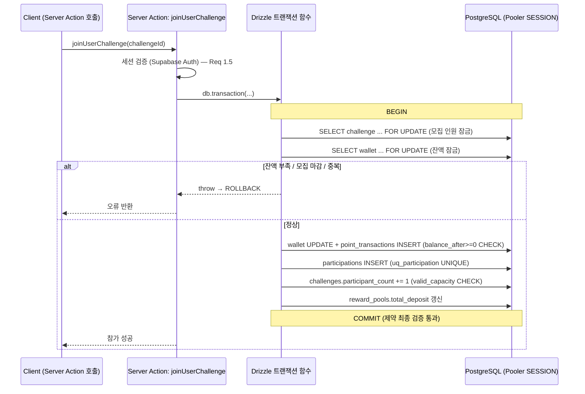
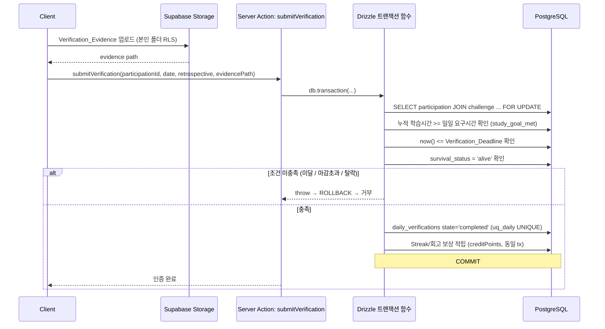
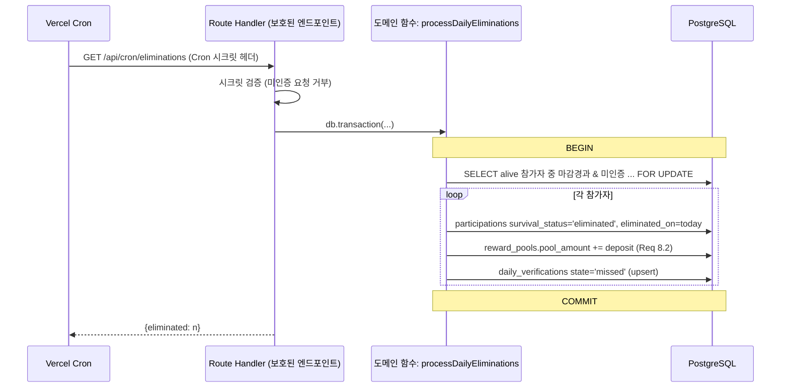
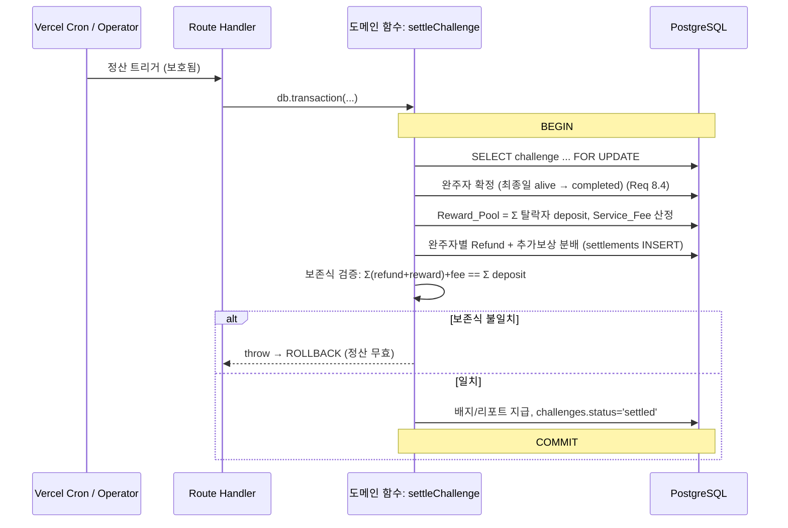
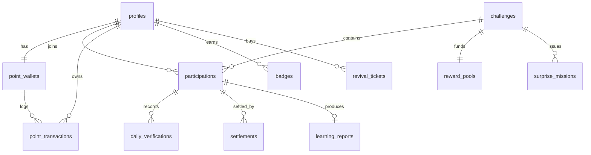

# Design Document: 서바이벌 스터디 챌린지 (Survival Study Challenge)

## Overview

서바이벌 스터디 챌린지는 참가자가 현금(Entry_Fee) 또는 서비스 포인트(Point)를 예치(Deposit)하고, 정해진 기간 동안 매일 학습 인증에 성공해야 생존하는 서바이벌형 학습 서비스이다. 인증에 실패한 참가자는 탈락(Elimination)하여 예치금을 상실하며, 상실된 예치금은 Reward_Pool로 편입되어 완주자에게 분배된다.

본 설계는 **Next.js(App Router) + Vercel + Supabase** 를 채택한 아키텍처 개정판(architecture pivot)이다. 요구사항(requirements.md, Requirement 1~14)은 변경되지 않았다. 요구사항은 시스템이 *무엇을* 해야 하는지(포인트 보존, 탈락, 정산 등 행위)를 정의하며 그대로 유효하다. 본 문서는 그 행위를 *어떻게* 구현할지에 대한 설계만 새로 정의한다.

이전 설계와의 핵심 차이는 **비즈니스 로직의 위치**이다.

- 이전 설계: 금전·포인트·상태 전이 로직을 `SECURITY DEFINER` PL/pgSQL 함수(RPC)로 DB 안에 두었다.
- 개정 설계: 비즈니스 규칙과 오케스트레이션을 **Next.js 서버 코드(Server Actions / Route Handlers)** 안의 **Drizzle ORM 기반 TypeScript 트랜잭션 함수**로 옮긴다. 실제 트랜잭션과 `SELECT ... FOR UPDATE` 행 잠금을 사용한다. PL/pgSQL RPC는 사용하지 않는다.

DB는 여전히 **"절대 깨지면 안 되는" 데이터 무결성 불변식의 최후 방어선**이다. 이는 선언적 제약(CHECK, UNIQUE, FK)과 원자적 트랜잭션으로 강제한다.

설계의 최우선 관심사는 **자원 보존 무결성(Requirement 14)** 이다. 즉, (a) 챌린지 종료 시 `Refund + 추가 보상 + Service_Fee == 예치된 Deposit 총액`, (b) Point_Wallet 잔액은 절대 음수가 될 수 없음, (c) 처리 중 오류 발생 시 거래 이전 상태로 완전 롤백. 이 세 불변식을 (1) 서버 트랜잭션 함수의 원자성, (2) DB 선언적 제약의 최후 방어선, (3) 행 잠금을 통한 경합 제어의 3중 방어로 강제한다.

### 본 스펙의 범위 (Core vs Web 스펙 분리)

본 스펙(core)은 **데이터 계층 + 도메인 로직 계층**만 다룬다.

- Drizzle 스키마(모든 테이블/열거형/제약), 마이그레이션 전략, Supabase 확장/트리거/RLS
- 서버 측 트랜잭션 도메인 함수: 포인트 차감/적립, 챌린지 개설/참가(사용자·공식), 결제 webhook 처리(external_ref 멱등성), 일일 목표/타이머, 인증 제출(게이팅), 일일 탈락 처리 + Reward_Pool 편입, 부활권, 정산(완주자 확정·보상 분배·보존식 검증), 포인트 획득(완주/스트릭/회고/초대), 배지, 학습 리포트, 리더보드/진행현황 read model, 돌발 미션
- 정확성 속성(Correctness Properties) + 테스트(Vitest + fast-check 속성 테스트, 실 Postgres 대상 통합 테스트)

별도 스펙 **"survival-study-web"**(추후 생성)은 Next.js UI를 다룬다: 페이지, 컴포넌트, Server Action 연결, 인증 페이지, Realtime UI, Storage 업로드 UI, Vercel Cron/webhook 라우트 연결. web 스펙은 본 문서에서 정의한 도메인 함수를 **소비(consume)** 한다. 본 문서에서 정의하는 트랜잭션 함수의 시그니처와 계약이 두 스펙 사이의 경계(contract)이다.

## Architecture

시스템은 Vercel에 배포된 Next.js 애플리케이션이 Supabase(PostgreSQL, Auth, Storage, Realtime) 위에서 동작하는 구조이다. **모든 쓰기(금전·포인트·상태 전이)는 Next.js 서버 코드가 직접 DB 연결로 트랜잭션을 실행**하며, 민감하지 않은 읽기(공개 챌린지 목록, 리더보드 등)는 클라이언트가 Supabase 클라이언트(PostgREST/Realtime)로 직접 수행한다.

```mermaid
graph TD
    subgraph Client["클라이언트 (브라우저)"]
        UI[Next.js UI / Study_Timer<br/>*web 스펙*]
        SBJS[Supabase JS 클라이언트<br/>읽기/Realtime/Storage 업로드]
    end

    subgraph Vercel["Vercel (Next.js 서버)"]
        SA[Server Actions<br/>사용자 주도 쓰기]
        RH[Route Handlers<br/>webhook / Cron 엔드포인트]
        MW[Middleware<br/>@supabase/ssr 세션]
        DOM["도메인 트랜잭션 함수<br/>(Drizzle + tx + FOR UPDATE)<br/>*core 스펙*"]
    end

    subgraph Supabase["Supabase 플랫폼"]
        AUTH[Supabase Auth]
        RT[Realtime<br/>리더보드/생존자 수]
        STORAGE[Storage<br/>Verification_Evidence]
        POOL[Connection Pooler<br/>SESSION 모드]
        DB[(PostgreSQL<br/>Drizzle 스키마 + 선언적 제약 + RLS)]
    end

    subgraph External["외부 서비스"]
        PAY[Payment_Service PG사]
        CRON[Vercel Cron]
    end

    UI --> SA
    UI --> SBJS
    SBJS -->|공개 조회/구독| RT
    SBJS -->|읽기| DB
    SBJS -->|evidence 업로드| STORAGE
    UI -->|로그인| AUTH
    MW --> AUTH

    SA --> DOM
    RH --> DOM
    DOM -->|직접 연결 (트랜잭션)| POOL
    POOL --> DB

    PAY -->|결제 webhook| RH
    CRON -->|일일 탈락/자동 정산| RH
    RT --> DB
    STORAGE -.evidence path.-> DOM
```

### 로직이 위치하는 곳 (핵심 원칙)

| 계층 | 위치 | 역할 |
|---|---|---|
| 비즈니스 규칙 · 오케스트레이션 | Next.js 서버 (Server Actions / Route Handlers) → 도메인 트랜잭션 함수 | 다단계 금전/상태 변경을 하나의 Drizzle 트랜잭션으로 원자적 수행 |
| 경합 제어 | 트랜잭션 함수 내부 `SELECT ... FOR UPDATE` | 지갑 잔액·모집 인원 등 경합 행 직렬화 |
| 무결성 최후 방어선 | DB 선언적 제약 (CHECK, UNIQUE, FK) | 애플리케이션 버그가 있어도 불변식 위반을 DB가 거부 |
| 계정 프로비저닝 | `auth.users` 트리거 `handle_new_user` (유일한 예외) | 지갑 없는 사용자 발생 방지 |

### 컴포넌트-요구사항 매핑

| 논리 컴포넌트 | 구현 방식 | 담당 요구사항 |
|---|---|---|
| Challenge_Service | 서버 도메인 함수 + Drizzle 스키마 + 선언적 제약 | 1, 2, 3, 4, 5, 8, 9, 10, 14 |
| Verification_Service | 서버 도메인 함수 + Storage + 테이블 | 6, 7 |
| Payment_Service | 외부 PG + webhook Route Handler → 도메인 함수 | 3, 9 |
| Point system | point_wallets + point_transactions + 도메인 함수 | 5, 10, 11, 12, 14 |
| Realtime/게임화 | Supabase Realtime + read model 뷰 | 13 |
| 일일 탈락 처리 | Vercel Cron → 보호된 Route Handler → 도메인 함수 | 7, 8 |

### 주요 흐름 시퀀스 다이어그램

각 흐름은 **(1) Drizzle 트랜잭션 시작 → (2) 경합 행 `FOR UPDATE` 잠금 → (3) 애플리케이션 검증 → (4) 쓰기 → (5) 선언적 제약이 커밋 시 최종 검증 → (6) COMMIT/ROLLBACK** 의 공통 형태를 따른다. 선언적 제약은 애플리케이션 검증이 누락·오류일 때를 대비한 backstop이다.

#### 사용자 챌린지 참가 (포인트 예치) — Requirement 5, 14



#### 일일 생존 인증 — Requirement 6, 7



#### 일일 탈락 처리 — Requirement 7, 8 (Vercel Cron)



#### 챌린지 종료 정산 — Requirement 9, 10, 14



## Components and Interfaces

각 서비스 컴포넌트는 Next.js 서버의 **TypeScript 트랜잭션 함수**로 구현한다. 아래 인터페이스가 core 스펙과 web 스펙 사이의 계약이다. 함수는 Server Action(사용자 주도) 또는 Route Handler(webhook/Cron)에서 호출되며, 내부적으로 `db.transaction()`(Drizzle)으로 원자적 실행된다.

공통 반환 타입:

```typescript
type Result<T> =
  | { ok: true; value: T }
  | { ok: false; error: DomainError };

type DomainError =
  | 'UNAUTHENTICATED'         // Req 1.5
  | 'DUPLICATE_EMAIL'         // Req 1.2
  | 'INSUFFICIENT_POINTS'     // Req 5.2, 12.2
  | 'PAYMENT_DECLINED'        // Req 3.2
  | 'DUPLICATE_PARTICIPATION' // Req 3.3, 5.4
  | 'CAPACITY_FULL'           // Req 3.4, 5.3
  | 'STUDY_TIME_NOT_MET'      // Req 7.2
  | 'DEADLINE_EXCEEDED'       // Req 7.3
  | 'NOT_ALIVE'               // Req 8.3
  | 'CONSERVATION_VIOLATED'   // Req 14.1
  | 'INVALID_CONFIG'          // Req 4.2, 4.3
  | 'ALREADY_SETTLED';
```

### Challenge_Service

**책임**: 챌린지 개설/탐색/참가, 생존·탈락 상태 전이, 종료 정산 총괄.

```typescript
interface ChallengeService {
  // Requirement 4: 사용자 챌린지 개설. Host 권한/설정 유효성 검증.
  //   Lock: 없음(INSERT). Backstop: kind_deposit_consistency, valid_dates, valid_capacity, valid_amount CHECK.
  createUserChallenge(hostId: string, config: UserChallengeConfig): Promise<Result<ChallengeId>>

  // Requirement 3: 공식 챌린지 참가. 결제 승인 webhook 처리 경로에서 호출.
  //   Lock: challenges FOR UPDATE(모집 인원). Backstop: uq_participation, valid_capacity CHECK.
  joinOfficialChallenge(userId: string, challengeId: string, paymentRef: string): Promise<Result<ParticipationId>>

  // Requirement 5: 사용자 챌린지 참가(포인트 예치).
  //   Lock: challenges FOR UPDATE + wallet FOR UPDATE. Backstop: uq_participation, wallet_non_negative, valid_capacity.
  joinUserChallenge(userId: string, challengeId: string): Promise<Result<ParticipationId>>

  // Requirement 2: 공식 챌린지 탐색(읽기 — Supabase 클라이언트 직접 조회, read model).
  listOpenOfficialChallenges(): Promise<Challenge[]>
  getChallengeDetail(challengeId: string): Promise<ChallengeDetail>

  // Requirement 8, 9, 10, 14: 종료 정산(원자적 트랜잭션 + 보존식 검증).
  //   Lock: challenges FOR UPDATE. Backstop: settle_non_negative, wallet_non_negative + 애플리케이션 보존식 검증.
  settleChallenge(challengeId: string): Promise<Result<SettlementSummary>>
}
```

### Verification_Service

**책임**: 일일 목표/타이머/회고/인증 자료 처리, 인증 완료 판정, 일일 탈락 처리.

```typescript
interface VerificationService {
  // Requirement 6.1: 일일 목표 작성. Backstop: uq_daily.
  submitDailyGoal(participationId: string, date: string, goal: string): Promise<Result<void>>

  // Requirement 6.2-6.4: 타이머 세션 누적. Backstop: accum_non_negative CHECK.
  recordTimerSession(participationId: string, date: string, elapsedSeconds: number): Promise<Result<AccumulatedTime>>

  // Requirement 7: 생존 인증 제출(게이팅: 학습시간 충족 ∧ 마감 이전 ∧ alive).
  //   Lock: participation FOR UPDATE. Backstop: uq_daily.
  submitVerification(input: {
    participationId: string
    date: string
    retrospective: string
    evidencePath: string   // Supabase Storage 경로 {user_id}/{challenge_id}/{date}
  }): Promise<Result<VerificationStatus>>

  // Requirement 7, 8: 마감 경과·미인증 참가자 일괄 탈락 + Reward_Pool 편입 (Vercel Cron 호출).
  //   Lock: participations FOR UPDATE. Backstop: elim_date_consistency, pool_non_negative.
  processDailyEliminations(runTime?: Date): Promise<Result<{ eliminated: number }>>
}
```

### Payment_Service

**책임**: 외부 PG 현금 결제/환불. 결제 승인은 webhook Route Handler에서 서명 검증 후 도메인 함수를 호출한다.

```typescript
interface PaymentService {
  // Requirement 3: 결제 세션 생성(외부 PG에 위임).
  createPaymentSession(challengeId: string, amount: number, pointDiscount: number): Promise<PaymentSession>

  // webhook: 결제 승인/실패 처리. external_ref UNIQUE로 멱등 처리(중복 webhook 무시).
  //   승인 시 joinOfficialChallenge 트랜잭션 트리거. Backstop: payment_transactions.external_ref UNIQUE.
  handlePaymentWebhook(event: PaymentWebhookEvent): Promise<Result<void>>

  // Requirement 9: 완주자 현금 환급/보상 큐잉.
  processRefund(participationId: string, amount: number): Promise<Result<void>>
}
```

### Point system

**책임**: Point_Wallet 잔액 관리, 적립/차감 원장 기록. 모든 잔액 변경은 서버 트랜잭션 함수에서만 발생하며, 잔액 UPDATE와 원장 INSERT가 하나의 트랜잭션에 묶인다. 클라이언트는 지갑/원장에 직접 쓸 수 없다(RLS).

```typescript
interface PointSystem {
  getWalletBalance(userId: string): Promise<number>   // 읽기: Supabase 클라이언트 가능

  // Requirement 11: 적립(완주/스트릭/회고/초대).
  //   Lock: wallet FOR UPDATE. Backstop: balance_after>=0, wallet_non_negative.
  //   NOTE: 다른 트랜잭션(정산·인증)에 참여할 때는 해당 tx 핸들을 주입받아 동일 트랜잭션에서 실행.
  creditPoints(tx: DbTx, userId: string, amount: number, reason: PointReason, ref?: string): Promise<Balance>

  // Requirement 12: 사용(챌린지 참가/할인/부활권). 잔액 부족 시 throw → 롤백.
  //   Lock: wallet FOR UPDATE. Backstop: wallet_non_negative, balance_after>=0.
  debitPoints(tx: DbTx, userId: string, amount: number, reason: PointReason, ref?: string): Promise<Balance>

  getTransactionHistory(userId: string): Promise<PointTransaction[]>
}
```

> `debitPoints`/`creditPoints` 는 트랜잭션 핸들 `tx` 를 인자로 받는다. 이는 참가·인증·정산 같은 상위 도메인 함수가 포인트 이동을 자신의 트랜잭션 경계 안에서 호출해 **원자성**을 유지하기 위함이다(이전 설계에서 RPC가 자체 트랜잭션을 여닫던 것과 대비되는 지점).

## Connection & Pooling 전략

Vercel 서버리스 함수에서 Drizzle의 **인터랙티브 트랜잭션**(여러 왕복이 있는 `db.transaction()` + `FOR UPDATE`)을 안전하게 쓰려면 연결 관리가 중요하다.

- **드라이버**: 직접 Postgres 연결(`postgres` 또는 `pg`) + Drizzle. Supabase JS 클라이언트(PostgREST)는 트랜잭션·행 잠금을 표현할 수 없으므로 쓰기에 사용하지 않는다.
- **풀러 모드**: 쓰기(트랜잭션) 경로는 반드시 **Supabase Connection Pooler를 SESSION 모드** 로 연결한다. Transaction 모드 풀러는 세션 상태(명시적 트랜잭션 내 `FOR UPDATE` 잠금 유지)를 보장하기 어렵기 때문이다. 서버리스에서는 요청당 연결 수가 폭증하므로 풀러 경유가 필수이다.
- **연결 문자열 분리**: 쓰기용(SESSION 풀러, 직접 연결) / 읽기용(Supabase 클라이언트, anon·authenticated 키)을 분리한다. 마이그레이션은 direct connection(비풀러)으로 적용한다.
- **근거**: 인터랙티브 트랜잭션의 정확성(잠금 유지)과 서버리스 확장성(연결 고갈 방지)을 동시에 만족시키기 위한 구성이다.

## Auth 전략

- **Supabase Auth** + **`@supabase/ssr`**: 쿠키 기반 세션. Next.js middleware에서 세션을 갱신·검증한다.
- 모든 Server Action / 보호된 Route Handler는 진입 시 세션에서 `userId` 를 확인한다. 인증되지 않은 참가·개설·인증·포인트 사용 요청은 `UNAUTHENTICATED` 로 거부한다(Requirement 1.5).
- 신규 계정 생성 시 `auth.users` INSERT는 앱 제어 밖에서 발생하므로, DB 트리거 `handle_new_user` 가 `profiles` + 잔액 0 `point_wallets` 를 원자적으로 프로비저닝한다(Requirement 1.1). 이것이 유일하게 허용된 트리거이다.
- Operator 권한(공식 챌린지 개설, Surprise_Mission 발행)은 `profiles.role = 'operator'` 를 서버 함수 내부에서 검증한다.

## RLS 전략 (축소된 방어선)

쓰기가 Next.js 서버 코드(직접 DB 연결)를 통해서만 일어나므로, RLS의 역할은 **deny-by-default 기반의 심층 방어(defense-in-depth)** 로 축소된다.

- **anon/authenticated 클라이언트가 도달하는 읽기 경로**에만 최소한의 SELECT 정책을 연다: 공개 챌린지 목록, 리더보드/진행현황 read model, 본인 지갑 잔액·본인 포인트 원장·본인 인증 레코드 조회.
- **클라이언트는 지갑/원장/정산/참가/인증 테이블에 직접 쓸 수 없다**(쓰기 정책 없음 = 거부). 이 테이블들의 모든 변경은 서버 직접 연결 트랜잭션 경로로만 발생한다.
- 서버 직접 연결은 서비스 역할(service role) 또는 소유자 권한으로 실행되어 RLS를 우회하지만, 서버 함수가 진입 시 `userId`/권한을 애플리케이션 레벨에서 재검증한다.

| 접근 경로 | 사용 클라이언트 | 대상 |
|---|---|---|
| 공개 챌린지 목록·상세 읽기 | Supabase JS (authenticated/anon) | challenges (visibility='public') |
| 리더보드·진행현황 읽기·구독 | Supabase JS + Realtime | participations read model, v_leaderboard |
| 본인 지갑/원장/인증 읽기 | Supabase JS (authenticated) | point_wallets, point_transactions, daily_verifications (본인) |
| Evidence 업로드 | Supabase JS Storage | storage.objects (본인 폴더) |
| 모든 쓰기(참가·인증·정산·포인트) | 서버 직접 연결 (SESSION 풀러) | 전 테이블 |

## Storage 전략

- Verification_Evidence는 **비공개 Supabase Storage 버킷** `evidence` 에 업로드한다.
- 경로 규약: `{user_id}/{challenge_id}/{date}`.
- Storage RLS 정책으로 **본인 폴더에만** 읽기/쓰기를 허용한다. 인증 제출 시 서버 함수는 `daily_verifications.evidence_path` 에 경로를 기록하고, 필요 시 서명 URL로 제한적 열람을 제공한다.

## Scheduling 전략

- **일일 탈락 처리**: `pg_cron` 을 더 이상 사용하지 않는다. **Vercel Cron**(`vercel.json` 스케줄)이 보호된 Route Handler(예: `/api/cron/eliminations`)를 주기 호출하고, 핸들러가 `processDailyEliminations()` 트랜잭션 함수를 실행한다.
- **자동 정산**: 종료일이 지난 챌린지에 대해 Vercel Cron이 별도 Route Handler를 통해 `settleChallenge()` 를 호출한다.
- 보호: Cron Route Handler는 Vercel Cron 시크릿(헤더) 검증으로 외부 호출을 차단한다.
- 타임존별 인증 마감을 촘촘히 커버하기 위해 탈락 처리 Cron은 세밀한 주기(예: 10분)로 실행하며, 함수 내부에서 각 챌린지의 `timezone` 기준으로 마감 경과를 판정한다.

## Data Models

데이터 모델의 **단일 원천(source of truth)은 Drizzle 스키마(TypeScript)** 이다. `drizzle-kit generate` 가 SQL 마이그레이션을 생성한다. 기존에 손으로 작성한 SQL 마이그레이션(enums, profiles/point_wallets, challenges, participations, auxiliary tables)과 포인트 RPC 마이그레이션(`debit_points`/`credit_points`)은 **제거(replace)** 하며, 그 SQL 스키마는 Drizzle 정의의 참조 "정답지(answer key)" 역할만 한다.

Drizzle이 표현하기 어려운 Supabase 고유 요소는 얇은 raw SQL 마이그레이션으로 병행 적용한다: (1) `pgcrypto` 확장, (2) `auth.users` 의 `handle_new_user` 트리거. 그 외 트리거는 두지 않고, 모든 상태 변경은 명시적 TS 트랜잭션 함수를 경유한다.

금전 컬럼은 정밀도 보존을 위해 `numeric(14,2)`(현금)로, 포인트는 정수 단위 `bigint` 로 표현한다. 음수/불변식은 `check()` 제약으로 강제한다.

### 열거형(ENUM)

```typescript
import { pgEnum } from 'drizzle-orm/pg-core';

export const challengeKind     = pgEnum('challenge_kind', ['official', 'user']);
export const challengeStatus   = pgEnum('challenge_status', ['recruiting', 'in_progress', 'ended', 'settled', 'cancelled']);
export const visibilityScope   = pgEnum('visibility_scope', ['public', 'private']);
export const survivalStatus    = pgEnum('survival_status', ['alive', 'eliminated', 'completed']);
export const depositKind       = pgEnum('deposit_kind', ['cash', 'point']);
export const verificationState = pgEnum('verification_state', ['pending', 'completed', 'missed']);
export const paymentStatus     = pgEnum('payment_status', ['pending', 'approved', 'failed', 'refunded']);
export const pointTxnType      = pgEnum('point_txn_type', [
  'challenge_complete', 'streak_bonus', 'retrospective_bonus', 'invite_bonus',
  'challenge_join', 'challenge_create', 'revival_purchase', 'reward_distribution',
  'entry_discount', 'refund_adjustment',
]);
```

### profiles (Requirement 1)

Supabase Auth의 `auth.users` 를 확장하는 공개 프로필. `handle_new_user` 트리거가 자동 생성한다(Drizzle 스키마로 컬럼을 정의하되, `auth.users` FK와 트리거는 raw SQL 마이그레이션으로 연결).

```typescript
export const profiles = pgTable('profiles', {
  id:          uuid('id').primaryKey(),                 // FK → auth.users(id) ON DELETE CASCADE (raw SQL)
  displayName: text('display_name').notNull(),
  email:       text('email').notNull().unique(),        // Req 1.2 중복 방지
  invitedBy:   uuid('invited_by').references((): AnyPgColumn => profiles.id), // Req 11.4
  role:        text('role').notNull().default('user'),  // 'user' | 'operator'
  createdAt:   timestamp('created_at', { withTimezone: true }).notNull().defaultNow(),
});
```

### point_wallets (Requirement 1.1, 14.2)

사용자당 하나의 지갑. 잔액은 절대 음수 불가 — 포인트 보존의 DB 레벨 최후 방어선.

```typescript
export const pointWallets = pgTable('point_wallets', {
  id:        uuid('id').primaryKey().default(sql`extensions.gen_random_uuid()`),
  userId:    uuid('user_id').notNull().unique().references(() => profiles.id, { onDelete: 'cascade' }),
  balance:   bigint('balance', { mode: 'number' }).notNull().default(0),
  updatedAt: timestamp('updated_at', { withTimezone: true }).notNull().defaultNow(),
}, (t) => ({
  walletNonNegative: check('wallet_non_negative', sql`${t.balance} >= 0`),  // Req 14.2
}));
```

### challenges (Requirement 2, 4) — 타입 구분 테이블

공식/사용자 챌린지를 `kind` 로 구분하는 단일 테이블. `check` 로 종류별 필드 정합성을 강제한다.

```typescript
export const challenges = pgTable('challenges', {
  id:                     uuid('id').primaryKey().default(sql`extensions.gen_random_uuid()`),
  kind:                   challengeKind('kind').notNull(),
  title:                  text('title').notNull(),
  description:            text('description'),
  hostId:                 uuid('host_id').references(() => profiles.id),  // User_Challenge Host, official은 NULL
  status:                 challengeStatus('status').notNull().default('recruiting'),
  visibility:             visibilityScope('visibility').notNull().default('public'),

  startDate:              date('start_date').notNull(),
  endDate:                date('end_date').notNull(),
  dailyStudyMinutes:      integer('daily_study_minutes').notNull(),
  verificationDeadlineTime: time('verification_deadline_time').notNull(),
  timezone:               text('timezone').notNull().default('Asia/Seoul'),

  capacity:               integer('capacity').notNull(),
  participantCount:       integer('participant_count').notNull().default(0),

  depositKind:            depositKind('deposit_kind').notNull(),          // official=cash, user=point
  entryAmount:            numeric('entry_amount', { precision: 14, scale: 2 }).notNull(),
  serviceFeeRate:         numeric('service_fee_rate', { precision: 5, scale: 4 }).notNull().default('0.10'),
  distributionRule:       jsonb('distribution_rule').notNull().default({}),
  noWinnerPolicy:         text('no_winner_policy'),                       // Req 10.3
  createdAt:              timestamp('created_at', { withTimezone: true }).notNull().defaultNow(),
}, (t) => ({
  validDates:    check('valid_dates', sql`${t.endDate} >= ${t.startDate}`),
  validCapacity: check('valid_capacity', sql`${t.capacity} > 0 AND ${t.participantCount} >= 0 AND ${t.participantCount} <= ${t.capacity}`),
  validAmount:   check('valid_amount', sql`${t.entryAmount} >= 0`),
  // Req 4.4: User_Challenge=point(+host), Official_Challenge=cash
  kindDepositConsistency: check('kind_deposit_consistency', sql`
    (${t.kind} = 'official' AND ${t.depositKind} = 'cash')
    OR (${t.kind} = 'user' AND ${t.depositKind} = 'point' AND ${t.hostId} IS NOT NULL)`),
  openIdx: index('idx_challenges_open').on(t.kind, t.status).where(sql`${t.status} = 'recruiting'`),
}));
```

### participations (Requirement 3, 5, 8)

참가 사실 + 생존 상태 + 예치금. (challenge, user) 쌍은 유일(중복 참가 방지).

```typescript
export const participations = pgTable('participations', {
  id:             uuid('id').primaryKey().default(sql`extensions.gen_random_uuid()`),
  challengeId:    uuid('challenge_id').notNull().references(() => challenges.id, { onDelete: 'cascade' }),
  userId:         uuid('user_id').notNull().references(() => profiles.id, { onDelete: 'cascade' }),
  survivalStatus: survivalStatus('survival_status').notNull().default('alive'),
  depositKind:    depositKind('deposit_kind').notNull(),
  depositAmount:  numeric('deposit_amount', { precision: 14, scale: 2 }).notNull(),
  currentStreak:  integer('current_streak').notNull().default(0),
  eliminatedOn:   date('eliminated_on'),
  joinedAt:       timestamp('joined_at', { withTimezone: true }).notNull().defaultNow(),
}, (t) => ({
  uqParticipation: unique('uq_participation').on(t.challengeId, t.userId),  // Req 3.3 / 5.4
  depositNonNegative: check('deposit_non_negative', sql`${t.depositAmount} >= 0`),
  elimDateConsistency: check('elim_date_consistency', sql`
    (${t.survivalStatus} = 'eliminated' AND ${t.eliminatedOn} IS NOT NULL)
    OR (${t.survivalStatus} <> 'eliminated')`),  // Req 8.1
  partChallengeIdx: index('idx_part_challenge').on(t.challengeId, t.survivalStatus),
}));
```

### daily_verifications (Requirement 6, 7)

참가자의 날짜별 인증 레코드. `uq_daily` 로 날짜당 1건.

```typescript
export const dailyVerifications = pgTable('daily_verifications', {
  id:                 uuid('id').primaryKey().default(sql`extensions.gen_random_uuid()`),
  participationId:    uuid('participation_id').notNull().references(() => participations.id, { onDelete: 'cascade' }),
  verifyDate:         date('verify_date').notNull(),
  dailyGoal:          text('daily_goal'),                              // Req 6.1
  accumulatedSeconds: integer('accumulated_seconds').notNull().default(0), // Req 6.3
  studyGoalMet:       boolean('study_goal_met').notNull().default(false),  // Req 6.4
  retrospective:      text('retrospective'),                           // Req 7.1
  evidencePath:       text('evidence_path'),                           // Storage 경로
  state:              verificationState('state').notNull().default('pending'),
  completedAt:        timestamp('completed_at', { withTimezone: true }),
  createdAt:          timestamp('created_at', { withTimezone: true }).notNull().defaultNow(),
}, (t) => ({
  uqDaily:          unique('uq_daily').on(t.participationId, t.verifyDate),
  accumNonNegative: check('accum_non_negative', sql`${t.accumulatedSeconds} >= 0`),
  dateStateIdx:     index('idx_dv_date_state').on(t.verifyDate, t.state),
}));
```

### payment_transactions (Requirement 3.5, 9, 12.3)

현금 결제/환불 원장. `external_ref` UNIQUE로 webhook 멱등성 보장.

```typescript
export const paymentTransactions = pgTable('payment_transactions', {
  id:              uuid('id').primaryKey().default(sql`extensions.gen_random_uuid()`),
  userId:          uuid('user_id').notNull().references(() => profiles.id),
  challengeId:     uuid('challenge_id').references(() => challenges.id),
  participationId: uuid('participation_id').references(() => participations.id),
  direction:       text('direction').notNull(),                        // 'charge' | 'refund'
  amount:          numeric('amount', { precision: 14, scale: 2 }).notNull(),
  pointDiscount:   bigint('point_discount', { mode: 'number' }).notNull().default(0), // Req 12.3
  status:          paymentStatus('status').notNull().default('pending'),
  externalRef:     text('external_ref').unique(),                      // 멱등성 (Req 3.5)
  createdAt:       timestamp('created_at', { withTimezone: true }).notNull().defaultNow(),
}, (t) => ({
  directionCheck: check('direction_check', sql`${t.direction} IN ('charge', 'refund')`),
  amountNonNegative: check('amount_non_negative', sql`${t.amount} >= 0`),
}));
```

### point_transactions (Requirement 11.5, 12.5, 14)

포인트 원장(append-only). 모든 지갑 잔액 변화가 기록된다. `balance_after >= 0` 이 포인트 보존의 DB 레벨 최후 방어선.

```typescript
export const pointTransactions = pgTable('point_transactions', {
  id:           uuid('id').primaryKey().default(sql`extensions.gen_random_uuid()`),
  walletId:     uuid('wallet_id').notNull().references(() => pointWallets.id),
  userId:       uuid('user_id').notNull().references(() => profiles.id),
  txnType:      pointTxnType('txn_type').notNull(),
  amount:       bigint('amount', { mode: 'number' }).notNull(),        // +적립 / -차감
  balanceAfter: bigint('balance_after', { mode: 'number' }).notNull(),
  reason:       text('reason').notNull(),                              // Req 11.5 / 12.5
  refId:        uuid('ref_id'),
  createdAt:    timestamp('created_at', { withTimezone: true }).notNull().defaultNow(),
}, (t) => ({
  balanceNonNegative: check('balance_after_non_negative', sql`${t.balanceAfter} >= 0`), // Req 14.2
  userIdx: index('idx_pt_user').on(t.userId, t.createdAt),
}));
```

### reward_pools & settlements (Requirement 9, 10, 14)

```typescript
export const rewardPools = pgTable('reward_pools', {
  id:           uuid('id').primaryKey().default(sql`extensions.gen_random_uuid()`),
  challengeId:  uuid('challenge_id').notNull().unique().references(() => challenges.id, { onDelete: 'cascade' }),
  depositKind:  depositKind('deposit_kind').notNull(),
  totalDeposit: numeric('total_deposit', { precision: 14, scale: 2 }).notNull().default('0'), // Σ 모든 예치
  poolAmount:   numeric('pool_amount', { precision: 14, scale: 2 }).notNull().default('0'),    // Σ 탈락자 예치
  serviceFee:   numeric('service_fee', { precision: 14, scale: 2 }).notNull().default('0'),
}, (t) => ({
  poolNonNegative: check('pool_non_negative', sql`${t.poolAmount} >= 0 AND ${t.totalDeposit} >= 0`),
}));

export const settlements = pgTable('settlements', {
  id:              uuid('id').primaryKey().default(sql`extensions.gen_random_uuid()`),
  challengeId:     uuid('challenge_id').notNull().references(() => challenges.id),
  participationId: uuid('participation_id').notNull().references(() => participations.id),
  refundAmount:    numeric('refund_amount', { precision: 14, scale: 2 }).notNull().default('0'),
  rewardAmount:    numeric('reward_amount', { precision: 14, scale: 2 }).notNull().default('0'),
  settledAt:       timestamp('settled_at', { withTimezone: true }).notNull().defaultNow(),
}, (t) => ({
  settleNonNegative: check('settle_non_negative', sql`${t.refundAmount} >= 0 AND ${t.rewardAmount} >= 0`),
}));
```

### badges / revival_tickets / surprise_missions / learning_reports

```typescript
export const badges = pgTable('badges', {
  id:          uuid('id').primaryKey().default(sql`extensions.gen_random_uuid()`),
  userId:      uuid('user_id').notNull().references(() => profiles.id, { onDelete: 'cascade' }),
  challengeId: uuid('challenge_id').references(() => challenges.id),
  badgeType:   text('badge_type').notNull(),                           // 'completion' 등
  awardedAt:   timestamp('awarded_at', { withTimezone: true }).notNull().defaultNow(),
}, (t) => ({
  uqBadge: unique('uq_badge').on(t.userId, t.challengeId, t.badgeType),  // Req 9.3/10.4/13.4
}));

export const revivalTickets = pgTable('revival_tickets', {           // Req 12.4
  id:              uuid('id').primaryKey().default(sql`extensions.gen_random_uuid()`),
  userId:          uuid('user_id').notNull().references(() => profiles.id),
  participationId: uuid('participation_id').references(() => participations.id),
  pointCost:       bigint('point_cost', { mode: 'number' }).notNull(),
  used:            boolean('used').notNull().default(false),
  purchasedAt:     timestamp('purchased_at', { withTimezone: true }).notNull().defaultNow(),
  usedAt:          timestamp('used_at', { withTimezone: true }),
}, (t) => ({
  pointCostNonNegative: check('point_cost_non_negative', sql`${t.pointCost} >= 0`),
}));

export const surpriseMissions = pgTable('surprise_missions', {       // Req 13.3
  id:          uuid('id').primaryKey().default(sql`extensions.gen_random_uuid()`),
  challengeId: uuid('challenge_id').notNull().references(() => challenges.id, { onDelete: 'cascade' }),
  title:       text('title').notNull(),
  description: text('description'),
  activeFrom:  timestamp('active_from', { withTimezone: true }).notNull().defaultNow(),
  activeUntil: timestamp('active_until', { withTimezone: true }),
  createdBy:   uuid('created_by').references(() => profiles.id),
});

export const learningReports = pgTable('learning_reports', {         // Req 9.3
  id:              uuid('id').primaryKey().default(sql`extensions.gen_random_uuid()`),
  participationId: uuid('participation_id').notNull().unique().references(() => participations.id, { onDelete: 'cascade' }),
  reportData:      jsonb('report_data').notNull(),
  generatedAt:     timestamp('generated_at', { withTimezone: true }).notNull().defaultNow(),
});
```

### Supabase 고유 요소 (얇은 raw SQL 마이그레이션)

Drizzle이 표현하지 못하는 두 가지만 별도 SQL로 유지한다.

```sql
-- 1) pgcrypto 확장 (gen_random_uuid)
create schema if not exists extensions;
create extension if not exists pgcrypto with schema extensions;

-- 2) auth.users 프로비저닝 트리거 (유일한 허용 트리거) — Req 1.1
--    auth.users INSERT는 앱 제어 밖에서 발생하므로, 트리거로 profiles + 잔액 0 wallet을
--    원자적으로 생성하여 "지갑 없는 사용자"를 원천 차단한다.
create or replace function public.handle_new_user()
returns trigger language plpgsql security definer
set search_path = public, extensions as $$
begin
  insert into public.profiles (id, display_name, email, invited_by)
  values (new.id,
          coalesce(nullif(new.raw_user_meta_data->>'display_name',''), split_part(new.email,'@',1)),
          new.email,
          nullif(new.raw_user_meta_data->>'invited_by','')::uuid);
  insert into public.point_wallets (user_id, balance) values (new.id, 0);
  return new;
end; $$;

drop trigger if exists on_auth_user_created on auth.users;
create trigger on_auth_user_created
  after insert on auth.users for each row execute function public.handle_new_user();
```

> **제거되는 것**: 기존 `pg_cron` 확장(스케줄은 Vercel Cron으로 대체), 기존 손작성 스키마 마이그레이션(Drizzle로 대체), 포인트 RPC 마이그레이션 `debit_points`/`credit_points`(TS 트랜잭션 함수로 대체). 자세한 내용은 문서 말미 "Migration 전략 및 기존 자산 제거" 참조.

### 엔티티 관계도



## 서버 트랜잭션 도메인 함수 (핵심 구현 패턴)

무결성의 핵심은 **모든 금전/포인트/상태 변경을 하나의 Drizzle 트랜잭션 안의 TypeScript 함수로 캡슐화**하는 것이다. 아래는 대표 함수의 구현 스케치이다.

### 포인트 차감/적립 (Requirement 5, 11, 12, 14.2, 14.3)

```typescript
// 상위 트랜잭션(tx)에 참여. 잔액 UPDATE + 원장 INSERT가 동일 트랜잭션에서 원자적으로 실행된다.
async function debitPoints(tx: DbTx, userId: string, amount: number, type: PointReason, reason: string, ref?: string) {
  if (amount <= 0) throw new DomainErr('INVALID_CONFIG');

  // 경합 제어: 지갑 행 잠금 (동시 차감/적립 직렬화)
  const [wallet] = await tx.select().from(pointWallets)
    .where(eq(pointWallets.userId, userId)).for('update');
  if (!wallet) throw new DomainErr('UNAUTHENTICATED');

  const newBalance = wallet.balance - amount;
  if (newBalance < 0) throw new DomainErr('INSUFFICIENT_POINTS'); // Req 5.2/12.2 → 롤백

  await tx.update(pointWallets)
    .set({ balance: newBalance, updatedAt: new Date() })
    .where(eq(pointWallets.id, wallet.id));

  // append-only 원장 (Req 11.5/12.5). balance_after>=0 CHECK가 최후 방어선(Req 14.2)
  await tx.insert(pointTransactions).values({
    walletId: wallet.id, userId, txnType: type, amount: -amount,
    balanceAfter: newBalance, reason, refId: ref,
  });
  return newBalance;
}
// creditPoints는 부호만 반대(newBalance = balance + amount)이며 동일 패턴을 따른다.
```

### 사용자 챌린지 참가 (Requirement 5)

```typescript
async function joinUserChallenge(userId: string, challengeId: string) {
  if (!userId) return err('UNAUTHENTICATED');           // Req 1.5 (Server Action에서 세션 확인)
  return db.transaction(async (tx) => {
    // 모집 인원 경합 제어
    const [ch] = await tx.select().from(challenges)
      .where(eq(challenges.id, challengeId)).for('update');
    if (ch.kind !== 'user')            throw new DomainErr('INVALID_CONFIG');
    if (ch.status !== 'recruiting')    throw new DomainErr('CAPACITY_FULL');   // Req 5.3
    if (ch.participantCount >= ch.capacity) throw new DomainErr('CAPACITY_FULL');

    // 포인트 예치 (내부에서 잔액/음수 검증) — Req 5.1, 5.2
    await debitPoints(tx, userId, Number(ch.entryAmount), 'challenge_join', 'User_Challenge 참가 예치', challengeId);

    // 참가 등록 (중복 시 uq_participation 위반 → Req 5.4)
    const [part] = await tx.insert(participations).values({
      challengeId, userId, survivalStatus: 'alive', depositKind: 'point', depositAmount: ch.entryAmount,
    }).returning({ id: participations.id });

    await tx.update(challenges)                          // valid_capacity CHECK가 상한 보증
      .set({ participantCount: sql`${challenges.participantCount} + 1` })
      .where(eq(challenges.id, challengeId));

    await tx.insert(rewardPools).values({ challengeId, depositKind: 'point', totalDeposit: ch.entryAmount })
      .onConflictDoUpdate({ target: rewardPools.challengeId,
        set: { totalDeposit: sql`${rewardPools.totalDeposit} + ${ch.entryAmount}` } });

    return part.id;
  });
}
```

### 정산과 보존식 검증 (Requirement 8.4, 9, 10, 14.1)

```typescript
async function settleChallenge(challengeId: string) {
  return db.transaction(async (tx) => {
    const [ch] = await tx.select().from(challenges).where(eq(challenges.id, challengeId)).for('update');
    if (ch.status === 'settled') throw new DomainErr('ALREADY_SETTLED');

    // 완주자 확정 (Req 8.4): 최종일까지 alive → completed
    await tx.update(participations).set({ survivalStatus: 'completed' })
      .where(and(eq(participations.challengeId, challengeId), eq(participations.survivalStatus, 'alive')));

    const totalDep = await sumDeposits(tx, challengeId);                       // Σ 전체 예치
    const pool     = await sumDeposits(tx, challengeId, 'eliminated');         // Σ 탈락자 예치
    const winners  = await listParticipations(tx, challengeId, 'completed');
    let fee = round2(pool * Number(ch.serviceFeeRate));

    let rewardEach = 0;
    if (winners.length === 0) {
      fee = pool;                                                             // Req 10.3 no_winner_policy
    } else {
      rewardEach = floor2((pool - fee) / winners.length);                     // 남은 pool 균등 분배
    }

    let distSum = 0;
    for (const w of winners) {
      await tx.insert(settlements).values({
        challengeId, participationId: w.id, refundAmount: w.depositAmount, rewardAmount: rewardEach,
      });
      if (ch.depositKind === 'point') {
        await creditPoints(tx, w.userId, Number(w.depositAmount) + rewardEach, 'reward_distribution', '완주 분배', challengeId);
      } else {
        await tx.insert(paymentTransactions).values({
          userId: w.userId, challengeId, participationId: w.id, direction: 'refund',
          amount: (Number(w.depositAmount) + rewardEach).toFixed(2), status: 'pending',
        });
      }
      await tx.insert(badges).values({ userId: w.userId, challengeId, badgeType: 'completion' }).onConflictDoNothing();
      distSum += Number(w.depositAmount) + rewardEach;
    }

    // 보존식 검증 (Req 14.1): 분배 + 수수료 == 총 예치액. 불일치 시 throw → 롤백
    if (round2(distSum + fee) !== round2(totalDep)) throw new DomainErr('CONSERVATION_VIOLATED');

    await tx.update(rewardPools).set({ poolAmount: String(pool), serviceFee: String(fee), totalDeposit: String(totalDep) })
      .where(eq(rewardPools.challengeId, challengeId));
    await tx.update(challenges).set({ status: 'settled' }).where(eq(challenges.id, challengeId));
  });
}
```

> 완주자 환급 모델은 "자기 예치금 환급 + 탈락자 pool 균등 분배"를 기본으로 하며, `distribution_rule` jsonb로 가중 분배 등 대안을 지원한다. 어느 규칙이든 마지막 보존식 검증은 동일하게 강제된다.

### 일일 탈락 처리 (Requirement 7, 8)

```typescript
async function processDailyEliminations(runTime = new Date()) {
  return db.transaction(async (tx) => {
    // 각 챌린지 timezone 기준 마감 경과 & 오늘 미인증 & alive 참가자 잠금 조회
    const targets = await tx.select(/* participations JOIN challenges */)
      .where(/* alive ∧ in_progress ∧ 마감경과 ∧ NOT EXISTS(completed 인증) */).for('update');

    let n = 0;
    for (const t of targets) {
      await tx.update(participations)                                   // Req 8.1
        .set({ survivalStatus: 'eliminated', eliminatedOn: t.today })
        .where(eq(participations.id, t.partId));
      await tx.update(rewardPools)                                      // Req 8.2 deposit → pool
        .set({ poolAmount: sql`${rewardPools.poolAmount} + ${t.depositAmount}` })
        .where(eq(rewardPools.challengeId, t.challengeId));
      await tx.insert(dailyVerifications).values({ participationId: t.partId, verifyDate: t.today, state: 'missed' })
        .onConflictDoUpdate({ target: [dailyVerifications.participationId, dailyVerifications.verifyDate], set: { state: 'missed' } });
      n++;
    }
    return { eliminated: n };
  });
}
```

탈락 후 인증 제출 거부(Req 8.3)는 `submitVerification` 진입부에서 `survival_status = 'alive'` 를 확인해 처리한다. 부활권 사용(Req 12.4) 시 `survival_status` 를 `alive` 로 복원하되, deposit은 이미 pool에 편입되었으므로 부활권 비용에 재예치 정책을 반영한다.

## Realtime & 게임화 (Requirement 13)

- **생존자 수/리더보드**: `participations` 를 Supabase Realtime으로 구독하여 상태 변경 시 클라이언트에 push. 순위는 `current_streak`·누적 인증률 기준 read model 뷰(`v_leaderboard`)로 계산(읽기 전용).
- **진행 현황(Req 13.1)**: 본인 `survival_status`, `current_streak`, 남은 기간을 반환하는 read model.
- **Surprise_Mission(Req 13.3)**: `surprise_missions` INSERT를 구독 중인 참가자에게 표시(발행은 Operator 권한 서버 함수).
- **배지(Req 13.4)**: `badges` 를 프로필 화면에서 조회.

```sql
-- read model 뷰 (Supabase 클라이언트 읽기 전용)
CREATE VIEW v_leaderboard AS
SELECT p.challenge_id, p.user_id, pr.display_name, p.survival_status, p.current_streak,
       rank() OVER (PARTITION BY p.challenge_id ORDER BY p.current_streak DESC) AS rank,
       count(*) FILTER (WHERE p.survival_status = 'alive')
         OVER (PARTITION BY p.challenge_id) AS alive_count
FROM participations p JOIN profiles pr ON pr.id = p.user_id;
```


## Correctness Properties

*속성(property)은 시스템의 모든 유효한 실행에서 참이어야 하는 특성 또는 행위이며, 시스템이 무엇을 해야 하는지에 대한 형식적 진술이다. 속성은 사람이 읽는 명세와 기계가 검증 가능한 정확성 보증 사이의 다리 역할을 한다.*

요구사항(Requirement 1~14)은 변경되지 않았으므로 아래 속성은 이전 설계와 **동일한 불변식**을 검증한다. 다만 강제 메커니즘(enforcement)이 바뀌었다: 이제 각 속성은 **Next.js 서버의 Drizzle 트랜잭션 함수**의 행위이며, DB의 선언적 제약(CHECK, UNIQUE)이 최후 방어선으로 이를 backstop한다. 속성 테스트는 실 Postgres(로컬 Supabase)를 대상으로 한 TS 트랜잭션 함수 호출로 실행한다.

### Property 1: 포인트 보존

*For any* 지갑에 대한 적립/차감 연산 시퀀스에 대해, 최종 잔액은 `초기 잔액 + Σ(적립) − Σ(차감)` 과 일치하고, 모든 중간 시점에서 잔액은 0 이상이며, 각 연산은 정확히 하나의 `point_transactions` 원장 행(부호 있는 amount, `balance_after`)을 남긴다.
(`debitPoints`/`creditPoints` 트랜잭션의 원자적 UPDATE+INSERT와 `wallet_non_negative` / `balance_after >= 0` CHECK가 강제)

**Validates: Requirements 5.1, 11.5, 12.1, 12.5, 14.2**

### Property 2: 차감 원자성 (롤백 불변)

*For any* 지갑과 잔액을 초과하는 차감 금액, 또는 트랜잭션 도중 발생하는 임의의 오류에 대해, 트랜잭션은 롤백되어 지갑 잔액과 관련 상태가 거래 이전과 완전히 동일하게 유지된다(전부 아니면 전무).
(Drizzle 트랜잭션 롤백 + `INSUFFICIENT_POINTS` 예외가 강제)

**Validates: Requirements 5.2, 12.2, 14.3**

### Property 3: 정산 보존식

*For any* 완주자·탈락자 구성에 대해, 정산 후 `Σ(refund) + Σ(reward) + service_fee == Σ(deposit)` 이 성립한다.
(`settleChallenge` 커밋 직전 애플리케이션 보존식 검증 + 불일치 시 `CONSERVATION_VIOLATED` 예외 → 롤백)

**Validates: Requirements 9.1, 9.2, 10.1, 14.1**

### Property 4: 보상 상한

*For any* 챌린지에 대해, 완주자에게 분배되는 추가 보상 총액은 `pool_amount − service_fee` 를 초과하지 않는다.

**Validates: Requirements 9.4, 10.2**

### Property 5: 생존 상태 전이 단조성

*For any* 참가자 상태 전이에 대해, 전이는 `alive → eliminated` 또는 `alive → completed` 로만 일어나며(부활권 사용에 의한 `eliminated → alive` 복원은 명시적 예외), `eliminated → completed` 직접 전이는 발생하지 않는다. 정산 시 최종일까지 `alive` 인 모든 참가자는 `completed` 로 확정된다.

**Validates: Requirements 8.4, 12.4**

### Property 6: 탈락 완전성

*For any* 챌린지 상태에 대해, 일일 탈락 처리(`processDailyEliminations`) 실행 후에는 `alive` 이면서 해당 날짜 마감이 경과했고 그날 인증을 완료하지 않은 참가자가 존재하지 않는다.

**Validates: Requirements 8.1**

### Property 7: 탈락 예치금의 Reward_Pool 보존

*For any* 탈락 처리 실행에 대해, `reward_pools.pool_amount` 의 증가분은 이번에 탈락한 참가자들의 `deposit_amount` 합과 정확히 일치한다.

**Validates: Requirements 8.2**

### Property 8: 탈락 후 인증 불가

*For any* `eliminated` 상태의 참가자가 제출하는 모든 인증에 대해, 인증은 `NOT_ALIVE` 로 거부된다.

**Validates: Requirements 8.3**

### Property 9: 인증 게이팅

*For any* 인증 제출 입력에 대해, 인증 완료(`state = 'completed'`) 기록은 `study_goal_met == true` ∧ 회고·인증자료 제출됨 ∧ `now() <= Verification_Deadline` 세 조건이 모두 참일 때만 생성된다.

**Validates: Requirements 7.1, 7.2, 7.3**

### Property 10: 타이머 누적 정합성

*For any* 타이머 세션 기록 시퀀스에 대해, 해당 날짜의 `accumulated_seconds` 는 기록된 세션 경과 시간의 합과 일치하며, `accumulated_seconds >= 요구 학습시간` 인 경우에만 `study_goal_met` 가 true가 된다.

**Validates: Requirements 6.3, 6.4**

### Property 11: 중복 참가 불변

*For any* 참가 요청 시퀀스에 대해, 동일 `(challenge_id, user_id)` 쌍의 `participations` 행은 최대 1개다.
(`uq_participation` UNIQUE가 강제)

**Validates: Requirements 3.3, 5.4**

### Property 12: 모집 인원 상한

*For any* 동시 참가 요청 시퀀스에 대해, `participant_count <= capacity` 가 항상 유지된다.
(`challenges FOR UPDATE` 잠금 + `valid_capacity` CHECK가 강제)

**Validates: Requirements 3.4, 5.3**

### Property 13: 챌린지 종류-예치 정합성

*For any* 생성되는 챌린지에 대해, `kind = 'user'` 이면 `deposit_kind = 'point'` 이고 host가 존재하며, `kind = 'official'` 이면 `deposit_kind = 'cash'` 이다.
(`kind_deposit_consistency` CHECK가 강제)

**Validates: Requirements 4.4**

### Property 14: 결제 webhook 멱등성

*For any* 동일 `external_ref` 를 가진 결제 webhook의 반복 수신에 대해, `payment_transactions` 에는 최대 1개의 행이 생성되고 참가는 최대 1회만 등록된다.
(`payment_transactions.external_ref` UNIQUE가 강제)

**Validates: Requirements 3.5, 3.1**

## Error Handling

| 시나리오 | 조건 | 응답 | 복구 |
|---|---|---|---|
| 중복 이메일 가입 (Req 1.2) | `auth.users`/`profiles.email` UNIQUE 위반 | `DUPLICATE_EMAIL` | 사용자 재입력 |
| 미인증 요청 (Req 1.5) | Server Action/Route Handler 진입 시 세션 없음 | `UNAUTHENTICATED` | 로그인 유도 |
| 포인트 부족 (Req 5.2, 12.2) | `debitPoints` 결과 잔액<0 | `INSUFFICIENT_POINTS`, 트랜잭션 롤백 | 잔액 유지 |
| 결제 거부 (Req 3.2) | PG webhook status=failed | 참가 미완료, `PAYMENT_DECLINED` | 재시도 가능 |
| 중복 참가 (Req 3.3, 5.4) | `uq_participation` 위반 | `DUPLICATE_PARTICIPATION` | 무시 |
| 모집 마감 (Req 3.4, 5.3) | `participant_count >= capacity` | `CAPACITY_FULL` | 대기/취소 |
| 학습시간 미달 (Req 7.2) | `study_goal_met = false` | `STUDY_TIME_NOT_MET` | 추가 학습 |
| 마감 초과 (Req 7.3) | `now() > deadline` | `DEADLINE_EXCEEDED` | 탈락 처리 |
| 탈락 후 인증 (Req 8.3) | `survival_status <> 'alive'` | `NOT_ALIVE` | 부활권 안내 |
| 정산 보존식 위반 (Req 14.1) | `dist+fee != total` | `CONSERVATION_VIOLATED` → 전체 롤백 | 정산 재검토, 무결성 유지 |
| 처리 중 오류 (Req 14.3) | 트랜잭션 내 예외 | Drizzle 트랜잭션 자동 롤백 | 거래 이전 상태 복원 |
| 잘못된 챌린지 설정 (Req 4.2, 4.3) | 필수 누락/범위 초과/`kind_deposit_consistency` 위반 | `INVALID_CONFIG` | 재입력 |

**오류 전파 원칙**: 도메인 함수는 `DomainError` 를 throw하고, Drizzle `db.transaction()` 이 이를 받아 자동 롤백한다. Server Action/Route Handler는 이를 `Result<T>` 로 변환해 클라이언트(web 스펙)에 반환한다. DB 선언적 제약 위반(UNIQUE/CHECK)은 애플리케이션 검증이 누락된 경우의 최후 방어선으로, 제약 위반 예외를 도메인 오류로 매핑한다.

## Testing Strategy

본 기능의 도메인 로직은 순수한 입출력 관계(포인트 계산, 정산 분배, 상태 전이 판정)를 다수 포함하며 입력 공간이 넓으므로 **property-based testing이 적합**하다. 단, Supabase Auth·Storage·외부 PG 같은 외부 서비스 동작은 PBT 대상이 아니며 통합/예제 테스트로 다룬다.

### Property-Based Testing (fast-check)

- **라이브러리**: `fast-check`(TypeScript). PBT를 직접 구현하지 않고 라이브러리를 사용한다.
- **대상**: 위 Correctness Properties 1~14. 각 속성은 **단일 property-based test**로 구현한다.
- **실행 환경**: 로컬 Supabase(`supabase start`)의 실 Postgres에 대해 Drizzle 트랜잭션 함수를 호출한다. 생성기는 무작위 지갑 잔액/연산 시퀀스, 참가자 구성(완주자/탈락자 비율), 타이머 세션열, 참가 요청 인터리빙, 결제 webhook 반복 등을 생성한다.
- **반복 횟수**: 각 속성 테스트 최소 **100회** 반복.
- **태그 형식**: 각 테스트에 주석으로 `Feature: survival-study-challenge, Property {번호}: {속성 텍스트}` 를 표기한다.
- **집중 영역**: 정산 보존식(Property 3, 4)과 포인트 보존/차감 원자성(Property 1, 2). 이들이 Requirement 14 자원 보존 무결성의 핵심이다.
- **동시성 속성**(Property 12 모집 인원 상한, Property 1 지갑 경합)은 병렬 트랜잭션을 인터리빙시켜 `FOR UPDATE` 잠금이 경쟁 조건을 제거하는지 검증한다.

### 단위 테스트 (Vitest)

- 각 도메인 함수(`debitPoints`, `creditPoints`, `joinUserChallenge`, `joinOfficialChallenge`, `submitVerification`, `settleChallenge`, `processDailyEliminations`, `handlePaymentWebhook`)의 정상/경계/오류 경로를 대표 예제로 검증한다.
- 선언적 제약(음수 잔액, `kind_deposit_consistency`, `uq_participation`, `uq_daily`, `external_ref` UNIQUE)이 실제로 위반을 거부하는지 검증한다.
- 특정 이벤트성 요구사항: 계정 프로비저닝(1.1), 중복 이메일(1.2), 완주 배지/리포트 지급(9.3, 10.4), 부활권 복귀(12.4), 포인트 할인(12.3), 초대 보상(11.4).

### 통합 테스트

- **엔드투엔드 시나리오**: 참가 → 매일 인증/일부 탈락 → 종료 정산 전체 흐름을 로컬 Supabase에서 재현하고 최종 보존식을 확인한다.
- **결제 webhook 멱등성**(Property 14): 동일 `external_ref` 중복 호출 검증.
- **인증 계층**: Supabase Auth 세션 생성/실패(Req 1.3, 1.4)와 미인증 거부(Req 1.5)를 대표 예제로 검증.
- **Storage**: evidence 업로드 경로/본인 폴더 RLS를 대표 예제로 검증.
- **Scheduling**: Vercel Cron Route Handler → `processDailyEliminations` 경로를 시크릿 검증 포함해 확인.
- **read model / RLS**: 공개 챌린지 목록·리더보드 읽기와, 클라이언트의 지갑/원장/정산 직접 쓰기 차단을 검증.

## Migration 전략 및 기존 자산 제거

Drizzle을 데이터 계층의 단일 원천으로 채택하면서 기존 손작성 SQL 자산을 정리한다.

**제거 대상 (기존 `supabase/migrations/`)**:
- `20250101000001_create_enums.sql` → Drizzle `pgEnum` 정의로 대체
- `20250101000002_create_accounts_wallets.sql` → profiles/point_wallets는 Drizzle로 대체. 단, `handle_new_user` 트리거는 얇은 raw SQL로 **보존**
- `20250101000003_create_challenges.sql`, `20250101000004_create_participations.sql`, `20250101000005_create_auxiliary_tables.sql` → Drizzle 스키마로 대체
- `20250101000006_create_point_rpc.sql` (`debit_points`/`credit_points` PL/pgSQL RPC) → **완전 제거**. TS 트랜잭션 함수 `debitPoints`/`creditPoints` 로 대체
- `pg_cron` 확장 및 관련 스케줄(`cron.schedule`) → **제거**. Vercel Cron으로 대체

**보존/신규 (얇은 raw SQL, Drizzle 마이그레이션과 병행)**:
- `pgcrypto` 확장 (`gen_random_uuid`)
- `handle_new_user` 트리거 + `on_auth_user_created`(auth.users) — 유일하게 허용된 트리거
- RLS 정책, Storage 버킷/정책, read model 뷰(`v_leaderboard`) — Drizzle이 표현하지 못하는 부분

**적용 순서**: (1) Drizzle 스키마 → `drizzle-kit generate` 로 마이그레이션 생성 → direct connection으로 적용, (2) 얇은 raw SQL(확장/트리거/RLS/Storage/뷰) 적용. 기존 마이그레이션 파일은 새 스키마의 참조 정답지로만 활용 후 리포지토리에서 제거한다.

## Dependencies

- **Next.js (App Router)** + **Vercel**: 서버 런타임, Server Actions, Route Handlers, Cron
- **Supabase**: PostgreSQL, Auth(`@supabase/ssr`), Storage, Realtime, Connection Pooler(SESSION 모드)
- **Drizzle ORM** + **drizzle-kit**: 스키마 단일 원천 및 마이그레이션 생성
- **postgres/pg 드라이버**: 서버 직접 연결(트랜잭션 + `FOR UPDATE`)
- **pgcrypto** (`gen_random_uuid`)
- **외부 PG사(Payment_Service)**: 현금 결제/환불 및 webhook
- **테스트**: Vitest(단위/통합), fast-check(속성 테스트), Supabase CLI(로컬 통합)
- **UI(별도 web 스펙)**: Tailwind CSS + shadcn/ui — 본 core 스펙 범위 외
