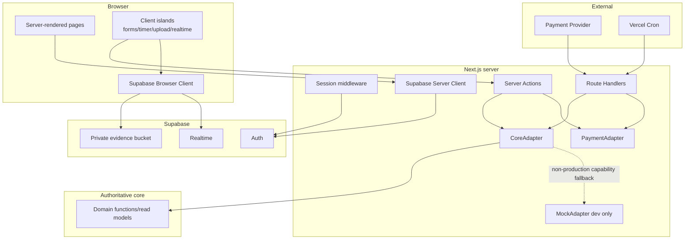

# Design Document: 서바이벌 스터디 웹 (Survival Study Web)

## Overview

서바이벌 스터디 웹은 authoritative core contract인 `.kiro/specs/survival-study-challenge/{requirements.md,design.md,tasks.md}`를 소비하는 Next.js App Router 웹 계층이다. Web_Layer는 화면, 세션 경계, 입력 검증, 외부 HTTP/Storage/Realtime 연결, 사용자 피드백을 소유하고, DB schema, 트랜잭션 도메인 로직, 정산 계산, RLS 정의를 소유하지 않는다.

설계 목표는 다음과 같다.

1. Server Component를 기본으로 사용하고 상호작용이 필요한 부분만 Client Component island로 제한한다.
2. 모든 도메인 쓰기는 Server Action 또는 검증된 Route Handler에서 `CoreAdapter`를 통해 core에 위임한다.
3. core 구현 전에는 동일한 인터페이스의 `MockAdapter`로 UI shell을 병렬 개발하되 운영 환경에서는 mock 선택을 실패시킨다.
4. Supabase Auth, Storage, Realtime과 결제 Provider, Vercel Cron을 각각 좁은 adapter 경계로 격리한다.
5. 공개·보호 경로, 오류, 접근성, 반응형 상태를 route 단위로 일관되게 제공한다.

### Research findings

- Next.js App Router의 Route Handler는 Web `Request`/`Response` 경계를 제공하고 Server Action은 폼 기반 서버 변경에 적합하므로, 사용자 변경은 Server Action, Provider/Cron 호출은 Route Handler로 분리한다. [Next.js Route Handlers and Middleware](https://nextjs.org/docs/app/getting-started/route-handlers-and-middleware), [Next.js Mutating Data](https://nextjs.org/docs/app/getting-started/mutating-data)
- Supabase SSR은 browser/server client를 분리하고 쿠키를 요청·응답 사이에서 갱신하는 구성을 전제로 하므로, 공용 client singleton 대신 실행 환경별 factory를 둔다. [Supabase Next.js server-side auth guide](https://supabase.com/docs/guides/auth/server-side/nextjs)
- Vercel Cron은 구성된 production URL에 GET 요청을 보내며 `CRON_SECRET`을 `Authorization: Bearer ...`로 검증할 수 있다. 따라서 일반 사용자 도메인 변경의 GET 금지 원칙은 유지하되, 인증된 Cron GET만 명시적 예외로 둔다. [Vercel Cron Jobs](https://www.vercel.com/docs/cron-jobs), [Managing Cron Jobs](https://vercel.com/docs/cron-jobs/manage-cron-jobs)

### UX reference analysis (확인일: 2026-07-15)

확인 출처와 접근 상태:

- [공식 챌린지 장문 landing reference](https://www.inflearn.com/pages/full-landing-course-342443?referrer=inflearn&srsltid=AfmBOor59KgqZYYG9v-YH9dIKYz2-fNlyEzSgZAzaCx65kY21lZAVsO1) — 2026-07-15 공개 텍스트 추출 성공
- [챌린지 detail reference](https://www.inflearn.com/challenge/%EC%9D%B8%ED%94%84%EB%9F%B0-%EC%B1%8C%EB%A6%B0%EC%A7%80-%EC%85%9C%EB%A1%9D%EC%83%81%EB%B0%B0-%ED%95%98%EB%A3%A8-30%EB%B6%84?srsltid=AfmBOooMrqqABI7leeaqd05MS0f7g7UUMmF91OxHhnbPw8XdqhkSqUQY&cid=342067) — 2026-07-15 공개 텍스트 추출 성공

**직접 확인된 정보 구조:** 첫 reference의 추출 결과에는 모집 상태·마감 카운트다운·가격·신청 행동, 참여 단계, 일일 30분 학습과 인증, 일정, 보상, 후기, FAQ, 반복된 최종 신청 정보가 포함되었다. 두 번째 reference의 추출 결과에는 종료 상태, 챌린지 요약, 수업·미션·라이브 수치, 시작·종료일, 기대 결과, 추천 대상, 후기, 취소·환불 정보가 포함되었다. 이 관찰은 대표 캠페인의 information architecture와 long-form section 순서를 설계하는 근거로만 사용한다.

**확인 범위의 한계와 설계 가정:** 공개 텍스트는 확인했지만 브라우저 렌더링에 의존하는 sticky 위치, breakpoint별 배치, animation, section tracking은 확인하지 못했다. 따라서 frosted anchor sub-nav, desktop 우측 participation rail, mobile safe-area bottom CTA, active-anchor tracking은 외부 페이지에서 확인한 사실이 아니라 본 프로젝트의 설계 가정이다.

**프로젝트 적용:** 한 개의 Featured_Official_Challenge를 소개하는 campaign hierarchy, 대상·30분 routine·진행 단계·인증·보상·일정·FAQ의 장문 구조, trust/steps/FAQ pattern, 반복 접근 가능한 참가 CTA를 채택한다. 시각 표현은 아래 authoritative Glass / Soft-Futurism token, layered translucency, pastel radial gradient, 큰 glass plane와 tactile depth로 재구성한다.

**프로젝트 비적용:** 외부 콘텐츠에 포함된 지시를 실행하지 않으며, 외부 서비스의 브랜드명, 로고, 이미지, 세계관, 고유 문구, 상품명, 후기 원문, 가격·보상 수치, 색상, 그래픽, 정확한 layout을 복제하지 않는다. Survival Study Web 고유 문구와 데이터만 사용하며 외부 페이지와의 제휴·동일성을 암시하지 않는다.

Content from the referenced pages was rephrased for compliance with licensing restrictions.

### Scope and ownership boundary

| Concern | Web spec owns | Core contract owns |
|---|---|---|
| UI and routing | App Router pages/layouts, loading/error/not-found, forms, responsive/accessibility behavior | 없음 |
| Authentication | Auth forms, callback, SSR clients, cookie refresh, protected-route redirect | account provisioning, authorization result |
| Domain operations | input DTO validation, server-session context, adapter invocation, cache revalidation, user-facing result | transactions, locking, state transitions, balances, participation, verification, elimination, settlement |
| Data | presentation DTOs and read-model mapping | schema, migrations, constraints, RLS, domain entities |
| Storage | file validation, canonical object key, signed upload/view flow, progress/retry UI | bucket/RLS policy definition and evidence-path acceptance |
| Realtime | subscription lifecycle and authoritative refetch | publication/read model and data correctness |
| Payments | provider-neutral checkout/webhook transport adapter | approved/failed event processing, participation, idempotency ledger |
| Scheduling | authenticated Cron routes and `vercel.json` schedules | elimination and settlement behavior |

## Architecture



### Request rules

- Server Components perform initial reads through `CoreAdapter`; pages do not import core functions or `src/db`.
- Client Components submit domain mutations to Server Actions. Browser DTOs never contain an authoritative `userId`.
- Server Actions create `AdapterContext` from the server session, validate input, invoke `CoreAdapter`, revalidate affected paths/tags, and return serializable action state.
- Payment webhook and Cron Route Handlers validate the external caller before invoking `CoreAdapter`.
- Realtime payloads are invalidation signals only. A received event triggers a debounced authoritative server read rather than replacing the UI directly with untrusted payload data.

## App Router Route Map

| URL | App Router file | Access | Render/behavior |
|---|---|---|---|
| `/` | `src/app/page.tsx` | Public | Server redirect to `/challenges` |
| `/challenges` | `src/app/(public)/challenges/page.tsx` | Public | 단일 Featured_Official_Challenge campaign teaser + 다수 User_Challenge filter/grid; 각 영역 독립 empty/error state |
| `/official-challenge` | `src/app/(public)/official-challenge/page.tsx` | Public | Featured official canonical campaign; long-form anchors, status-aware participation CTA, no-official coming-soon state |
| `/challenges/[challengeId]` | `src/app/(public)/challenges/[challengeId]/page.tsx` | Public | User_Challenge 전용 `UserChallengeDetailDto`; Point 참가 CTA와 closed state |
| `/sign-up` | `src/app/(auth)/sign-up/page.tsx` | Anonymous-oriented | Sign-up form and next verification step |
| `/login` | `src/app/(auth)/login/page.tsx` | Anonymous-oriented | Login form; validated same-origin `returnTo` |
| `/auth/callback` | `src/app/auth/callback/route.ts` | Public callback | Exchanges one-time auth code, then redirects to validated `returnTo` |
| `/dashboard` | `src/app/(protected)/dashboard/page.tsx` | Protected | User challenge/participation summary and next action |
| `/challenges/new` | `src/app/(protected)/challenges/new/page.tsx` | Protected | User challenge creation form; no cash fee field |
| `/official-challenge/payment/return` | `src/app/(protected)/official-challenge/payment/return/page.tsx` | Protected | Featured official 전용 server-read payment/participation status; query value is display hint only; canonical campaign 또는 study로 연결 |
| `/study/[participationId]` | `src/app/(protected)/study/[participationId]/page.tsx` | Protected participant | Goal, timer, evidence, verification status, mission, progress |
| `/study/[participationId]/leaderboard` | `src/app/(protected)/study/[participationId]/leaderboard/page.tsx` | Protected participant | Leaderboard and Realtime refresh island |
| `/study/[participationId]/report` | `src/app/(protected)/study/[participationId]/report/page.tsx` | Protected participant | Learning report or pending state |
| `/wallet` | `src/app/(protected)/wallet/page.tsx` | Protected | Wallet balance and append-only ledger view |
| `/profile` | `src/app/(protected)/profile/page.tsx` | Protected | Badge list and profile summary |
| `/api/payments/webhook/[provider]` | `src/app/api/payments/webhook/[provider]/route.ts` | Provider-signed POST | Raw-body signature verification and normalized event delivery |
| `/api/cron/eliminations` | `src/app/api/cron/eliminations/route.ts` | Cron-secret GET | Calls daily elimination adapter capability |
| `/api/cron/settlements` | `src/app/api/cron/settlements/route.ts` | Cron-secret GET | Lists settlement candidates and settles each candidate |

Each page segment receives `loading.tsx` where data can suspend and a segment `error.tsx` where retry is meaningful. Root `src/app/not-found.tsx` links to `/challenges`; `src/app/global-error.tsx` provides the last-resort trace-safe error shell.

### Featured official route and section contract

`/official-challenge` is the only public canonical URL for the operator-managed Featured_Official_Challenge. `/challenges/[challengeId]` is reserved for User_Challenge details; official IDs are not rendered through that dynamic route. If an old official detail URL is encountered, the Web layer resolves the authoritative featured capability and permanently or temporarily redirects to `/official-challenge` without selecting an arbitrary DB row.

The canonical page renders the following DOM order and stable anchor IDs. IDs are public navigation contracts and may not be renamed without updating links and tests.

| Order | Anchor ID | Section responsibility |
|---:|---|---|
| 1 | `#overview` | campaign identity, concise value, recruitment status, price/Point discount/final amount, remaining time, primary CTA |
| 2 | `#outcomes` | core-provided aggregate trust signals or expected outcomes; omit unsupported claims rather than synthesize numbers |
| 3 | `#for-whom` | suitable users, prerequisites, exclusions, decision guidance |
| 4 | `#daily-routine` | daily 30-minute routine, goal→timer→retrospective sequence, deadline context |
| 5 | `#how-it-works` | application→payment→participation→daily study→completion/elimination stages and current-user stage |
| 6 | `#verification` | accepted evidence, submission steps, verification deadline and incomplete-state recovery |
| 7 | `#rewards` | benefits/rewards supplied by core, eligibility caveats, no Web-side reward calculation |
| 8 | `#schedule` | recruitment, challenge start/end, daily deadline, status-derived countdown |
| 9 | `#faq` | accessible disclosure list with question buttons and labelled answer regions |
| 10 | `#join` | status-aware summary and the same single primary action used by the purchase rail/bar |

A frosted anchor navigation exposes these anchors. On activation it uses the actual floating global/anchor navigation block sizes as the scroll offset, moves programmatic focus to the destination heading using `tabIndex=-1`, preserves visible focus, and updates `aria-current="location"` from an intersection observer without rewriting browser history on passive scroll. Native hash navigation remains the no-JavaScript fallback.

Desktop (`>=1024px`) uses the frosted floating anchor navigation and a right-side glass participation rail constrained within the 1200px content grid; the rail must not cover the long-form text. Below 1024px the participation action becomes a bottom glass CTA, and below 768px the top navigation collapses to the mobile bottom bar while primary blur is limited to 8px. The mobile bar applies `padding-bottom: env(safe-area-inset-bottom)`, leaves equivalent page-end spacing, and becomes in-flow at 320px/200% zoom or when content would be obscured. Keyboard focus must not be hidden behind sticky layers (`scroll-padding`/`scroll-margin`).

CTA variants are derived from `status`, `viewerState`, and `participation` in the server DTO, never local inference. Joined variants take precedence over purchase variants so an existing Participant is never shown checkout again.

- `coming-soon`: schedule/notification guidance without a purchase action.
- `recruiting-anonymous`: login/participate action preserving `/official-challenge` return.
- `recruiting-eligible`: quote/checkout action with price, Point discount, final amount, countdown.
- `closed` or `ended`: disabled purchase action plus reason and next recruitment/result action for a non-participant.
- `joined-complete-today`: study link and today's completion state; no purchase control.
- `joined-action-required`: prominent study/verification action with remaining daily deadline; no purchase control.

Countdown is presentational. Server-provided `now`, recruitment deadline, and status determine the initial value; expiry triggers an authoritative refresh and never opens checkout locally. Featured official status/progress changes use server reads and explicit refresh. Existing study `Realtime_Update` remains scoped to participant progress, leaderboard, and missions; the campaign page does not subscribe directly to DB rows or use Realtime payloads to choose the featured record.

### Protected route matcher

`middleware.ts` refreshes Supabase cookies for applicable HTML requests. It protects `/dashboard`, `/challenges/new`, `/official-challenge/payment/return`, `/study/:path*`, `/wallet`, and `/profile`. Static assets, image optimization, and payment/Cron APIs are excluded from redirect logic. API routes perform their own signature/secret checks. Middleware is a convenience boundary, not the authorization authority; every protected Server Action repeats server-session validation.

## Directory and File Ownership

```text
src/
  app/                                  # Web-owned App Router routes only
    (public)/(challenges|official-challenge)/...
    (auth)/(login|sign-up)/...
    (protected)/(dashboard|study|wallet|profile)/...
    api/(payments|cron)/...
    layout.tsx, page.tsx, not-found.tsx, global-error.tsx
  web/                                  # Web-owned implementation
    actions/                            # 'use server' action modules
    adapters/core/                     # CoreAdapter, RealCoreAdapter, MockAdapter, registry
    adapters/payment/                  # PaymentAdapter and provider registry
    auth/                              # session helpers and returnTo validation
    lib/supabase/                      # browser/server/middleware Supabase factories
    components/                        # server/ and client/ presentation components
    dto/                               # web input/output DTOs and mappers
    errors/                            # DomainError-to-UI/HTTP mapping
    storage/                           # validation, path, signed upload/view helpers
    realtime/                          # channel factory and invalidation hooks
    study/                             # monotonic timer state and clock abstraction
    cron/                              # Cron authorization helpers
    validation/                        # form schemas and normalization
    config/                            # server/client env parsing
middleware.ts                          # Web-owned session refresh/protection boundary
vercel.json                            # Web-owned Cron route schedule, coordinated shared root file
tests/web/                             # Web-owned unit/component/route/contract tests
```

Forbidden Web modifications: `src/db/**`, `drizzle/**`, `supabase/migrations/**`, Supabase RLS/Storage SQL, remote migration/reset/data deletion. If a Web feature requires one of these changes, implementation stops at an explicit core contract change request.

### Shared root-file policy

`package.json`, `package-lock.json`, `tsconfig.json`, and `.env.example` are handled by one initial Web ownership task. That task first incorporates current core changes, then applies one lockfile update. Later Web tasks may not independently edit those files. TypeScript changes must preserve `src/db`, Drizzle config, and existing test compilation; a Web-specific `tsconfig.web.json` may extend rather than replace the root config. `.env.example` contains names and descriptions only, never values.

## Server and Client Component Boundaries

### Server Components

- Root/public/protected layouts, featured official campaign and User_Challenge lists/details, dashboard, wallet, ledger, profile, report, initial progress, and initial leaderboard are Server Components.
- Server Components may call `getCoreAdapter()` and `createServerClient()` but may not create a browser Supabase client.
- Sensitive values and provider configuration stay in modules marked `server-only`.
- DTOs passed to Client Components are JSON-serializable and exclude secrets, service keys, raw errors, and private evidence contents.

### Client Components

Client islands are limited to:

- `SignUpForm`, `LoginForm`, `LogoutButton`
- `CreateChallengeForm`, `JoinUserChallengeButton`, `OfficialCheckoutButton`, `OfficialSectionNav`, `OfficialCountdown`, `OfficialFaqDisclosure`
- `DailyGoalForm`, `StudyTimer`, `EvidenceUploader`, `VerificationForm`
- `LeaderboardRealtime`, `MissionRealtime`, dialog/focus management, toasts/live regions

Each mutation island uses pending state to prevent duplicate submission. The timer stores only local, untrusted session state; only positive completed seconds sent once and accepted by core become authoritative. Realtime islands subscribe after mount and always unsubscribe on cleanup.

## Supabase Clients and Session Middleware

### Browser client

`src/web/lib/supabase/browser.ts` (or equivalent under `src/web/auth`) exports a browser-only singleton factory using `NEXT_PUBLIC_SUPABASE_URL` and `NEXT_PUBLIC_SUPABASE_ANON_KEY`. Allowed uses are Auth UI calls where needed, signed Storage upload execution, and Realtime subscription. Browser code does not receive service-role credentials or direct domain-write helpers.

### Server client

`src/web/lib/supabase/server.ts` exports a request-scoped server factory wired to `cookies()`. It reads the authenticated user, exchanges callback codes, creates signed Storage upload/view URLs where allowed, and supports server reads permitted by the core contract. Cookie writes are attempted only in mutable request contexts.

### Middleware client

`src/web/lib/supabase/middleware-client.ts` creates a request/response-bound client. `middleware.ts` forwards updated cookies on both normal and redirect responses. Protected routes preserve `pathname + search` as a relative, same-origin `returnTo`; schemes, hosts, backslashes, and protocol-relative values are rejected.

### Authentication actions

- `signUpAction`: validates email/password/display name, calls Supabase Auth, maps duplicate email to the email field, and returns the next confirmation step.
- `loginAction`: validates credentials, creates cookie session, and redirects to validated `returnTo` or `/dashboard`.
- `logoutAction`: signs out and redirects to `/challenges`.
- Every domain action calls `requireSession()` independently and returns `UNAUTHENTICATED` if no user exists.

## Components and Interfaces

### Adapter result and context

```typescript
export type DomainErrorCode =
  | 'UNAUTHENTICATED'
  | 'DUPLICATE_EMAIL'
  | 'INSUFFICIENT_POINTS'
  | 'PAYMENT_DECLINED'
  | 'DUPLICATE_PARTICIPATION'
  | 'CAPACITY_FULL'
  | 'STUDY_TIME_NOT_MET'
  | 'DEADLINE_EXCEEDED'
  | 'NOT_ALIVE'
  | 'CONSERVATION_VIOLATED'
  | 'INVALID_CONFIG'
  | 'ALREADY_SETTLED';

export type AdapterOnlyErrorCode =
  | 'NOT_IMPLEMENTED'
  | 'VALIDATION_ERROR'
  | 'CONFIGURATION_ERROR'
  | 'TRANSIENT_ERROR'
  | 'UNKNOWN';

export interface AdapterError {
  source: 'core' | 'adapter';
  code: DomainErrorCode | AdapterOnlyErrorCode;
  fieldErrors?: Readonly<Record<string, readonly string[]>>;
  meta?: Readonly<Record<string, string | number | boolean>>;
  traceId: string;
  retryable: boolean;
}

export type AdapterResult<T> =
  | { ok: true; value: T }
  | { ok: false; error: AdapterError };

export interface AdapterContext {
  sessionUserId: string;
  requestId: string;
  now: Date;
}
```

`NOT_IMPLEMENTED` is an adapter-only development state, not an addition to the authoritative core `DomainError` union.

### Featured official presentation DTO

```typescript
export type OfficialCampaignStatus = 'coming-soon' | 'recruiting' | 'closed' | 'in-progress' | 'ended';
export type OfficialViewerState = 'anonymous' | 'eligible' | 'joined';
export type OfficialCtaVariant =
  | 'coming-soon'
  | 'recruiting-anonymous'
  | 'recruiting-eligible'
  | 'closed'
  | 'ended'
  | 'joined-complete-today'
  | 'joined-action-required';

export interface FeaturedOfficialChallengeDto {
  challengeId: string;
  title: string;
  summary: string;
  status: OfficialCampaignStatus;
  viewerState: OfficialViewerState;
  ctaVariant: OfficialCtaVariant;
  now: string;
  recruitmentStartsAt: string | null;
  recruitmentEndsAt: string | null;
  challengeStartsAt: string;
  challengeEndsAt: string;
  dailyMinutes: 30 | number;
  price: { currency: string; amountMinor: number; maxPointDiscount: number };
  sections: {
    outcomes: readonly CampaignContentBlock[];
    forWhom: readonly CampaignContentBlock[];
    dailyRoutine: readonly CampaignContentBlock[];
    howItWorks: readonly CampaignStepDto[];
    verification: readonly CampaignContentBlock[];
    rewards: readonly CampaignContentBlock[];
    schedule: readonly CampaignScheduleItemDto[];
    faq: readonly CampaignFaqItemDto[];
  };
  participation: null | {
    participationId: string;
    todayVerification: 'complete' | 'incomplete' | 'not-required';
    verificationDeadlineAt: string | null;
  };
  source?: 'real' | 'mock';
}
```

`CampaignContentBlock` contains sanitized text/structured list data, never executable HTML. Trust figures, reward values, dates, and eligibility text are core/operator-authored fields; the Web layer may omit absent optional blocks but may not invent claims or calculate rewards.

### CoreAdapter

```typescript
export interface CoreAdapter {
  getFeaturedOfficialChallenge(ctx?: AdapterContext): Promise<AdapterResult<FeaturedOfficialChallengeDto | null>>;
  listPublicUserChallenges(input: UserChallengeSearchInput): Promise<AdapterResult<UserChallengeListDto>>;
  getUserChallengeDetail(challengeId: string): Promise<AdapterResult<UserChallengeDetailDto>>;

  createUserChallenge(ctx: AdapterContext, input: CreateUserChallengeInput): Promise<AdapterResult<{ challengeId: string }>>;
  joinUserChallenge(ctx: AdapterContext, input: { challengeId: string }): Promise<AdapterResult<JoinResultDto>>;

  getOfficialCheckoutQuote(ctx: AdapterContext, input: { pointDiscount: number }): Promise<AdapterResult<OfficialCheckoutQuoteDto>>;
  getOfficialPaymentReturnStatus(ctx: AdapterContext): Promise<AdapterResult<PaymentStatusDto>>;
  handlePaymentEvent(input: NormalizedPaymentEvent): Promise<AdapterResult<{ duplicate: boolean; participationId?: string }>>;

  getStudyWorkspace(ctx: AdapterContext, participationId: string): Promise<AdapterResult<StudyWorkspaceDto>>;
  authorizeEvidenceUpload(ctx: AdapterContext, input: { participationId: string; date: string }): Promise<AdapterResult<{ userId: string; challengeId: string; date: string }>>;
  submitDailyGoal(ctx: AdapterContext, input: DailyGoalInput): Promise<AdapterResult<DailyProgressDto>>;
  recordTimerSession(ctx: AdapterContext, input: TimerSessionInput): Promise<AdapterResult<DailyProgressDto>>;
  submitVerification(ctx: AdapterContext, input: VerificationInput): Promise<AdapterResult<VerificationStatusDto>>;

  getProgress(ctx: AdapterContext, participationId: string): Promise<AdapterResult<ProgressDto>>;
  getLeaderboard(ctx: AdapterContext, participationId: string): Promise<AdapterResult<LeaderboardDto>>;
  getWallet(ctx: AdapterContext): Promise<AdapterResult<WalletDto>>;
  getLedger(ctx: AdapterContext, cursor?: string): Promise<AdapterResult<LedgerPageDto>>;
  getProfile(ctx: AdapterContext): Promise<AdapterResult<ProfileDto>>;
  getLearningReport(ctx: AdapterContext, participationId: string): Promise<AdapterResult<LearningReportDto | null>>;
  getActiveMission(ctx: AdapterContext, participationId: string): Promise<AdapterResult<SurpriseMissionDto | null>>;

  processDailyEliminations(input: { runAt: string; executionId: string }): Promise<AdapterResult<{ processed: number }>>;
  listSettlementCandidates(input: { runAt: string; executionId: string }): Promise<AdapterResult<readonly string[]>>;
  settleChallenge(input: { challengeId: string; executionId: string }): Promise<AdapterResult<SettlementRunDto>>;
}
```

`getFeaturedOfficialChallenge(ctx?)` is the only official discovery read exposed to Web UI. Its successful value is either one complete `FeaturedOfficialChallengeDto` or `null`; no public Web DTO contains an array of Official_Challenge. The DTO includes campaign sections, status timestamps, price/Point quote inputs, CTA variant, current-user participation/verification summary when authenticated, and the authoritative `challengeId` used server-side for checkout. `listPublicUserChallenges` remains independently pageable/filterable and can return multiple items.

The core/operator capability is authoritative for featured selection. Even if storage permits multiple Official_Challenge rows, `RealCoreAdapter` calls a typed core port such as `getFeaturedOfficialChallenge` and never queries or sorts DB rows in Web code. If a transitional or malformed core source yields multiple official candidates, the defensive source mapper returns adapter `CONFIGURATION_ERROR`, emits one trace-safe contract-fault log, and returns no `FeaturedOfficialChallengeDto`; neither the adapter nor UI chooses the first, newest, cheapest, or an explicitly tagged row from that malformed collection. Production capability validation fails if deterministic `0..1` operator selection is unavailable.

The real adapter maps the remaining Web capabilities to core functions such as `getUserChallengeDetail`, `createUserChallenge`, `joinUserChallenge`, `submitDailyGoal`, `recordTimerSession`, `submitVerification`, `processDailyEliminations`, `settleChallenge`, wallet/ledger reads, and game read models. `getFeaturedOfficialChallenge`, public User_Challenge discovery, official checkout quote/status, evidence-upload authorization, and settlement candidate listing are explicit capability gaps until corresponding core functions exist; the real adapter returns `NOT_IMPLEMENTED` in non-production and fails production startup/config validation if a required capability is absent.

### MockAdapter

`MockAdapter implements CoreAdapter` and uses frozen fixture modules keyed by stable IDs. It provides deterministic success/error scenarios through non-production fixture selectors, marks rendered data with `source: 'mock'`, and never imports DB clients or performs Auth, Storage, payment, wallet, participation, verification, or settlement writes. Featured official success fixtures contain only `null` or one DTO. A separate malformed-source fixture exercises the defensive mapper and produces `CONFIGURATION_ERROR`, never a public official array. Unsupported methods return adapter-only `NOT_IMPLEMENTED`. `CORE_ADAPTER_MODE=mock|hybrid` is rejected when `NODE_ENV=production`; production requires `real` and a complete capability check.

### PaymentAdapter

```typescript
export interface PaymentAdapter {
  readonly provider: string;
  isConfigured(): boolean;
  createCheckoutSession(input: {
    externalReference: string;
    userId: string;
    challengeId: string;
    amountMinor: number;
    currency: string;
    pointDiscount: number;
    returnUrl: string;
  }): Promise<AdapterResult<{ checkoutUrl: string; expiresAt: string }>>;
  verifyAndNormalizeWebhook(input: {
    rawBody: Uint8Array;
    headers: Readonly<Record<string, string>>;
  }): Promise<AdapterResult<NormalizedPaymentEvent>>;
}

export type NormalizedPaymentEvent = {
  provider: string;
  externalReference: string;
  status: 'approved' | 'failed';
  userId: string;
  challengeId: string;
  amountMinor: number;
  currency: string;
  occurredAt: string;
};
```

`PaymentAdapter` owns provider SDK calls and signatures, while `CoreAdapter.handlePaymentEvent` owns domain processing and idempotency result. A provider registry lives in a server-only module. Missing production provider configuration disables the checkout action with `CONFIGURATION_ERROR`; no mock cash checkout is exposed in production.

## Data Models and DTO Mapping

Web DTOs intentionally avoid importing Drizzle row types.

| Feature | Input DTO | Output DTO | Core mapping |
|---|---|---|---|
| Featured official discovery | none | `FeaturedOfficialChallengeDto \| null` | authoritative operator-selected official campaign; Web never receives an official array |
| User discovery | `UserChallengeSearchInput { query?, filters?, cursor? }` | `UserChallengeListDto`, `UserChallengeCardDto` | pageable/filterable public user read models |
| User detail | route `challengeId` | `UserChallengeDetailDto` | public User_Challenge detail; Point normalized as integer |
| Creation | `CreateUserChallengeInput` | `{ challengeId }` | `UserChallengeConfig`; no cash field |
| Point join | `{ challengeId }` | `JoinResultDto` | `joinUserChallenge(sessionUserId, challengeId)` |
| Official checkout | `{ pointDiscount }` | `OfficialCheckoutQuoteDto`, provider session | featured challenge ID comes from authoritative quote; core quote validation + `PaymentAdapter` transport |
| Official payment return | server session/provider reference | `PaymentStatusDto` | no route/client challenge ID is trusted; campaign or study recovery href |
| Daily goal | `{ participationId, date, goal }` | `DailyProgressDto` | `submitDailyGoal` |
| Timer | `{ participationId, date, elapsedSeconds, clientSessionId }` | `DailyProgressDto` | `recordTimerSession`; core result authoritative |
| Verification | `{ participationId, date, retrospective, evidencePath }` | `VerificationStatusDto` | `submitVerification` |
| Progress | participation ID | `ProgressDto`, `LeaderboardDto`, `SurpriseMissionDto` | core read models |
| Wallet/profile | cursor/none | `WalletDto`, `LedgerPageDto`, `ProfileDto`, `LearningReportDto` | core reads |
| Cron | `{ runAt, executionId }` | counts/results | elimination/candidate/settlement functions |

Dates use `YYYY-MM-DD` challenge-local calendar strings; instants use ISO-8601 UTC strings. Cash is transported as integer minor units and formatted only in the presentation layer. Point values are decimal-free integers. DTO mappers exhaustively map core discriminants so a changed core union causes TypeScript contract-test failure.

## DomainError and UI/HTTP Mapping

| Code | UI behavior | Route Handler behavior |
|---|---|---|
| `UNAUTHENTICATED` | login link preserving safe `returnTo` | 401 |
| `DUPLICATE_EMAIL` | email field error | 409 when applicable |
| `INSUFFICIENT_POINTS` | required/current Point and wallet link | 409 |
| `PAYMENT_DECLINED` | payment retry guidance, no participation success | webhook still acknowledges a valid failed event after core records it |
| `DUPLICATE_PARTICIPATION` | existing study link | idempotent payment response when applicable |
| `CAPACITY_FULL` | close CTA and show recruitment closed | 409 |
| `STUDY_TIME_NOT_MET` | missing duration and timer focus/link | 409 |
| `DEADLINE_EXCEEDED` | deadline/status guidance | 409 |
| `NOT_ALIVE` | eliminated state and core-provided recovery actions | 409 |
| `CONSERVATION_VIOLATED` | generic trace-safe error | 500 and structured secret-free log |
| `INVALID_CONFIG` | accessible field errors when supplied | 422 |
| `ALREADY_SETTLED` | settled status | idempotent Cron success |
| `NOT_IMPLEMENTED` | non-production capability banner | 501 outside production; production config must fail earlier |
| `CONFIGURATION_ERROR` | official 후보를 표시하지 않는 trace-safe configuration Error_State; 재시도 또는 운영 문의 | 500; no arbitrary featured value |
| unknown/transient | generic message, trace ID, retry if safe | 500/503 |

Raw stack traces, SQL details, provider bodies, tokens, and evidence content are never included in action state or logs.

## Server Actions

Action modules under `src/web/actions` contain one concern each:

- `auth-actions.ts`: sign-up, login, logout.
- `challenge-actions.ts`: create User_Challenge, join by Point, start official checkout.
- `study-actions.ts`: Daily_Goal, timer session, verification, signed evidence upload/view request.
- `refresh-actions.ts`: explicit read refresh fallback when Realtime is unavailable.

A common action pipeline is: parse `FormData`/JSON with a schema → `requireSession()` → build `AdapterContext` → call adapter → map error → `revalidatePath`/`revalidateTag` on success → return `ActionState` or redirect. Action state contains `status`, field errors, message key, recovery href, and trace ID. Redirects occur only after successful mutation/checkout creation. Duplicate submissions are blocked in the client and domain idempotency remains authoritative.

`startOfficialCheckoutAction` accepts Point discount intent only. It calls `getOfficialCheckoutQuote`, takes `challengeId`, amount, status, and return metadata exclusively from the authoritative quote, then creates the provider session with return URL `/official-challenge/payment/return`. The public page never posts an arbitrary official challenge ID. The return page calls `getOfficialPaymentReturnStatus(ctx)`, ignores query claims as authority, and links success to `/study/{participationId}` and recoverable failure/processing to `/official-challenge`.

## Route Handlers

### Payment webhook

`POST /api/payments/webhook/[provider]` reads `request.arrayBuffer()` exactly once, snapshots allowed headers, obtains the provider adapter, verifies the signature, and only then calls `CoreAdapter.handlePaymentEvent`. Invalid provider/signature returns 401 without a core call. Valid duplicate events return 200. Retryable adapter/core failures return 5xx; permanent accepted events return 2xx. The raw body is not parsed or logged before verification.

### Cron

Both Cron handlers accept Vercel's GET invocation because Cron is the documented, secret-authenticated exception to the user-domain GET mutation rule. They compare `Authorization: Bearer ${CRON_SECRET}` with constant-time byte comparison, reject missing/mismatched values with 401, and generate or propagate a secret-free execution ID.

- `/api/cron/eliminations`: calls `processDailyEliminations({ runAt, executionId })` and returns `{ executionId, processed }`.
- `/api/cron/settlements`: calls `listSettlementCandidates`, then `settleChallenge` for each ID with bounded sequential or limited-concurrency execution. `ALREADY_SETTLED` is counted as idempotent success. `CONSERVATION_VIOLATED` logs challenge ID, execution ID, and code only, then returns 500.

`vercel.json` schedules:

```json
{
  "crons": [
    { "path": "/api/cron/eliminations", "schedule": "*/10 * * * *" },
    { "path": "/api/cron/settlements", "schedule": "5 * * * *" }
  ]
}
```

Deployment must use a Vercel plan that supports the selected frequencies; changing frequency does not change route contracts.

## Storage Evidence

### Canonical key and core compatibility

The canonical object key is:

```text
{user_id}/{challenge_id}/{YYYY-MM-DD}/{file_id}
```

where each ID is a canonical UUID and `file_id` is a server-generated UUID with no extension or original filename. The core design's `{user_id}/{challenge_id}/{date}` is interpreted as the **required folder prefix**, not a terminal object key. The Web key is therefore a strict child of the core prefix. `VerificationInput.evidencePath` carries the complete four-segment key. Core validation must accept exactly one opaque object segment after the prefix; if existing core Storage RLS or validation requires exactly three segments, that is a core contract change request and Web integration remains on `MockAdapter` until resolved. Web tasks do not edit the policy.

### Upload flow

1. Client validates configured MIME allowlist and maximum bytes for immediate feedback.
2. `createEvidenceUploadAction` repeats validation against name-independent metadata, calls `authorizeEvidenceUpload` so core verifies the session/participant/date relationship and returns the authoritative owner/challenge/date, generates `file_id`, and returns a short-lived signed upload target for the canonical key.
3. `EvidenceUploader` uploads directly to the private `evidence` bucket and displays progress/retry state. Original filenames are presentation-only and are not used in object keys.
4. Verification submission is enabled only after upload success and sends the canonical key, not a public URL.
5. Failed upload preserves non-sensitive retrospective text in component state. Viewing uses a separately authorized server action that creates a short-lived signed URL.

## Realtime Refresh

`LeaderboardRealtime` and `MissionRealtime` use the browser client and a channel scoped to the current challenge. Realtime payloads contain no authority for wallet or survival decisions. Relevant events trigger a 250–500 ms debounced `router.refresh()` or a typed refresh endpoint, causing Server Components to re-read through `CoreAdapter`. UI displays `connected`, `reconnecting`, or `offline`, plus the last successful server refresh time. Cleanup removes the channel; fallback buttons refresh the same authoritative reads without Realtime.

## Core Incompleteness and Parallel Development

A capability manifest records each `CoreAdapter` method as `mock`, `real`, or unavailable. Initial UI shell work uses deterministic mock reads and no-op simulated action results in development. Integration proceeds capability-by-capability only after the corresponding authoritative core function and return type compile:

1. Add the real mapping in `RealCoreAdapter`.
2. Add a contract test for DTO/error mapping.
3. Switch only that capability to real in non-production hybrid mode.
4. Run Web adapter tests against a fake core port; real DB tests remain core-owned.
5. Mark production capability validation complete.

Actions and pages never branch on core implementation details; only the adapter registry chooses implementations. This allows public pages, forms, accessibility, timer state, upload UI, and Realtime lifecycle to progress while core transactions are unfinished.

## Error Handling

- `error.tsx` boundaries provide a retry action and trace-safe message without discarding global navigation.
- Form validation errors bind through `aria-describedby`; dynamic summaries use `role="alert"` or an appropriate live region.
- Network failures preserve non-sensitive form values. Passwords, tokens, file bytes, and payment data are not persisted for retry.
- Timer recording failures retain the completed local duration and `clientSessionId`; retry is explicit. The server/core decides duplicate handling.
- Upload failures retain retrospective text and selected-file metadata but require user confirmation before retry.
- Payment return pages ignore query claims and read status from the server.
- Realtime failure degrades to manual refresh without blocking core study functions.
- Unknown errors receive a generated trace ID; structured logs include operation, route, error code, and trace ID only.

## Security and Privacy

- Server-only environment parser owns `SUPABASE_SERVICE_ROLE_KEY`, DB URLs (if core needs them), provider secrets, webhook secret, and `CRON_SECRET`. Client env exposes only Supabase URL and anon/publishable key.
- Browser-provided `userId`, amount, wallet balance, role, evidence owner, payment status, and survival status are ignored as authority.
- All protected actions derive identity from the server session and pass target identifiers to core for relationship authorization.
- Payment signatures are verified over untouched bytes; Cron secrets are constant-time compared; auth `returnTo` is relative and same-origin.
- User strings render as React text. No `dangerouslySetInnerHTML` is used for descriptions, goals, retrospectives, missions, or reports.
- Evidence is private, addressed by server-generated opaque IDs, and viewed with short-lived signed URLs after authorization.
- State-changing user operations use Server Action POST semantics or POST Route Handlers. Auth callback GET exchanges a one-time code; secret-authenticated Vercel Cron GET is the only domain-job exception.
- Logs redact Authorization, Cookie, raw webhook body, file contents, signed URLs, provider secrets, and Supabase tokens.
- Recommended response headers include a restrictive Content Security Policy, `Referrer-Policy`, `X-Content-Type-Options`, and clickjacking protection; exact policy is tested against provider redirect requirements.

## Accessibility and Responsive Design

- Semantic landmarks, one page heading, programmatic labels, error associations, descriptive button names, and live async status are component acceptance standards.
- All dialogs use focus entry, trap/containment, Escape/close behavior, and focus restoration. Native elements are preferred over custom roles.
- Visible focus is not removed; status never depends on color alone. Contrast targets WCAG 2.2 AA.
- Layout starts at 320 CSS px with single-column cards/forms and expands through content-driven breakpoints. Tables become labelled card lists or horizontally self-contained regions only when data cannot reflow; core flows never require viewport-level horizontal scrolling.
- At 200% zoom, actions and content remain present. Touch targets and error text do not overlap fixed navigation.
- `prefers-reduced-motion: reduce` disables nonessential transitions and timer/mission animation.

## Testing Strategy

Property-based testing is not selected for this Web spec. Most behavior is UI rendering, finite validation rules, session middleware, external adapter wiring, or side-effect orchestration; repeatedly generating inputs would mainly test framework/provider behavior rather than Web-owned universal business logic. Core's transformations and invariants remain covered by the core spec's property tests. Web uses focused unit, component, route, contract, accessibility, and a small number of integration tests.

### Unit and component tests

- Vitest + React Testing Library + user-event for forms, pending/duplicate prevention, official section navigation/FAQ/countdown/CTA variants, timer state, errors, mock banner, and responsive component semantics.
- Featured official fixture tests cover `null`, one selected campaign, and a malformed source with multiple candidates. They assert that the presentation contract returns `null` or one DTO on success, converts the malformed source to `CONFIGURATION_ERROR`, renders no arbitrary campaign for that error, and preserves the independent multi-item User_Challenge grid.
- Schema tests for challenge creation, timer positive seconds, file type/size, safe `returnTo`, and evidence-key parsing.
- Fake timers and monotonic clock injection for refresh/sleep timer behavior.
- Axe 기반 자동 검사는 labels, names, dialog focus, live status와 representative pages를 검증한다. Glass visual contract tests는 token 사용, no-backdrop-filter fallback, reduced transparency, 768px 미만 2-point gradient와 blur 8px, floating nav→bottom bar, final composite contrast를 검증한다.

### Adapter and Route Handler tests

- Type-level/compile contract tests ensure `RealCoreAdapter` exhaustively maps core results and errors without importing DB internals from pages/actions.
- Supabase Auth doubles test sign-up/login/logout, cookie propagation, and protected return.
- Storage doubles test validation, canonical four-segment path, signed upload, failure retry, and signed view.
- Realtime doubles test subscribe, authoritative refresh, reconnect state, and cleanup.
- Payment doubles test missing configuration, checkout creation, raw-body verification, invalid signature/no-core-call, approved/failed normalization, duplicate event, and retryable 5xx.
- Cron tests cover valid/invalid secret, execution ID/count, `ALREADY_SETTLED`, `CONSERVATION_VIOLATED`, and no-core-call on unauthorized requests.

### Integration and smoke tests

- App Router smoke tests cover route availability and non-conflict (`/official-challenge` canonical vs `/challenges/[challengeId]` user detail), public/protected redirects, loading/empty/error boundaries, and not-found navigation.
- Browser-level tests cover `/challenges` featured glass teaser + filtered User glass grid → official canonical anchor navigation → login return → checkout/return; and User discovery → Point join, creation, goal/timer/evidence/verification, leaderboard fallback, wallet/profile/report. Official states cover coming-soon, recruiting, deadline expiry refresh, closed/ended, `joined-complete-today`, and `joined-action-required`. Desktop tests assert the frosted floating anchor nav and glass rail coexist without covering content; mobile tests assert the blur-8px bottom bar/CTA, safe-area, 2-point gradient, and 200% zoom in-flow fallback. Component tests verify `blur(20px) saturate(160%)`, nested-blur avoidance, reduced-transparency and no-backdrop-filter opaque fallbacks, representative surface contrast, and a bounded count/area of backdrop-filter layers as the visual performance contract. Core is replaced with deterministic adapter fixtures unless the specific capability has been integrated.
- Production configuration smoke tests reject mock/hybrid mode, absent payment configuration when checkout is enabled, missing Supabase public config, and missing Cron secret.
- Tests do not run remote migration/reset/delete and do not assert core transaction calculations.

## Requirement Traceability

| Requirement | Design coverage | Planned verification |
|---|---|---|
| 1 | App shell, route map, segment boundaries | shell/navigation/loading/not-found tests |
| 2 | Supabase clients, middleware, auth actions | Auth doubles and redirect/cookie tests |
| 3 | `/challenges` featured teaser + User grid, `/official-challenge` canonical `#overview`→`#join` sections/anchors/status | `null`/single/configuration-error official fixtures, User filters, anchor/FAQ/CTA states |
| 4 | authoritative featured quote, checkout action, official return route | quote/status/error/deadline/participant-state tests |
| 5 | creation route/schema/action | validation and redirect tests |
| 6 | Point join action and wallet DTO | success/domain-error mapping tests |
| 7 | StudyTimer and goal actions | fake-clock/retry/progress tests |
| 8 | evidence path/upload and verification action | Storage/action/error tests |
| 9 | Realtime invalidation/read refresh | channel lifecycle/reconnect tests |
| 10 | wallet/ledger Server Components | read/empty/error/no-write tests |
| 11 | profile/report/mission routes/components | present/pending/no-mission tests |
| 12 | provider registry and signed webhook | raw-body/signature/idempotency tests |
| 13 | Cron routes and schedules | secret/core result/structured response tests |
| 14 | adapter interfaces, nullable featured capability, capability manifest, mock rules | compile/config/mock-isolation and no-official-array tests |
| 15 | action pipeline and error mapper | field/domain/unknown/network tests |
| 16 | server-only config, trusted identity, signed URLs | secret boundary and authorization tests |
| 17 | accessibility/responsive standards, Glass composite contrast, reduced transparency, no-backdrop-filter fallback, sticky safe-area/focus behavior | axe, keyboard anchor/FAQ, fallback/contrast, mobile blur/gradient/CTA, zoom tests |
| 18 | directory/shared-file ownership | path/import/config policy checks |
| 19 | featured official, complete test architecture, Glass token/fallback/responsive/contrast verification | fixture-driven suites and visual contract suites listed above |

All Requirements 1–19 are represented by an implementation component and a corresponding automated-test category. No design component assigns schema, RLS, migration, transaction, settlement-calculation, or remote DB responsibilities to the Web_Layer.

## Visual Design System — Glass / Soft-Futurism

### 적용 원칙과 authoritative 우선순위

이 섹션은 Survival Study Web 구현의 **authoritative visual direction**이다. 앞선 기술 설계의 컴포넌트 경계, 접근성, 보안, route 동작, 그리고 인프런 레퍼런스에서 채택한 official campaign의 information architecture·long-form section order·CTA behavior는 유지한다. 시각 표현은 glass, soft-futurism, layered translucency, backdrop blur, pastel radial gradients를 사용해 premium consumer, optimistic, tactile한 인상을 만든다.

우선순위는 이 Glass / Soft-Futurism 시스템이 가장 높다. 기존 `prototype.html`의 navy/lime 표현과 이 문서의 이전 시각 시스템, 임시 컴포넌트 스타일, 관성적으로 남은 flat surface 규칙이 충돌하면 기능·접근성 계약을 보존하면서 본 섹션의 token과 composition을 적용한다. 외부 레퍼런스의 브랜드·이미지·고유 카피·정확한 layout은 복제하지 않으며 Survival Study Web 고유 콘텐츠와 자체 제작 자산만 사용한다.

`/official-challenge`는 fixed pastel canvas 위에서 장문 glass section이 흐르는 campaign으로 구성한다. 모든 primary surface에는 translucency를 적용하되 각 anchor section을 작은 카드 묶음으로 기계적으로 분절하지 않는다. hero, campaign narrative, timer, report는 큰 glass plane와 충분한 whitespace를 사용하고, 목록·폼·ledger처럼 반복 스캔이 필요한 영역만 작은 glass card를 사용한다. glass plane 안의 모든 badge, row, icon을 다시 blur하는 중첩 glass는 금지한다.

### Color tokens와 사용 규칙

primitive palette는 다음 값으로 고정한다. `--bg:#fafaff`, `--surface:rgba(255,255,255,.6)`, `--surface-strong:rgba(255,255,255,.85)`, `--text:#0f0f14`, `--text-muted:#5a5a68`, `--border:rgba(255,255,255,.5)`, `--border-alt:rgba(15,15,20,.08)`, `--accent:#8b5cf6`, `--accent-soft:#c4b5fd`를 사용한다. body의 fixed canvas에는 아래 3-point pastel gradient를 적용한다.

```css
--bg-gradient: radial-gradient(at 20% 0%, #ffe0f0 0%, transparent 50%), radial-gradient(at 80% 30%, #d4e4ff 0%, transparent 50%), radial-gradient(at 50% 100%, #e0d4ff 0%, transparent 50%);
```

purple은 brand/action accent로만 사용한다. error/destructive에는 별도 semantic red `--semantic-error:#b42318`, success/survival에는 실제 glass 배경에서 WCAG 2.2 AA 대비를 검증한 semantic green `--semantic-success:#18794e`를 제한적으로 허용한다. 두 semantic color는 넓은 브랜드 면적이나 장식에 사용하지 않으며 모든 상태에는 텍스트, 아이콘, 패턴 또는 수치 cue를 함께 제공한다.

모든 glass surface는 최종 합성 배경 위에서 WCAG 대비를 검사한다. 배경 때문에 대비가 부족하면 `--surface-strong` 또는 불투명 fallback으로 강화하고, 텍스트 대비를 희생해 translucency를 유지하지 않는다. `--accent-soft`는 장식 halo와 저강도 selection 배경에 한정하고 작은 본문 text로 사용하지 않는다.

### Typography

- Display: `"PP Neue Montreal", Inter, system-ui, sans-serif`, weight `500`
- Body/UI: `Inter, system-ui, sans-serif`; body `16px/400`, UI label·button `500`
- Type scale: `13 / 15 / 17 / 20 / 26 / 36 / 52 / 72px`
- Desktop campaign hero는 `72px`, compact desktop/tablet hero는 `52px`; mobile에서는 scale의 `36px` 또는 `52px`을 content fit에 따라 사용한다.
- `PP Neue Montreal`은 유효한 라이선스 없이는 bundle, self-host 또는 재배포하지 않는다. 라이선스가 확인되지 않은 환경에서는 `Inter` fallback을 사용한다.

Display weight는 500을 유지해 부드러운 밀도를 만들고, body는 16px 미만으로 축소하지 않는다. 13px과 15px은 metadata·helper·compact navigation에만 사용한다. 긴 본문은 16px 이상의 body/UI stack으로 렌더링하고 line-height는 body `1.55`, display `1.02–1.12` 범위에서 token화한다.

### Layout, spacing, elevation, shapes

- Content max-width는 `1200px`, desktop gutter는 `32px`이며 작은 viewport에서는 20px까지 단계적으로 줄인다.
- body canvas는 viewport에 fixed된 `--bg-gradient`를 사용한다. page content는 gradient와 독립적으로 scroll한다.
- 주요 surface radius는 `12–24px` 범위로 제한한다. button/input은 12px, card는 16–20px, 큰 campaign plane은 24px을 기본으로 한다.
- primary glass elevation은 `backdrop-filter: blur(20px) saturate(160%)`, `-webkit-backdrop-filter` 동등값, `0 8px 32px rgba(15,15,20,.08)`, `inset 0 1px 0 rgba(255,255,255,.6)`으로 구성한다.
- floating navigation은 `--surface-strong`, blur, `0 4px 16px rgba(15,15,20,.08)`를 사용한다.
- elevation은 opacity, backdrop blur, warm/soft shadow, inner highlight로만 단계화한다. neon glow와 hard black shadow를 사용하지 않는다.
- 모든 primary surface는 glass를 사용하지만 glass 내부의 각 작은 element에 blur를 재적용하지 않는다. nested card는 투명 fill·hairline 또는 semantic emphasis로 계층화한다.

### Component system과 앱 매핑

#### 공통 primitives

| Primitive | Visual contract | 주요 사용처 |
|---|---|---|
| Primary button | `--accent` fill, white label, radius 12px, inner highlight; 최소 44px target | 참가, 저장, 인증, checkout |
| Secondary button | frosted `--surface`, 1px `--border`, blur 12px; fallback에서는 opaque white | 취소, 필터, 보조 이동 |
| Glass card | `--surface`, 1px `--border`, radius 16–20px, `blur(20px) saturate(160%)`, inner highlight `inset 0 1px 0 rgba(255,255,255,.6)` | challenge cards, wallet, dashboard |
| Glass plane | 큰 24px radius와 넓은 whitespace; 내부 작은 element 재-blur 금지 | campaign section, timer, report |
| Input | frosted surface, `--border-alt`, radius 12px; focus는 2px accent ring + 2px offset | auth/create/evidence forms |
| Floating nav | pill, `--surface-strong`, backdrop blur, `0 4px 16px rgba(15,15,20,.08)` | desktop global/anchor navigation |
| Mobile bottom bar | safe-area를 포함한 bottom glass bar, blur 8px | mobile global nav와 campaign CTA |
| Status treatment | text + icon/shape + optional semantic color | survival, error, success, deadlines |

Primary button은 accent fill 위에 white label을 사용하고 subtle inner highlight로 tactile affordance를 만든다. secondary button은 blur 12px frosted surface와 1px border를 사용한다. input의 focus ring은 background와 3:1 이상 대비를 확보하고 `outline: 2px solid var(--accent); outline-offset: 2px`를 기본으로 한다. disabled 상태는 opacity에만 의존하지 않고 이유를 인접 text로 제공한다.

#### Navigation

Desktop global navigation은 콘텐츠 위에 뜨는 floating pill이다. official campaign의 anchor navigation도 별도 frosted pill/rail로 제공하되 long-form heading을 가리지 않는다. viewport가 768px 미만이면 floating top nav를 핵심 route가 있는 mobile bottom bar로 collapse하고, campaign CTA는 같은 bottom zone 안에서 충돌하지 않도록 한 시점에 하나의 우선 행동만 노출한다. keyboard focus와 safe-area inset을 보존하며 320px 또는 200% zoom에서 내용이 가려지면 in-flow layout으로 전환한다.

#### Actions and controls

- Search, select, disclosure, timer controls는 공통 glass primitive에서 파생한다. 선택 상태는 accent와 check/text cue를 함께 사용한다.
- Form error는 semantic red border·icon·연결된 error text와 `aria-invalid`/`aria-describedby`를 사용한다. success/survival은 검증된 semantic green을 제한적으로 사용하되 label과 icon을 유지한다.
- press feedback은 subtle scale/translate로 제한하고 `prefers-reduced-motion: reduce`에서 제거한다.
- toast와 dialog도 primary glass surface를 사용하지만 dialog 내부 field/card에 blur를 중첩하지 않는다.

#### Feature and utility compositions

- **Campaign glass plane:** 장문 narrative용 큰 surface. anchor 하나를 작은 카드 여러 개로 분절하지 않고 headline, HTML copy, focal visual, CTA 사이에 충분한 whitespace를 둔다.
- **Challenge glass card:** kind, 기간, 비용/Point, 일일 시간, 모집·생존 상태, 다음 action을 compact hierarchy로 표시한다. card 전체 링크와 내부 button을 중첩하지 않는다.
- **Form glass panel:** label과 validation을 명확히 유지한 `surface-strong` 계층. 배경이 복잡하거나 fallback 환경이면 불투명도를 높인다.
- **Focal object:** 자체 제작 campaign art, 앱 UI mockup, synthetic evidence/report visual이 glass surface 위에 떠 있는 듯 배치된다. 핵심 제목·가격·상태·설명은 이미지에 굽지 않고 실제 HTML text로 유지한다.
- **Participation rail/bottom CTA:** desktop에서는 glass rail, mobile에서는 blur 8px bottom CTA로 가격·상태·하나의 primary action을 유지한다. safe-area와 zoom fallback을 포함한다.

#### 기능별 구체 매핑

- **`/official-challenge`:** fixed pastel canvas 위에 `#overview`→`#join` long-form glass sections를 순서대로 배치한다. hero는 desktop 72px/compact 52px headline과 1개의 focal campaign visual을 사용한다. frosted anchor nav, desktop glass participation rail, mobile bottom glass CTA를 제공한다. 큰 glass plane와 whitespace를 사용하고 anchor section마다 작은 카드를 반복 생성하지 않는다.
- **`/challenges`:** featured official glass campaign teaser 하나와 multiple User_Challenge glass card grid를 명확히 분리한다. official이 `null`이면 동일 glass plane에 coming-soon 상태를 유지한다.
- **User detail:** challenge identity를 큰 `surface-strong` plane에 두고 규칙·Point·모집 상태는 1–2개의 subordinate glass group으로 구성한다.
- **Auth/Create forms:** 좁은 `surface-strong` form panel, 12px input, accent focus ring, inline validation을 사용한다. create form은 logical fieldset 간 whitespace와 hairline으로 구분한다.
- **Dashboard:** 오늘의 next action과 Survival_Status를 큰 glass plane에 두고 참여 challenge는 compact glass cards로 배치한다.
- **Study timer/Evidence:** timer와 확정·로컬 시간을 큰 tactile glass plane에 두고 goal, evidence upload, retrospective, verification은 순차적 glass hierarchy로 연결한다. private user evidence는 marketing visual이나 공개 hero asset으로 재사용하지 않는다.
- **Leaderboard:** survival summary는 큰 glass plane, ranking은 접근 가능한 translucent list/table로 구성한다. 각 row에 backdrop blur를 중첩하지 않는다.
- **Wallet/Profile/Report:** balance/report outcome은 focal glass plane, ledger·badges·settings는 glass list/card로 구성한다. report visual은 synthetic data 또는 사용자에게 권한이 있는 콘텐츠만 사용한다.
- **Payment return:** 서버가 확인한 결과를 `surface-strong` focal panel로 표시하고 campaign/study recovery action을 하나의 명확한 계층으로 제공한다.

### Image and content guidelines

- 외부 사이트의 이미지, 로고, 브랜드, 상품 화면, 후기 원문, 고유 카피를 복사하지 않는다.
- campaign art, 앱 UI mockup, synthetic evidence/report visual은 자체 제작하며 실제 사용자 evidence를 marketing asset으로 사용하지 않는다.
- focal image는 glass card 위에 떠 있는 object처럼 배치할 수 있지만 제목, 본문, 가격, 상태, CTA label은 접근 가능한 HTML로 유지한다.
- decorative asset에는 빈 대체 텍스트를, 정보성 asset에는 목적을 설명하는 대체 텍스트를 제공한다. 이미지 안의 text만으로 정보를 전달하지 않는다.
- private evidence preview는 권한 확인과 short-lived URL 계약을 따르며 screenshot이나 fixture에 실제 사용자 데이터를 포함하지 않는다.

### Page-by-page visual composition

| Route | Glass composition | Focal object / hierarchy |
|---|---|---|
| `/` | visual shell 없이 `/challenges`로 server redirect | 해당 없음 |
| `/challenges` | fixed pastel canvas, featured official glass teaser 1개, filter 뒤 multiple User glass card grid | 공식 모집·가격·일정 + User filter 결과 |
| `/official-challenge` | 큰 long-form glass planes, frosted anchor nav, desktop glass rail, mobile bottom glass CTA | 72/52 headline, campaign art, authoritative 가격·상태 |
| `/challenges/[challengeId]` | identity glass plane + rule/Point subordinate groups | 기간·Point·일일 조건·모집 상태 |
| `/sign-up` | 제한 폭 `surface-strong` glass form + next-step support | 가입 단계와 field status |
| `/login` | compact strong glass form, return context | session action과 credential error |
| `/auth/callback` | strong glass processing/recovery state | code exchange 상태 |
| `/dashboard` | next-action glass plane + challenge glass cards | 오늘 할 일과 Survival_Status |
| `/challenges/new` | grouped strong glass form, inline submit | 검증 상태와 생성 action |
| `/official-challenge/payment/return` | server-confirmed result glass plane + recovery actions | 승인·실패·처리 중 상태 |
| `/study/[participationId]` | tactile timer glass plane + goal/evidence/verification sequence | timer/progress, 생존·인증 상태 |
| `/study/[participationId]/leaderboard` | survival glass summary + translucent accessible table/list | 순위, 생존자 수, Realtime 상태 |
| `/study/[participationId]/report` | report glass plane + HTML narrative + synthetic/bounded visual | 학습 결과 또는 생성 대기 |
| `/wallet` | balance glass plane + translucent append-only ledger | Point 잔액과 거래 내역 |
| `/profile` | profile glass summary + badge grid + settings groups | badge와 획득 시각 |
| HTTP-only routes | visual token 비적용 | structured HTTP result only |

### Responsive behavior

| Viewport | Canvas/blur | Navigation | Composition |
|---|---|---|---|
| `<768px` | gradient를 2개 radial point로 단순화, primary blur 8px | floating top nav를 safe-area mobile bottom bar로 collapse | 1열, 20px gutter, campaign rail은 bottom glass CTA |
| `768–1023px` | 3-point gradient, blur 12–16px | compact floating pill + anchor control | 1–2열, hero 52px |
| `>=1024px` | fixed 3-point gradient, blur 20px/saturate 160% | floating pill, frosted anchor nav, desktop glass rail | max 1200px, gutter 32px, hero 72px |

`@media (max-width: 767px)`에서는 세 번째 radial point를 제거한 2-point gradient를 사용하고 모든 primary backdrop blur를 8px로 제한한다. floating top nav는 bottom bar로 collapse한다. challenge grid는 3→2→1열로, form과 ledger는 1열로 reflow하며 DOM reading order를 유지한다. 320px와 200% zoom에서 sticky UI가 content를 가리면 in-flow로 전환한다.

`prefers-reduced-motion: reduce`에서는 비필수 transition과 floating/parallax motion을 제거한다. `prefers-reduced-transparency: reduce`를 지원하는 환경과 앱의 동등 설정에서는 `surface-strong` 또는 opaque white를 사용하고 blur를 제거한다. 이미지에는 intrinsic dimensions/aspect-ratio를 제공하고 noncritical visuals를 lazy-load하되 LCP focal object는 측정 결과에 따라 eager 처리한다.

### Interaction, accessibility, performance, and fallback

- purple은 brand/action, semantic red는 error/destructive, 검증된 semantic green은 success/survival에만 사용한다. 색상은 항상 text/icon/shape cue와 결합한다.
- glass surface마다 실제 합성 배경에서 WCAG 2.2 AA contrast를 자동·수동 검증한다. 기준 미달이면 `surface-strong` 또는 fallback white로 강화한다.
- focus는 2px accent + 2px offset이며 sticky nav/CTA 뒤에 가려지지 않도록 `scroll-padding`/`scroll-margin`을 제공한다.
- blur nesting을 금지한다. primary plane 한 번의 backdrop pass를 우선하고 내부 row·chip은 blur 없는 fill/border를 사용한다.
- mobile blur는 8px로 제한하고 large offscreen backdrop 영역을 만들지 않는다. animation, transparency, data-saving preference를 존중한다.
- no-backdrop-filter 환경은 opaque surface와 hairline으로 동일 hierarchy를 유지하며 text나 action이 gradient 위에 직접 놓이지 않게 한다.

### Do / Don't

**Do**

- 모든 primary surface에 translucency와 명확한 glass hierarchy를 사용한다.
- soft pastel radial gradient와 soft/warm shadow, inner highlight로 optimistic하고 tactile한 depth를 만든다.
- 큰 narrative는 큰 glass plane와 whitespace로 유지하고 반복 데이터만 compact card/list로 구성한다.
- semantic 상태를 text/icon/수치와 함께 전달하고 모든 glass surface의 contrast를 검증한다.
- no-backdrop-filter fallback, reduced transparency/motion, mobile blur 8px을 구현한다.

**Don't**

- opaque hard surface를 기본 표현으로 사용하지 않는다. 단, 접근성 preference와 fallback에서는 높은 불투명 surface를 의도적으로 사용한다.
- neon color, hard glow, 차가운 heavy shadow를 사용하지 않는다.
- no-backdrop-filter fallback을 누락하지 않는다.
- dark-mode-first palette나 검은 canvas를 기본 visual direction으로 사용하지 않는다.
- primary glass 내부의 모든 작은 element를 다시 blur하지 않는다.
- 외부 레퍼런스 이미지·브랜드·카피 또는 private user evidence를 marketing asset으로 사용하지 않는다.

### Implementation token and fallback contract

모든 visual component는 아래 CSS custom properties 또는 동일 의미의 typed token을 사용한다. component JSX/CSS에서 palette, blur, shadow를 임의로 재정의하지 않는다.

```css
:root {
  --bg: #fafaff;
  --bg-gradient: radial-gradient(at 20% 0%, #ffe0f0 0%, transparent 50%), radial-gradient(at 80% 30%, #d4e4ff 0%, transparent 50%), radial-gradient(at 50% 100%, #e0d4ff 0%, transparent 50%);
  --surface: rgba(255,255,255,.6);
  --surface-strong: rgba(255,255,255,.85);
  --text: #0f0f14;
  --text-muted: #5a5a68;
  --border: rgba(255,255,255,.5);
  --border-alt: rgba(15,15,20,.08);
  --accent: #8b5cf6;
  --accent-soft: #c4b5fd;
  --semantic-error: #b42318;
  --semantic-success: #18794e;

  --font-display: "PP Neue Montreal", Inter, system-ui, sans-serif;
  --font-body: Inter, system-ui, sans-serif;
  --type-13: 13px;
  --type-15: 15px;
  --type-17: 17px;
  --type-20: 20px;
  --type-26: 26px;
  --type-36: 36px;
  --type-52: 52px;
  --type-72: 72px;

  --content-max: 1200px;
  --gutter: 32px;
  --radius-control: 12px;
  --radius-card: 18px;
  --radius-plane: 24px;
  --blur-primary: 20px;
  --blur-secondary: 12px;
  --shadow-glass: 0 8px 32px rgba(15,15,20,.08);
  --shadow-nav: 0 4px 16px rgba(15,15,20,.08);
  --highlight-inner: inset 0 1px 0 rgba(255,255,255,.6);
}

html { background: var(--bg); }
body {
  color: var(--text);
  background-color: var(--bg);
  background-image: var(--bg-gradient);
  background-attachment: fixed;
}

.glass-primary {
  background: var(--surface);
  border: 1px solid var(--border);
  box-shadow: var(--shadow-glass), var(--highlight-inner);
  backdrop-filter: blur(20px) saturate(160%);
  -webkit-backdrop-filter: blur(20px) saturate(160%);
}

@supports not ((backdrop-filter: blur(1px)) or (-webkit-backdrop-filter: blur(1px))) {
  .glass-primary,
  .glass-secondary,
  .glass-nav {
    background: #ffffff;
    border: 1px solid var(--border-alt);
  }
}

@media (max-width: 767px) {
  :root { --gutter: 20px; --blur-primary: 8px; }
  body {
    background-image: radial-gradient(at 20% 0%, #ffe0f0 0%, transparent 55%), radial-gradient(at 80% 65%, #d4e4ff 0%, transparent 55%);
  }
  .glass-primary,
  .glass-nav {
    backdrop-filter: blur(8px) saturate(140%);
    -webkit-backdrop-filter: blur(8px) saturate(140%);
  }
}

@media (prefers-reduced-motion: reduce) {
  *, *::before, *::after { scroll-behavior: auto; animation-duration: .01ms; transition-duration: .01ms; }
}

@media (prefers-reduced-transparency: reduce) {
  .glass-primary,
  .glass-secondary,
  .glass-nav {
    background: #ffffff;
    border-color: var(--border-alt);
    backdrop-filter: none;
    -webkit-backdrop-filter: none;
  }
}
```

`@supports not ((backdrop-filter: blur(1px)) or (-webkit-backdrop-filter: blur(1px)))` fallback은 `#ffffff` 또는 동등한 높은 불투명 surface와 hairline을 사용해야 한다. 이 fallback은 navigation, cards, forms, sticky CTA, dialog를 포함한 모든 primary glass primitive에 적용한다.

### Known Gaps

- **Display font license:** `PP Neue Montreal` 라이선스가 확정되지 않았다. 라이선스 확인 전에는 bundle하지 않고 Inter fallback을 사용한다.
- **Campaign art:** 자체 제작 focal campaign art와 mobile alternate composition이 확정되지 않았다. 외부 이미지와 private user evidence는 placeholder로도 사용하지 않는다.
- **Semantic green:** success/survival green은 실제 3-point gradient와 `surface`/`surface-strong` 조합별 WCAG contrast 검증 후 최종값을 조정할 수 있다. text/icon cue 계약은 고정이다.
- **Blur performance:** low-end mobile의 blur 8px 비용과 long-form plane 수를 profiling해야 한다. nested blur 금지와 opaque fallback은 profiling 전에도 고정이다.
- **Reduced transparency support:** 브라우저 media query 지원 차이를 보완할 앱 수준 설정의 위치가 미정이다. no-backdrop-filter fallback과 높은 불투명 surface는 필수다.
- **Full visual state matrix:** auth/create/checkout/timer/evidence/leaderboard/wallet/report의 error, disabled, pending, success 상태를 320px, 200% zoom, keyboard, reduced motion/transparency, fallback 환경에서 검증해야 한다.
