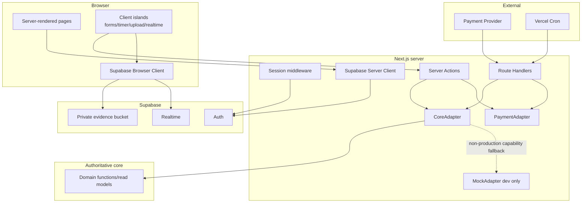

# Design Document: 서바이벌 스터디 웹 (Survival Study Web)

## Overview

서바이벌 스터디 웹은 authoritative core contract인 `.kiro/specs/survival-study-challenge/{requirements.md,design.md,tasks.md}`를 소비하는 Next.js App Router 웹 계층이다. Web_Layer는 화면, 세션 경계, 입력 검증, 외부 HTTP/Storage/Realtime 연결, 사용자 피드백을 소유하고, DB schema, 트랜잭션 도메인 로직, 정산 계산, RLS 정의를 소유하지 않는다.

설계 목표는 다음과 같다.

1. Server Component를 기본으로 사용하고 상호작용이 필요한 부분만 Client Component island로 제한한다.
2. 모든 도메인 쓰기는 Server Action 또는 검증된 Route Handler에서 `CoreAdapter`를 통해 core에 위임한다.
3. core 구현 전에는 동일한 인터페이스의 `MockAdapter`로 UI shell을 병렬 개발하되 운영 환경에서는 mock 선택을 실패시킨다.
4. Supabase Auth, Storage, Realtime과 결제 Provider, Vercel Cron을 각각 좁은 adapter 경계로 격리한다.
5. 공개·보호 경로, 오류, 접근성, 반응형 상태를 route 단위로 일관되게 제공한다.

### Research findings

- Next.js App Router의 Route Handler는 Web `Request`/`Response` 경계를 제공하고 Server Action은 폼 기반 서버 변경에 적합하므로, 사용자 변경은 Server Action, Provider/Cron 호출은 Route Handler로 분리한다. [Next.js Route Handlers and Middleware](https://nextjs.org/docs/app/getting-started/route-handlers-and-middleware), [Next.js Mutating Data](https://nextjs.org/docs/app/getting-started/mutating-data)
- Supabase SSR은 browser/server client를 분리하고 쿠키를 요청·응답 사이에서 갱신하는 구성을 전제로 하므로, 공용 client singleton 대신 실행 환경별 factory를 둔다. [Supabase Next.js server-side auth guide](https://supabase.com/docs/guides/auth/server-side/nextjs)
- Vercel Cron은 구성된 production URL에 GET 요청을 보내며 `CRON_SECRET`을 `Authorization: Bearer ...`로 검증할 수 있다. 따라서 일반 사용자 도메인 변경의 GET 금지 원칙은 유지하되, 인증된 Cron GET만 명시적 예외로 둔다. [Vercel Cron Jobs](https://www.vercel.com/docs/cron-jobs), [Managing Cron Jobs](https://vercel.com/docs/cron-jobs/manage-cron-jobs)

Content was rephrased for compliance with licensing restrictions.

### Scope and ownership boundary

| Concern | Web spec owns | Core contract owns |
|---|---|---|
| UI and routing | App Router pages/layouts, loading/error/not-found, forms, responsive/accessibility behavior | 없음 |
| Authentication | Auth forms, callback, SSR clients, cookie refresh, protected-route redirect | account provisioning, authorization result |
| Domain operations | input DTO validation, server-session context, adapter invocation, cache revalidation, user-facing result | transactions, locking, state transitions, balances, participation, verification, elimination, settlement |
| Data | presentation DTOs and read-model mapping | schema, migrations, constraints, RLS, domain entities |
| Storage | file validation, canonical object key, signed upload/view flow, progress/retry UI | bucket/RLS policy definition and evidence-path acceptance |
| Realtime | subscription lifecycle and authoritative refetch | publication/read model and data correctness |
| Payments | provider-neutral checkout/webhook transport adapter | approved/failed event processing, participation, idempotency ledger |
| Scheduling | authenticated Cron routes and `vercel.json` schedules | elimination and settlement behavior |

## Architecture



### Request rules

- Server Components perform initial reads through `CoreAdapter`; pages do not import core functions or `src/db`.
- Client Components submit domain mutations to Server Actions. Browser DTOs never contain an authoritative `userId`.
- Server Actions create `AdapterContext` from the server session, validate input, invoke `CoreAdapter`, revalidate affected paths/tags, and return serializable action state.
- Payment webhook and Cron Route Handlers validate the external caller before invoking `CoreAdapter`.
- Realtime payloads are invalidation signals only. A received event triggers a debounced authoritative server read rather than replacing the UI directly with untrusted payload data.

## App Router Route Map

| URL | App Router file | Access | Render/behavior |
|---|---|---|---|
| `/` | `src/app/page.tsx` | Public | Server redirect to `/challenges` |
| `/challenges` | `src/app/(public)/challenges/page.tsx` | Public | Official/User sections, filters, empty/error states |
| `/challenges/[challengeId]` | `src/app/(public)/challenges/[challengeId]/page.tsx` | Public | `ChallengeDetailDto`; authenticated CTA islands; closed-recruitment state |
| `/sign-up` | `src/app/(auth)/sign-up/page.tsx` | Anonymous-oriented | Sign-up form and next verification step |
| `/login` | `src/app/(auth)/login/page.tsx` | Anonymous-oriented | Login form; validated same-origin `returnTo` |
| `/auth/callback` | `src/app/auth/callback/route.ts` | Public callback | Exchanges one-time auth code, then redirects to validated `returnTo` |
| `/dashboard` | `src/app/(protected)/dashboard/page.tsx` | Protected | User challenge/participation summary and next action |
| `/challenges/new` | `src/app/(protected)/challenges/new/page.tsx` | Protected | User challenge creation form; no cash fee field |
| `/challenges/[challengeId]/payment/return` | `src/app/(protected)/challenges/[challengeId]/payment/return/page.tsx` | Protected | Server-read payment/participation status; query value is display hint only |
| `/study/[participationId]` | `src/app/(protected)/study/[participationId]/page.tsx` | Protected participant | Goal, timer, evidence, verification status, mission, progress |
| `/study/[participationId]/leaderboard` | `src/app/(protected)/study/[participationId]/leaderboard/page.tsx` | Protected participant | Leaderboard and Realtime refresh island |
| `/study/[participationId]/report` | `src/app/(protected)/study/[participationId]/report/page.tsx` | Protected participant | Learning report or pending state |
| `/wallet` | `src/app/(protected)/wallet/page.tsx` | Protected | Wallet balance and append-only ledger view |
| `/profile` | `src/app/(protected)/profile/page.tsx` | Protected | Badge list and profile summary |
| `/api/payments/webhook/[provider]` | `src/app/api/payments/webhook/[provider]/route.ts` | Provider-signed POST | Raw-body signature verification and normalized event delivery |
| `/api/cron/eliminations` | `src/app/api/cron/eliminations/route.ts` | Cron-secret GET | Calls daily elimination adapter capability |
| `/api/cron/settlements` | `src/app/api/cron/settlements/route.ts` | Cron-secret GET | Lists settlement candidates and settles each candidate |

Each page segment receives `loading.tsx` where data can suspend and a segment `error.tsx` where retry is meaningful. Root `src/app/not-found.tsx` links to `/challenges`; `src/app/global-error.tsx` provides the last-resort trace-safe error shell.

### Protected route matcher

`middleware.ts` refreshes Supabase cookies for applicable HTML requests. It protects `/dashboard`, `/challenges/new`, `/study/:path*`, `/wallet`, `/profile`, and payment return routes. Static assets, image optimization, and payment/Cron APIs are excluded from redirect logic. API routes perform their own signature/secret checks. Middleware is a convenience boundary, not the authorization authority; every protected Server Action repeats server-session validation.

## Directory and File Ownership

```text
src/
  app/                                  # Web-owned App Router routes only
    (public)/challenges/...
    (auth)/(login|sign-up)/...
    (protected)/(dashboard|study|wallet|profile)/...
    api/(payments|cron)/...
    layout.tsx, page.tsx, not-found.tsx, global-error.tsx
  web/                                  # Web-owned implementation
    actions/                            # 'use server' action modules
    adapters/core/                     # CoreAdapter, RealCoreAdapter, MockAdapter, registry
    adapters/payment/                  # PaymentAdapter and provider registry
    auth/                              # session helpers and returnTo validation
    lib/supabase/                      # browser/server/middleware Supabase factories
    components/                        # server/ and client/ presentation components
    dto/                               # web input/output DTOs and mappers
    errors/                            # DomainError-to-UI/HTTP mapping
    storage/                           # validation, path, signed upload/view helpers
    realtime/                          # channel factory and invalidation hooks
    study/                             # monotonic timer state and clock abstraction
    cron/                              # Cron authorization helpers
    validation/                        # form schemas and normalization
    config/                            # server/client env parsing
middleware.ts                          # Web-owned session refresh/protection boundary
vercel.json                            # Web-owned Cron route schedule, coordinated shared root file
tests/web/                             # Web-owned unit/component/route/contract tests
```

Forbidden Web modifications: `src/db/**`, `drizzle/**`, `supabase/migrations/**`, Supabase RLS/Storage SQL, remote migration/reset/data deletion. If a Web feature requires one of these changes, implementation stops at an explicit core contract change request.

### Shared root-file policy

`package.json`, `package-lock.json`, `tsconfig.json`, and `.env.example` are handled by one initial Web ownership task. That task first incorporates current core changes, then applies one lockfile update. Later Web tasks may not independently edit those files. TypeScript changes must preserve `src/db`, Drizzle config, and existing test compilation; a Web-specific `tsconfig.web.json` may extend rather than replace the root config. `.env.example` contains names and descriptions only, never values.

## Server and Client Component Boundaries

### Server Components

- Root/public/protected layouts, challenge lists/details, dashboard, wallet, ledger, profile, report, initial progress, and initial leaderboard are Server Components.
- Server Components may call `getCoreAdapter()` and `createServerClient()` but may not create a browser Supabase client.
- Sensitive values and provider configuration stay in modules marked `server-only`.
- DTOs passed to Client Components are JSON-serializable and exclude secrets, service keys, raw errors, and private evidence contents.

### Client Components

Client islands are limited to:

- `SignUpForm`, `LoginForm`, `LogoutButton`
- `CreateChallengeForm`, `JoinUserChallengeButton`, `OfficialCheckoutButton`
- `DailyGoalForm`, `StudyTimer`, `EvidenceUploader`, `VerificationForm`
- `LeaderboardRealtime`, `MissionRealtime`, dialog/focus management, toasts/live regions

Each mutation island uses pending state to prevent duplicate submission. The timer stores only local, untrusted session state; only positive completed seconds sent once and accepted by core become authoritative. Realtime islands subscribe after mount and always unsubscribe on cleanup.

## Supabase Clients and Session Middleware

### Browser client

`src/web/lib/supabase/browser.ts` (or equivalent under `src/web/auth`) exports a browser-only singleton factory using `NEXT_PUBLIC_SUPABASE_URL` and `NEXT_PUBLIC_SUPABASE_ANON_KEY`. Allowed uses are Auth UI calls where needed, signed Storage upload execution, and Realtime subscription. Browser code does not receive service-role credentials or direct domain-write helpers.

### Server client

`src/web/lib/supabase/server.ts` exports a request-scoped server factory wired to `cookies()`. It reads the authenticated user, exchanges callback codes, creates signed Storage upload/view URLs where allowed, and supports server reads permitted by the core contract. Cookie writes are attempted only in mutable request contexts.

### Middleware client

`src/web/lib/supabase/middleware-client.ts` creates a request/response-bound client. `middleware.ts` forwards updated cookies on both normal and redirect responses. Protected routes preserve `pathname + search` as a relative, same-origin `returnTo`; schemes, hosts, backslashes, and protocol-relative values are rejected.

### Authentication actions

- `signUpAction`: validates email/password/display name, calls Supabase Auth, maps duplicate email to the email field, and returns the next confirmation step.
- `loginAction`: validates credentials, creates cookie session, and redirects to validated `returnTo` or `/dashboard`.
- `logoutAction`: signs out and redirects to `/challenges`.
- Every domain action calls `requireSession()` independently and returns `UNAUTHENTICATED` if no user exists.

## Components and Interfaces

### Adapter result and context

```typescript
export type DomainErrorCode =
  | 'UNAUTHENTICATED'
  | 'DUPLICATE_EMAIL'
  | 'INSUFFICIENT_POINTS'
  | 'PAYMENT_DECLINED'
  | 'DUPLICATE_PARTICIPATION'
  | 'CAPACITY_FULL'
  | 'STUDY_TIME_NOT_MET'
  | 'DEADLINE_EXCEEDED'
  | 'NOT_ALIVE'
  | 'CONSERVATION_VIOLATED'
  | 'INVALID_CONFIG'
  | 'ALREADY_SETTLED';

export type AdapterOnlyErrorCode =
  | 'NOT_IMPLEMENTED'
  | 'VALIDATION_ERROR'
  | 'CONFIGURATION_ERROR'
  | 'TRANSIENT_ERROR'
  | 'UNKNOWN';

export interface AdapterError {
  source: 'core' | 'adapter';
  code: DomainErrorCode | AdapterOnlyErrorCode;
  fieldErrors?: Readonly<Record<string, readonly string[]>>;
  meta?: Readonly<Record<string, string | number | boolean>>;
  traceId: string;
  retryable: boolean;
}

export type AdapterResult<T> =
  | { ok: true; value: T }
  | { ok: false; error: AdapterError };

export interface AdapterContext {
  sessionUserId: string;
  requestId: string;
  now: Date;
}
```

`NOT_IMPLEMENTED` is an adapter-only development state, not an addition to the authoritative core `DomainError` union.

### CoreAdapter

```typescript
export interface CoreAdapter {
  listPublicChallenges(input: ChallengeSearchInput): Promise<AdapterResult<PublicChallengeListDto>>;
  getChallengeDetail(challengeId: string): Promise<AdapterResult<ChallengeDetailDto>>;

  createUserChallenge(ctx: AdapterContext, input: CreateUserChallengeInput): Promise<AdapterResult<{ challengeId: string }>>;
  joinUserChallenge(ctx: AdapterContext, input: { challengeId: string }): Promise<AdapterResult<JoinResultDto>>;

  getOfficialCheckoutQuote(ctx: AdapterContext, input: OfficialCheckoutInput): Promise<AdapterResult<OfficialCheckoutQuoteDto>>;
  getPaymentReturnStatus(ctx: AdapterContext, challengeId: string): Promise<AdapterResult<PaymentStatusDto>>;
  handlePaymentEvent(input: NormalizedPaymentEvent): Promise<AdapterResult<{ duplicate: boolean; participationId?: string }>>;

  getStudyWorkspace(ctx: AdapterContext, participationId: string): Promise<AdapterResult<StudyWorkspaceDto>>;
  authorizeEvidenceUpload(ctx: AdapterContext, input: { participationId: string; date: string }): Promise<AdapterResult<{ userId: string; challengeId: string; date: string }>>;
  submitDailyGoal(ctx: AdapterContext, input: DailyGoalInput): Promise<AdapterResult<DailyProgressDto>>;
  recordTimerSession(ctx: AdapterContext, input: TimerSessionInput): Promise<AdapterResult<DailyProgressDto>>;
  submitVerification(ctx: AdapterContext, input: VerificationInput): Promise<AdapterResult<VerificationStatusDto>>;

  getProgress(ctx: AdapterContext, participationId: string): Promise<AdapterResult<ProgressDto>>;
  getLeaderboard(ctx: AdapterContext, participationId: string): Promise<AdapterResult<LeaderboardDto>>;
  getWallet(ctx: AdapterContext): Promise<AdapterResult<WalletDto>>;
  getLedger(ctx: AdapterContext, cursor?: string): Promise<AdapterResult<LedgerPageDto>>;
  getProfile(ctx: AdapterContext): Promise<AdapterResult<ProfileDto>>;
  getLearningReport(ctx: AdapterContext, participationId: string): Promise<AdapterResult<LearningReportDto | null>>;
  getActiveMission(ctx: AdapterContext, participationId: string): Promise<AdapterResult<SurpriseMissionDto | null>>;

  processDailyEliminations(input: { runAt: string; executionId: string }): Promise<AdapterResult<{ processed: number }>>;
  listSettlementCandidates(input: { runAt: string; executionId: string }): Promise<AdapterResult<readonly string[]>>;
  settleChallenge(input: { challengeId: string; executionId: string }): Promise<AdapterResult<SettlementRunDto>>;
}
```

The real adapter maps these Web capabilities to core functions such as `listOpenOfficialChallenges`, `getChallengeDetail`, `createUserChallenge`, `joinUserChallenge`, `submitDailyGoal`, `recordTimerSession`, `submitVerification`, `processDailyEliminations`, `settleChallenge`, wallet/ledger reads, and game read models. `getOfficialCheckoutQuote`, public User_Challenge discovery, payment status, evidence-upload authorization, and settlement candidate listing are explicit capability gaps until corresponding core functions exist; the real adapter returns `NOT_IMPLEMENTED` in non-production and fails production startup/config validation if a required capability is absent.

### MockAdapter

`MockAdapter implements CoreAdapter` and uses frozen fixture modules keyed by stable IDs. It provides deterministic success/error scenarios through non-production fixture selectors, marks rendered data with `source: 'mock'`, and never imports DB clients or performs Auth, Storage, payment, wallet, participation, verification, or settlement writes. Unsupported methods return adapter-only `NOT_IMPLEMENTED`. `CORE_ADAPTER_MODE=mock|hybrid` is rejected when `NODE_ENV=production`; production requires `real` and a complete capability check.

### PaymentAdapter

```typescript
export interface PaymentAdapter {
  readonly provider: string;
  isConfigured(): boolean;
  createCheckoutSession(input: {
    externalReference: string;
    userId: string;
    challengeId: string;
    amountMinor: number;
    currency: string;
    pointDiscount: number;
    returnUrl: string;
  }): Promise<AdapterResult<{ checkoutUrl: string; expiresAt: string }>>;
  verifyAndNormalizeWebhook(input: {
    rawBody: Uint8Array;
    headers: Readonly<Record<string, string>>;
  }): Promise<AdapterResult<NormalizedPaymentEvent>>;
}

export type NormalizedPaymentEvent = {
  provider: string;
  externalReference: string;
  status: 'approved' | 'failed';
  userId: string;
  challengeId: string;
  amountMinor: number;
  currency: string;
  occurredAt: string;
};
```

`PaymentAdapter` owns provider SDK calls and signatures, while `CoreAdapter.handlePaymentEvent` owns domain processing and idempotency result. A provider registry lives in a server-only module. Missing production provider configuration disables the checkout action with `CONFIGURATION_ERROR`; no mock cash checkout is exposed in production.

## Data Models and DTO Mapping

Web DTOs intentionally avoid importing Drizzle row types.

| Feature | Input DTO | Output DTO | Core mapping |
|---|---|---|---|
| Discovery | `ChallengeSearchInput { kind?, cursor? }` | `PublicChallengeListDto`, `ChallengeCardDto` | official/public user read models |
| Detail | route `challengeId` | `ChallengeDetailDto` | `ChallengeDetail`; money normalized as minor units/display string |
| Creation | `CreateUserChallengeInput` | `{ challengeId }` | `UserChallengeConfig`; no cash field |
| Point join | `{ challengeId }` | `JoinResultDto` | `joinUserChallenge(sessionUserId, challengeId)` |
| Official checkout | `{ challengeId, pointDiscount }` | `OfficialCheckoutQuoteDto`, provider session | core quote validation + `PaymentAdapter` transport |
| Daily goal | `{ participationId, date, goal }` | `DailyProgressDto` | `submitDailyGoal` |
| Timer | `{ participationId, date, elapsedSeconds, clientSessionId }` | `DailyProgressDto` | `recordTimerSession`; core result authoritative |
| Verification | `{ participationId, date, retrospective, evidencePath }` | `VerificationStatusDto` | `submitVerification` |
| Progress | participation ID | `ProgressDto`, `LeaderboardDto`, `SurpriseMissionDto` | core read models |
| Wallet/profile | cursor/none | `WalletDto`, `LedgerPageDto`, `ProfileDto`, `LearningReportDto` | core reads |
| Cron | `{ runAt, executionId }` | counts/results | elimination/candidate/settlement functions |

Dates use `YYYY-MM-DD` challenge-local calendar strings; instants use ISO-8601 UTC strings. Cash is transported as integer minor units and formatted only in the presentation layer. Point values are decimal-free integers. DTO mappers exhaustively map core discriminants so a changed core union causes TypeScript contract-test failure.

## DomainError and UI/HTTP Mapping

| Code | UI behavior | Route Handler behavior |
|---|---|---|
| `UNAUTHENTICATED` | login link preserving safe `returnTo` | 401 |
| `DUPLICATE_EMAIL` | email field error | 409 when applicable |
| `INSUFFICIENT_POINTS` | required/current Point and wallet link | 409 |
| `PAYMENT_DECLINED` | payment retry guidance, no participation success | webhook still acknowledges a valid failed event after core records it |
| `DUPLICATE_PARTICIPATION` | existing study link | idempotent payment response when applicable |
| `CAPACITY_FULL` | close CTA and show recruitment closed | 409 |
| `STUDY_TIME_NOT_MET` | missing duration and timer focus/link | 409 |
| `DEADLINE_EXCEEDED` | deadline/status guidance | 409 |
| `NOT_ALIVE` | eliminated state and core-provided recovery actions | 409 |
| `CONSERVATION_VIOLATED` | generic trace-safe error | 500 and structured secret-free log |
| `INVALID_CONFIG` | accessible field errors when supplied | 422 |
| `ALREADY_SETTLED` | settled status | idempotent Cron success |
| `NOT_IMPLEMENTED` | non-production capability banner | 501 outside production; production config must fail earlier |
| unknown/transient | generic message, trace ID, retry if safe | 500/503 |

Raw stack traces, SQL details, provider bodies, tokens, and evidence content are never included in action state or logs.

## Server Actions

Action modules under `src/web/actions` contain one concern each:

- `auth-actions.ts`: sign-up, login, logout.
- `challenge-actions.ts`: create User_Challenge, join by Point, start official checkout.
- `study-actions.ts`: Daily_Goal, timer session, verification, signed evidence upload/view request.
- `refresh-actions.ts`: explicit read refresh fallback when Realtime is unavailable.

A common action pipeline is: parse `FormData`/JSON with a schema → `requireSession()` → build `AdapterContext` → call adapter → map error → `revalidatePath`/`revalidateTag` on success → return `ActionState` or redirect. Action state contains `status`, field errors, message key, recovery href, and trace ID. Redirects occur only after successful mutation/checkout creation. Duplicate submissions are blocked in the client and domain idempotency remains authoritative.

## Route Handlers

### Payment webhook

`POST /api/payments/webhook/[provider]` reads `request.arrayBuffer()` exactly once, snapshots allowed headers, obtains the provider adapter, verifies the signature, and only then calls `CoreAdapter.handlePaymentEvent`. Invalid provider/signature returns 401 without a core call. Valid duplicate events return 200. Retryable adapter/core failures return 5xx; permanent accepted events return 2xx. The raw body is not parsed or logged before verification.

### Cron

Both Cron handlers accept Vercel's GET invocation because Cron is the documented, secret-authenticated exception to the user-domain GET mutation rule. They compare `Authorization: Bearer ${CRON_SECRET}` with constant-time byte comparison, reject missing/mismatched values with 401, and generate or propagate a secret-free execution ID.

- `/api/cron/eliminations`: calls `processDailyEliminations({ runAt, executionId })` and returns `{ executionId, processed }`.
- `/api/cron/settlements`: calls `listSettlementCandidates`, then `settleChallenge` for each ID with bounded sequential or limited-concurrency execution. `ALREADY_SETTLED` is counted as idempotent success. `CONSERVATION_VIOLATED` logs challenge ID, execution ID, and code only, then returns 500.

`vercel.json` schedules:

```json
{
  "crons": [
    { "path": "/api/cron/eliminations", "schedule": "*/10 * * * *" },
    { "path": "/api/cron/settlements", "schedule": "5 * * * *" }
  ]
}
```

Deployment must use a Vercel plan that supports the selected frequencies; changing frequency does not change route contracts.

## Storage Evidence

### Canonical key and core compatibility

The canonical object key is:

```text
{user_id}/{challenge_id}/{YYYY-MM-DD}/{file_id}
```

where each ID is a canonical UUID and `file_id` is a server-generated UUID with no extension or original filename. The core design's `{user_id}/{challenge_id}/{date}` is interpreted as the **required folder prefix**, not a terminal object key. The Web key is therefore a strict child of the core prefix. `VerificationInput.evidencePath` carries the complete four-segment key. Core validation must accept exactly one opaque object segment after the prefix; if existing core Storage RLS or validation requires exactly three segments, that is a core contract change request and Web integration remains on `MockAdapter` until resolved. Web tasks do not edit the policy.

### Upload flow

1. Client validates configured MIME allowlist and maximum bytes for immediate feedback.
2. `createEvidenceUploadAction` repeats validation against name-independent metadata, calls `authorizeEvidenceUpload` so core verifies the session/participant/date relationship and returns the authoritative owner/challenge/date, generates `file_id`, and returns a short-lived signed upload target for the canonical key.
3. `EvidenceUploader` uploads directly to the private `evidence` bucket and displays progress/retry state. Original filenames are presentation-only and are not used in object keys.
4. Verification submission is enabled only after upload success and sends the canonical key, not a public URL.
5. Failed upload preserves non-sensitive retrospective text in component state. Viewing uses a separately authorized server action that creates a short-lived signed URL.

## Realtime Refresh

`LeaderboardRealtime` and `MissionRealtime` use the browser client and a channel scoped to the current challenge. Realtime payloads contain no authority for wallet or survival decisions. Relevant events trigger a 250–500 ms debounced `router.refresh()` or a typed refresh endpoint, causing Server Components to re-read through `CoreAdapter`. UI displays `connected`, `reconnecting`, or `offline`, plus the last successful server refresh time. Cleanup removes the channel; fallback buttons refresh the same authoritative reads without Realtime.

## Core Incompleteness and Parallel Development

A capability manifest records each `CoreAdapter` method as `mock`, `real`, or unavailable. Initial UI shell work uses deterministic mock reads and no-op simulated action results in development. Integration proceeds capability-by-capability only after the corresponding authoritative core function and return type compile:

1. Add the real mapping in `RealCoreAdapter`.
2. Add a contract test for DTO/error mapping.
3. Switch only that capability to real in non-production hybrid mode.
4. Run Web adapter tests against a fake core port; real DB tests remain core-owned.
5. Mark production capability validation complete.

Actions and pages never branch on core implementation details; only the adapter registry chooses implementations. This allows public pages, forms, accessibility, timer state, upload UI, and Realtime lifecycle to progress while core transactions are unfinished.

## Error Handling

- `error.tsx` boundaries provide a retry action and trace-safe message without discarding global navigation.
- Form validation errors bind through `aria-describedby`; dynamic summaries use `role="alert"` or an appropriate live region.
- Network failures preserve non-sensitive form values. Passwords, tokens, file bytes, and payment data are not persisted for retry.
- Timer recording failures retain the completed local duration and `clientSessionId`; retry is explicit. The server/core decides duplicate handling.
- Upload failures retain retrospective text and selected-file metadata but require user confirmation before retry.
- Payment return pages ignore query claims and read status from the server.
- Realtime failure degrades to manual refresh without blocking core study functions.
- Unknown errors receive a generated trace ID; structured logs include operation, route, error code, and trace ID only.

## Security and Privacy

- Server-only environment parser owns `SUPABASE_SERVICE_ROLE_KEY`, DB URLs (if core needs them), provider secrets, webhook secret, and `CRON_SECRET`. Client env exposes only Supabase URL and anon/publishable key.
- Browser-provided `userId`, amount, wallet balance, role, evidence owner, payment status, and survival status are ignored as authority.
- All protected actions derive identity from the server session and pass target identifiers to core for relationship authorization.
- Payment signatures are verified over untouched bytes; Cron secrets are constant-time compared; auth `returnTo` is relative and same-origin.
- User strings render as React text. No `dangerouslySetInnerHTML` is used for descriptions, goals, retrospectives, missions, or reports.
- Evidence is private, addressed by server-generated opaque IDs, and viewed with short-lived signed URLs after authorization.
- State-changing user operations use Server Action POST semantics or POST Route Handlers. Auth callback GET exchanges a one-time code; secret-authenticated Vercel Cron GET is the only domain-job exception.
- Logs redact Authorization, Cookie, raw webhook body, file contents, signed URLs, provider secrets, and Supabase tokens.
- Recommended response headers include a restrictive Content Security Policy, `Referrer-Policy`, `X-Content-Type-Options`, and clickjacking protection; exact policy is tested against provider redirect requirements.

## Accessibility and Responsive Design

- Semantic landmarks, one page heading, programmatic labels, error associations, descriptive button names, and live async status are component acceptance standards.
- All dialogs use focus entry, trap/containment, Escape/close behavior, and focus restoration. Native elements are preferred over custom roles.
- Visible focus is not removed; status never depends on color alone. Contrast targets WCAG 2.2 AA.
- Layout starts at 320 CSS px with single-column cards/forms and expands through content-driven breakpoints. Tables become labelled card lists or horizontally self-contained regions only when data cannot reflow; core flows never require viewport-level horizontal scrolling.
- At 200% zoom, actions and content remain present. Touch targets and error text do not overlap fixed navigation.
- `prefers-reduced-motion: reduce` disables nonessential transitions and timer/mission animation.

## Testing Strategy

Property-based testing is not selected for this Web spec. Most behavior is UI rendering, finite validation rules, session middleware, external adapter wiring, or side-effect orchestration; repeatedly generating inputs would mainly test framework/provider behavior rather than Web-owned universal business logic. Core's transformations and invariants remain covered by the core spec's property tests. Web uses focused unit, component, route, contract, accessibility, and a small number of integration tests.

### Unit and component tests

- Vitest + React Testing Library + user-event for forms, pending/duplicate prevention, timer state, errors, mock banner, and responsive component semantics.
- Schema tests for challenge creation, timer positive seconds, file type/size, safe `returnTo`, and evidence-key parsing.
- Fake timers and monotonic clock injection for refresh/sleep timer behavior.
- axe-based automated checks for labels, names, dialog focus, live status, and representative pages; manual visual checks are outside automated tasks.

### Adapter and Route Handler tests

- Type-level/compile contract tests ensure `RealCoreAdapter` exhaustively maps core results and errors without importing DB internals from pages/actions.
- Supabase Auth doubles test sign-up/login/logout, cookie propagation, and protected return.
- Storage doubles test validation, canonical four-segment path, signed upload, failure retry, and signed view.
- Realtime doubles test subscribe, authoritative refresh, reconnect state, and cleanup.
- Payment doubles test missing configuration, checkout creation, raw-body verification, invalid signature/no-core-call, approved/failed normalization, duplicate event, and retryable 5xx.
- Cron tests cover valid/invalid secret, execution ID/count, `ALREADY_SETTLED`, `CONSERVATION_VIOLATED`, and no-core-call on unauthorized requests.

### Integration and smoke tests

- App Router smoke tests cover route availability, public/protected redirects, loading/empty/error boundaries, and not-found navigation.
- Browser-level tests cover public discovery → login return → Point join; creation; goal/timer/evidence/verification; leaderboard fallback; wallet/profile/report. Core is replaced with deterministic adapter fixtures unless the specific capability has been integrated.
- Production configuration smoke tests reject mock/hybrid mode, absent payment configuration when checkout is enabled, missing Supabase public config, and missing Cron secret.
- Tests do not run remote migration/reset/delete and do not assert core transaction calculations.

## Requirement Traceability

| Requirement | Design coverage | Planned verification |
|---|---|---|
| 1 | App shell, route map, segment boundaries | shell/navigation/loading/not-found tests |
| 2 | Supabase clients, middleware, auth actions | Auth doubles and redirect/cookie tests |
| 3 | public challenge routes and DTOs | deterministic list/detail states |
| 4 | checkout action, PaymentAdapter, return route | checkout/status/error tests |
| 5 | creation route/schema/action | validation and redirect tests |
| 6 | Point join action and wallet DTO | success/domain-error mapping tests |
| 7 | StudyTimer and goal actions | fake-clock/retry/progress tests |
| 8 | evidence path/upload and verification action | Storage/action/error tests |
| 9 | Realtime invalidation/read refresh | channel lifecycle/reconnect tests |
| 10 | wallet/ledger Server Components | read/empty/error/no-write tests |
| 11 | profile/report/mission routes/components | present/pending/no-mission tests |
| 12 | provider registry and signed webhook | raw-body/signature/idempotency tests |
| 13 | Cron routes and schedules | secret/core result/structured response tests |
| 14 | adapter interfaces, capability manifest, mock rules | compile/config/mock-isolation tests |
| 15 | action pipeline and error mapper | field/domain/unknown/network tests |
| 16 | server-only config, trusted identity, signed URLs | secret boundary and authorization tests |
| 17 | accessibility/responsive component standards | axe, keyboard, zoom/layout-oriented tests |
| 18 | directory/shared-file ownership | path/import/config policy checks |
| 19 | complete test architecture | fixture-driven suites listed above |

All Requirements 1–19 are represented by an implementation component and a corresponding automated-test category. No design component assigns schema, RLS, migration, transaction, settlement-calculation, or remote DB responsibilities to the Web_Layer.

## Visual Design System — Apple-inspired

### 적용 원칙과 우선순위

이 섹션은 Survival Study Web의 실제 구현에 적용할 **authoritative visual direction**이다. 앞선 기술 설계의 컴포넌트 경계, 접근성, 보안, route 동작을 변경하지 않으며, 화면의 시각 언어와 composition을 구체화한다. 기존 `prototype.html`에 임시로 사용된 navy/lime 스타일, 색상, 그림자, radius, typography보다 이 섹션의 token과 component 규칙이 우선한다. 구현 중 충돌이 발생하면 기능·접근성 요구사항을 유지한 상태에서 이 섹션을 적용한다.

이 방향은 Apple의 로고, 제품 이미지, 상표, 고유 카피 또는 제품 화면을 복제하지 않는다. Apple과의 제휴·보증·공식 관계를 암시하는 표현도 사용하지 않는다. 참고 범위는 낮은 정보 밀도, 명확한 hierarchy, 절제된 색과 여백, 일관된 token 같은 일반적인 디자인 원칙뿐이며, 결과물의 브랜드와 콘텐츠는 Survival Study Web 고유 자산이어야 한다.

전체 화면은 기능과 핵심 상태가 주인공이 되는 near-invisible UI를 지향한다. 장식용 chrome을 줄이고, 사용자가 지금 살아남았는지, 오늘 무엇을 해야 하는지, 얼마나 학습했는지, 인증이 완료되었는지를 첫 시선에 파악하게 한다. 마케팅·탐색 화면은 full-bleed light, parchment, dark feature tile을 교차 배치하고 별도 divider 대신 배경색 전환으로 section 경계를 만든다. 학습 서비스에는 product photography를 억지로 대입하지 않는다. 다음 항목을 focal artifact로 취급한다.

- 챌린지 고유 identity: 고유 wordmark가 아닌 자체 생성 title treatment, 기간, 규칙, participant context
- `Survival_Status`: 생존·탈락·완주 상태를 텍스트와 아이콘을 동반해 표현한 핵심 상태물
- `Study_Timer`와 progress: 오늘의 요구 시간 대비 확정 시간, 로컬 세션, deadline
- 사용자 생성 evidence와 `Learning_Report`: 권한이 확인된 preview, 업로드 상태, 회고 및 결과 요약

store/configurator형 utility card 패턴은 정보 밀도가 실제로 필요한 챌린지 목록, 공식 결제 확인, Point_Wallet·Point_Ledger, 설정·프로필, 폼과 표에만 사용한다. hero, challenge identity, timer 같은 focal 영역을 작은 카드 여러 개로 쪼개지 않는다. 반대로 폼·표·ledger에 full-viewport 저밀도 hero 구성을 강제하지 않는다.

장식용 gradient와 모든 일반 UI shadow를 금지한다. 허용되는 유일한 shadow는 focal media/artifact에만 적용하는 `rgba(0,0,0,.22) 3px 5px 30px 0`이다. 버튼, navigation, 입력, utility card, toast, 텍스트에는 shadow를 적용하지 않는다.

### Color tokens와 사용 규칙

| Token | Value | 사용 |
|---|---:|---|
| `primary` | `#0066cc` | light/parchment surface의 단일 action accent, 기본 text link |
| `primary-focus` | `#0071e3` | light surface의 focus/active 강조와 큰 primary action |
| `primary-on-dark` | `#2997ff` | dark/black surface의 link와 action |
| `canvas` | `#ffffff` | 기본 page canvas와 light feature tile |
| `canvas-parchment` | `#f5f5f7` | section 전환, footer, 저강도 grouping |
| `surface-pearl` | `#fafafc` | utility panel, form group, pearl capsule |
| `surface-tile-1` | `#272729` | 첫 번째 dark feature tile |
| `surface-tile-2` | `#2a2a2c` | 인접 dark feature tile variation |
| `surface-tile-3` | `#252527` | 세 번째 dark feature tile variation |
| `surface-black` | `#000000` | global navigation과 가장 강한 focal section |
| `chip` | `rgba(210,210,215,.64)` | light surface의 비선택 option chip; blur 가능한 반투명 배경 |
| `ink` / `body` | `#1d1d1f` | light surface의 heading과 본문 |
| `body-on-dark` | `#ffffff` | dark surface의 heading과 주요 본문 |
| `body-muted` | `#cccccc` | dark surface의 보조 설명 |
| `ink-muted-80` | `#333333` | light surface의 강한 보조 본문 |
| `ink-muted-48` | `#7a7a7a` | caption, metadata, placeholder; 대비 검증 필요 |
| `divider-soft` | `#f0f0f0` 또는 `rgba(0,0,0,.04)` | 넓은 grouping 안의 낮은 강도 구분선 |
| `hairline` | `#e0e0e0` | 입력·utility card 경계와 table row separator |

**Single accent rule:** 브랜드 action 색은 blue 계열 하나뿐이다. light/parchment/pearl에서는 `primary`와 상태 변형인 `primary-focus`만, dark/black에서는 같은 의미의 surface 대응값인 `primary-on-dark`만 사용한다. green, lime, violet, orange 등을 두 번째 브랜드 accent로 추가하지 않는다. 생존·완료 상태도 색만으로 브랜드화하지 않고 텍스트, 아이콘, progress 형태를 우선한다.

**Dark-surface link rule:** dark surface의 링크와 text action은 반드시 `primary-on-dark`를 사용한다. `primary` 또는 `primary-focus`를 dark surface에 그대로 올리지 않으며, light surface에서 `primary-on-dark`를 사용하지 않는다. 링크는 색 외에 문맥상 link임이 드러나는 label을 제공하고, 본문 안에서는 underline 또는 명확한 affordance를 함께 사용한다.

오류와 파괴적 위험은 브랜드 accent가 아닌 제한된 semantic red로만 표현한다. 권장 token은 `error: #b42318`이며, dark surface에서는 WCAG 2.2 AA를 만족하도록 별도 검증한 대응값을 사용할 수 있다. semantic red는 validation error, 결제 실패, 탈락 위험 또는 destructive confirmation에만 사용하고 두 번째 브랜드 색처럼 넓은 면적에 사용하지 않는다. warning, success, survival 상태는 우선 중립 surface와 텍스트·아이콘·label로 전달한다.

### Typography

Display stack은 `SF Pro Display, system-ui, -apple-system, BlinkMacSystemFont, "Segoe UI", sans-serif`, body/UI stack은 `SF Pro Text, system-ui, -apple-system, BlinkMacSystemFont, "Segoe UI", sans-serif`이다. SF Pro는 proprietary font이므로 번들에 포함하거나 무단 배포하지 않는다. Apple 플랫폼에서 사용 가능한 경우에만 시스템이 선택하고, 그 외 환경에서는 `system-ui` 계열 fallback을 사용한다. 브랜드 일관성을 위해 self-hosted 대체 글꼴이 필요하면 라이선스를 확인한 `Inter`를 display와 body의 optional substitute로 사용할 수 있으나, 한 화면에서 SF 계열과 Inter를 임의 혼합하지 않는다.

| Token | Size | Weight | Line-height | Letter-spacing | 용도 |
|---|---:|---:|---:|---:|---|
| `hero` | 56px | 600 | 1.07 | -0.28px | desktop challenge identity, 핵심 survival statement |
| `display-lg` | 40px | 600 | 1.10 | 0 | section title, compact hero |
| `display-md` | 34px | 600 | 1.47 | -0.374px | mobile hero, 주요 결과 heading |
| `lead` | 28px | 400 | 1.14 | 0 | hero support statement, timer context |
| `lead-airy` | 24px | 300 | 1.5 | 0 | 넓은 editorial explanation |
| `tagline` | 21px | 600 | 1.19 | 0.231px | challenge promise, section kicker |
| `body-strong` | 17px | 600 | 1.24 | -0.374px | emphasized body, utility title |
| `body` | 17px | 400 | 1.47 | -0.374px | 기본 본문과 form 설명 |
| `dense-link` | 17px | 400 | 2.41 | 0 | dense utility list link |
| `caption` | 14px | 400 | 1.43 | -0.224px | metadata, helper text |
| `caption-strong` | 14px | 600 | 1.29 | -0.224px | chip label, table header |
| `button-large` | 18px | 300 | 1 | 0 | large primary button |
| `button-utility` | 14px | 400 | 1.29 | -0.224px | compact utility action |
| `fine-print` | 12px | 400 | 1 | -0.12px | constrained legal/helper copy |
| `micro-legal` | 10px | 400 | 1.3 | -0.08px | 법적 고지의 최저 단계; 핵심 정보에 사용 금지 |
| `nav-link` | 12px | 400 | 1 | -0.12px | global navigation link |

허용 weight는 `300`, `400`, `600`, `700`뿐이다. `500`은 사용하지 않는다. 기본 body는 17px이며 정보 밀도를 줄이기 위해 body를 14px로 축소하지 않는다. 14px 이하는 metadata와 비핵심 고지에만 사용한다. Display 계열은 지정된 negative tracking을 유지하며, 임의의 letter-spacing으로 넓히지 않는다. `700`은 숫자 상태나 접근성상 강한 hierarchy가 꼭 필요한 짧은 label에만 제한하고, hero와 일반 heading은 `600`을 기본으로 한다.

### Layout, spacing, elevation, shapes

공간 체계는 8px base를 기준으로 하되 optical alignment가 필요한 `xxs`, `sm`, `md`를 명시적으로 사용한다.

| Token | Value |
|---|---:|
| `space-xxs` | 4px |
| `space-xs` | 8px |
| `space-sm` | 12px |
| `space-md` | 17px |
| `space-lg` | 24px |
| `space-xl` | 32px |
| `space-xxl` | 48px |
| `space-section` | 80px |

본문·설명 text measure는 최대 `980px`, 반복 grid는 최대 `1440px`에 고정한다. feature tile 배경은 viewport full-bleed를 허용하되 내부 콘텐츠는 위 max-width와 responsive gutter에 맞춘다. grid gap은 20–24px 범위에서 `20px` 또는 `space-lg`만 사용한다. hero는 navigation 아래 첫 콘텐츠 기준 최소 64px의 상단 whitespace와 48–64px의 하단 whitespace를 확보한다. hero copy와 focal artifact 사이에는 최소 40px을 둔다. viewport가 작을 때도 이 간격을 임의로 16px 이하로 압축하지 않고 typography와 layout을 먼저 전환한다.

| Elevation token | 표현 | 적용 |
|---|---|---|
| `elevation-flat` | shadow 없음, 배경색 전환 | 대부분의 section, button, card, form |
| `elevation-hairline` | `1px` `hairline` 또는 `divider-soft` 경계 | utility card, 입력, table/ledger row |
| `elevation-blur` | 반투명 surface + `backdrop-filter`; shadow 없음 | 52px frosted sub-nav, floating sticky bar |
| `elevation-artifact` | `rgba(0,0,0,.22) 3px 5px 30px 0` | focal evidence/report/media artifact 한정 |

| Radius token | Value | 적용 |
|---|---:|---|
| `radius-none` | 0 | full-bleed feature tile, table region |
| `radius-xs` | 5px | 작은 field state, compact media |
| `radius-sm` | 8px | 입력, dense utility element |
| `radius-md` | 11px | utility card, evidence preview |
| `radius-lg` | 18px | 큰 card 또는 bounded artifact |
| `radius-pill` / `radius-full` | 9999px | button, chip, search, capsule |

같은 component family는 하나의 radius token을 공유한다. full-bleed tile에는 radius를 적용하지 않는다. 둥근 모서리를 hierarchy 대신 장식으로 반복하지 않는다.

### Component system과 앱 매핑

#### Navigation

- **Global nav:** 높이 44px, `surface-black`, `body-on-dark` 기반이다. 좌측에는 Survival Study Web의 최종 브랜드명 또는 text identity, 우측에는 현재 세션에 맞는 route link를 둔다. 최소 44×44px hit target을 확보하되 nav text는 `nav-link`를 사용한다. logo처럼 보이는 Apple glyph나 Apple 고유 자산을 사용하지 않는다.
- **Frosted sub-nav:** 높이 52px, 현재 section title·상태·주요 local navigation을 제공한다. `canvas` 또는 `canvas-parchment`의 반투명 대응값과 backdrop blur를 사용하며 shadow 대신 하단 `divider-soft`를 둔다. sticky 사용 시 main content가 가려지지 않도록 offset을 제공한다.
- 좁은 viewport에서는 global nav의 비핵심 link를 명시적 menu button으로 collapse하고, sub-nav는 title + 한 개의 핵심 action 또는 horizontally scrollable이 아닌 menu 구조로 축소한다.

#### Actions and controls

| Component | Visual contract | 주요 사용처 |
|---|---|---|
| `button-primary-pill` | blue fill, white label, `radius-pill`, shadow 없음 | 참가, 저장, 인증 제출 |
| `button-secondary-outline-pill` | transparent, 1px `hairline`/ink border, ink label | 취소, 나중에, 상세 보기 |
| `button-dark-utility` | dark fill, white label, compact pill | dark tile 내부 utility action |
| `button-pearl-capsule` | `surface-pearl` 또는 chip fill, ink label | filter, low-emphasis mode switch |
| `button-large-primary` | `button-large`, 충분한 horizontal padding, 최소 44px 높이 | hero의 단일 주요 CTA |
| `button-circular-icon` | 최소 44×44px circle, accessible name 필수 | timer control, media navigation |
| `link-text` | surface별 blue token, 명확한 label/underline 문맥 | 보조 navigation과 recovery action |

모든 press 가능한 control은 active 상태에서 `transform: scale(.95)`를 사용할 수 있다. transition은 짧고 비장식적으로 유지하며 `prefers-reduced-motion: reduce`에서는 scale transition을 제거한다. disabled 상태는 opacity만 낮추지 말고 비활성 이유를 인접 text로 제공한다.

- **Search input pill:** 챌린지 discovery 전용 검색 입력은 최소 44px 높이, `radius-pill`, `surface-pearl`, 1px transparent 또는 focus 시 명확한 blue outline을 사용한다. search icon에는 accessible label이 필요 없을 수 있으나 input 자체에는 programmatic label이 반드시 있다. 결과 수와 empty state는 입력 아래 live region에서 제공한다.
- **Option chip:** 기본은 `chip`, 선택 상태는 blue border 또는 blue text와 check icon/`선택됨` 상태를 함께 사용한다. 선택 여부를 fill color만으로 전달하지 않는다.
- **Neutral validation:** 기본 input은 `canvas`/`surface-pearl` + `hairline`, focus는 단일 blue focus ring을 사용한다. 오류 시 semantic red border·icon·연결된 error text를 함께 제공하고 `aria-invalid`/`aria-describedby`를 설정한다. 성공 field를 별도 green brand treatment로 칠하지 않는다. destructive action은 semantic red text 또는 border와 구체적인 확인 문구를 사용한다.

#### Feature and utility compositions

- **`feature-tile-light`:** `canvas` full-bleed section, dark ink, large challenge identity 또는 report artifact. 인접 section과 색 전환으로 구분한다.
- **`feature-tile-parchment`:** `canvas-parchment` full-bleed section, 규칙·학습 방식·결과 설명처럼 차분한 narrative에 사용한다.
- **`feature-tile-dark`:** `surface-tile-1/2/3` 또는 `surface-black` full-bleed section, white heading와 muted body, `primary-on-dark` action을 사용한다. dark tile끼리 인접할 때 token을 교차해 경계를 만든다.
- 위 feature tile들은 product tile을 그대로 모방하는 것이 아니라 challenge identity, survival snapshot, timer/progress, evidence/report artifact를 중심에 놓는 Survival Study Web의 고유 composition이다.
- **Challenge utility card:** 목록·dashboard에서 challenge kind, 기간, 비용/Point, 일일 시간, 모집·생존 상태, 다음 action을 compact hierarchy로 표시한다. 기본은 flat + hairline이며 card 전체 click target과 내부 button을 중첩하지 않는다.
- **Official checkout card:** 금액, Point 할인, 최종 결제액, participant 대상, provider 이동 사실을 한 utility panel에서 검토하게 한다. 가격 숫자가 focal이고 CTA는 하나만 primary로 둔다.
- **Environment note / editorial quote:** 챌린지 운영 원칙, surprise mission context, 학습 회고의 인용문을 강조할 필요가 있을 때만 사용한다. 장식 따옴표나 gradient 대신 `lead-airy`, 넓은 whitespace, 얇은 hairline을 사용하며 필수 상태를 quote에만 숨기지 않는다.
- **Floating sticky participation/verification bar:** challenge detail과 study 화면의 viewport 하단에 선택적으로 배치한다. 반투명 pearl backdrop + blur + 상단 hairline, 현재 비용/인증 가능 상태와 한 개의 primary action을 포함한다. safe-area inset을 반영하고 320px/200% zoom에서 content를 가리지 않도록 inline block으로 전환할 수 있어야 한다.
- **Footer:** `canvas-parchment`, text links, legal/support 정보, 현재 서비스 identity를 사용한다. footer를 dark marketing banner로 만들지 않고 `fine-print` 이상의 읽기 가능한 hierarchy를 유지한다.

#### 기능별 구체 매핑

- **Challenge discovery:** 980px intro/검색 영역 뒤에 최대 1440px challenge utility grid를 둔다. Official/User section은 light와 parchment background 전환 또는 명시적 heading으로 구분한다. desktop 2–3열, mobile 1열이며 무조건 full-viewport hero를 반복하지 않는다.
- **Challenge detail:** challenge identity, 기간·일일 조건·Survival_Status context를 저밀도 hero에 두고, 규칙과 참가 정보는 utility card로 내린다. Official checkout 또는 Point 참가 sticky bar는 현재 모집 상태와 비용을 텍스트로 명시한다.
- **Official checkout/return:** checkout은 dense utility layout으로 금액과 상태를 검토하게 하며 마케팅 hero를 반복하지 않는다. return 화면은 서버에서 확인한 결제/참가 상태가 focal artifact이고 query hint는 보조 text로만 취급한다.
- **Study timer/verification:** timer 숫자, 서버 확정 누적 시간, 오늘 required time, Survival_Status를 focal area에 둔다. goal·evidence·retrospective는 순차적 utility sections로 구성한다. 로컬 미확정 시간과 서버 확정 시간을 typography와 label로 분리하며 색에만 의존하지 않는다.
- **Leaderboard:** 상위 결과 또는 사용자 자신의 행은 넓은 status summary로 보여 줄 수 있지만 전체 순위는 접근 가능한 dense table/list를 유지한다. low-density full-screen tile을 각 row에 적용하지 않는다. Realtime 상태와 마지막 갱신 시각을 caption + icon으로 표시한다.
- **Wallet/Profile/Report:** wallet balance나 report outcome은 focal number/artifact가 될 수 있다. ledger, badges, profile settings는 utility card/table을 사용한다. evidence/report preview에만 유일한 artifact shadow를 허용하고 일반 balance card에는 shadow를 사용하지 않는다.
- **Create challenge/Auth forms:** 980px보다 좁은 읽기 폭의 flat form composition을 사용한다. field group은 pearl surface 또는 whitespace/hairline으로 구분하고 full-viewport feature rhythm을 입력 사이에 강제하지 않는다.

### Page-by-page visual composition

다음 표는 기존 App Router Route Map의 route를 변경하지 않고 각 route의 visual composition만 정의한다. HTTP 전용 route는 시각 화면이 없음을 명시한다.

| Route | Visual composition | Focal artifact / 주요 상태 |
|---|---|---|
| `/` | visual shell 없이 `/challenges`로 server redirect | 해당 없음 |
| `/challenges` | light intro + search pill, parchment/light section 교차, utility-card grid | challenge identity와 모집 상태 |
| `/challenges/[challengeId]` | 저밀도 identity hero, alternating rule sections, sticky participation bar | 기간·비용·일일 조건·모집 상태 |
| `/sign-up` | centered가 아닌 읽기 폭이 제한된 flat form + parchment support section | 다음 인증 단계와 field status |
| `/login` | compact flat form, return context, text recovery links | session action과 credential error |
| `/auth/callback` | 짧은 neutral processing/redirect state; 실패 시 trace-safe recovery | code exchange 상태 |
| `/dashboard` | focal next-action summary + dense challenge utility cards | 오늘 할 일과 현재 Survival_Status |
| `/challenges/new` | grouped form sections, pearl field groups, floating bar 대신 inline submit | 검증 상태와 생성 action |
| `/challenges/[challengeId]/payment/return` | payment result focal panel + server-confirmed participation utility | 승인·실패·처리 중 상태 |
| `/study/[participationId]` | dark 또는 light timer focal tile + goal/evidence/verification utility flow | timer/progress, 생존 및 인증 상태 |
| `/study/[participationId]/leaderboard` | compact survival summary + accessible dense ranking table/list | 사용자 순위, 생존자 수, Realtime 상태 |
| `/study/[participationId]/report` | report identity hero + full-width editorial sections + bounded artifact | 학습 결과 또는 생성 대기 상태 |
| `/wallet` | large balance focal area + dense append-only ledger | Point 잔액과 거래 방향·사유 |
| `/profile` | profile summary + badge utility grid + settings groups | badge identity와 획득 시각 |
| `/api/payments/webhook/[provider]` | 비시각 HTTP route; UI token 적용 대상 아님 | structured HTTP result only |
| `/api/cron/eliminations` | 비시각 HTTP route; UI token 적용 대상 아님 | structured HTTP result only |
| `/api/cron/settlements` | 비시각 HTTP route; UI token 적용 대상 아님 | structured HTTP result only |

### Responsive behavior

CSS는 mobile-first로 작성하되 아래 범위를 visual QA matrix로 사용한다. 범위는 device 이름이 아니라 실제 content behavior를 정의한다.

| Viewport width | Layout behavior | Navigation / grid | Hero type |
|---|---|---|---|
| `<=419px` | 최소 gutter, 모든 주요 flow 1열, sticky bar가 필요 시 inline block으로 전환 | nav collapse, utility grid 1열, table은 labelled rows | 28px |
| `420–640px` | 1열 유지, focal artifact가 viewport 폭을 활용 | collapsed nav, 1열 card, 44px targets 유지 | 28–34px |
| `641–735px` | 넓은 mobile/tablet composition, 일부 paired metadata 허용 | sub-nav compact, grid는 기본 1열 | 34px |
| `736–833px` | 2열 utility grid를 콘텐츠 조건부 허용 | nav/menu 혼합, forms는 제한 폭 | 34px |
| `834–1023px` | tablet split composition과 2열 grid | global links 일부 복원, detail rail 조건부 | 40px |
| `1024–1068px` | desktop 전환 전 compact wide layout | 2열 grid, 980px text measure | 40px |
| `1069–1440px` | full desktop composition, 최대 3열 utility grid | full nav, feature 내부 max-width 적용 | 56px |
| `>=1441px` | content를 1440px에 lock하고 배경만 full-bleed | full nav, grid 폭 증가 금지 | 56px |

주요 composition switch는 `1068px`, `833px`, `734px`, `640px`, `480px/419px`에서 일어난다. 구체적으로 desktop composition은 1069px부터, tablet split은 834px부터, compact tablet은 735px 전후부터, single-column mobile은 640px 이하에서 강제한다. `480px`는 sticky action label 축약 여부와 form control stacking을 점검하는 content breakpoint이고, `419px` 이하는 최협폭 navigation과 gutter 규칙을 적용한다. 위 QA 범위의 `641–735px`와 구현 media query의 734/735 경계가 충돌하지 않도록 735px에서 실제 콘텐츠 overflow를 확인하고 한쪽 규칙만 적용한다.

Hero typography는 넓은 desktop부터 `56 → 40 → 34 → 28px` 순으로 낮춘다. 단순 viewport 비율 축소 대신 위 breakpoint에서 token을 전환하고 line length를 함께 제한한다. 모든 pointer target은 최소 44×44 CSS px이다. navigation은 좁은 화면에서 collapse하며 keyboard focus order와 accessible name을 보존한다. tile/grid는 3→2→1열로 collapse하고 DOM reading order를 시각 순서와 일치시킨다.

Focal media/artifact는 viewport별 art direction을 제공한다. evidence thumbnail, report visualization, challenge identity art는 작은 화면에서 단순 crop만 하지 말고 핵심 상태와 text가 보존되는 alternate composition을 선택한다. 비핵심 media는 lazy loading하고 intrinsic dimensions 또는 `aspect-ratio`로 layout shift를 방지한다. 첫 화면의 핵심 focal artifact는 무조건 lazy load하지 않으며 실제 LCP 측정에 따라 결정한다. `prefers-reduced-motion`과 data-saving 환경에서 자동 재생·과도한 전환을 사용하지 않는다.

기존 Requirement 17의 320 CSS px 최소 지원과 200% zoom을 그대로 유지한다. 320px에서 viewport 수준의 가로 스크롤이 없어야 하며, 200% zoom에서 global/sub-nav, sticky bar, dialog, form action이 콘텐츠를 가리지 않아야 한다. fixed composition이 이 조건을 충족하지 못하면 sticky/fixed를 해제하고 문서 흐름에 배치한다.

### Interaction, accessibility, and status hierarchy

Survival Study Web의 절제는 생존 urgency나 접근성 상태를 숨기는 방식으로 구현하지 않는다. deadline 임박, 탈락, 결제 실패, 미달 시간, 업로드 실패는 시각적 calmness보다 명료성이 우선이다. 각 상태는 다음 순서를 따른다.

1. 짧고 구체적인 상태 heading 또는 inline label
2. icon 또는 progress/shape 같은 비색상 cue
3. 필요한 경우 semantic color
4. 다음 행동과 deadline/부족량 같은 정량 정보

focus ring은 단일 blue action 체계를 사용하되 배경과 최소 3:1 대비를 확보한다. dark surface에서는 `primary-on-dark` 또는 white/blue 이중 outline처럼 검증된 방식으로 보정할 수 있다. hover에만 정보를 두지 않는다. timer와 Realtime update는 polite live region을 기본으로 하고, deadline 초과나 제출 실패처럼 즉각 조치가 필요한 오류만 assertive announcement를 검토한다.

### Do / Don't

**Do**

- action accent는 single blue 체계만 사용하고 surface에 맞는 token을 선택한다.
- display token의 지정 tracking, 17px body, 300/400/600/700 weight hierarchy를 유지한다.
- light/parchment/dark full-bleed tile을 교차해 section rhythm을 만들고 색상 전환을 divider로 사용한다.
- button, option, search에 pill을 목적성 있게 사용한다.
- focal media/artifact 한 개에만 지정된 artifact shadow를 사용한다.
- press feedback이 필요한 control에 `scale(.95)`를 적용하고 reduced motion을 존중한다.
- Survival_Status, deadline, 부족 시간, 결제 결과를 텍스트·아이콘·숫자로 명시한다.
- dense form/table/ledger는 utility composition으로 유지해 scanability를 우선한다.

**Don't**

- lime, green, purple 등의 secondary brand accent를 추가하지 않는다.
- UI card, nav, input, button, toast, text에 shadow를 적용하지 않으며 text-shadow도 사용하지 않는다.
- decorative gradient, glow, glass highlight를 사용하지 않는다. backdrop blur는 지정된 navigation/sticky layer에만 쓴다.
- font weight `500`을 사용하지 않는다.
- full-bleed tile에 rounded corner를 적용하지 않는다.
- 같은 계층에서 임의의 6px, 10px, 14px radius를 혼용하지 않는다.
- `primary`를 dark surface에, `primary-on-dark`를 light surface에 배치하지 않는다.
- Apple 로고·제품 사진·상표·고유 카피를 사용하거나 제휴를 암시하지 않는다.
- Apple-inspired restraint를 이유로 생존 urgency, error, focus, verification state를 낮은 대비나 숨겨진 interaction으로 처리하지 않는다.

### Implementation token contract

모든 visual component는 아래 CSS custom properties 또는 동일 의미의 typed theme token을 참조해야 한다. component CSS/JSX에서 hex, rgba, shadow, spacing 값을 inline으로 반복하지 않는다. semantic component token은 이 primitive를 alias할 수 있지만 원시값을 새로 만들 수 없다.

```css
:root {
  --color-primary: #0066cc;
  --color-primary-focus: #0071e3;
  --color-primary-on-dark: #2997ff;

  --color-canvas: #ffffff;
  --color-canvas-parchment: #f5f5f7;
  --color-surface-pearl: #fafafc;
  --color-surface-tile-1: #272729;
  --color-surface-tile-2: #2a2a2c;
  --color-surface-tile-3: #252527;
  --color-surface-black: #000000;
  --color-chip: rgba(210, 210, 215, 0.64);

  --color-ink: #1d1d1f;
  --color-body: #1d1d1f;
  --color-body-on-dark: #ffffff;
  --color-body-muted: #cccccc;
  --color-ink-muted-80: #333333;
  --color-ink-muted-48: #7a7a7a;
  --color-divider-soft: #f0f0f0;
  --color-divider-soft-alpha: rgba(0, 0, 0, 0.04);
  --color-hairline: #e0e0e0;
  --color-error: #b42318;

  --font-display: "SF Pro Display", system-ui, -apple-system,
    BlinkMacSystemFont, "Segoe UI", sans-serif;
  --font-body: "SF Pro Text", system-ui, -apple-system,
    BlinkMacSystemFont, "Segoe UI", sans-serif;

  --space-xxs: 4px;
  --space-xs: 8px;
  --space-sm: 12px;
  --space-md: 17px;
  --space-lg: 24px;
  --space-xl: 32px;
  --space-xxl: 48px;
  --space-section: 80px;

  --radius-none: 0;
  --radius-xs: 5px;
  --radius-sm: 8px;
  --radius-md: 11px;
  --radius-lg: 18px;
  --radius-pill: 9999px;
  --radius-full: 9999px;

  --content-text-max: 980px;
  --content-grid-max: 1440px;
  --grid-gap-compact: 20px;
  --grid-gap: 24px;
  --nav-global-height: 44px;
  --nav-sub-height: 52px;
  --target-min: 44px;

  --shadow-artifact: rgba(0, 0, 0, 0.22) 3px 5px 30px 0;
}
```

Typography token은 CSS variable 또는 typed style object로 별도 선언하되 이 섹션의 size/weight/line-height/letter-spacing 표를 정확히 source of truth로 사용한다. `primary-focus`는 focus visibility를 보장하는 semantic alias에 연결하고, dark surface focus는 `primary-on-dark`를 기반으로 대비를 재검증한다. component가 surface를 알 수 없는 상태에서 blue를 선택하지 않도록 `onLight`/`onDark` variant를 명시한다.

### Known Gaps

- **최종 brand name/assets:** 현재 서비스명은 작업명이다. 최종 명칭, 자체 wordmark, favicon, app icon, legal attribution은 확정되지 않았다. Apple 고유 자산은 placeholder로도 사용하지 않는다.
- **Focal imagery와 art direction:** challenge identity art, evidence thumbnail treatment, report visualization의 제작 방식·crop·alternate mobile asset이 확정되지 않았다. 사용자 evidence는 권한·privacy 검토 후에만 focal artifact가 될 수 있다.
- **Exact backdrop blur:** frosted sub-nav와 sticky bar의 blur radius, opacity, browser fallback은 실제 배경과 성능을 대상으로 visual/contrast 검증 후 확정한다. shadow로 대체하지 않는다.
- **Dark utility-card variants:** dark feature tile 내부의 dense card, input, table에 필요한 exact border/pearl-opacity 조합은 contrast 검증이 남아 있다. `primary-on-dark` 규칙은 그 전에도 고정이다.
- **Full form validation visual review:** auth, challenge creation, checkout, evidence/verification의 error, warning, destructive, disabled, pending, success 상태를 320px·200% zoom·dark/light surface에서 전체 검토해야 한다. semantic red는 오류/위험에만 사용하고 모든 상태에는 text/icon cue가 필요하다.
