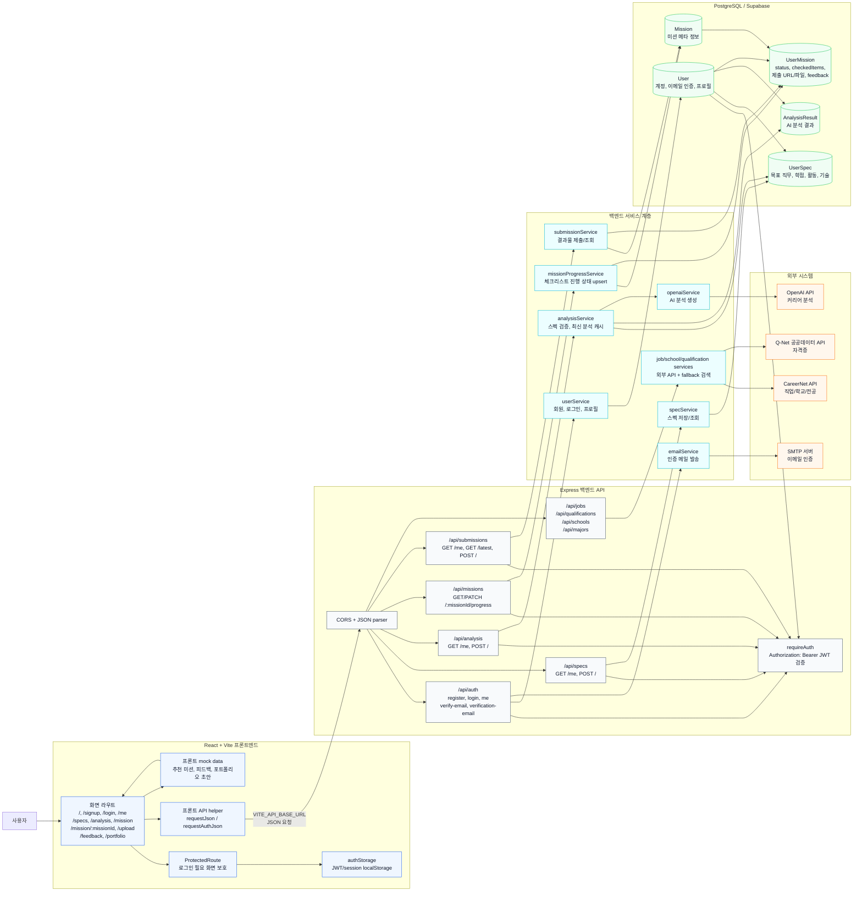

# Career Mission AI 데이터 흐름 아키텍처

시각화 도구는 Mermaid flowchart를 선택했다. Mermaid는 Markdown 안에 텍스트로 다이어그램을 유지할 수 있어, 화면/라우트/API가 바뀔 때 문서도 코드처럼 수정하기 쉽다.

바로 열어볼 수 있는 이미지 파일: [architecture-data-flow.svg](images/architecture-data-flow.svg)

## 핵심 데이터 흐름

- 인증: `Signup/Login/VerifyEmail/MyPage` 화면에서 `/api/auth/*`를 호출하고, 서버는 `User`를 읽고 쓰며 JWT를 발급한다. 프론트는 JWT를 `authStorage`에 저장해 보호 API 호출에 사용한다.
- 스펙: `/specs` 화면은 `specApi`로 `/api/specs`를 호출하고, `UserSpec`에 사용자별 스펙을 저장한다.
- AI 분석: `/analysis` 화면은 `/api/analysis`를 호출한다. 서버는 `UserSpec`을 확인한 뒤 OpenAI API를 호출하고 결과를 `AnalysisResult`에 저장한다. 스펙 변경 이후 새 분석이 없으면 기존 최신 분석을 재사용한다.
- 미션 진행: `/mission/:missionId` 화면은 `/api/missions/:missionId/progress`를 호출한다. 체크리스트 진행 상태는 `UserMission.checkedItems`에 저장된다.
- 결과물 제출: `/upload` 화면은 `/api/submissions`를 호출한다. 제출 URL/파일 정보와 제출 상태는 `UserMission`에 저장되고, `/feedback`, `/portfolio`는 최신 제출 정보를 조회해 화면을 구성한다.
- 검색: 회원가입/스펙 입력 화면의 학교, 전공, 직업, 자격증 검색은 백엔드 `/api/jobs`, `/api/qualifications`, `/api/schools`, `/api/majors`를 거쳐 CareerNet/Q-Net 또는 fallback 데이터로 응답한다.

## 코드 기준

- 프론트 라우팅: `frontend/src/App.jsx`, `frontend/src/router.js`
- 프론트 API helper: `frontend/src/features/auth/authService.js`, `frontend/src/features/career/*Api.js`
- 백엔드 라우팅: `backend/src/app.js`, `backend/src/routes`
- 백엔드 서비스: `backend/src/services`
- DB 모델: `backend/prisma/schema.prisma`
