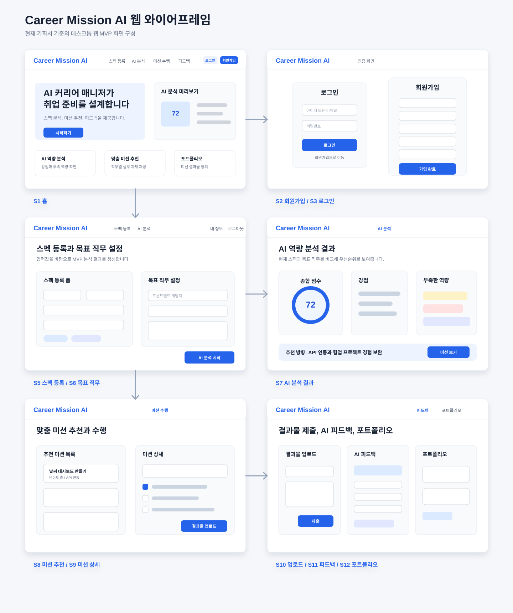

# Career Mission AI 기획서


## 1. 서비스 소개

### Career Mission AI

AI가 사용자의 커리어 미션을 설계하고, 성장과 취업까지 함께하는 AI 커리어 매니저 서비스입니다.

현재 나의 역량을 분석하고, 실무 경험으로 연결되는 미션을 수행하며, 나만의 포트폴리오를 완성해 나가는 것을 목표로 합니다.

### 핵심 제공 가치

- AI 역량 분석
- 맞춤 미션 추천
- AI 피드백 제공
- 포트폴리오 생성

## 2. 문제 정의

### 대학생 취업 준비, 이런 고민이 있나요?

- 목표 직무에 필요한 역량을 명확히 알기 어렵다.
- 스펙은 쌓고 있지만 실무 경험으로 연결되지 않는다.
- 포트폴리오에 넣을 만한 결과물을 만들기 어렵다.
- 혼자 준비하다 보니 피드백을 받기 어렵다.
- 장기간 취업 준비로 인해 번아웃이 발생할 수 있다.

## 3. 서비스 목표

AI 커리어 매니저가 체계적인 취업 준비를 도와드립니다.

### 주요 목표

1. 사용자 분석
   - 현재 스펙과 목표 직무를 분석합니다.

2. 역량 진단
   - 부족한 역량을 확인하고 우선순위를 제시합니다.

3. 맞춤 미션 제공
   - 실무 경험으로 연결되는 미션을 추천합니다.

4. AI 피드백
   - 결과물에 대한 상세 피드백을 제공합니다.

5. 포트폴리오 생성
   - 미션 결과물을 포트폴리오로 정리합니다.

6. 지속 가능한 성장
   - 컨디션 관리와 지속적인 성장 지원을 제공합니다.

## 4. 핵심 사용자

### 주 사용자

- 취업 준비를 시작한 대학생
- 목표 직무는 있지만 무엇을 준비해야 할지 모르는 학생
- 포트폴리오에 넣을 프로젝트 경험이 부족한 학생
- 자기소개서나 면접에서 말할 실무 경험이 부족한 학생

### 보조 사용자

- 인턴 준비생
- 직무 전환을 준비하는 초기 구직자
- 부트캠프 / 교육 과정 수강생

## 5. 핵심 기능

1. 회원 관리
   - 회원가입, 로그인, 로그아웃 기능을 제공합니다.

2. 스펙 등록
   - 사용자의 전공, 학력, 자격증, 프로젝트, 대외활동, 기술 역량 등을 등록합니다.

3. 목표 직무 설정
   - 사용자가 희망하는 직무와 관심 분야를 설정합니다.

4. AI 역량 분석
   - 목표 직무와 현재 스펙을 비교하여 강점과 부족한 역량을 분석합니다.

5. AI 맞춤 미션 생성
   - 부족한 역량을 보완할 수 있는 실무형 미션을 추천합니다.

6. 미션 수행
   - 사용자가 추천받은 미션을 수행하고 진행 상태를 관리합니다.

7. 결과물 업로드
   - 문서, 이미지, 링크, PDF, GitHub, Notion 링크 등 결과물을 업로드합니다.

8. AI 피드백
   - 제출 결과물에 대해 잘한 점, 개선할 점, 수정 방향을 제공합니다.

9. 포트폴리오 생성
   - 미션 결과물을 프로젝트 경험 형태로 정리합니다.

10. AI 성장 분석
    - 미션 수행 기록과 피드백을 바탕으로 성장한 역량을 분석합니다.

11. AI 다음 미션 추천
    - 성장 분석 결과를 바탕으로 다음 미션을 추천합니다.

12. AI 컨디션 체크
    - 피로도, 스트레스, 집중도, 의욕, 수면 상태 등을 체크합니다.

13. AI 휴식 추천
    - 컨디션 체크 결과를 바탕으로 적절한 휴식 방법을 추천합니다.

14. 내 정보 확인
    - 회원가입 당시 입력한 기본 정보와 사용자가 등록한 스펙, 목표 직무, 미션 수행 이력을 확인합니다.

## 6. 서비스 흐름

### 기본 이용 흐름

1. 사용자가 웹서비스에 접속하면 홈 화면이 먼저 표시됩니다.
2. 홈 화면 상단에는 핵심 기능 메뉴와 회원가입 / 로그인 버튼이 표시됩니다.
3. 사용자가 회원가입 버튼을 누르면 회원가입 화면으로 이동합니다.
4. 회원가입을 완료하면 로그인 화면으로 이동합니다.
5. 사용자가 로그인을 완료하면 다시 홈 화면으로 이동합니다.
6. 로그인 후 홈 화면 상단에는 회원가입 / 로그인 버튼 대신 로그아웃 버튼과 내 정보 버튼이 표시됩니다.
7. 로그아웃 버튼을 누르면 로그인 상태가 해제되고, 다시 회원가입 / 로그인 버튼이 표시됩니다.
8. 내 정보 버튼을 누르면 회원 정보와 등록한 스펙 정보를 확인할 수 있는 내 정보 화면으로 이동합니다.

### 핵심 기능 이용 흐름

1. 홈 화면
2. 회원가입
3. 로그인
4. 스펙 등록
5. 목표 직무 설정
6. AI 역량 분석
7. AI 맞춤 미션 생성
8. 미션 수행
9. 결과물 업로드
10. AI 피드백
11. 포트폴리오 생성
12. AI 성장 분석
13. AI 다음 미션 추천
14. AI 컨디션 체크
15. AI 휴식 추천
16. 로그아웃

## 7. 인증 및 사용자 상태 흐름

### 로그인 전 상태

홈 화면 상단 메뉴에는 핵심 기능 메뉴와 함께 회원가입 / 로그인 버튼이 표시됩니다.

표시 요소:

- 스펙 등록
- AI 분석
- 미션 수행
- 피드백
- 포트폴리오
- 회원가입
- 로그인

로그인 전 사용자가 핵심 기능 메뉴를 누르면 로그인 화면으로 이동시키거나, 로그인이 필요한 기능이라는 안내를 보여줍니다.

### 회원가입 흐름

1. 사용자가 홈 화면에서 회원가입 버튼을 클릭합니다.
2. 회원가입 화면으로 이동합니다.
3. 이름, 아이디, 이메일, 비밀번호, 학교, 전공 등 기본 정보를 입력합니다.
4. 회원가입을 완료합니다.
5. 회원가입 완료 후 로그인 화면으로 이동합니다.

### 로그인 흐름

1. 사용자가 홈 화면에서 로그인 버튼을 클릭합니다.
2. 로그인 화면으로 이동합니다.
3. 아이디 또는 이메일과 비밀번호를 입력합니다.
4. 로그인에 성공하면 홈 화면으로 이동합니다.
5. 홈 화면 상단 메뉴가 로그인 후 상태로 변경됩니다.

### 로그인 후 상태

로그인 후에는 회원가입 / 로그인 버튼이 사라지고, 로그아웃 버튼과 내 정보 버튼이 표시됩니다.

표시 요소:

- 스펙 등록
- AI 분석
- 미션 수행
- 피드백
- 포트폴리오
- 내 정보
- 로그아웃

### 로그아웃 흐름

1. 사용자가 로그아웃 버튼을 클릭합니다.
2. 로그인 상태가 해제됩니다.
3. 홈 화면으로 유지되거나 홈 화면으로 이동합니다.
4. 상단 메뉴는 다시 로그인 전 상태로 변경됩니다.

### 내 정보 흐름

1. 사용자가 로그인 후 내 정보 버튼을 클릭합니다.
2. 내 정보 화면으로 이동합니다.
3. 회원가입 당시 입력한 기본 정보와 등록한 스펙 정보를 확인합니다.
4. 추후에는 목표 직무, 수행한 미션, 업로드한 결과물, AI 피드백, 포트폴리오 이력도 함께 확인할 수 있도록 확장합니다.

## 8. 주요 화면 구성 MVP

### 1차 MVP 화면

1. 홈 화면
   - 서비스 소개
   - 핵심 기능 슬라이드
   - AI 분석 패널
   - 상단 메뉴
   - 로그인 전: 회원가입 / 로그인 버튼
   - 로그인 후: 내 정보 / 로그아웃 버튼

2. 회원가입 화면
   - 이름
   - 아이디
   - 이메일
   - 비밀번호
   - 비밀번호 확인
   - 학교
   - 전공
   - 회원가입 버튼
   - 회원가입 완료 후 로그인 화면으로 이동

3. 로그인 화면
   - 아이디 또는 이메일
   - 비밀번호
   - 로그인 버튼
   - 회원가입 이동 버튼
   - 로그인 완료 후 홈 화면으로 이동

4. 스펙 등록 화면
   - 전공
   - 학년
   - 학점
   - 자격증
   - 어학 점수
   - 프로젝트 경험
   - 대외활동
   - 인턴 경험
   - 보유 기술

5. 목표 직무 설정 화면
   - 목표 직무 선택
   - 관심 산업 선택
   - 희망 기업 유형
   - 목표 이유 입력

6. AI 분석 결과 화면
   - 종합 점수
   - 강점
   - 부족한 역량
   - 보완 우선순위
   - 추천 준비 방향

7. 미션 추천 화면
   - 추천 미션 카드
   - 미션 난이도
   - 예상 소요 시간
   - 필요한 역량
   - 제출 결과물 안내

8. 미션 수행 화면
   - 선택한 미션 상세 설명
   - 수행 가이드
   - 단계별 체크리스트
   - 참고 자료
   - 진행 상태
   - 결과물 업로드 버튼

9. 결과물 업로드 화면
   - 파일 업로드
   - 링크 입력
   - 설명 입력
   - 제출 버튼

10. AI 피드백 화면
   - 전체 평가
   - 잘한 점
   - 개선할 점
   - 수정 제안
   - 포트폴리오 반영 포인트

11. 내 정보 화면
    - 회원 기본 정보
    - 아이디
    - 이메일
    - 학교
    - 전공
    - 등록한 스펙
    - 목표 직무
    - 수행한 미션 이력
    - AI 피드백 이력

## 9. 상단 메뉴 및 페이지 이동 계획

### 상단 메뉴 구성

홈 화면 상단에는 핵심 기능으로 이동할 수 있는 메뉴 버튼을 배치합니다.

메뉴 항목:

- 스펙 등록
- AI 분석
- 미션 수행
- 피드백
- 포트폴리오

### 로그인 전 메뉴 동작

로그인하지 않은 사용자가 핵심 기능 메뉴를 클릭하면 로그인 화면으로 이동합니다.

예시:

- 스펙 등록 클릭 → 로그인 화면으로 이동
- AI 분석 클릭 → 로그인 화면으로 이동
- 미션 수행 클릭 → 로그인 화면으로 이동
- 피드백 클릭 → 로그인 화면으로 이동
- 포트폴리오 클릭 → 로그인 화면으로 이동

### 로그인 후 메뉴 동작

로그인한 사용자는 상단 메뉴를 통해 각 기능 페이지로 이동할 수 있습니다.

예상 라우팅:

```txt
/              홈
/signup        회원가입
/login         로그인
/me            내 정보
/specs         스펙 등록
/analysis      AI 분석
/mission       미션 추천
/mission/:id   미션 상세 / 수행
/upload        결과물 업로드
/feedback      피드백
/portfolio     포트폴리오
```


### 미션 관련 페이지 구분

미션 기능은 추천 목록, 상세 수행, 결과물 업로드를 분리해서 구성합니다.

```txt
/mission          미션 추천
/mission/:id      미션 상세 / 수행
/upload           결과물 업로드
```

각 페이지 역할:

1. `Mission.jsx`
   - 추천 미션 목록을 보여줍니다.
   - 미션 제목, 난이도, 예상 소요 시간, 필요한 역량, 제출 결과물 안내를 표시합니다.
   - 사용자가 특정 미션을 선택하면 `/mission/:id`로 이동합니다.

2. `MissionDetail.jsx`
   - 선택한 미션의 상세 설명과 수행 가이드를 보여줍니다.
   - 단계별 체크리스트, 참고 자료, 진행 상태를 제공합니다.
   - 미션 수행 후 결과물 업로드 버튼을 통해 `/upload`로 이동합니다.

3. `UploadResult.jsx`
   - 사용자가 미션 결과물을 제출하는 화면입니다.
   - 파일 업로드, 링크 입력, 설명 입력을 제공합니다.
   - 제출 후 AI 피드백 화면으로 이동합니다.

### 보호 페이지 정책

로그인이 필요한 페이지:

- 내 정보
- 스펙 등록
- AI 분석
- 미션 추천
- 미션 상세 / 수행
- 결과물 업로드
- 피드백
- 포트폴리오

로그인하지 않은 상태에서 보호 페이지에 접근하면 로그인 화면으로 이동합니다.

## 10. 데이터 구조 초안

### 사용자 정보

```js
user = {
  id: "user01",
  name: "홍길동",
  email: "user@example.com",
  school: "OO대학교",
  major: "컴퓨터공학과"
}
```

### 스펙 정보

```js
profile = {
  grade: "3학년",
  gpa: "3.8",
  certificates: ["SQLD"],
  languageScores: ["TOEIC 850"],
  projects: ["웹 서비스 기획 프로젝트"],
  activities: ["IT 동아리"],
  skills: ["React", "JavaScript"]
}
```

### 인증 상태

```js
authState = {
  isLoggedIn: true,
  userId: "user01"
}
```

초기 프론트엔드 구현에서는 `localStorage`를 사용해 임시로 회원 정보와 로그인 상태를 저장합니다. 실제 서비스 단계에서는 백엔드 서버와 데이터베이스, JWT 인증 방식으로 전환합니다.


## 11. 구현 가능 범위 및 단계별 개발 전략

기획서에 포함된 모든 기능을 처음부터 완성형으로 구현하기는 어렵기 때문에, 실제 개발은 단계별로 나누어 진행합니다.

### 1차 MVP 구현 범위

1차 MVP는 백엔드와 실제 AI API 없이 React 프론트엔드만으로 구현합니다. 이 단계에서는 `localStorage`와 미리 정의한 mock 데이터를 사용해 서비스 흐름을 검증합니다.

1차 MVP에서 구현할 기능:

- 홈 화면
- 회원가입
- 로그인
- 로그아웃
- 내 정보
- 스펙 등록
- 목표 직무 설정
- 규칙 기반 AI 역량 분석
- 목표 직무별 미션 추천
- 미션 수행 화면
- 결과물 링크 제출
- mock AI 피드백

### 1차 MVP에서 제외할 기능

아래 기능은 초기 구현 범위에서는 제외하고, 2차 이후 확장 기능으로 분리합니다.

- 실제 AI API 연동
- 실제 파일 업로드
- 백엔드 서버
- 데이터베이스 저장
- JWT 인증
- 성장 그래프
- 컨디션 체크
- 휴식 추천
- 포트폴리오 PDF 다운로드

### 1차 MVP의 AI 처리 방식

1차 MVP에서는 실제 AI API를 사용하지 않고, 사용자가 입력한 목표 직무와 스펙에 따라 미리 준비한 결과를 보여주는 방식으로 구현합니다.

예시:

```txt
목표 직무: 프론트엔드 개발자
보유 기술: HTML, CSS, JavaScript, React
프로젝트 경험: 개인 포트폴리오 페이지 제작
```

분석 결과 예시:

```txt
강점:
React 기반 프로젝트 경험이 있어 프론트엔드 직무와 관련성이 있습니다.

보완할 점:
API 연동 경험, 협업 경험, 테스트 경험이 부족합니다.

추천 미션:
공공 API를 활용한 날씨 대시보드 만들기
```

### 미션 예시

미션은 사용자가 목표 직무에 가까워지기 위해 수행하는 작은 실무형 과제입니다. 단순한 공부가 아니라 결과물이 남고, 포트폴리오로 연결될 수 있어야 합니다.

프론트엔드 개발자 목표 예시:

- React로 회원가입 / 로그인 화면 구현하기
- 공공 API를 활용한 날씨 대시보드 만들기
- 개인 포트폴리오 웹 페이지 만들기

서비스 기획자 목표 예시:

- 경쟁 서비스 3개 분석 리포트 작성하기
- 신규 기능 기획서 작성하기
- 사용자 흐름도와 와이어프레임 작성하기

데이터 분석가 목표 예시:

- 채용 공고 데이터 분석하기
- 공개 데이터를 활용한 시각화 리포트 작성하기

### 2차 확장 기능

2차에서는 실제 AI API 연동과 백엔드 도입을 검토합니다.

- OpenAI API 또는 다른 AI API 연동
- Node.js / Express 또는 Spring Boot 백엔드 구축
- 데이터베이스 저장
- JWT 기반 로그인 인증
- 실제 파일 업로드
- 포트폴리오 자동 생성
- 성장 분석
- 컨디션 체크
- 휴식 추천

## 12. AI API 연동 계획

이 서비스에서 실제 AI API를 연동할 수 있는 핵심 기능은 다음과 같습니다.

### AI API 적용 가능 기능

1. AI 역량 분석
   - 사용자의 스펙과 목표 직무를 AI에게 전달해 강점, 부족한 역량, 보완 우선순위를 생성합니다.

2. AI 맞춤 미션 생성
   - 사용자의 현재 역량과 목표 직무에 맞는 실무형 미션을 생성합니다.

3. AI 피드백
   - 사용자가 제출한 결과물 설명, GitHub 링크, Notion 링크 등을 바탕으로 피드백을 생성합니다.

4. 포트폴리오 문장 생성
   - 미션 결과물을 포트폴리오에 넣기 좋은 문장과 구조로 정리합니다.

5. 컨디션 기반 휴식 추천
   - 피로도, 스트레스, 집중도, 수면 상태 등을 바탕으로 휴식 방법을 추천합니다.

### AI API 연동 방식

프론트엔드에 API 키를 직접 넣으면 보안상 위험합니다. 따라서 실제 AI API는 백엔드를 통해 호출합니다.

```txt
React 프론트엔드
↓
백엔드 서버
↓
AI API
```

초기 개발 단계에서는 프론트엔드 mock 데이터로 흐름을 먼저 구현하고, 이후 백엔드가 준비되면 AI API 호출로 대체합니다.

### 사용 가능한 AI API 후보

- OpenAI API
- Google Gemini API
- Anthropic Claude API
- Naver HyperCLOVA X API
- Upstage API

초기 연동 후보로는 접근성이 좋은 OpenAI API를 우선 검토합니다.

## 12-1. 수익화 및 결제 확장 계획

실제 배포 단계에서 AI API를 연동하면 사용량에 따라 운영 비용이 발생합니다. 따라서 AI 기능은 무제한 무료 제공이 아니라, 무료 체험과 유료 플랜을 함께 운영하는 방식으로 설계합니다.

### 수익화 방향

이 서비스의 유료 가치는 단순히 AI가 스펙을 분석해주는 기능만으로는 약할 수 있습니다. 사용자는 ChatGPT 같은 범용 AI 도구로도 비슷한 질문을 할 수 있기 때문입니다.

따라서 유료 기능은 AI 답변 자체가 아니라 취업 준비 결과물과 연결되는 기능 중심으로 구성합니다.

- 목표 직무 기준 상세 역량 분석
- 부족한 역량에 대한 구체적인 보완 미션 추천
- 이력서와 포트폴리오에 넣을 문장 개선
- 자기소개서 문항별 초안 생성과 개선
- 면접 예상 질문 생성
- 기업 / 직무별 맞춤 준비 리포트
- 이전 분석 결과와 비교한 성장 추적

### 무료 플랜

무료 플랜은 사용자가 서비스 가치를 체험할 수 있는 수준으로 제공합니다.

- 스펙 등록
- 목표 직무 설정
- 기본 분석 제공
- 월 5 크레딧 제공
- 간단 분석 중심 제공
- 상세 결과 일부 제한

무료 플랜의 목적은 사용자가 현재 상태를 빠르게 확인하고, 더 구체적인 분석과 취업 준비 결과물이 필요하다고 느끼게 만드는 것입니다.

### Pro 플랜

초기 유료 플랜은 복잡하게 나누지 않고 단일 Pro 플랜으로 시작합니다.

```txt
Pro 플랜
- 월 9,900원
- 월 100 크레딧 제공
- 상세 스펙 분석
- 직무별 부족 역량 분석
- 이력서 문장 개선
- 자기소개서 초안 / 개선
- 면접 질문 생성
- 포트폴리오 문장 개선
- 분석 기록 저장
```

취업 준비생 대상 서비스이므로 초기 가격은 5천원에서 1만원 사이의 심리적 부담이 낮은 가격대로 설정합니다. 브랜드 신뢰가 충분히 쌓이기 전에는 19,900원 이상의 고가 구독은 진입 장벽이 될 수 있습니다.

### 크레딧 정책

AI 기능은 단순 횟수제가 아니라 크레딧 차감 방식으로 관리합니다. 기능마다 AI API 사용량과 가치가 다르기 때문에, 고비용 기능은 더 많은 크레딧을 차감합니다.

예시:

```txt
간단 분석: 1 크레딧
상세 스펙 분석: 2 크레딧
이력서 문장 개선: 2 크레딧
자기소개서 초안 생성: 3 크레딧
기업 / 직무 맞춤 리포트: 5 크레딧
```

화면에서는 `월 100회`보다 `월 100 크레딧`으로 표현합니다. 모든 기능을 100번 사용할 수 있다는 오해를 줄이고, 기능별 차감 구조를 명확히 보여주기 위함입니다.

### 추가 크레딧 판매

Pro 플랜의 월 제공량을 모두 사용한 사용자를 위해 추가 크레딧 구매 옵션을 둡니다.

```txt
30 크레딧: 2,900원
100 크레딧: 7,900원
```

추가 크레딧은 과도한 API 사용을 통제하면서도, 집중적으로 취업 준비를 하는 사용자가 필요한 만큼 더 사용할 수 있게 하는 보완 수단입니다.

### 결제 UI 계획

초기 MVP에서는 실제 결제 연동보다 결제 흐름과 플랜 UX를 먼저 설계합니다.

필요한 UI:

- 현재 플랜 표시
- 이번 달 남은 크레딧 표시
- AI 기능별 차감 크레딧 표시
- Pro 업그레이드 버튼
- 요금제 비교 화면
- 크레딧 부족 시 업그레이드 모달
- 결제 완료 후 Pro 상태 반영

크레딧 부족 안내 예시:

```txt
이번 달 무료 크레딧을 모두 사용했어요.
Pro로 업그레이드하면 월 100 크레딧을 사용할 수 있어요.
```

### 결제 연동 단계

1차 MVP에서는 mock 결제 상태만 구현하고, 실제 결제 연동은 배포 준비 단계에서 진행합니다.

개발 순서:

1. mock 결제 UI 구현
2. 사용자 플랜과 남은 크레딧 상태 표시
3. AI 기능 실행 시 크레딧 차감 로직 적용
4. 크레딧 부족 시 업그레이드 모달 표시
5. 백엔드와 DB에 사용자 플랜 / 크레딧 저장
6. 실제 결제 PG 연동

국내 사용자를 우선 대상으로 한다면 실제 결제 연동 후보는 다음과 같습니다.

- 토스페이먼츠
- 포트원
- Stripe

한국 대상 서비스에서는 토스페이먼츠 또는 포트원을 우선 검토합니다.

### 운영 비용 통제 정책

AI API 비용이 운영비로 누적되지 않도록 다음 제한을 둡니다.

- 프론트엔드에서 AI API 키 직접 사용 금지
- AI API 호출은 백엔드 서버에서만 처리
- 비로그인 사용자는 AI 분석 제한
- 무료 사용자는 월 5 크레딧 제공
- Pro 사용자는 월 100 크레딧 제공
- 요청당 입력 글자 수 제한
- 응답 길이 제한
- 동일한 입력에 대한 분석 결과 캐싱
- 관리자 기준 월 API 예산 한도 설정

이 정책을 통해 무료 사용자의 체험은 허용하되, 무제한 사용으로 인한 운영비 폭주를 방지합니다.

## 13. 기술 스택

### 프론트엔드

- React
- Vite
- React Router
- CSS Modules / CSS
- localStorage 임시 데이터 저장

### 추후 백엔드 예정

- Node.js / Express 또는 Spring Boot
- MySQL 또는 MongoDB
- AI API 연동
- JWT 인증
- AWS / Firebase 예정

## 14. 디자인 톤 & 키워드

### 디자인 톤

모던하고 혁신적인 AI 서비스 느낌을 지향합니다.

### 키워드

- 모던
- 혁신적인
- 신뢰감
- AI 기술
- 미래지향적

### 컬러 팔레트

- 네이비
- 보라색
- 블루
- 연한 블루 그레이
- 라이트 퍼플

### 주요 가치

- 데이터 기반
- 개인 맞춤형
- 명확한 가이드
- 성장과 성취
- AI 기반

## 15. 프론트엔드 개발 방향

### 우선 구현 범위

1. 홈 화면 구조 정리
2. 회원가입 화면 구현
3. 로그인 화면 구현
4. 로그인 / 로그아웃 상태 처리
5. 내 정보 화면 구현
6. 스펙 등록 화면 구현
7. 목표 직무 설정 화면 구현
8. AI 분석 결과 화면 구현
9. 미션 추천 화면 구현
10. 미션 상세 / 수행 화면 구현
11. 결과물 업로드 화면 구현
12. AI 피드백 화면 구현

### 추천 디렉토리 구조

```txt
src/
  App.jsx
  main.jsx

  pages/
    Home.jsx
    Login.jsx
    Signup.jsx
    MyPage.jsx
    SpecRegister.jsx
    JobGoal.jsx
    Analysis.jsx
    Mission.jsx          # /mission, 미션 추천 목록
    MissionDetail.jsx    # /mission/:id, 미션 상세 / 수행
    UploadResult.jsx     # /upload, 결과물 업로드
    Feedback.jsx
    Portfolio.jsx

  components/
    layout/
      Header.jsx

    auth/
      LoginForm.jsx
      SignupForm.jsx

    home/
      HeroSection.jsx
      AiStatusPanel.jsx
      FeatureSlider.jsx
      GoalSection.jsx

  features/
    auth/
      authService.js
      authStorage.js

  data/
    menuItems.js
    homeFeatures.js
```

## 16. 서비스 한눈에 보기

기존 기획서가 기능을 자세히 설명하는 문서라면, 이 섹션은 발표나 평가에서 서비스를 빠르게 이해시키기 위한 요약 화면입니다.

### 무엇을 해결하나

- 목표 직무에 필요한 역량을 명확히 알기 어렵다.
- 스펙은 쌓고 있지만 실무 경험과 연결하기 어렵다.
- 포트폴리오에 넣을 만한 결과물을 만들기 어렵다.
- 혼자 준비하다 보니 피드백을 받기 어렵다.

### Career Mission AI의 답

1. 스펙 등록
   - 전공, 학년, 프로젝트, 자격증, 기술 역량 등을 입력합니다.

2. 목표 직무 설정
   - 희망 직무와 관심 산업을 선택합니다.

3. AI 역량 분석
   - 현재 스펙과 목표 직무를 비교해 강점과 부족한 역량을 보여줍니다.

4. 맞춤 미션 추천
   - 부족한 역량을 보완할 수 있는 실무형 미션을 제안합니다.

5. 결과물 제출과 AI 피드백
   - 미션 결과물을 제출하면 잘한 점, 개선할 점, 포트폴리오 반영 포인트를 제공합니다.

6. 포트폴리오 정리
   - 수행한 미션과 피드백을 바탕으로 프로젝트 경험을 정리합니다.

## 17. 화면 흐름 User Flow

사용자는 처음에는 홈 화면에서 서비스를 이해하고, 회원가입과 로그인 후 핵심 기능을 순서대로 이용합니다. 1차 MVP의 핵심 반복 흐름은 `스펙 등록 → 목표 직무 설정 → AI 분석 → 미션 추천 → 수행 → 피드백 → 포트폴리오`입니다.

```txt
홈
 ├─ 회원가입
 │   └─ 로그인
 │       └─ 홈
 └─ 로그인
     └─ 홈
         ├─ 내 정보
         ├─ 스펙 등록
         │   └─ 목표 직무 설정
         │       └─ AI 분석 결과
         │           └─ 미션 추천
         │               └─ 미션 상세 / 수행
         │                   └─ 결과물 업로드
         │                       └─ AI 피드백
         │                           └─ 포트폴리오
         └─ 로그아웃
```

### 로그인 전 흐름

```txt
홈 → 회원가입 → 로그인 → 홈
홈 → 로그인 → 홈
홈 → 보호 페이지 클릭 → 로그인 안내 또는 로그인 화면 이동
```

### 로그인 후 핵심 흐름

```txt
홈 → 스펙 등록 → 목표 직무 설정 → AI 분석 결과 → 미션 추천
미션 추천 → 미션 상세 / 수행 → 결과물 업로드 → AI 피드백 → 포트폴리오
```

### 반복 사용 흐름

```txt
AI 피드백 → 개선 방향 확인 → 다음 미션 추천 → 미션 수행 → 결과물 업로드
```

## 18. 화면 목록 Information Architecture

서비스 화면을 인증 영역, 핵심 기능 영역, 확장 기능 영역으로 나누어 관리합니다. 1차 MVP에서는 인증 영역과 핵심 기능 영역을 우선 구현하고, 확장 기능은 2차 개발 범위로 둡니다.

```txt
Career Mission AI
 ├─ 인증 영역
 │   ├─ 홈
 │   ├─ 회원가입
 │   ├─ 로그인
 │   └─ 내 정보
 ├─ 핵심 기능 영역
 │   ├─ 스펙 등록
 │   ├─ 목표 직무 설정
 │   ├─ AI 분석 결과
 │   ├─ 미션 추천
 │   ├─ 미션 상세 / 수행
 │   ├─ 결과물 업로드
 │   ├─ AI 피드백
 │   └─ 포트폴리오
 └─ 확장 기능 영역
     ├─ AI 성장 분석
     ├─ AI 다음 미션 추천
     ├─ AI 컨디션 체크
     └─ AI 휴식 추천
```

### MVP 화면 코드 기준

```txt
S1  홈
S2  회원가입
S3  로그인
S4  내 정보
S5  스펙 등록
S6  목표 직무 설정
S7  AI 분석 결과
S8  미션 추천
S9  미션 상세 / 수행
S10 결과물 업로드
S11 AI 피드백
S12 포트폴리오
```

## 19. 와이어프레임 예시

아래 이미지는 1차 MVP의 핵심 화면을 데스크톱 웹서비스 기준으로 구성한 와이어프레임 예시입니다. 상단 내비게이션, 인증 상태별 버튼, 입력 폼, 분석 결과 카드, 미션 카드, 피드백과 포트폴리오 영역이 실제 구현 흐름에 맞게 연결됩니다.



### S1 홈 화면

- 웹 상단 내비게이션에 서비스명, 핵심 메뉴, 인증 버튼을 배치합니다.
- 로그인 전에는 회원가입 / 로그인 버튼을 표시하고, 로그인 후에는 내 정보 / 로그아웃 버튼으로 변경합니다.
- 메인 영역에는 서비스 소개 문구와 시작하기 버튼을 배치합니다.
- 오른쪽 또는 보조 영역에는 AI 분석 미리보기와 추천 미션 예시를 보여줍니다.
- 하단에는 AI 역량 분석, 맞춤 미션 추천, 포트폴리오 생성 같은 핵심 가치 카드를 배치합니다.

### S2 회원가입 화면

- 입력 항목: 이름, 아이디, 이메일, 비밀번호, 비밀번호 확인, 학교, 전공
- 주요 버튼: 회원가입 완료
- 완료 후 이동: 로그인 화면

### S3 로그인 화면

- 입력 항목: 아이디 또는 이메일, 비밀번호
- 주요 버튼: 로그인
- 보조 버튼: 회원가입 이동
- 완료 후 이동: 홈 화면

### S5 스펙 등록 화면

- 웹 폼을 2열 또는 카드형 섹션으로 구성합니다.
- 기본 정보: 전공, 학년, 학점
- 경험 정보: 프로젝트, 대외활동, 인턴 경험
- 역량 정보: 자격증, 어학 점수, 보유 기술
- 저장 후 이동: 목표 직무 설정 화면

### S6 목표 직무 설정 화면

- 스펙 등록 화면과 같은 페이지 안에서 이어서 작성하거나, 다음 단계 화면으로 분리할 수 있습니다.
- 선택 항목: 목표 직무, 관심 산업, 희망 기업 유형
- 입력 항목: 목표 이유
- 저장 후 이동: AI 분석 결과 화면

### S7 AI 분석 결과 화면

- 상단에는 종합 점수와 한 줄 평가를 크게 보여줍니다.
- 본문에는 강점, 부족한 역량, 보완 우선순위를 카드 형태로 배치합니다.
- 하단에는 추천 준비 방향을 요약합니다.
- 다음 행동: 추천 미션 보기 버튼

### S8 미션 추천 화면

- 추천 미션을 카드 목록 형태로 보여줍니다.
- 카드 정보: 미션 제목, 난이도, 예상 소요 시간, 필요한 역량, 제출 결과물
- 선택 후 이동: 미션 상세 / 수행 화면

### S9 미션 상세 / 수행 화면

- 미션 설명
- 수행 가이드
- 단계별 체크리스트
- 참고 자료
- 진행 상태
- 결과물 업로드 버튼

### S10 결과물 업로드 화면

- 1차 MVP에서는 파일 업로드 대신 링크 제출 중심으로 구성합니다.
- 링크 입력: GitHub, Notion, 블로그, 배포 URL
- 설명 입력: 수행 과정, 맡은 역할, 어려웠던 점
- 제출 후 이동: AI 피드백 화면

### S11 AI 피드백 화면

- 전체 평가
- 잘한 점
- 개선할 점
- 수정 제안
- 포트폴리오 반영 포인트

### S12 포트폴리오 화면

- 미션 결과물을 프로젝트 경험 형태로 정리
- 프로젝트 제목, 문제 정의, 해결 과정, 사용 기술, 결과물 링크 표시
- 2차 확장 시 PDF 다운로드 또는 공유 링크 기능 추가

## 20. MVP 구현 우선순위 요약

1차 MVP는 사용자가 서비스를 처음 접한 뒤 미션 결과물과 피드백까지 경험하는 흐름을 완성하는 데 집중합니다.

### 1순위 핵심 흐름

```txt
회원가입 / 로그인
→ 스펙 등록
→ 목표 직무 설정
→ AI 분석 결과
→ 미션 추천
→ 미션 상세 / 수행
→ 결과물 업로드
→ mock AI 피드백
```

### 2순위 보조 흐름

```txt
내 정보 확인
→ 등록한 스펙 확인
→ 목표 직무 확인
→ 수행한 미션과 피드백 이력 확인
```

### 3순위 확장 흐름

```txt
포트폴리오 자동 정리
→ 성장 분석
→ 다음 미션 추천
→ 컨디션 체크
→ 휴식 추천
```

### 구현 기준

- 1차 MVP에서는 실제 AI API 없이 mock 데이터와 규칙 기반 결과를 사용합니다.
- 파일 업로드는 실제 파일 저장 대신 링크 제출 방식으로 단순화합니다.
- 로그인 상태와 사용자 정보는 `localStorage`에 저장합니다.
- 전체 개발은 라우팅과 화면 이동이 먼저 동작한 뒤, 각 화면의 상세 UI와 mock 분석 결과를 채우는 순서로 진행합니다.


