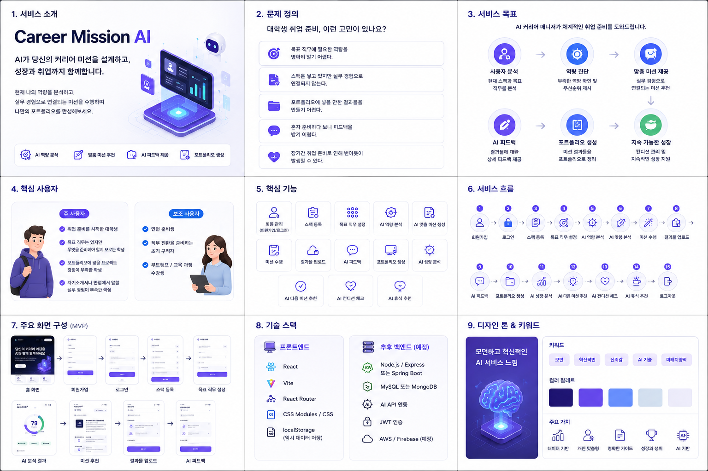

# Career Mission AI 기획서



## 1. 서비스 소개

### Career Mission AI

AI가 사용자의 커리어 미션을 설계하고, 성장과 취업까지 함께하는 AI 커리어 매니저 서비스입니다.

현재 나의 역량을 분석하고, 실무 경험으로 연결되는 미션을 수행하며, 나만의 포트폴리오를 완성해 나가는 것을 목표로 합니다.

### 핵심 제공 가치

- AI 역량 분석
- 맞춤 미션 추천
- AI 피드백 제공
- 포트폴리오 생성

## 2. 문제 정의

### 대학생 취업 준비, 이런 고민이 있나요?

- 목표 직무에 필요한 역량을 명확히 알기 어렵다.
- 스펙은 쌓고 있지만 실무 경험으로 연결되지 않는다.
- 포트폴리오에 넣을 만한 결과물을 만들기 어렵다.
- 혼자 준비하다 보니 피드백을 받기 어렵다.
- 장기간 취업 준비로 인해 번아웃이 발생할 수 있다.

## 3. 서비스 목표

AI 커리어 매니저가 체계적인 취업 준비를 도와드립니다.

### 주요 목표

1. 사용자 분석
   - 현재 스펙과 목표 직무를 분석합니다.

2. 역량 진단
   - 부족한 역량을 확인하고 우선순위를 제시합니다.

3. 맞춤 미션 제공
   - 실무 경험으로 연결되는 미션을 추천합니다.

4. AI 피드백
   - 결과물에 대한 상세 피드백을 제공합니다.

5. 포트폴리오 생성
   - 미션 결과물을 포트폴리오로 정리합니다.

6. 지속 가능한 성장
   - 컨디션 관리와 지속적인 성장 지원을 제공합니다.

## 4. 핵심 사용자

### 주 사용자

- 취업 준비를 시작한 대학생
- 목표 직무는 있지만 무엇을 준비해야 할지 모르는 학생
- 포트폴리오에 넣을 프로젝트 경험이 부족한 학생
- 자기소개서나 면접에서 말할 실무 경험이 부족한 학생

### 보조 사용자

- 인턴 준비생
- 직무 전환을 준비하는 초기 구직자
- 부트캠프 / 교육 과정 수강생

## 5. 핵심 기능

1. 회원 관리
   - 회원가입, 로그인, 로그아웃 기능을 제공합니다.

2. 스펙 등록
   - 사용자의 전공, 학력, 자격증, 프로젝트, 대외활동, 기술 역량 등을 등록합니다.

3. 목표 직무 설정
   - 사용자가 희망하는 직무와 관심 분야를 설정합니다.

4. AI 역량 분석
   - 목표 직무와 현재 스펙을 비교하여 강점과 부족한 역량을 분석합니다.

5. AI 맞춤 미션 생성
   - 부족한 역량을 보완할 수 있는 실무형 미션을 추천합니다.

6. 미션 수행
   - 사용자가 추천받은 미션을 수행하고 진행 상태를 관리합니다.

7. 결과물 업로드
   - 문서, 이미지, 링크, PDF, GitHub, Notion 링크 등 결과물을 업로드합니다.

8. AI 피드백
   - 제출 결과물에 대해 잘한 점, 개선할 점, 수정 방향을 제공합니다.

9. 포트폴리오 생성
   - 미션 결과물을 프로젝트 경험 형태로 정리합니다.

10. AI 성장 분석
    - 미션 수행 기록과 피드백을 바탕으로 성장한 역량을 분석합니다.

11. AI 다음 미션 추천
    - 성장 분석 결과를 바탕으로 다음 미션을 추천합니다.

12. AI 컨디션 체크
    - 피로도, 스트레스, 집중도, 의욕, 수면 상태 등을 체크합니다.

13. AI 휴식 추천
    - 컨디션 체크 결과를 바탕으로 적절한 휴식 방법을 추천합니다.

## 6. 서비스 흐름

1. 회원가입
2. 로그인
3. 스펙 등록
4. 목표 직무 설정
5. AI 역량 분석
6. AI 맞춤 미션 생성
7. 미션 수행
8. 결과물 업로드
9. AI 피드백
10. 포트폴리오 생성
11. AI 성장 분석
12. AI 다음 미션 추천
13. AI 컨디션 체크
14. AI 휴식 추천
15. 로그아웃

## 7. 주요 화면 구성 MVP

### 1차 MVP 화면

1. 홈 화면
   - 서비스 소개
   - 핵심 기능 슬라이드
   - AI 분석 패널
   - 상단 메뉴
   - 로그인 / 회원가입 버튼

2. 회원가입 화면
   - 이름
   - 이메일
   - 비밀번호
   - 비밀번호 확인
   - 학교
   - 전공
   - 회원가입 버튼

3. 로그인 화면
   - 이메일
   - 비밀번호
   - 로그인 버튼
   - 회원가입 이동 버튼

4. 스펙 등록 화면
   - 전공
   - 학년
   - 학점
   - 자격증
   - 어학 점수
   - 프로젝트 경험
   - 대외활동
   - 인턴 경험
   - 보유 기술

5. 목표 직무 설정 화면
   - 목표 직무 선택
   - 관심 산업 선택
   - 희망 기업 유형
   - 목표 이유 입력

6. AI 분석 결과 화면
   - 종합 점수
   - 강점
   - 부족한 역량
   - 보완 우선순위
   - 추천 준비 방향

7. 미션 추천 화면
   - 추천 미션 카드
   - 미션 난이도
   - 예상 소요 시간
   - 필요한 역량
   - 제출 결과물 안내

8. 결과물 업로드 화면
   - 파일 업로드
   - 링크 입력
   - 설명 입력
   - 제출 버튼

9. AI 피드백 화면
   - 전체 평가
   - 잘한 점
   - 개선할 점
   - 수정 제안
   - 포트폴리오 반영 포인트

## 8. 기술 스택

### 프론트엔드

- React
- Vite
- React Router
- CSS Modules / CSS
- localStorage 임시 데이터 저장

### 추후 백엔드 예정

- Node.js / Express 또는 Spring Boot
- MySQL 또는 MongoDB
- AI API 연동
- JWT 인증
- AWS / Firebase 예정

## 9. 디자인 톤 & 키워드

### 디자인 톤

모던하고 혁신적인 AI 서비스 느낌을 지향합니다.

### 키워드

- 모던
- 혁신적인
- 신뢰감
- AI 기술
- 미래지향적

### 컬러 팔레트

- 네이비
- 보라색
- 블루
- 연한 블루 그레이
- 라이트 퍼플

### 주요 가치

- 데이터 기반
- 개인 맞춤형
- 명확한 가이드
- 성장과 성취
- AI 기반

## 10. 프론트엔드 개발 방향

### 우선 구현 범위

1. 홈 화면 구조 정리
2. 회원가입 화면 구현
3. 로그인 화면 구현
4. 로그아웃 상태 처리
5. 스펙 등록 화면 구현
6. 목표 직무 설정 화면 구현
7. AI 분석 결과 화면 구현
8. 미션 추천 화면 구현
9. 결과물 업로드 화면 구현
10. AI 피드백 화면 구현

### 추천 디렉토리 구조

```txt
src/
  App.jsx
  main.jsx

  pages/
    Home.jsx
    Login.jsx
    Signup.jsx
    SpecRegister.jsx
    JobGoal.jsx
    Analysis.jsx
    Mission.jsx
    Feedback.jsx
    Portfolio.jsx

  components/
    layout/
      Header.jsx

    auth/
      LoginForm.jsx
      SignupForm.jsx

    home/
      HeroSection.jsx
      AiStatusPanel.jsx
      FeatureSlider.jsx
      GoalSection.jsx

  features/
    auth/
      authService.js
      authStorage.js

  data/
    menuItems.js
    homeFeatures.js
```

