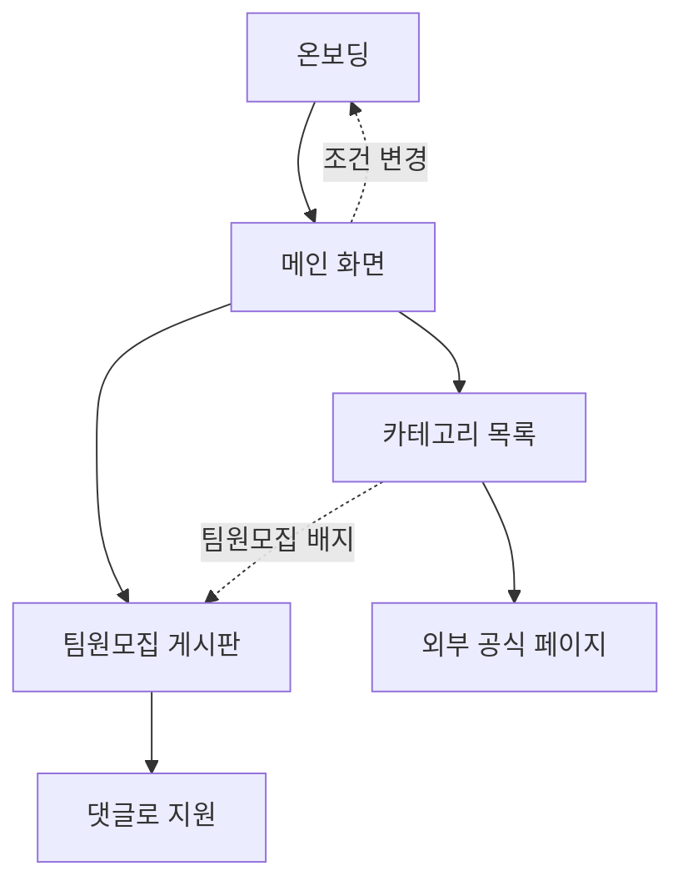

# 캠퍼스핏 — 유령 대학생을 위한 맞춤 정보 서비스

## 문제 정의
학과·선후배 네트워크가 없는 대학생이, 장학금·공모전·지자체 혜택·대외활동·인턴십 정보가 여러 사이트에 흩어져 있고 학교·지역에 따라 지원 대상이 달라지는 상황에서, 자신에게 해당되는 기회의 존재조차 모른 채 놓치는 불편을 겪는다.

> 문제의 본질: 정보가 없는 게 아니라, 흩어져 있고 "내가 대상인지"를 걸러주는 곳이 없다는 것.

### 왜 AI 챗봇으로는 안 되나
- AI에게 물어보면 잘못된 정보(환각)가 섞여 있어 신뢰하기 어렵다.
- 답을 받아도 결국 링크를 타고 들어가 다시 검색·확인해야 하는 불편이 남는다.
- 캠퍼스핏은 검증된 정보를 내 조건에 맞게 걸러서 한 화면에 보여주는 것으로 이 한계를 해결한다.

### 왜 기존 정보 사이트로도 부족한가
- 링커리어·위비티 같은 정보 사이트도 이미 있지만, 직접 써본 결과 나에게 해당되지 않는 공고까지 다 뒤져봐야 해서 오히려 정보를 찾는 데 시간이 더 걸렸다.
- 캠퍼스핏은 국립/사립·지역 조건으로 한 번 걸러주는 것에 집중해서, "대학생 정보 사이트" 하면 바로 떠오르는 곳을 목표로 한다.

## 목표 사용자
- 학과 네트워크가 약해 정보를 스스로 찾아야 하는 대학생
- 신입생, 편입생, 복학생처럼 정보 경로가 끊긴 학생

## 사용자 시나리오
1. 온보딩을 한다: 1) 국립대/사립대 → 2) 내 지역 → 3) 관심 분야(복수 선택, 건너뛰기 가능)
2. 선택이 끝나면 내 조건에서 지원 가능한 정보만 모인 메인 화면이 뜬다.
3. 메인 화면에서 5개 카테고리(장학금/공모전/지자체 혜택/대외활동/인턴십) 또는 팀원모집 탭 중 하나를 고른다.
4. 카테고리에 들어가면 상단에 '마감 임박' 코너(마감까지 7일 이내 남은 공고 전체), 아래로 전체 목록이 보이며, 관심 분야와 맞는 정보가 먼저 보인다.
5. 각 항목의 한 줄 요약과 마감일을 보고, 링크를 눌러 공식 페이지로 이동한다.
6. 팀 단위로만 지원 가능한 공고에는 '팀원모집 N건' 배지가 함께 보이고, 누르면 인앱 팀원모집 게시판에서 모집글을 보고 댓글로 지원할 수 있다.
7. 다음 접속부터는 저장된 내 조건으로 바로 메인 화면이 뜬다.

## 핵심 기능 (3개)
1. **조건 기반 정보 필터링** — 국립/사립 + 지역(재학 학교 소재지 기준) 온보딩으로, 내가 지원 자격이 되는 정보만 노출. 소득분위 같은 세부 조건은 필터링하지 않고 공고 안에 표시해 학생이 직접 확인한다. *문제 정의를 정면으로 해결하는 서비스의 심장.*
2. **카테고리별 목록 + 마감 임박** — 5개 카테고리. 마감까지 7일 이내 남은 공고는 등급 구분 없이 전부 상단 마감 임박 코너에 모은다. *정보를 종류별로 찾고 놓치지 않게 하는 기본 골격.*
3. **팀원모집 게시판** — 팀 단위로만 지원 가능한 공고에서, 학생이 직접 모집글을 올리고 다른 학생이 댓글로 지원한다. 채팅 기능은 MVP(최소 기능 제품) 범위 밖. *정보를 보여주는 데서 그치지 않고 실제 지원까지 이어지게 만드는 두 번째 핵심 가치.*

### 운영 로직
- 정보 출처: 공모전 사이트, 한국장학재단, 지자체, 대외활동 주최 기관이 직접 게시한 공고를 수집해 정리한다.
- 마감된 공고는 자동으로 목록에서 사라진다.
- 마감일이 변경되면, 주최 측이 올린 변경 공지를 기준으로 정보를 갱신한다.

## 설계 결정 사항

| 결정 | 이유 |
|---|---|
| 학과 필터는 의도적으로 넣지 않았다 | 본인 전공과 다른 분야를 체험하고 싶은 수요가 있기 때문. '관심 분야'는 필터가 아니라 우선 정렬로만 사용한다. |
| 관심 분야는 건너뛰기를 허용한다 | 지원 자격과 무관한 취향 정보이기 때문. 국립/사립·지역은 지원 자격을 가르므로 필수로 둔다. |
| 지역 기준은 재학 학교 소재지로 한다 | 거주지 기준은 자취·통학 등 변수가 많아 복잡해진다. 학교 소재지는 온보딩에서 한 번만 정하면 되는 단순한 기준이다. |
| 복수전공·부전공·편입 전 학교 이력은 고려하지 않는다 | 학과 단위의 세밀한 혜택이 아니라, 대학생 전반이 알아두면 좋은 정보를 다루는 서비스이기 때문. |
| 팀원모집은 외부 링크가 아니라 인앱 게시판으로 만든다 | 링크만으로는 팀을 못 구해 대외활동을 포기했던 문제를 풀 수 없었다. 실제 지원까지 이어지는 것이 두 번째 핵심 가치다. |
| 개인 알림(푸시·문자)은 만들지 않는다 | 흩어진 정보를 모아 필터링해 보여주는 정보 사이트이지, 알아서 챙겨주는 개인 비서형 서비스가 아니다. |

## 확장 기능 (MVP 이후)
- 카테고리 내 검색
- 스크랩·북마크 (관심 공고 저장)
- 합격 후기·커뮤니티 게시판
- 자소서·서류 템플릿

## 화면 흐름

## 화면 구성
- **온보딩**: 국립/사립 → 지역 → 관심 분야 (3단계, 3단계는 건너뛰기 가능)
- **메인 화면**: 5개 카테고리 카드 + 팀원모집 탭 + 내 조건 표시(변경 버튼)
- **카테고리 목록**: 상단 '마감 임박' 코너(7일 이내) + 전체 목록 (제목/한 줄 요약/마감일/링크/팀원모집 배지)
- **팀원모집 게시판**: 모집글 목록 (제목/연결 공고/모집 인원/마감일/상태) + 댓글로 지원

## 프로토타입
[온보딩 → 메인 → 카테고리 목록 클릭해보기](https://claude.ai/code/artifact/982fe9c5-2d68-4ac1-b0f4-62176a1517e8)
