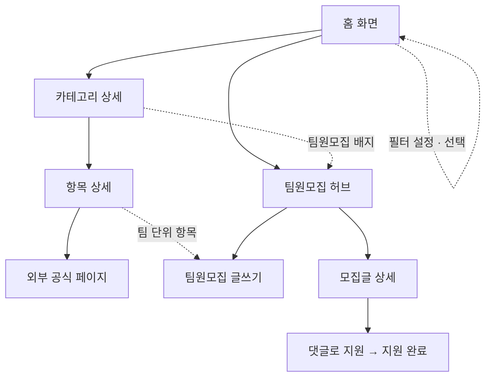

# 캠퍼스핏 — 유령 대학생을 위한 맞춤 정보 서비스

## 문제 정의
학과·선후배 네트워크가 없는 대학생이, 장학금·공모전·지자체 혜택·대외활동·인턴십 정보가 여러 사이트에 흩어져 있고 학교·지역에 따라 지원 대상이 달라지는 상황에서, 자신에게 해당되는 기회의 존재조차 모른 채 놓치는 불편을 겪는다.

> 문제의 본질: 정보가 없는 게 아니라, 흩어져 있고 "내가 대상인지"를 걸러주는 곳이 없다는 것.

### 왜 AI 챗봇으로는 안 되나
- AI에게 물어보면 잘못된 정보(환각)가 섞여 있어 신뢰하기 어렵다.
- 답을 받아도 결국 링크를 타고 들어가 다시 검색·확인해야 하는 불편이 남는다.
- 캠퍼스핏은 검증된 정보를 내 조건에 맞게 걸러서 한 화면에 보여주는 것으로 이 한계를 해결한다.

### 왜 기존 정보 사이트로도 부족한가
- 링커리어·위비티 같은 정보 사이트도 이미 있지만, 직접 써본 결과 나에게 해당되지 않는 공고까지 다 뒤져봐야 해서 오히려 정보를 찾는 데 시간이 더 걸렸다.
- 캠퍼스핏은 국립/사립·지역 조건으로 한 번 걸러주는 것에 집중해서, "대학생 정보 사이트" 하면 바로 떠오르는 곳을 목표로 한다.

## 목표 사용자
- 학과 네트워크가 약해 정보를 스스로 찾아야 하는 대학생
- 신입생, 편입생, 복학생처럼 정보 경로가 끊긴 학생

## 사용자 시나리오
1. 온보딩 없이 바로 **홈 화면**에 들어온다 — 히어로, 등록된 정보 통계(카테고리 수·전체 건수·팀원모집 건수), 전체 카테고리를 통틀은 '마감 임박' 상위 목록, 카테고리별 목록이 한 화면에 보인다.
2. 조건(국립/사립, 지역)을 걸러 보고 싶으면 상단의 **"필터 설정하고 보기"**를 눌러 그때 설정한다 — 강제 단계가 아니라 언제든 켜고 끌 수 있는 옵션이다. 지역을 바꾸면 관련 항목들이 그 지역 기준으로 즉시 바뀐다.
3. 카테고리(장학금/공모전/지자체 혜택/대외활동/인턴십) 또는 팀원모집을 상단 내비게이션에서 바로 고른다.
4. 카테고리에 들어가면 사이드바로 다른 카테고리를 계속 오갈 수 있고, 본문엔 항목별 제목·조건·마감일이 보인다.
5. 항목을 누르면 상세 화면(대표 이미지, 한눈에 정리 표)으로 들어가고, "공식 페이지에서 지원하기"로 이동한다.
6. 팀 단위로만 지원 가능한 항목에는 '팀원모집 N건'이 함께 보이고, 누르면 인앱 팀원모집 게시판으로 연결된다. 학생이 직접 **글쓰기**로 모집글을 올릴 수도 있다.
7. 모집글 상세에서 댓글로 지원하면 지원 완료 화면으로 이동한다.

## 핵심 기능 (3개)
1. **조건 기반 정보 필터링** — 국립/사립 + 지역(재학 학교 소재지 기준)을 상단 필터로 설정하면 지원 자격이 되는 정보만 우선 노출. 필터를 안 켜도 전체를 둘러볼 수 있어, 탐색을 막지 않으면서 걸러주는 게 목표다. 소득분위 같은 세부 조건은 필터링하지 않고 공고 안에 표시해 학생이 직접 확인한다. *문제 정의를 정면으로 해결하는 서비스의 심장.*
2. **카테고리별 목록 + 마감 임박** — 5개 카테고리. 마감까지 7일 이내 남은 공고는 카테고리 구분 없이 홈 화면 상단에 모아서 보여주고, 각 카테고리 안에서도 다시 확인할 수 있다. *정보를 종류별로 찾고 놓치지 않게 하는 기본 골격.*
3. **팀원모집 게시판** — 팀 단위로만 지원 가능한 공고에서, 학생이 직접 모집글을 올리고(글쓰기) 다른 학생이 댓글로 지원한다. 채팅 기능은 MVP(최소 기능 제품) 범위 밖. *정보를 보여주는 데서 그치지 않고 실제 지원까지 이어지게 만드는 두 번째 핵심 가치.*

### 운영 로직
- 정보 출처: 공모전 사이트, 한국장학재단, 지자체, 대외활동 주최 기관이 직접 게시한 공고를 수집해 정리한다.
- 마감된 공고는 자동으로 목록에서 사라진다.
- 마감일이 변경되면, 주최 측이 올린 변경 공지를 기준으로 정보를 갱신한다.

## 설계 결정 사항

| 결정 | 이유 |
|---|---|
| 학과 필터는 의도적으로 넣지 않았다 | 본인 전공과 다른 분야를 탐색하고 싶은 수요가 있기 때문. 학과 단위가 아니라 대학생 전반이 알아두면 좋은 정보를 다루는 서비스다. |
| 온보딩(강제 단계) 자체를 없앤다 | 처음엔 온보딩에서 관심 분야까지 고르게 했는데, 그러면 둘러보기도 전에 여러 단계를 거쳐야 했다. 지금은 조건 없이 바로 홈 화면에서 둘러볼 수 있고, 국립/사립·지역은 상단 "필터 설정" 버튼으로 원할 때만 켜는 옵션으로 바꿨다 — 탐색을 막지 않으면서 걸러주는 것으로 목적을 좁혔다. |
| 지역 기준은 재학 학교 소재지로 한다 | 거주지 기준은 자취·통학 등 변수가 많아 복잡해진다. 학교 소재지는 필터에서 한 번만 정하면 되는 단순한 기준이다. |
| 복수전공·부전공·편입 전 학교 이력은 고려하지 않는다 | 학과 단위의 세밀한 혜택이 아니라, 대학생 전반이 알아두면 좋은 정보를 다루는 서비스이기 때문. |
| 팀원모집은 외부 링크가 아니라 인앱 게시판으로 만든다 | 링크만으로는 팀을 못 구해 대외활동을 포기했던 문제를 풀 수 없었다. 실제 지원까지 이어지는 것이 두 번째 핵심 가치다. |
| 개인 알림(푸시·문자)은 만들지 않는다 | 흩어진 정보를 모아 필터링해 보여주는 정보 사이트이지, 알아서 챙겨주는 개인 비서형 서비스가 아니다. |

## 확장 기능 (MVP 이후)
- 카테고리 내 검색
- 스크랩·북마크 (관심 공고 저장)
- 합격 후기·커뮤니티 게시판
- 자소서·서류 템플릿

## 화면 흐름

## 화면 구성
- **홈 화면**: 히어로 + 통계(카테고리 수·전체 건수·팀원모집 건수) + 전체 카테고리 통합 '마감 임박' 상위 목록 + 카테고리별 목록(건수 포함). 상단 내비게이션에 전체 카테고리 + 팀원모집이 항상 노출되고, "필터 설정" 버튼으로 국립/사립·지역을 옵션으로 설정한다.
- **카테고리 상세**: 사이드바(다른 카테고리로 이동) + 항목 목록(제목/조건/마감일/팀원모집 배지)
- **항목 상세**: 대표 이미지 + 본문 + '한눈에 정리' 요약 표 + 공식 페이지 지원 버튼 (+ 팀 단위 항목이면 '팀원 모집하기' 버튼)
- **팀원모집 허브**: 모집글 목록(연결 공고/모집 내용/마감일) + 글쓰기
- **팀원모집 글쓰기**: 카테고리·연결 공고 선택 + 제목/내용/마감일 입력
- **모집글 상세**: 대표 이미지 + 본문 + 댓글로 지원 → 지원 완료 화면

## 프로토타입
- [claude.ai/code 아티팩트 (온보딩 있던 이전 버전)](https://claude.ai/code/artifact/7ccf5d4e-89c4-4f21-a9e9-7c6adc79de54)
- **Claude Design으로 만든 최신 버전** — 필터 방식, 홈 화면 통합 마감임박, 팀원모집 글쓰기까지 실제로 동작하는 버전. 로컬 파일(`CampusFit Website (standalone).html`)로 시연.

> 최신 버전은 온보딩 대신 옵션형 필터를 쓰고, 팀원모집 글쓰기·지역별 개인화가 실제로 동작한다. React 구현은 2주차 개발 범위.
