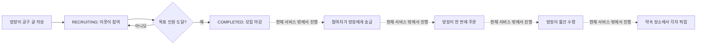
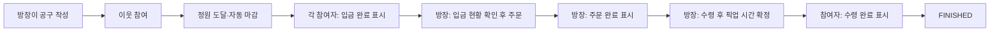

# CLAUDE.md

이 저장소는 모노레포다: `frontend/`(React) + `backend/`(Express).
서비스 기획서: 띵동(ThingDong) — 위치 기반 자취생 공동구매 분할 웹 플랫폼.
(기획서 내 ERD·상태값·API 명세는 스택과 무관하게 유효. **단, 기획서 7장의 "Next.js / Spring / JPA / MySQL" 아키텍처 서술은 무시할 것** — 실제 스택은 아래 참조.)

## 기술 스택

| 영역             | 선택                                                                             | 비고                                                                                                                                                                                              |
| ---------------- | -------------------------------------------------------------------------------- | ------------------------------------------------------------------------------------------------------------------------------------------------------------------------------------------------- |
| 프론트엔드       | React + Vite (순수 SPA)                                                          | Next.js 아님. SSR/SEO 불필요                                                                                                                                                                      |
| 언어             | JavaScript (TS 아님)                                                             |                                                                                                                                                                                                   |
| 백엔드           | Express                                                                          | Spring 아님                                                                                                                                                                                       |
| DB               | MySQL                                                                            |                                                                                                                                                                                                   |
| ORM              | Sequelize                                                                        | 순수 JS 친화적이고, 기획서 7.3의 비관적 락(`SELECT ... FOR UPDATE`)을 `transaction.LOCK.UPDATE`로 그대로 지원                                                                                     |
| 인증             | OAuth 로그인 → JWT (Access Token은 메모리, Refresh Token은 httpOnly+Secure 쿠키) | 기획서 7.7 그대로                                                                                                                                                                                 |
| OAuth 프로바이더 | 카카오, 네이버                                                                   | 구글은 제외                                                                                                                                                                                       |
| 지도 API         | 카카오맵 JS SDK                                                                  | 스크립트 태그로 로드, REST/JS 키 필요 (`.env`의 `KAKAO_MAP_JS_KEY` 등)                                                                                                                            |
| 로컬 개발 DB     | Docker Compose로 MySQL 컨테이너                                                  | 혼자 개발이어도 추천 — 로컬 설치 버전 꼬임 방지, 나중에 팀원/배포 환경과 설정 통일 쉬움                                                                                                           |
| 알림 구현 순서   | 이메일(SMTP) 먼저 → 웹 푸시(FCM) 나중                                            | 웹 푸시는 Service Worker + VAPID 키 발급 등 설정이 더 걸려서 뒤로 미룸. `Notification` 엔티티/발송 로직은 처음부터 이메일·웹푸시 두 채널을 다 받을 수 있게 설계하고, 웹 푸시 발송부만 나중에 구현 |

## 디렉토리 구조

```
my-project/
├── AGENTS.md
├── frontend/
│   ├── src/
│   │   ├── api/            # axios 인스턴스, 엔드포인트별 함수
│   │   ├── components/     # 재사용 UI 컴포넌트 (design-system.md 패턴 준수)
│   │   ├── pages/          # 라우트 단위 페이지 (HomePage, GroupPurchaseDetailPage 등)
│   │   ├── routes/         # React Router 설정
│   │   ├── hooks/          # 커스텀 훅 (useGeolocation 등)
│   │   ├── store/          # 클라이언트 상태 (Zustand)
│   │   ├── styles/
│   │   │   └── tokens.css  # 디자인 토큰
│   │   └── utils/
│   ├── public/
│   ├── docs/
│   │   └── design-system.md  # 컴포넌트 코드 패턴 레퍼런스
│   └── package.json
├── backend/
│   ├── src/
│   │   ├── config/         # db.js, env.js
│   │   ├── models/         # Sequelize 모델 (User, GroupPurchase, UserGroupPurchase, Notification)
│   │   ├── controllers/    # 요청 검증 + DTO 변환만, 비즈니스 로직 없음
│   │   ├── services/       # 트랜잭션 경계 + 도메인 로직
│   │   ├── routes/
│   │   ├── middlewares/    # auth, errorHandler, validate
│   │   ├── schedulers/     # node-cron 배치 (마감 공구 자동취소 등)
│   │   └── utils/          # haversine 거리 계산, apiResponse 포맷 등
│   ├── .env.example
│   └── package.json
└── package.json
```

## 라이브러리

**프론트엔드**

- `react-router-dom` — 라우팅
- `axios` — API 통신
- `@tanstack/react-query` — 서버 상태(피드 목록, 상세 등) 캐싱/리페칭
- `zustand` — 클라이언트 전역 상태(로그인 유저 정보 등), Redux 대신 가볍게
- 카카오맵 JS SDK — npm 패키지 아님, `index.html`에 `<script src="//dapi.kakao.com/v2/maps/sdk.js?appkey=...">`로 로드하거나 `react-kakao-maps-sdk` 래퍼 사용 가능

**백엔드**

- `express`, `sequelize` + `mysql2`
- `jsonwebtoken`, `bcrypt` — 인증
- `passport`, `passport-kakao`, `passport-naver-v2` — 카카오/네이버 OAuth (직접 REST 호출로 구현해도 되지만, 두 개뿐이라 라이브러리로 보일러플레이트 줄이는 쪽 추천)
- `cookie-parser`, `cors`, `helmet` — 보안/쿠키
- `express-validator` — 요청 검증 (Controller 레이어에서 사용)
- `node-cron` — 스케줄러 (7.4 자동취소 배치)
- `nodemailer` — 이메일 발송 (1차 알림 채널, 먼저 구현)
- `web-push` — 웹 푸시(Web Push API + VAPID) — 2차로 나중에 구현
- `winston` 또는 `morgan` — 로깅
- (Advanced 단계) `ioredis` — Redis 캐시/분산락, `socket.io` — 실시간 상태 반영을 폴링 대신 소켓으로

## 코드 컨벤션

- 파일명: React 컴포넌트는 `PascalCase.jsx`, 나머지 JS 파일은 `camelCase.js`
- 백엔드 레이어 규칙: Controller → Service → Model(Repository 역할) 순서 유지, Controller에 비즈니스 로직 넣지 않기
- API 응답은 항상 `{ success, data, error }` 형태로 통일
- 에러는 커스텀 `AppError` 클래스 + 중앙 `errorHandler` 미들웨어에서 처리 (컨트롤러에서 직접 try/catch로 응답 만들지 않기)
- ESLint + Prettier 적용 (세부 룰셋은 개발 착수 시 `eslint-config-airbnb-base` 또는 `eslint-config-standard` 중 택1 — 아래 체크리스트)
- `.env`는 커밋 금지, `.env.example`에 필요한 키만 이름으로 명시

## 커밋 로그 규칙 (Conventional Commits)

```
<type>: <설명>

예)
feat: 공구 참여 신청 API 추가
fix: 정원 초과 시 동시 신청 레이스 컨디션 수정
docs: AGENTS.md에 백엔드 디렉토리 구조 추가
refactor: GroupPurchase 서비스 트랜잭션 분리
style: 버튼 컴포넌트 포맷팅
test: 참여 승인 API 테스트 추가
chore: 패키지 업데이트
```

- type: `feat` `fix` `docs` `style` `refactor` `test` `chore` `perf`
- 설명은 한글, 현재형("~한다"체 아닌 "~함/~추가" 식 요약), 끝에 마침표 없음
- 브랜치명: `feature/기능명`, `fix/버그명` (예: `feature/group-purchase-join`)
- 혼자 개발이면 `main` 하나로 가도 되지만, 기능 단위로 브랜치 나누고 머지하는 습관은 유지 (나중에 롤백/리뷰 쉬움)

## 프론트엔드 디자인 시스템 (ThingDong / Fresh Share Modern)

프론트엔드에서 UI 컴포넌트를 새로 만들거나 수정할 때는 반드시 아래 두 파일을 먼저 확인한다.
임의로 색상, 폰트, radius, spacing 값을 정하지 않는다.

- `frontend/src/styles/tokens.css` — 색상/폰트/radius/spacing/shadow CSS 변수(`--td-*`)와 타이포그래피 유틸리티 클래스.
- `frontend/docs/design-system.md` — 이미 만든 컴포넌트(Button, ProductCard, ProgressBar, SearchInput, Chip)의 실제 JSX + CSS 코드와 네이밍/구조 규칙.

React 함수형 컴포넌트, 이름 있는 export. Tailwind / CSS-in-JS / styled-components 사용하지 않고 `ComponentName.jsx` + `ComponentName.css`로 분리. className은 `td-` 접두사 + BEM.

| 요소         | 규칙                                                                       |
| ------------ | -------------------------------------------------------------------------- |
| Radius       | 버튼/필=pill, 카드=20px, 히어로 배너=24px, 카테고리 아이콘=16px, 그 외=8px |
| 주요 액션 색 | `--td-primary-container` 배경 + `--td-on-primary` 텍스트, pill             |
| 보조 액션 색 | `--td-mint-green` 배경 + `--td-primary` 텍스트, 8px 라운드                 |
| 경고/에러    | 에러/마감=`--td-danger`, 주의=`--td-warning`. 파랑은 유틸리티 전용         |
| 카드 hover   | shadow + `scale(--td-scale-hover)`를 항상 같이                             |

## 개발 전 결정 사항

- [x] **지도 API**: 카카오맵 JS SDK
- [x] **OAuth 프로바이더**: 카카오, 네이버
- [x] **웹 푸시 vs 이메일 우선순위**: 이메일(SMTP) 먼저 구현 → 웹 푸시(FCM)는 나중에 추가
- [x] **로컬 개발 DB**: Docker Compose로 MySQL 컨테이너 (혼자 개발이어도 재현성/재설치 편의 때문에 추천)
- [x] **Redis 도입 시점**: 기획서대로 Advanced 단계로 미룸 — MVP는 Sequelize 트랜잭션 락(`transaction.LOCK.UPDATE`)만으로 간다
- [x] **배포 환경**: 프론트 Vercel(정적 호스팅, 자동배포 간편) + 백엔드 Railway(Express+MySQL을 한 곳에서 관리하기 편함, 무료 티어로 MVP/포트폴리오 데모에 충분). 트래픽 늘면 백엔드만 별도 VM/컨테이너로 이전
- [x] **테스트 범위**: 전체 테스트는 생략하고, 4.3(동시성 제어)·4.4(상태 전이) 두 핵심 로직만 Jest + Supertest로 최소 테스트. 이 두 개가 깨지면 서비스 신뢰(정원 초과, 상태 꼬임)가 바로 무너지기 때문
- [x] **CI**: 혼자 개발이라 지금은 생략. GitHub Actions는 나중에 협업하거나 배포 자동화가 필요해지면 추가 (지금 만들어도 유지비만 듦)
- [x] **ESLint 룰셋**: `eslint-config-standard` — 세미콜론/따옴표 등 논쟁적인 규칙이 airbnb보다 적어서 혼자 개발할 때 규칙과 싸울 일이 적음

모두 결정돼서 이 프로젝트 시작 전 체크리스트는 닫혔다. 진행하다 새로 결정할 게 생기면 이 표 형식으로 아래에 추가한다.

| 날짜 | 결정 사항 | 이유 |
| ---- | --------- | ---- |
|      |           |      |

## 공동구매 운영 흐름과 책임 분산 설계

### 지금 구현된 흐름 (사실 기준)

현재 서비스는 **모집과 참여 기록**까지 실제 MySQL에 저장한다. 결제, 실제 주문, 물건 수령 확인, 나눔 완료 처리는 아직 화면·API·DB에 구현되어 있지 않다. 따라서 아래의 `현재` 흐름에서 `모집 완료` 뒤 단계는 서비스가 자동으로 처리하는 일이 아니라 방장과 참여자가 별도로 대화해 해결해야 하는 상태다.



쉽게 말하면 지금은 “사람을 모으고, 자리가 찼다는 것을 기록하는 게시판”이다. 방장이 글을 올리고 인원이 다 차면 모집 상태가 `COMPLETED`가 된다. 하지만 누가 돈을 냈는지, 누가 주문했는지, 누가 물건을 받았는지는 서비스가 아직 모르므로 방장에게 일이 몰린다.

### 왜 방장 중심이 부담이 되는가

방장은 돈을 먼저 받거나 대신 내고, 주문 실수·배송 지연을 설명하고, 물건을 보관하고, 약속 시간에 나눠줘야 한다. 참여자는 버튼 하나만 누르면 되므로 책임이 비대칭이다. 이 구조는 작은 금액·친한 이웃에게는 괜찮지만, 금액·인원이 커질수록 “방장이 손해 보면 어떡하지?”와 “참여자가 안 오면 어떡하지?” 때문에 공구를 열 사람이 줄어든다.

### 추천하는 다음 흐름: 방장이 총대, 서비스가 실무를 대신하는 공구

초기 서비스에서는 주문·수령 담당을 따로 뽑지 않는다. 역할을 나누면 책임은 줄어들 수 있지만, “누가 할래요?”를 다시 조율해야 해 참여자에게 한 단계 더 번거롭다. 대신 **방장이 주문과 수령을 맡고, 서비스가 반복 확인과 공지를 대신하는 구조**를 선택한다.



- **방장**: 공구 글 작성, 주문, 물건 수령·전달을 맡는다.
- **참여자**: 정해진 시간 전 입금 완료와 픽업 완료를 직접 표시한다.
- **서비스**: 1인 금액 계산, 정원·마감 처리, 입금·미입금 목록, 주문·픽업 공지, 대기자, 완료 기록을 자동으로 관리한다.

처음에는 아래처럼 작게 만든다.

1. 정원이 차면 자동으로 모집을 마감하고, 참여자별 금액·입금 상태를 한 화면에 보여 준다.
2. 방장이 `주문 완료`와 `픽업 가능`만 누르면 참여자 모두의 화면에 상태가 바뀌게 한다.
3. 참여자는 `입금 완료`, `수령 완료`를 직접 누르고, 방장은 미완료자만 확인한다.
4. 취소가 나면 대기자에게 자동으로 참여 기회를 준다.

서비스가 참여자의 돈을 직접 보관하는 **에스크로/예치금**은 MVP에서 바로 만들지 않는다. 결제대행사 계약, 정산·환불 정책, 법적 검토가 필요할 수 있다. 초반에는 방장 계좌 이체 또는 검증된 외부 결제 링크를 기록하고, 플랫폼은 “누가 입금·수령을 완료했는지”를 투명하게 보여 주는 역할에 집중한다.

### 왜 방장 총대 방식이 이 서비스에 맞는가

방장에게 주문·수령의 일이 몰린다는 단점은 분명하다. 하지만 동네 공동구매에서는 참여자가 여러 명의 역할자를 정하고 서로 조율하는 것보다, **신뢰할 수 있는 한 사람이 빠르게 결정하고 나머지는 단순하게 참여하는 경험**이 더 편할 수 있다. 중고거래에서 판매자가 물건과 거래 조건을 정하고 구매자가 선택하는 방식처럼, 책임 주체가 한 명이면 참여자는 “입금하고 정해진 때 받기”만 이해하면 된다.

이 선택의 장점은 다음과 같다.

- **참여 진입장벽이 낮다**: 참여자는 역할 지원·협의 없이 공구 조건을 보고 참여하면 된다.
- **결정이 빠르다**: 상품 변경, 주문 시간, 픽업 장소 같은 판단을 한 명이 정하므로 단체 대화가 길어지지 않는다.
- **책임 창구가 분명하다**: 문제가 생겼을 때 공지와 문의의 중심이 명확하다.
- **MVP가 작고 검증하기 쉽다**: 복잡한 역할 권한·정산 규칙보다 모집, 입금 확인, 픽업 확인부터 안정적으로 만들 수 있다.
- **신뢰가 쌓이기 쉽다**: 방장은 완료 기록과 후기를 통해 “이 동네에서 공구를 잘 여는 사람”이라는 신뢰를 만들 수 있다.

따라서 목표는 방장의 책임을 없애는 것이 아니라, 방장이 같은 질문에 답하고 사람을 세고 독촉하는 일을 하지 않게 만드는 것이다. 공구가 커져 역할 분담 수요가 실제로 확인되면 그때 선택 기능으로 확장한다.

### 노쇼 방지: 처벌보다 약속을 지키기 쉬운 구조

현재는 `noShowCount` 필드가 있지만, 실제로 픽업 완료·노쇼 판정·제재하는 흐름은 없다. 조언대로 현재 노쇼 방지는 약하다. 다만 바로 벌점부터 넣기보다, 취소할 길과 대체 인원을 먼저 마련해야 억울한 벌점을 줄일 수 있다.

권장 우선순위는 다음과 같다.

1. **취소 마감 시간**: 픽업 2~3시간 전까지는 한 번의 버튼으로 취소할 수 있게 한다. 지금처럼 모집 중 취소만 가능하면, 모집 완료 뒤 사정이 생긴 참여자가 연락 없이 빠질 수 있다.
2. **대기자**: 정원이 찬 뒤에도 참여 희망자를 대기열에 넣고, 취소가 나면 다음 사람에게 일정 시간 참여 기회를 준다.
3. **픽업 확인 버튼 또는 QR**: 수령 담당이 “전달 완료”, 참여자가 “받았어요”를 각각 누르게 한다. 둘 중 하나만으로 노쇼를 확정하지 않는다.
4. **가벼운 신뢰 신호**: 최근 10회 중 픽업 완료율, 취소 횟수, 역할 수행 횟수를 보여 준다. 공개 망신식 점수보다 “약속을 잘 지킨 이웃” 배지를 먼저 쓴다.
5. **반복 노쇼만 단계적 제한**: 정당한 사유를 소명할 수 있게 하고, 반복된 무단 노쇼에만 7일 참여 제한 → 더 긴 제한처럼 점진 적용한다. 사람이 수동으로 확정하거나 양쪽 이의 제기 기간을 둔다.

가장 먼저 만들 기능은 `픽업 시간 확정 + 완료/미수령 기록 + 대기자`다. 이것만 있어도 방장이 혼자 연락을 돌리는 일을 줄이고, 나중에 신뢰 점수나 제한을 공정하게 판단할 데이터가 생긴다.

## 백엔드 (Express) — 추가 컨벤션

(개발 착수 후 API 에러 코드 체계, 트랜잭션 헬퍼 함수 패턴 등 확정되는 대로 이 섹션에 추가)
