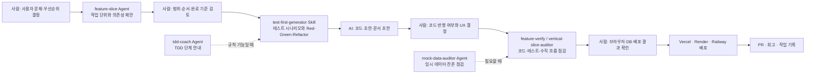

# ThingDong Agent 협업 과정

## 사람과 AI의 역할

## 도구별 사용 위치

| 구분 | 사용 시점 | AI가 한 일 | 내가 결정·확인한 일 |
| --- | --- | --- | --- |
| `feature-slice` | 기능 시작 | 요구사항을 P0~P2 이슈로 분리 | 이번 주 범위와 우선순위 조정 |
| `test-first-generator` | 규칙 구현 전 | 테스트 케이스와 Red-Green-Refactor 순서 제안 | 케이스 누락 여부와 테스트 대상 선택 |
| `tdd-coach` | TDD 학습·실행 | 테스트 우선 진행 단계 안내 | 어떤 함수가 TDD에 적합한지 선택 |
| `feature-verify` | 기능 완료 직전 | 완료 기준과 코드·테스트 대조 | 실제 화면의 UX와 배포 결과 확인 |
| `vertical-slice-auditor` | FE·BE·DB 연결 후 | 화면부터 DB까지 연결 점검 | 데모 흐름을 직접 실행 |
| `mock-data-auditor` | 목업 제거 시 | 고정 데이터·더미 텍스트 탐색 | 실제 DB 데이터로 바꿀 범위 결정 |

## 실제 적용 사례

### 공동구매 상태 전이

1. 사람: 방장은 주문 완료·픽업 가능·공구 완료를 순서대로 처리하고, 참여자는 수령 완료를 기록해야 한다고 정했다.
2. AI: 상태별 성공·실패 테스트와 API 구현 초안을 제안했다.
3. 사람: 방장과 참여자의 버튼·문구를 구분하고, 데모에서 보여줄 순서를 결정했다.
4. 검증: 테스트와 배포 화면에서 모집 완료 → 입금 → 주문 완료 → 픽업 완료 흐름을 확인했다.

### 배포 오류 해결

1. 사람: Vercel·Render·Railway를 선택하고 배포 화면에서 환경변수를 입력했다.
2. AI: Render에서 Railway 내부 호스트를 사용할 수 없다는 로그를 해석하고, 공개 호스트·포트 사용을 안내했다.
3. 사람: 환경변수를 직접 설정하고, 배포 URL에서 결과를 확인했다.
4. 검증: `/health`와 `/group-purchases` 응답, Vercel에서의 로그인·목록 표시를 확인했다.
