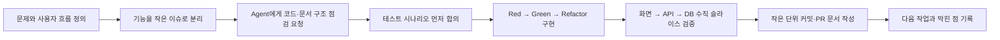

# 나의 AI 협업 워크플로우와 발표 개요

## 1. 3주 동안 만든 나의 작업 순서

### 내가 맡는 일

- 어떤 문제를 풀지, 사용자에게 어떤 흐름이 필요한지 결정한다.
- AI가 제안한 작업 순서와 범위를 그대로 받지 않고 우선순위·누락·작업 크기를 확인한다.
- 브라우저 화면, 테스트 결과, DB 데이터를 보고 최종 동작을 판단한다.

### AI에게 맡기는 일

- 코드베이스에서 테스트하기 좋은 함수와 빠진 연결을 찾는다.
- 기능을 화면·API·DB 단위로 나누고 구현 초안을 만든다.
- 테스트 케이스, 문서 구조, 검증 체크리스트를 제안한다.
- 반복 작업인 테스트 실행·빌드·변경 파일 점검을 돕는다.

## 2. 사용한 Agent와 Skill

| 종류 | 이름 | 언제 쓰는가 | 결과물 |
| --- | --- | --- | --- |
| Agent | `feature-slice` | 큰 요구사항을 1~2일짜리 기능으로 나눌 때 | 우선순위·완료 기준 |
| Agent | `tdd-coach` | 규칙이 분명한 기능을 만들 때 | 시나리오, Red/Green 순서 |
| Agent | `vertical-slice-auditor` | 화면부터 DB까지 연결됐는지 확인할 때 | 검증 보고서 |
| Agent | `mock-data-auditor` | 화면에 남은 목업 데이터가 있는지 찾을 때 | 목업 정리 목록 |
| Skill | `test-first-generator` | React/Vitest, Express/Jest 테스트를 먼저 쓸 때 | 테스트 코드와 실행 절차 |

## 3. 내가 실제로 적용한 예시

### 예시: 1인 금액 계산

1. **시나리오**: `10000원, 3명`은 `3333원`, 0명·문자열·음수는 `0원`이어야 한다.
2. **Red**: 항상 0을 반환하는 스텁으로 정상 계산 테스트가 실패하는지 확인했다.
3. **Green**: 숫자와 인원 조건을 검사한 뒤 나누고 반올림하는 최소 코드를 작성했다.
4. **Refactor**: 화면 안에 있던 계산식을 `utils` 함수로 분리했다.
5. **검증**: Vitest 전체 테스트와 Vite build를 실행했다.

## 4. 짧은 발표 자료 개요 (6장)

### 1장. 서비스 소개 — 띵동(ThingDong)

- 동네 이웃과 함께 필요한 상품을 공동구매하는 서비스
- 문제: 모집·주문·픽업 정보가 채팅에 흩어지고 방장 부담이 큼

### 2장. 핵심 사용자 흐름

- 등록 → 참여/취소 → 모집 완료 → 주문 → 픽업 → 수령 완료
- 방장은 주문·수령을 맡고, 서비스는 상태와 공지를 관리

### 3장. 이번 주 구현 결과

- Docker MySQL 데이터 저장, 실제 마이페이지
- 이메일 알림 기록, 자동 마감 스케줄러, 카카오맵 픽업 위치
- 테스트: 프론트 12개 / 백엔드 15개

### 4장. 구조와 데이터 흐름

- React 화면 → Axios/React Query → Express → Sequelize → Docker MySQL
- 공동구매·참여·알림 테이블 관계

### 5장. AI와 함께 일한 방식

- 기능을 작게 나누고 TDD로 완료 기준을 먼저 정함
- TDD 코치, 수직 슬라이스 검증 Agent, 테스트 우선 Skill 사용

### 6장. 다음 단계

- 카카오맵 키·SMTP 실제 외부 연동 확인
- 픽업 정보 변경 알림, 대기자, 노쇼 방지 규칙 강화
