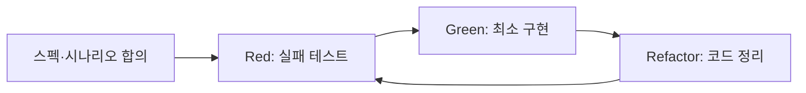

# 띵동 TDD 가이드

## TDD는 순서를 바꾸는 개발 방식

보통은 코드를 먼저 만들고 나중에 확인한다. TDD는 반대로 **어떤 동작이 맞는지 테스트로 먼저 정한 뒤**, 그 테스트를 통과시키는 코드를 만든다.



- **Red**: 아직 기능이 없으므로 테스트가 실패하는 것이 정상이다.
- **Green**: 테스트를 통과하는 최소 코드만 만든다.
- **Refactor**: 동작을 유지한 채 중복과 복잡도를 정리하고 테스트를 다시 실행한다.

## 이 프로젝트에서 테스트하기 좋은 곳

| 대상 | 위치 | 이유 | 도구 |
| --- | --- | --- | --- |
| 공동구매 상태 필터 | `frontend/src/utils/filterPurchasesByActivity.js` | 전체·진행 중·마감 조건이 명확하다 | Vitest |
| 1인 금액 계산 | `CreatePostScreen.jsx`의 금액 계산 로직 | 숫자, 0, 반올림을 검증할 수 있다 | Vitest |
| 참여·취소·상태 전환 | `backend/src/routes/groupPurchase.routes.js` | 권한과 DB 상태 변화가 중요하다 | Jest + Supertest |
| 디자인 간격·색상 | CSS와 화면 | 눈으로 보는 편이 빠르다 | 브라우저 확인 |

## 실제로 있는 테스트

### 프론트엔드 단위 테스트

`frontend/src/utils/filterPurchasesByActivity.test.js`에는 7개 테스트가 있다.

`filterPurchasesByActivity`는 공동구매 목록과 필터를 받아 화면에 표시할 목록을 반환한다.

- `all`: 모든 목록을 그대로 반환한다.
- `recruiting`: `RECRUITING`만 반환한다.
- `closed`: `RECRUITING`이 아닌 `COMPLETED`, `ORDERED`, `WAITING_PICKUP`, `FINISHED`를 반환한다.
- 빈 목록, 특정 상태가 없는 목록, 알 수 없는 필터도 확인한다.

이 함수로 마이페이지의 `전체 / 진행 중 / 마감` 카드 수와 목록이 같은 기준으로 움직이는지 검증한다.

실행:

```powershell
cd Project/frontend
npx.cmd vitest run
```

### 백엔드 통합 테스트

`backend/src/tests/groupPurchase.test.js`에는 Jest와 Supertest 테스트가 있다.

- 인원만큼 참여하면 `RECRUITING`에서 `COMPLETED`로 바뀌는지
- 동시에 여러 명이 참여해도 정원을 초과하지 않는지
- 참여 취소 시 참여 기록과 인원 수가 함께 바뀌는지
- 공개 목록에서 마감된 공동구매와 시간이 지난 공동구매가 숨겨지는지
- 방장만 주문·픽업·완료 상태를 순서대로 바꿀 수 있는지
- 모든 참여자가 수령 완료해야 공동구매를 끝낼 수 있는지

Supertest는 브라우저 대신 API에 요청을 보내고, 테스트는 `thingdong_test` MySQL DB에서만 실행한다. 그래서 실제 개발 데이터와 분리된다.

실행:

```powershell
cd Project
docker compose up -d
cd backend
npm.cmd test -- --runInBand
```

## 새 기능을 TDD로 만드는 순서

예: `제목 검증` 함수를 만들 때

1. 코드 없이 먼저 시나리오를 정한다.

| 입력 | 기대 결과 | 이유 |
| --- | --- | --- |
| `장보기` | `true` | 정상 제목 |
| `''` | `false` | 빈 값 |
| `'   '` | `false` | 공백만 있는 값 |

2. 테스트가 import할 수 있도록 빈 스텁을 만든다. 정상 케이스가 실패하면 Red다.
3. `title.trim().length > 0`처럼 최소 코드를 작성한다. 테스트가 통과하면 Green이다.
4. 코드가 커졌을 때만 이름·중복·조건을 정리하고 다시 실행한다.

## AI와 함께할 때 지킬 약속

1. AI에게 먼저 테스트 대상 후보와 테스트 케이스만 요청한다.
2. 케이스를 내가 확인한 뒤에만 테스트 코드를 요청한다.
3. 실패 로그가 기능 미구현인지, 테스트 환경 문제인지 구분해서 확인한다.
4. 테스트가 통과한 뒤에만 다음 기능이나 리팩터링으로 넘어간다.

## 2026-07-23 TDD 실습: 1인 금액 계산

### 스펙과 시나리오

공동구매 등록 화면에서 보여 줄 `calculatePerPersonPrice(총금액, 모집인원)`을 만들었다. 입력값이 올바르면 총금액을 인원수로 나누고 가장 가까운 원 단위로 반올림한다. 잘못된 값은 화면에 이상한 금액이 보이지 않도록 0원을 돌려준다.

| 입력 | 기대 결과 | 이유 |
| --- | --- | --- |
| `10000, 3` | `3333` | 나눈 뒤 반올림 |
| `12000, 3` | `4000` | 나누어떨어지는 정상값 |
| `0, 2` | `0` | 경계값 |
| `10000, 0` 또는 `10000, -1` | `0` | 0으로 나눌 수 없음 |
| 음수·문자열·NaN | `0` | 잘못된 입력 |

### Red → Green → Refactor

1. **Red**: `calculatePerPersonPrice.js`에 항상 `0`을 반환하는 스텁을 만들고, 정상 계산 두 테스트가 실패하는 것을 확인했다. 실패 원인은 구현이 아직 없어서였다.
2. **Green**: 유한한 숫자인지와 인원수·금액 범위를 검사한 뒤 `Math.round(totalPrice / targetParticipants)`을 반환하는 최소 코드를 작성했다.
3. **Refactor**: `CreatePostScreen.jsx` 안에 있던 계산식을 이 함수로 교체했다. 이제 화면과 테스트가 같은 계산 규칙을 사용한다.

실행 결과: `npx.cmd vitest run` 기준 프론트엔드 테스트 **12개 통과**, `npm.cmd run build` 통과.
