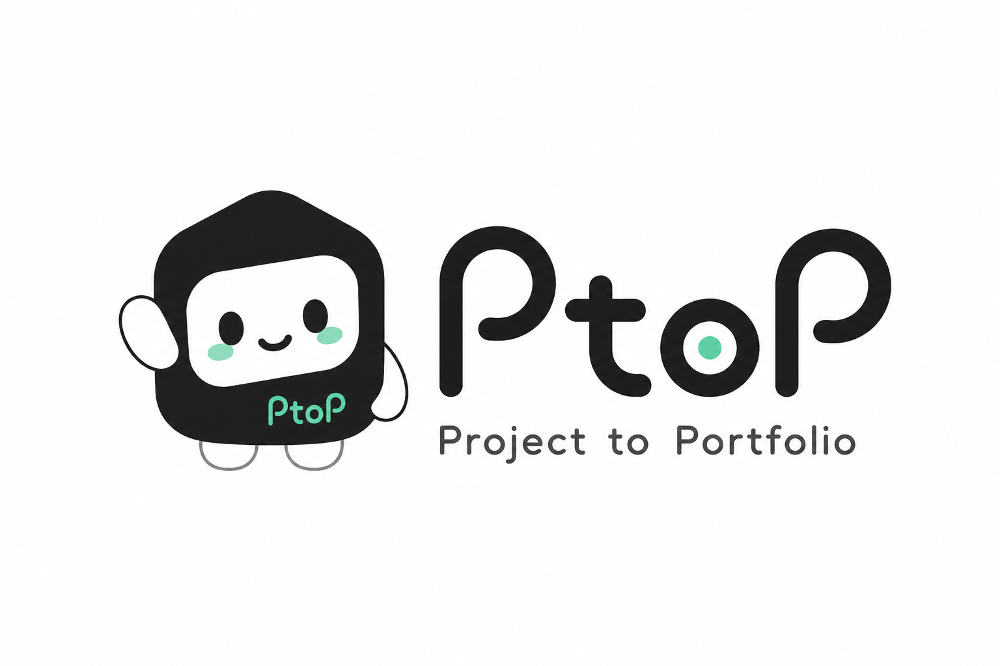

# PtoP(Project to Portfolio) 기획 문서



## 1. 프로젝트 주제

대학생 개발자를 위한 프로젝트 회고 및 포트폴리오 정리 AI Agent

## 2. 서비스 이름

- 서비스명: PtoP
- 의미: Project to Portfolio
- 한 줄 소개: GitHub Repository나 프로젝트 폴더를 분석해 대학생 개발자의 프로젝트 경험을 포트폴리오와 회고 형태로 정리해주는 AI Agent 서비스

## 3. 핵심 기능 요약

| 핵심 기능 | 설명 |
| --- | --- |
| Repository 입력 | GitHub Repository URL 또는 프로젝트 폴더를 입력한다. |
| 프로젝트 분석 | README, 폴더 구조, 주요 코드 파일을 분석한다. |
| 기술 스택 정리 | 프로젝트에서 사용한 프레임워크, 라이브러리, 개발 도구를 정리한다. |
| 핵심 기능 요약 | 프로젝트 목적과 주요 기능을 포트폴리오에 맞게 요약한다. |
| 경험 회고 생성 | 내가 한 일, 어려웠던 점, 해결 과정, 배운 점을 정리할 수 있는 초안을 만든다. |
| Markdown 내보내기 | 정리된 결과를 포트폴리오나 회고 문서에 바로 활용할 수 있게 Markdown으로 제공한다. |

## 4. 브랜드 콘셉트

- 마스코트 이름: 포피(Popy)
- 마스코트 역할: 프로젝트를 분석하고 정리해주는 친절한 AI 에이전트
- 브랜드 키워드: 정리, 회고, 성장, 포트폴리오, 친근한 AI 도우미
- 디자인 톤: 흰색과 검정색을 중심으로 사용하고, 민트색을 포인트 컬러로 활용한다.
- 이미지 사용 방향: 마스코트는 서비스의 보조 브랜드 요소로 사용하고, 기획서 화면에서는 핵심 기능이 먼저 보이도록 최소한으로 배치한다.
- 컬러 방향:
  - Black: 핵심 텍스트와 로고의 중심 색상
  - White: 문서형 서비스의 깔끔한 배경
  - Mint: 완료, 발견, 성장, 긍정적인 피드백을 표현하는 포인트 색상
  - Light Gray: 구분선과 보조 배경

## 5. 선택한 문제 영역

대학생이 겪는 문제 해결

## 6. 문제 정의

최근 대학생들은 동아리, 해커톤, 부트캠프, 개인 프로젝트 등을 통해 많은 프로젝트 경험을 쌓고 있다. AI 도구의 발전으로 짧은 시간 안에 프로젝트를 구현하는 속도도 빨라지고 있다.

하지만 프로젝트가 끝난 뒤에는 자신의 역할, 핵심 구현 내용, 기술적 고민, 문제 해결 과정을 바로 정리하지 못하는 경우가 많다. 시간이 지난 뒤 포트폴리오나 자기소개서를 작성하려고 하면 당시 어떤 문제를 해결했는지, 어떤 결정을 했는지 다시 떠올리기 어렵다.

결과적으로 프로젝트 경험은 많지만, 그 경험을 잘 설명하지 못하는 문제가 생긴다.

## 7. 타겟 사용자

- 프로젝트 경험을 쌓고 있는 대학생 개발자
- 동아리, 해커톤, 부트캠프, 개인 프로젝트를 병행하는 학생
- 포트폴리오를 준비해야 하지만 프로젝트 정리에 어려움을 느끼는 학생
- GitHub Repository는 있지만, README나 회고 문서가 부족한 학생

## 8. 해결 방향

PtoP는 사용자가 프로젝트 폴더나 GitHub Repository를 입력하면, AI Agent가 프로젝트 내용을 분석해 포트폴리오와 회고 작성에 필요한 초안을 만들어준다.

분석 대상은 README, 폴더 구조, 주요 코드 파일, 기술 스택, 기능 흐름 등이다. 이를 바탕으로 프로젝트 목적, 핵심 기능, 사용 기술, 나의 역할로 정리할 수 있는 내용, 문제 해결 과정, 배운 점을 Markdown 형태로 제공한다.

## 9. MVP 기능

- GitHub Repository URL 또는 프로젝트 폴더 입력
- README, 폴더 구조, 주요 코드 파일 분석
- 프로젝트 목적과 핵심 기능 요약
- 사용한 기술 스택 자동 정리
- 포트폴리오에 활용할 수 있는 회고 초안 생성
- 내가 한 일, 어려웠던 점, 해결 과정, 배운 점 템플릿 제공
- Markdown 파일 형태로 결과 내보내기

## 10. 사용자 흐름

```text
프로젝트 종료
→ PtoP에 GitHub Repository 또는 프로젝트 폴더 입력
→ AI Agent가 프로젝트 구조와 문서 분석
→ 프로젝트 요약, 기술 스택, 핵심 구현 내용 추출
→ 회고/포트폴리오 초안 생성
→ 사용자가 수정 후 포트폴리오, 자기소개서, 면접 준비에 활용
```

## 11. 추가 핵심 기능 고려사항

- 커밋 기반 기여도 분석
- PR, Issue, 리뷰 코멘트 분석
- 자기소개서와 면접 답변 형태로 변환
- 기술적 고민과 어필 포인트 자동 추출
- README 개선 제안
- KPT, 4L 등 회고 템플릿 자동 생성
- 프로젝트 기간, 커밋 수, 기술 스택 비중 시각화
- 여러 프로젝트 비교 후 포트폴리오 우선순위 추천
- Notion 또는 GitHub Pages 내보내기

## 12. 기대 효과

PtoP를 사용하면 대학생 개발자는 프로젝트가 끝난 직후 짧은 시간 안에 경험을 정리할 수 있다. 프로젝트 결과물뿐 아니라 자신이 어떤 문제를 해결했고 어떤 역할을 맡았는지 기록할 수 있기 때문에 포트폴리오의 완성도를 높일 수 있다.

또한 자기소개서나 면접을 준비할 때도 프로젝트 경험을 다시 정리하는 부담을 줄일 수 있다.

## 13. 4주간 구현 목표

4주 동안은 완성형 포트폴리오 생성기보다, Repository 분석을 통해 프로젝트 회고 초안을 만들어주는 기능에 집중한다.

우선은 사용자가 입력한 프로젝트 정보를 바탕으로 다음 결과물을 생성하는 것을 목표로 한다.

- 프로젝트 요약
- 기술 스택 정리
- 핵심 기능 정리
- 포트폴리오용 설명 초안
- 회고용 질문과 답변 템플릿

## 14. 프로젝트 방향성

PtoP는 단순한 코드 요약 도구가 아니라, 대학생 개발자가 자신의 프로젝트 경험을 더 잘 설명할 수 있도록 돕는 서비스가 되는 것을 목표로 한다.

따라서 기술적으로는 Repository 분석이 중요하고, 제품적으로는 사용자가 나중에 바로 활용할 수 있는 문장과 구조를 제공하는 것이 중요하다.
