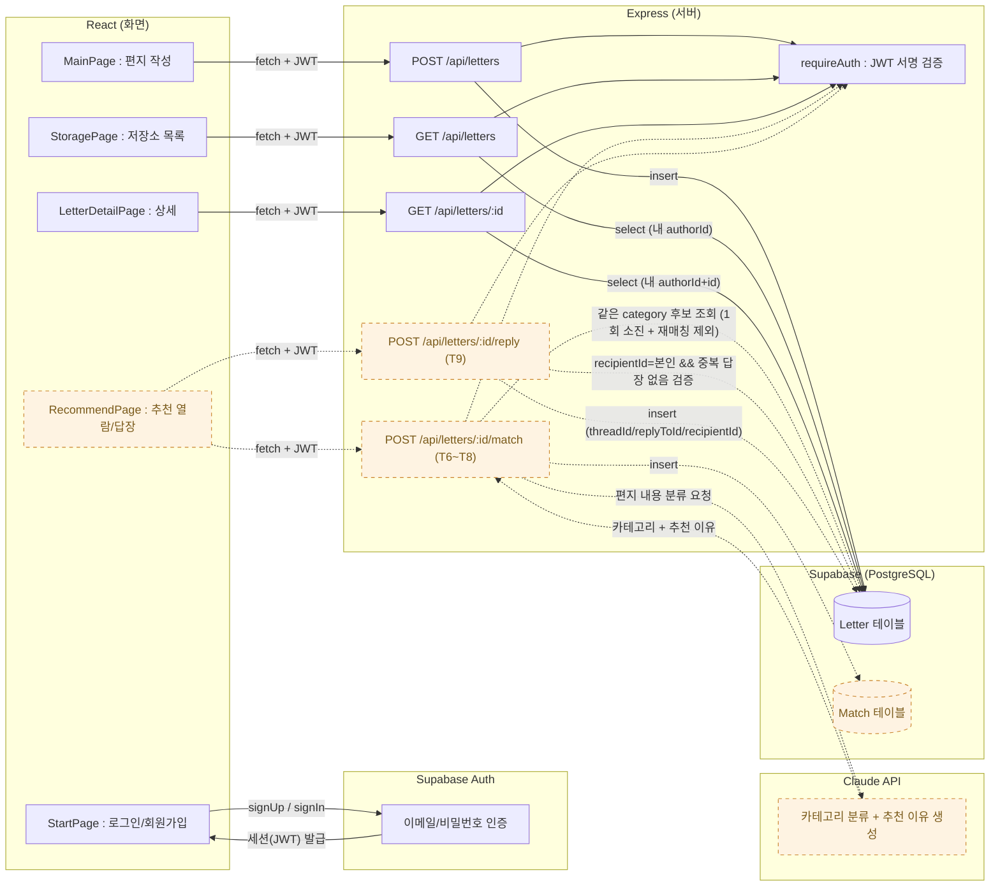

# hub

## Bridge 서비스 소개

글을 통해 사람과 연결되는 플랫폼

---

## 아키텍처 · 데이터 흐름

화면 → 인증/서버 → DB 기준. 실선/기본색은 구현 완료, **점선/주황색은 아직 구상 단계(미구현)**.

> 점선(주황) 부분은 설계만 확정되고 아직 구현 전입니다. 상세는 `docs/backlog.md`의 D(AI 매칭)·C4(답장 API) 항목과 GitHub 이슈 [T6](https://github.com/bovoZhang/hub/issues/7)·[T7](https://github.com/bovoZhang/hub/issues/8)·[T8](https://github.com/bovoZhang/hub/issues/9)·[T9](https://github.com/bovoZhang/hub/issues/10) 참고.

## 기획 문서

- docs/plan.md
- docs/backlog.md — 주차별 백로그·일정
- [서비스 기획안](https://github.com/bovoZhang/hub/wiki/Bridge%E2%80%90서비스%E2%80%90기획안) — 문제 정의, 사용자 시나리오, 핵심 기능, 진행 계획
- [GitHub Issues](https://github.com/bovoZhang/hub/issues) — 작업 단위(Task) 진행 현황

---

## 기술 스택

- React 19 + Vite 8
- Express

### 사용 예정 라이브러리

| 기능/영역 | 라이브러리 | 용도 |
|---|---|---|
| DB 연결/쿼리 | Prisma | Supabase(PostgreSQL)와 통신하는 ORM. 편지/모음소/저장소 테이블 스키마 관리 |
| DB 종류 | Supabase (PostgreSQL) | 실제 데이터 저장소, 로컬/배포 동일 인스턴스 |
| 요청 검증 | zod | 편지 작성 API 요청 바디 검증 (글자 수, 필수 필드 등) |
| 로그인/인증 | @supabase/supabase-js (Supabase Auth) | 이메일/비밀번호 로그인, 세션(JWT) 관리 — 직접 해싱/토큰 발급 불필요 |
| AI 추천 연결 | @anthropic-ai/sdk | 편지 분류 + 추천 이유 생성 (24시간 후 매칭 로직) |
| 타이머/스케줄링 | node-cron (선택) | 24시간 후 추천 도착, 8시간 후 답장 전달 체크 |
| 프론트-백엔드 통신 | fetch 또는 axios | HTTP 요청 |
| API 상태 관리 | @tanstack/react-query | 로딩/에러/캐싱 상태 관리 |
| 날짜/카운트다운 | dayjs | 24시간·8시간 카운트다운, 상대 시간 표시 |
| 편지 개봉 애니메이션 | motion (구 framer-motion) | 봉투 열림 → 종이 펼침 연출 |
| 프론트 테스트 | Vitest + React Testing Library | 컴포넌트/통합 테스트 |
| 백엔드 테스트 | Supertest | API 엔드포인트 테스트 |
| E2E 테스트 (선택) | Playwright | 전체 사용자 흐름 검증 |
