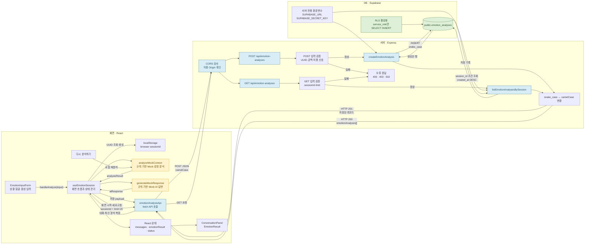
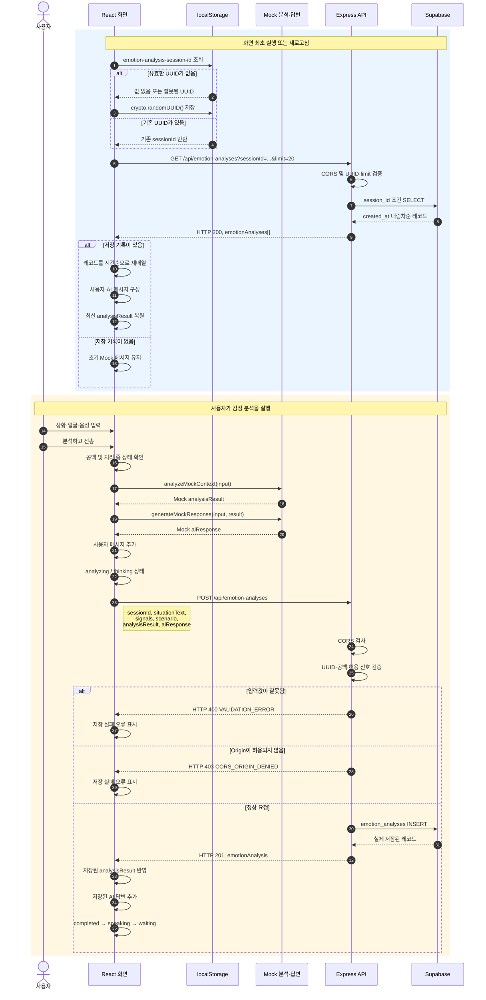

# 관계형 AI

관계형 AI는 사용자가 자신의 상황과 얼굴·목소리 신호를 입력하면 감정 가능성을 분석하고 공감형 반응이나 후속 질문을 제공하는 웹서비스입니다.

현재 감정 분석과 응답 생성에는 실제 생성형 AI API가 아닌 규칙 기반 Mock 로직을 사용합니다.


## 해결하려는 문제

사용자는 감정을 표현할 때 공감과 다음 단계를 원하는데, 기존 시스템은 단순한 자동 응답이나 챗봇형 인터페이스로 감정적 연결을 제공하지 못합니다.

## 핵심 사용자 시나리오

1. 사용자가 상황을 입력한다.
2. 사용자가 현재 감정을 선택한다.
3. React 앱이 Express API에 요청을 보낸다.
4. Express 서버가 입력값을 검증한다.
5. 규칙 기반 Mock AI가 공감형 응답과 후속 질문을 생성한다.
6. Supabase에 사용자 입력과 AI 응답을 저장한다.
7. 저장된 결과가 React 대화 화면에 표시된다.

## 핵심 수직 슬라이스

* 사용자 상황 입력과 얼굴·목소리 신호 선택
* 규칙 기반 감정 점수, 가능한 상태와 판단 근거 생성
* React에서 Express API 호출
* Express에서 입력값 검증
* 감정 결과에 맞는 Mock 공감 응답과 후속 질문 생성
* Supabase에 사용자 입력과 AI 응답 저장
* 저장 결과 반환
* React 대화 화면 갱신과 브라우저 세션별 기록 복원
* 로딩·오류·중복 요청 방지
* 새 대화 메시지를 알리는 접근성 대화 로그

## 기술 스택

* Frontend: React 18, Vite 8
* Backend: Express 5
* Database: Supabase
* Supabase SDK: @supabase/supabase-js
* HTTP 요청: fetch
* React 상태 관리: Hooks
* Test: Vitest, Testing Library
* AI 응답: 규칙 기반 Mock 분석 및 응답

## 실행 방법

의존성을 설치하고 프런트엔드와 API 서버를 각각 실행합니다.

```bash
npm install
npm run dev
```

프런트엔드 기본 주소는 `http://127.0.0.1:5173`입니다.

API와 Supabase 저장 기능을 함께 사용하려면 별도 터미널에서 서버를 실행합니다.

```bash
npm run server
```

Supabase 환경변수와 스키마 설정은 [Supabase 설정 문서](docs/supabase-setup.md)를 따릅니다. API 주소가 기본값과 다르면 공개 환경변수 `VITE_API_BASE_URL`을 설정합니다. Supabase 비밀키에는 `VITE_` 접두사를 사용하지 않습니다.

## 주요 기능

* 최대 500자의 상황 입력
* 얼굴 표정과 목소리 어조 신호 선택
* 평소·긴장·피곤 시나리오 시뮬레이션
* 감정 점수 합계 100 정규화
* 가능한 감정 상태와 판단 근거 표시
* 분석 결과에 맞는 공감형 Mock 응답
* 브라우저 UUID 기반 Supabase 저장과 최근 20개 기록 복원
* 분석·저장 상태와 오류 표시
* 새 메시지 자동 스크롤
* `role="log"`와 `aria-live="polite"`를 이용한 대화 접근성

## TDD 적용

`ConversationPanel`의 새 메시지 접근성 기능을 작은 TDD 단위로 구현했습니다.

1. 대화 영역을 `role="log"`로 찾는 테스트를 먼저 작성했습니다.
2. 기존 구현에 해당 역할이 없어 테스트가 실패하는 red를 확인했습니다.
3. `role`, `aria-live`, `aria-relevant` 속성만 추가했습니다.
4. focused test와 전체 Vitest가 통과하는 green을 확인했습니다.

관련 파일:

* [ConversationPanel 테스트](frontend/src/features/conversation/components/ConversationPanel.test.jsx)
* [ConversationPanel 구현](frontend/src/features/conversation/components/ConversationPanel.jsx)

## Agent와 Skill

### 관계형 AI 기능 계획 Agent

[관계형 AI 기능 계획 Agent](agents/relationship-ai-feature-planner.md)는 요구사항을 최대 25분 단위로 나누고 P0·P1·P2 우선순위, 선행 작업과 완료 기준을 정합니다.

### 테스트 검증 Skill

[test-verification Skill](skills/test-verification/SKILL.md)은 다음 절차를 반복 가능하게 정의합니다.

```text
요구사항 확인
→ 실패 테스트 작성
→ red 원인 확인
→ 최소 구현
→ focused test green 확인
→ 전체 회귀 검증
→ 결과 보고
```

### 기능 검증 Agent

[기능 검증 Agent](agents/agents/feature-verifier.md)는 요구사항, 변경 코드, 테스트와 빌드 결과를 근거로 기능을 `PASS`, `FAIL`, `BLOCKED` 중 하나로 판정합니다.

이번 `ConversationPanel` 접근성 기능의 검증 결과는 `PASS`입니다.

## 테스트와 검증

```bash
# 전체 Vitest
npm run test:run

# 규칙 기반 감정 분석 검증
npm run test:analysis

# Express API와 Supabase 통합 검증
npm run test:api

# Supabase 연결 검증
npm run test:supabase

# 프로덕션 빌드
npm run build
```

최근 검증 결과:

* Vitest: 테스트 파일 2개, 테스트 2개 통과
* Mock 감정 분석: 대표 시나리오 4개 통과
* Vite 프로덕션 빌드 성공
* `test-verification` Skill 공식 구조 검증 통과
* API·Supabase 검증은 실행 중인 서버와 환경변수가 필요

## Showcase

프로젝트 소개 정보와 대표 이미지는 `showcase/`에 있습니다.

* [Showcase 정보](showcase/showcase.json)
* [대표 이미지](showcase/thumbnail.webp)
* 화면 이미지: [평소](showcase/screenshots/home2.webp), [긴장](showcase/screenshots/home3.webp), [피곤](showcase/screenshots/home1.webp)

## 프로젝트 폴더 구조

```
hub/
├─ agents/
│  ├─ relationship-ai-feature-planner.md
│  └─ agents/
│     └─ feature-verifier.md
│
├─ backend/
│  ├─ config/
│  │  └─ supabaseClient.js
│  ├─ features/
│  │  └─ emotion-analyses/
│  │     ├─ emotionAnalysisMapper.js
│  │     ├─ emotionAnalysisRoutes.js
│  │     └─ emotionAnalysisValidation.js
│  ├─ repositories/
│  │  └─ emotionAnalysisRepository.js
│  └─ supabase-schema.sql
│
├─ docs/
│  ├─ codex-prompt.md
│  ├─ emotion-analysis-api.md
│  ├─ github-issues.md
│  ├─ mvp-scope.md
│  ├─ project-brief.md
│  ├─ supabase-setup.md
│  └─ test-plan.md
│
├─ frontend/
│  └─ src/
│     ├─ features/
│     │  ├─ conversation/
│     │  │  ├─ components/
│     │  │  │  ├─ ConversationPanel.jsx
│     │  │  │  └─ ConversationPanel.test.jsx
│     │  │  ├─ data/
│     │  │  │  └─ mockMessages.js
│     │  │  ├─ utils/
│     │  │  │  └─ generateMockResponse.js
│     │  │  └─ index.js
│     │  │
│     │  ├─ emotion-analysis/
│     │  │  ├─ components/
│     │  │  │  └─ AnalysisStatus.jsx
│     │  │  ├─ data/
│     │  │  │  └─ scenarioAnalysisPresets.js
│     │  │  ├─ utils/
│     │  │  │  ├─ analyzeMockContext.js
│     │  │  │  ├─ analyzeMockEmotion.js
│     │  │  │  └─ normalizeEmotionScores.js
│     │  │  └─ index.js
│     │  │
│     │  ├─ emotion-input/
│     │  │  ├─ components/
│     │  │  │  └─ EmotionInputForm.jsx
│     │  │  └─ index.js
│     │  │
│     │  ├─ emotion-result/
│     │  │  ├─ components/
│     │  │  │  ├─ AnalysisDisclaimer.jsx
│     │  │  │  ├─ EmotionResult.jsx
│     │  │  │  ├─ EmotionScoreBar.jsx
│     │  │  │  └─ EvidenceList.jsx
│     │  │  └─ index.js
│     │  │
│     │  ├─ emotion-session/
│     │  │  ├─ api/
│     │  │  │  └─ emotionAnalysisApi.js
│     │  │  ├─ hooks/
│     │  │  │  └─ useEmotionSession.js
│     │  │  ├─ utils/
│     │  │  │  └─ browserSession.js
│     │  │  └─ index.js
│     │  │
│     │  ├─ face-signal/
│     │  │  ├─ components/
│     │  │  │  └─ FaceSignalSelector.jsx
│     │  │  ├─ data/
│     │  │  │  └─ faceOptions.js
│     │  │  └─ index.js
│     │  │
│     │  ├─ observation-status/
│     │  │  ├─ components/
│     │  │  │  └─ ObservationStatus.jsx
│     │  │  └─ index.js
│     │  │
│     │  ├─ scenario-simulation/
│     │  │  ├─ components/
│     │  │  │  ├─ ScenarioSelector.jsx
│     │  │  │  └─ ScenarioSelector.test.jsx
│     │  │  ├─ data/
│     │  │  │  └─ scenarioPresets.js
│     │  │  └─ index.js
│     │  │
│     │  ├─ situation-input/
│     │  │  ├─ components/
│     │  │  │  └─ SituationInput.jsx
│     │  │  └─ index.js
│     │  │
│     │  └─ voice-signal/
│     │     ├─ components/
│     │     │  └─ VoiceSignalSelector.jsx
│     │     ├─ data/
│     │     │  └─ voiceOptions.js
│     │     └─ index.js
│     │
│     ├─ shared/
│     │  ├─ components/
│     │  │  └─ ServiceHeader.jsx
│     │  └─ constants/
│     │     └─ emotionDefinitions.js
│     │
│     ├─ test/
│     │  └─ setup.js
│     ├─ App.jsx
│     ├─ index.css
│     └─ index.jsx
│
├─ scripts/
│  ├─ verify-emotion-analysis.mjs
│  ├─ verify-emotion-analysis-api.mjs
│  └─ verify-supabase-connection.mjs
│
├─ showcase/
│  ├─ screenshots/
│  │  ├─ home1.webp
│  │  ├─ home2.webp
│  │  └─ home3.webp
│  ├─ showcase.json
│  └─ thumbnail.webp
│
├─ skills/
│  └─ test-verification/
│     ├─ agents/
│     │  └─ openai.yaml
│     └─ SKILL.md
│
├─ .github/
│  └─ pull_request_template.md
├─ AGENTS.md
├─ index.html
├─ package.json
├─ package-lock.json
├─ README.md
├─ server.js
└─ vite.config.js
```

## 문서 링크
* [Mock 데이터 사용 및 화면 표시 현황](https://github.com/studentnoname/hub/wiki/Mock-%EB%8D%B0%EC%9D%B4%ED%84%B0-%EC%82%AC%EC%9A%A9-%EB%B0%8F-%ED%99%94%EB%A9%B4-%ED%91%9C%EC%8B%9C-%ED%98%84%ED%99%A9)

## 현재 개발 상태
* [개발일지 - 1] (https://github.com/studentnoname/hub/wiki/%5B%EA%B0%9C%EB%B0%9C%EC%9D%BC%EC%A7%80-%E2%80%90-1-%5D-%E2%80%90-2026%EB%85%84-7%EC%9B%94-21%EC%9D%BC-(%ED%98%84%EC%9E%AC-%EC%83%81%ED%99%A9-%EC%9A%94%EC%95%BD))

## 전체 데이터의 흐름


## 분석 저장과 새로고침의 복원 순서


