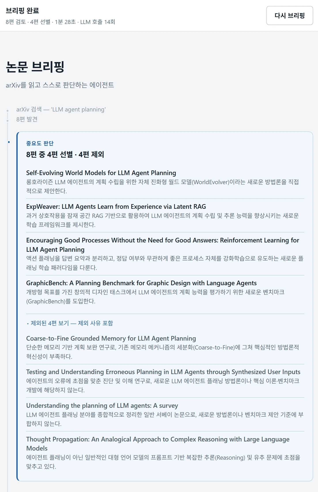

# PAPERHUB

**arXiv를 읽고 스스로 판단하는 에이전트.**

주제를 입력하면 LLM 에이전트가 arXiv 논문을 **스스로 골라 읽고 요약**하는 웹 서비스.
결과만 던지지 않는다. **무엇을 왜 안 읽어도 되는지**까지 화면에 남긴다.

[**▶ 서비스 바로가기**](https://hub-1rd5.onrender.com) · [**시연 영상 (5분)**](https://youtu.be/d7cMpYSfxcI) · [소스](https://github.com/leekwanhak/hub)

> 무료 인스턴스라 15분 이상 접속이 없으면 잠듭니다. **첫 화면이 뜨기까지 50초 정도** 걸릴 수 있습니다.



---

## 무엇이 다른가

요약 서비스는 이미 많다. 이 서비스가 다른 건 **에이전트의 판단 과정을 감추지 않는다**는 점이다.

타겟은 AI 연구자·개발자다. 연구자는 검증할 수 없는 것을 믿지 않는다.
그래서 판단 과정은 장식이 아니라 **신뢰의 근거**이고, 다음 넷은 어떤 이유로도 화면에서 빼지 않는다.

| | 무엇을 증명하는가 |
|---|---|
| **제외된 N편 + 사유** | "놓치지 않기"가 말뿐이 아님을 증명한다. 고른 것만 보여주면 무엇을 흘렸는지 알 수 없다 |
| **`본문까지 읽음` / `초록으로 충분` 배지** | 에이전트가 도구를 골랐다는 사실이 눈에 보이는 유일한 지점 |
| **재시도 로그** | 자기 요약을 스스로 검증해 되돌렸다는 증거. 실제 실행에서 **환각 문장을 잡아내고 다시 쓴 적이 있다** |
| **트렌드의 논문 칩** | 흐름 주장을 클릭하면 근거가 된 카드로 이동한다. 주장에는 근거가 붙어야 한다 |

요약은 **`기여 · 방법 · 결과` 3줄 고정**이다. 자유 문단이 아니다 —
여러 논문을 세로로 훑을 때 같은 위치에 같은 정보가 있어야 눈으로 비교된다.

## 어떻게 동작하나

에이전트는 5단계를 돈다. 각 단계는 전부 같은 패턴이다 —
**LLM에게 묻고 → JSON으로 받고 → 코드가 `if`로 분기한다.** 마법은 없다.

```
① 판단 judge           수집한 논문 중 무엇이 중요한가       → 고른 이유 · 제외 사유
② 도구 선택 select_tool 초록으로 충분한가, 본문이 필요한가   → 배지
③ 요약 summarize        기여 · 방법 · 결과 3줄
④ 자기 검증 verify      내가 쓴 요약이 부실한가             → 부실하면 ③으로 (최대 2회)
⑤ 트렌드 추론 trend     논문들 사이의 연결점                → 흐름 + 빈 구멍
```

진행 과정은 **SSE로 실시간 스트리밍**된다. 기다렸다 한 번에 받는 화면이 아니라,
에이전트가 지금 무엇을 하는지가 단일 세로 타임라인에 하나씩 쌓인다.

`app/agent.py`의 `run_agent()`는 **제너레이터**다. 단계마다 결과를 `yield`하고,
`app/main.py`는 그것을 `data: {json}\n\n`으로 감싸기만 한다.
덕분에 에이전트 코드를 한 줄도 고치지 않고 터미널 실행 ↔ 웹 스트리밍을 오갈 수 있다.

이벤트 11종의 필드는 [`docs/spec/sse-contract.md`](docs/spec/sse-contract.md)에 고정돼 있다.
**백엔드와 프론트를 잇는 유일한 인터페이스**이고, 코드보다 먼저 고친다.

### 실패는 상태가 아니라 사건이다

4편 중 3편만 성공한 **부분 실패**, 검색은 됐지만 관련 논문이 0편인 **결과 없음**, **전체 실패** —
셋을 전부 다르게 처리한다. 하나라도 건졌으면 화면을 에러로 덮지 않는다.

LLM은 반드시 JSON 형식을 어긴다(코드펜스로 감싸기, 앞뒤 설명 붙이기).
그래서 파싱은 항상 실패를 가정하고 `ask_llm_json(prompt, fallback)`으로 받는다.
**fallback은 언제나 비용이 덜 드는 쪽**이다 — 2단계는 `본문 불필요`, 4단계는 `요약 양호`.
판단이 안 될 때 본문을 받거나 재시도하면 돈과 시간이 샌다.

## 실측 (배포본, `limit=8`)

| | |
|---|---|
| 8편 수집 → **4편 선별 · 4편 제외** | 총 **87.8초** |
| **LLM 호출 14회** | 예상(20~28회)의 절반 |

judge가 8편을 **한 번의 호출로** 판단하고, 요약은 선별된 4편만 돈다.
그래서 수집량을 늘려도 비용이 선형으로 늘지 않는다.

## 로컬에서 돌리기

웹은 마지막에 붙인다. 에이전트와 웹을 동시에 만들면 오류가 나도 어디가 원인인지 모른다.

```bash
pip install -r requirements.txt
cp .env.example .env          # GEMINI_API_KEY 를 채운다

# 도구 하나씩 — 웹 없이, 에이전트 없이
python -m app.tools --check arxiv --topic "LLM agent planning"
python -m app.tools --check llm

# 에이전트 루프 — 웹 없이
python -m app.agent --topic "LLM agent planning" --limit 3

# 서버 + SSE — 브라우저 없이
uvicorn app.main:app --reload --port 8000
curl -N "http://localhost:8000/api/brief/stream?topic=LLM+agent+planning"

pytest
```

> `--limit 3` 이하를 습관으로. 논문 1편당 LLM을 여러 번 부르기 때문에
> 무료 티어 하루 한도(RPD 500)가 오전에 차버린다.

프론트는 백엔드 없이도 완성할 수 있다. `?mock=` 에 시나리오 이름을 넣으면 가짜 이벤트가 재생된다 —
`normal`(=`1`) · `partial`(부분 실패) · `barren`(트렌드 없음) · `empty` · `error` 5종.

## 구조

```
app/        main.py(SSE 래핑만) → agent.py(5단계 루프) → tools.py → prompt_loader.py
prompts/    judge · select_tool · summarize · verify · trend  ← 사실상 소스코드
web/        빌드 없음. index.html · app.js · style.css · mock.js
docs/spec/  sse-contract.md — 백엔드↔프론트 계약
```

**의존은 한 방향이다.** `tools.py`는 에이전트를 모르고, `agent.py`는 웹을 모른다.
역방향 import는 금지다. 이 규칙 덕분에 웹 없이 에이전트를 터미널에서 완성할 수 있었다.

**프롬프트는 `.py`에 문자열로 박지 않는다.** 에이전트의 판단 기준은 이 프로젝트의 사실상 소스코드다.
`prompts/*.md`에서 관리하고 코드는 로드만 하며, 무엇을 왜 바꿨는지는
[`prompts/CHANGELOG.md`](prompts/CHANGELOG.md)에 남는다.

## 기술 스택

Python 3.11 · FastAPI · **SSE** · Gemini Flash · 바닐라 HTML/CSS/JS(**빌드 없음**) · JSON 파일(**DB 없음**) · Render

프레임워크도 DB도 쓰지 않았다. 4주짜리 프로젝트에서 빌드 설정과 상태관리를 배우는 건
이 서비스가 증명하려는 것과 상관이 없다.

## 문서

| 문서 | 내용 |
|---|---|
| [docs/plan.md](docs/plan.md) | 전체 기획 — 무엇을 왜 만드는가 |
| [docs/spec/sse-contract.md](docs/spec/sse-contract.md) | SSE 이벤트 계약 |
| [prompts/CHANGELOG.md](prompts/CHANGELOG.md) | 프롬프트 변경 기록 (무엇을 · 왜 · 결과) |
| [docs/spec/checklist.md](docs/spec/checklist.md) | 작업 분해 체크리스트 |
| [CLAUDE.md](CLAUDE.md) | AI와 함께 개발하기 위한 규칙 — 금지 사항과 아키텍처 불변식 |

---

<sub>Naver Connect 부스트캠프 AI Agent Challenge · 2026</sub>
