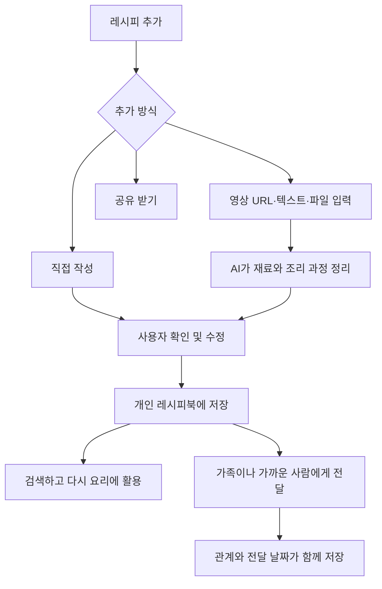

# 나만의 레시피북 서비스
직접 알고 있는 레시피와 인터넷에서 발견한 레시피를 한곳에 모으고, AI가 실제로 다시 요리하기 좋은 형태로 정리해 주는 개인 레시피북 서비스입니다.

## 문제 정의
사람들은 자신이 알고 있는 요리법, 인터넷에서 발견한 레시피, 가족에게 전해 들은 레시피를 여러 장소에 흩어진 형태로 보관합니다. 이러한 방식은 다시 찾아 활용하기 어렵고, 영상이나 자유로운 문장으로 남아 있는 요리법은 실제 조리에 사용하기 좋은 형태로 정리하기도 번거롭습니다. 

특히 부모님이나 할머니에게 전해 받은 마더 레시피는 단순한 조리 정보가 아니라 사람과 기억이 담긴 기록이지만, 일반적인 메모나 링크 공유 방식에서는 누가 전해준 레시피인지에 대한 연결과 의미가 쉽게 사라집니다.

## 핵심 기능
1. 레시피 수집 및 정리
2. 관계 중심 레시피 공유

## 인증

Firebase Authentication을 사용한다. 초기 MVP에서는 Google 로그인만 제공하고, 핵심 레시피 흐름이 완성된 뒤 이메일/비밀번호와 카카오 로그인을 추가한다. Firebase는 인증에만 사용하며, 사용자와 레시피 데이터는 Express와 PostgreSQL에서 관리한다.

## 핵심 서비스 흐름

