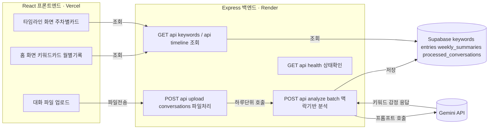

# LifeLog

**그때의 나를, 있는 그대로.**

Claude(또는 ChatGPT) 대화 기록을 분석해 고민과 감정의 흐름을 타임라인으로 보여주는 회고 웹 서비스입니다.

성장 평가 앱이 아닙니다. 점수, 뱃지, 달성/미달성 없이, 과거부터 현재까지 이어진 나에 관한 기록을 보면서 자연스럽게 미래를 그려나갈 수 있도록 하는 것이 목표입니다.

## 링크

| 항목 | 주소 |
|---|---|
| 배포된 서비스 | https://hub-mu-puce.vercel.app/ |
| 백엔드 상태 확인 | https://lifelog-backend-gryt.onrender.com/api/health |
| 데모 발표 자료 | [Google Slides](https://docs.google.com/presentation/d/17vEP-xWjFfviHcAl_nzCyjVUmIHb9qRV/edit?usp=sharing&ouid=100790024314221882298&rtpof=true&sd=true) |
| 위키 | https://github.com/dabinnida/hub/wiki |

## 문제의식

기록의 중요성은 커지고 있지만, 많은 사용자는 일기를 꾸준히 작성하지 못합니다. 반면 AI와의 대화에는 고민, 목표, 계획, 성취 등 개인의 삶이 이미 자연스럽게 기록되어 있습니다.

이 대화 기록을 분석해, 평가하지 않고 그때의 나를 담백하게 되돌아볼 수 있게 하는 것이 이 서비스의 목표입니다.

## 주요 기능

- **홈 화면** — 이번 달 AI 한 줄 요약, 자주 언급된 키워드 카드(언급 횟수 · 최근 시점 표시), 월별 기록 진입
- **타임라인 화면** — 키워드별로 주차마다 있었던 일, 그 시기에 집중했던 것, 우세 감정 2가지와 비율 확인
- **대화 파일 업로드** — Claude 대화 내보내기 파일을 올리면 AI가 자동으로 분석해 키워드/감정을 추출하고 화면에 반영

## 기술 스택

| 영역 | 사용 기술 |
|---|---|
| Frontend | React, TypeScript, Vite |
| Backend | Node.js, Express |
| Database | Supabase (Postgres) |
| AI | Gemini API |
| 배포 | Vercel (Frontend), Render (Backend) |

## 아키텍처



## 데이터 처리 파이프라인

```text
Claude 대화 내보내기 파일 (conversations.json)
↓
파싱 (sender=human 메시지만 추출)
↓
중복 확인 (processed_conversations 테이블의 uuid 대조)
↓
날짜별 그룹핑
↓
하루 단위 배치 분석 (Gemini API)
↓
정보성 질문 필터링 · 맥락 단위 묶음 · 감정 충돌 시 분리
↓
keywords / entries 테이블 저장
↓
주간 감정 집계 + LLM 요약 → weekly_summaries
↓
화면 반영 (홈 키워드 카드, 타임라인 주차별 카드)
```

## 기술적 특징

- **맥락 기반 배치 분석** — 문장을 하나씩 따로 분석하면 이어지는 이야기가 끊기는 문제가 있어, 하루 단위로 여러 메시지를 묶어 한 번에 분석
- **감정 정보 손실 방지** — 같은 주제여도 감정이 상반되면(예: 걱정 vs 기대) 분리 저장해 어느 한쪽 감정이 묻히지 않도록 처리
- **중복 업로드 방지** — 대화 uuid를 기록해, 겹치는 기간을 다시 업로드해도 안전하게 처리
- **정보성 질문 필터링** — 날씨, 코드 문법, 레시피 등 개인의 고민·감정과 무관한 질문은 자동으로 제외
- **카테고리 일관성 유지** — 프롬프트에서 기존 키워드 목록을 참고하게 해, 표현이 매번 달라지지 않으면서도 새 주제는 새 카테고리로 생성

## 폴더 구조

```
hub/
├── lifelog/       # React 프론트엔드
│   └── src/components/RetrospectApp.tsx   # 메인 컴포넌트
├── llm-test/      # Express 백엔드 (API, LLM 연동, DB 로직)
│   ├── server.js                          # API 엔드포인트
│   ├── parseLLMResponse.js                # LLM 응답 파싱
│   ├── aggregateWeek.js                   # 주간 감정 집계
│   └── generateWeeklySummaryAll.js        # 주간 요약 생성
└── showcase/      # 프로젝트 쇼케이스 (showcase.json, 스크린샷)
```

## DB 스키마

| 테이블 | 역할 |
|---|---|
| `keywords` | 고민 카테고리 (취업고민, 스트레스, 건강관리 등) |
| `entries` | 대화 문장 단위 기록 (원문, 키워드, 감정, 날짜) |
| `weekly_summaries` | 키워드별 주간 집계 (감정 2가지 + 비율, 제목, 설명, 집중했던 것) |
| `processed_conversations` | 처리 완료된 대화 uuid (중복 업로드 방지) |

## 개발 과정에서의 AI 활용

React 화면 디자인부터 Express API, LLM 프롬프트 설계, 배포까지 Claude와 단계별로 대화하며 개발했습니다.

반복한 작업 루프:
1. 설계 결정마다 트레이드오프를 먼저 비교
2. 코드 작성 및 적용
3. 로컬에서 실행 결과 확인 (우연한 성공과 재현되는 성공을 구분)
4. 문제 발생 시 화면 · 서버 · DB 중 어디서 실패했는지 나눠서 원인 추적

## 아직 안 된 것

- `monthly_records` — `weekly_summaries`와 동일한 로직으로 추가 예정, 현재 홈 화면 "월별 기록" 모달은 더미 데이터
- 감정 표현 UI — 이모티콘을 고양이 모양으로, 기분에 따라 색이 달라지도록 수정 예정
