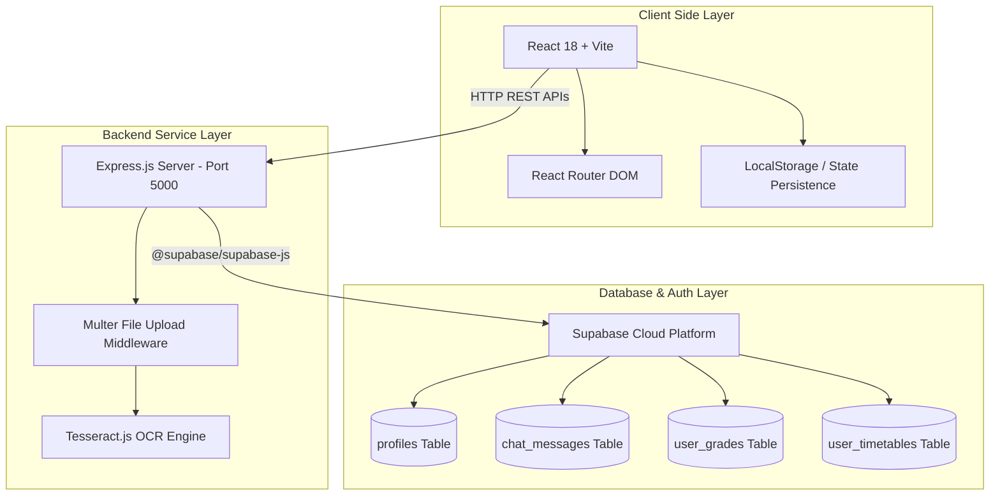
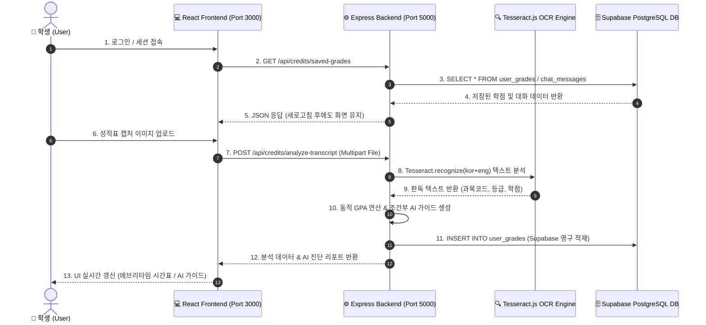

# 🎓 GNU 전공/교양 수강신청 AI 네비게이터

경상국립대학교(GNU) 학생들을 위한 맞춤형 인공지능 학업 및 수강신청 네비게이터 서비스입니다. 학생의 이수 구분별 취득 학점을 정밀 분석하고 졸업 필수 요건을 실시간으로 진단하여 맞춤형 시간표 및 교과목 추천을 제공합니다.

---

## 🔗 프로젝트 문서 바로가기
* [🎯 GNU 전공/교양 수강신청 AI 네비게이터 기획서 (Notion)](https://excessive-noise-9a0.notion.site/GNU-AI-428495d4a4b9468ca520ff6e981ec797?source=copy_link)

---

## 🏗️ 시스템 아키텍처 및 데이터 흐름 다이어그램 (Mermaid)

### 1. 컴포넌트 구성 아키텍처 (System Component Architecture)



---

### 2. 수직슬라이스 엔드투엔드(E2E) 데이터 흐름 (Data Flow Sequence)



---

## 📅 주간 개발 미션 & 해결 가이드

### 1. 데이터 연동 (Supabase DB + E2E 수직슬라이스)
* **스키마 설계 (`schema.sql`)**: `profiles`(회원 학적), `chat_messages`(AI 대화이력), `user_grades`(학점), `user_timetables`(시간표) 테이블 구축.
* **새로고침 데이터 유지**: OCR 판독 결과 및 AI 어드바이저 대화 이력을 Supabase DB 및 로컬 스토리지와 연동하여 브라우저 새로고침(`F5`) 후에도 학점/가이드가 영구 유지되도록 구현.

### 2. 이미지 OCR 성적 판독 및 동적 GPA 분석
* **Tesseract.js 연동**: 경상국립대학교 통합포털 성적표 스크린샷 내 학수번호(8자리), 분반(3자리), 과목명, 취득학점, 등급(A+~F, P)을 정규식(Regex)으로 자동 매핑.
* **동적 GPA 및 AI 가이드**: 이수 학점 평균을 실시간 연산하고 C+ 이하 과목 수유 여부에 따라 재수강 권장 메시지를 동적으로 생성.

---

## 🚀 시작하기 (How to Run)

### 1. 로컬 환경 실행 (개발 서버)
```bash
# 백엔드 서버 구동 (Port 5000)
cd backend
npm install
npm start

# 프론트엔드 서버 구동 (Port 3000)
cd ../frontend
npm install
npm run dev
```

### 2. 온라인 배포 접속
👉 **[공식 Vercel 서비스 접속 주소](https://hub-ms02.vercel.app/)**

---

## 📂 폴더 구조 (Project Structure)
```text
gnu-course-navigator/
├── backend/
│   ├── src/
│   │   ├── app.js               # Express 메인 API 서버 (OCR + Persistence)
│   │   ├── server.js            # Node HTTP 서버 엔트리 포인트
│   │   └── supabase.js          # Supabase Client 객체 초기화 모듈
│   ├── uploads/                 # 성적표 업로드 임시 디렉터리
│   └── package.json
├── frontend/
│   ├── src/
│   │   ├── components/
│   │   │   ├── Login.jsx        # 로그인 및 회원가입 제어 컴포넌트
│   │   │   ├── Portal.jsx       # 서비스 메인 허브 및 AI 어드바이저 대화창
│   │   │   ├── TimetableGenerator.jsx # 에브리타임 스타일 시간표 수강신청 시뮬레이터
│   │   │   └── CreditAnalytics.jsx   # OCR 성적 분석 및 동적 GPA 가이드 포털
│   │   ├── App.jsx              # 전체 라우팅 및 사용자 세션 제어
│   │   └── index.css            # 메인 디자인 시스템 (Glassmorphism & Grid)
├── showcase/                    # AI Agent Challenge 공식 쇼케이스 설정 폴더
│   ├── showcase.json            # 쇼케이스 메타데이터 규격서
│   ├── thumbnail.png            # 포털 썸네일 이미지
│   └── screenshots/
│       └── home.png             # 서비스 시연 스크린샷 이미지
├── schema.sql                   # Supabase PostgreSQL DDL 테이블 설계 스크립트
└── README.md
```
