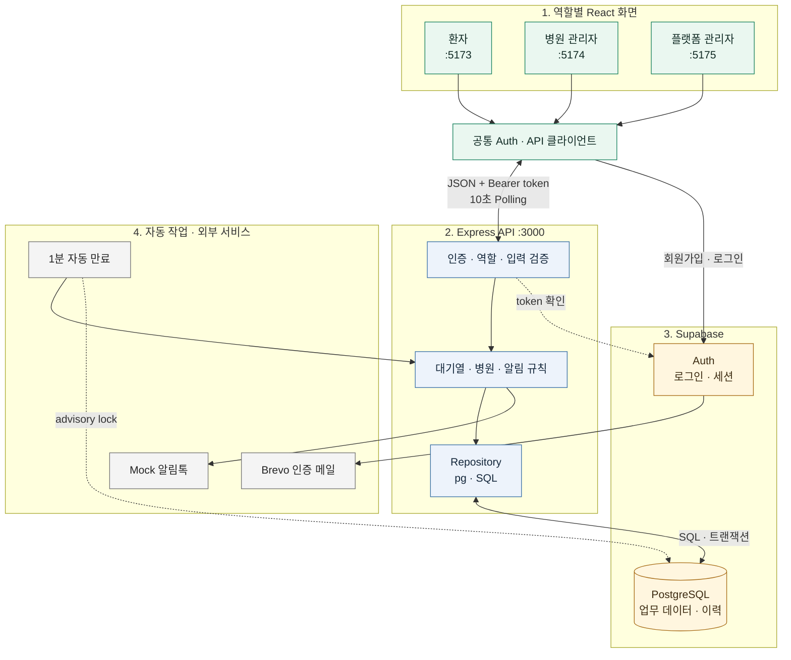

# 바로진료

로그인한 환자가 동네 병원의 당일 진료 대기열에 원격으로 참여하고, 병원이 원격 환자와 현장 환자를 하나의 실제 순서로 관리하는 웹 서비스입니다.

## 해결하려는 문제

동네 병원을 이용하려는 환자는 방문 전에 실제 진료 대기 상황을 확인하거나 순번을 등록하기 어려워, 병원에 먼저 도착한 뒤 장시간 현장에서 기다리는 불편을 겪습니다.

바로진료는 예약 시간을 판매하거나 진료 내용을 관리하지 않습니다. 환자가 병원 밖에서 기다리다가 적절한 시점에 입장하고, 도착 후 병원 데스크에서 정식 접수를 마치도록 돕는 당일 원격 웨이팅 서비스입니다.

## 핵심 흐름

### 원격 환자

```text
회원가입·로그인
→ 병원 검색
→ 가족 단위 원격 웨이팅
→ 6번째 방문 준비 알림
→ 4번째 입장 요청·20분 기한
→ 병원 데스크 방문
→ 직원 도착·접수 처리
→ 현장 대기
→ 진료실 호출·웨이팅 종료
```

### 현장 환자

```text
병원 데스크 정식 접수
→ 직원이 현장 웨이팅 등록
→ 알림톡 mock 상태 링크 수신
→ 웹에서 현재 순서·예상 시간 확인
→ 4번째 진료 임박 알림
→ 호출 또는 취소 시 링크 즉시 무효화
```

## 데이터 흐름과 아키텍처



React는 Supabase를 인증에만 직접 사용하고, 병원과 대기열 데이터는 반드시 Express와 Repository를 거쳐 PostgreSQL에 저장합니다. 상세한 요청 흐름, 주요 테이블과 현재 발견한 보완 지점은 [데이터 흐름과 아키텍처 문서](./docs/architecture.md)에서 확인할 수 있습니다.

## 핵심 기능

### 환자

- 이메일·비밀번호 회원가입, 이메일 확인과 로그인
- 병원명·지역·대표 진료과 검색
- 소아·성인·노인 가족 인원 선택
- 계정당 활성 원격 웨이팅 1건
- 현재 진료 대기 순서와 참고용 예상 시간
- 순서 1회 미루기와 원격 웨이팅 직접 취소
- 카카오 알림톡을 가정한 mock 상태 알림

### 병원 관리자

- 병원 입점 신청과 증빙 이미지 mock 제출
- 병원별 하루 1개 통합 대기열
- 원격·현장 환자의 단일 순서 관리
- 직원의 현장 접수와 원격 환자 도착 처리
- 진료실 호출, 보류, 취소와 순서 조정
- 평균 진료시간, 알림 기준과 원격 접수 한도 설정
- 상태 변경과 mock 알림 발송 이력

## 프로젝트 문서

- [GitHub Project - 개발 대시보드](https://github.com/users/DLSTODAKD/projects/1)
- [2~3주차 주간 계획](./docs/weekly-plan.md)
- [3~4주차 작업 결과](./docs/weekly-summary.md)
- [나의 AI 개발 워크플로우](./docs/ai-workflow.md)
- [기획서](./docs/plan.md)
- [시스템 기능 명세](./docs/feature-spec.md)
- [ERD](./docs/erd.md)
- [데이터 흐름과 아키텍처](./docs/architecture.md)
- [첫 배포 준비](./docs/deployment-prep.md)
- [화면 흐름·IA·와이어프레임](./docs/ux-structure.md)
- [디자인 시스템](./docs/design-system.md)
- [개발 Task 및 백로그](./docs/tasks.md)
- [개발 작업 체크리스트](./docs/checklist.md)
- [개발 계획 수립 Skill](./.agents/skills/plan-development/SKILL.md)
- [TDD 개발 Skill](./.agents/skills/test-driven-development/SKILL.md)
- [기능 검증 Skill](./.agents/skills/verify-feature/SKILL.md)
- [정적 프로토타입 안내](./prototype/README.md)
- [Codex 프로젝트 지침](./AGENTS.md)

## 현재 진행 상태

| 구분 | 상태 |
|---|---|
| 문제 정의·사용자 시나리오 | 완료 |
| 핵심 기능·운영 정책 | 완료 |
| ERD | 완료 |
| User Flow·IA·와이어프레임 문서 | 새 정책 반영 완료 |
| 디자인 시스템 | 새 용어 반영 완료 |
| 기존 정적 프로토타입 | 이전 흐름 기준, 갱신 필요 |
| 기존 디자인 이미지 | 시각적 참고용, 일부 화면 갱신 필요 |
| React·Express 개발 환경 | npm workspaces 기반 구성 완료 |
| 개발 Task·백로그 | 4주 일정과 P0·P1·P2 범위 정리 완료 |
| Supabase·Brevo 연동 | Seoul 개발 DB·Express·Brevo Custom SMTP 연결 완료 |
| 실제 P0 기능 | 환자·직원 통합 대기열, 자동 알림·만료와 상태 동기화 구현 완료 |
| 첫 공개 배포 | 환자 웹(Vercel Hobby)·API(Render Free) 배포 및 Supabase 연결 완료 |

## 공개 데모

- 환자 웹: https://baro-jinryo-patient.vercel.app
- API 상태 확인: https://baro-jinryo-api.onrender.com/api/health/live
- DB 연결 확인: https://baro-jinryo-api.onrender.com/api/health/ready

모든 배포 서비스는 무료 등급만 사용합니다. 병원 관리자 웹과 플랫폼 관리자 웹은 아직
공개하지 않았으므로 환자 웹의 `병원 직원` 링크는 현재 로컬 개발 주소를 가리킵니다.

## 데이터·운영 원칙

- 예약 진료가 아닌 당일 순번 접수만 다룹니다.
- 환자 계정 하나에는 병원과 관계없이 활성 원격 웨이팅을 1건만 허용합니다.
- 가족은 하나의 웨이팅 상태를 공유하지만 실제 환자 수로 순서와 시간을 계산합니다.
- 원격과 현장 환자는 날짜별 같은 통합 대기열에 포함됩니다.
- 예상 시간은 `앞에 남은 실제 환자 수 × 평균 진료시간`입니다.
- 평균 진료시간 기본값은 10분입니다.
- 원격 환자는 기본 6번째에 준비 알림, 4번째에 입장 요청을 받습니다.
- 입장 요청 후 20분 동안 직원의 도착 처리가 없으면 미도착 규칙을 적용합니다.
- 최대 원격 대기 환자는 기본 20명이고 현장 접수에는 한도를 적용하지 않습니다.
- 현장 환자는 상태 링크에서 직접 취소하지 않고 병원 전화번호를 확인합니다.
- 진료실 호출은 진료 완료가 아니라 웨이팅 서비스에서 빠지는 동작입니다.

## Mock과 실제 연동

MVP에서는 Supabase Auth 이메일 확인에 Brevo Custom SMTP를 실제로 연결합니다. 다음 외부 연동은 mock으로 구현합니다.

- 카카오 알림톡 발송과 결과
- 병원 사업자·요양기관 정보 검증
- 사업자등록증·의료기관 개설신고증명서 업로드
- 병원 입점 승인
- `내 주변` 병원 데이터

실제 알림톡·SMS, 국세청·심평원 검증, 증빙 파일 저장소, GPS·지도와 병원 전산 연동은 P2 확장 범위입니다.

## 확정 기술 정책

- 인증: Supabase Auth 이메일·비밀번호, 이메일 확인 필수
- 인증 메일: Brevo 무료 Custom SMTP
- 업무 데이터: React에서 직접 조회하지 않고 Express API만 사용
- DB 접근: `pg` + 직접 SQL + Repository 패턴
- DB 변경: Supabase CLI의 `supabase/migrations` SQL
- 화면 갱신: 활성 화면에서 10초 Polling
- 자동 만료: Express가 1분마다 실행하고 PostgreSQL advisory lock으로 중복 방지
- 시간: `timestamptz` UTC 저장, 병원 운영일은 `Asia/Seoul`
- 배포: 환자 웹과 API는 무료 등급으로 공개, 병원·플랫폼 웹과 운영용 Supabase 분리는 P2

## 정적 프로토타입

현재 [`prototype/`](./prototype/)은 이전 비회원·수동 방문 요청 흐름을 검증한 보관용 HTML/CSS 자료입니다. 현재 개발·테스트·배포 대상이 아니며, 새 정책의 회원가입, 자동 2단계 알림, 현장 상태 링크와 병원 입점 신청은 반영하지 않습니다.

## 개발 환경

Node.js 22.12 이상과 npm 11 이상을 사용합니다. 저장소 루트에서 의존성을 설치하고 웹과 API를 함께 실행합니다.

```bash
npm install
npm run dev
```

- 환자 웹: `http://127.0.0.1:5173`
- 병원 관리자 웹: `http://127.0.0.1:5174`
- 플랫폼 관리자 웹: `http://127.0.0.1:5175`
- API: `http://127.0.0.1:3000`
- API 생존 확인: `http://127.0.0.1:3000/api/health/live`
- DB 준비 확인: `http://127.0.0.1:3000/api/health/ready`

품질 검사는 모두 저장소 루트에서 실행합니다.

```bash
npm run lint
npm run typecheck
npm test
npm run test:integration
npm run build
```

`npm test`는 외부 DB 없이 단위·컴포넌트·API 테스트를 실행합니다.
개발용 Supabase가 필요한 DB 통합 테스트는 `npm run test:integration`으로
분리되어 있습니다. 두 테스트를 한 번에 검증할 때는 `npm run test:all`을
사용합니다.

Supabase CLI는 프로젝트 개발 의존성으로 고정되어 있습니다.

```bash
npm run supabase -- --version
npm run db:migration:new -- <migration_name>
npm run db:reset
```

`supabase start`와 `db:reset`으로 로컬 전체 스택을 실행하려면 Docker 호환 컨테이너 환경이 필요합니다. `db:reset`은 migration 적용 후 `supabase/seed.sql`을 실행하며 로컬 전용 개발 계정과 오늘의 통합 대기열을 만듭니다. 이 로컬 계정을 외부 Supabase 프로젝트에 사용하면 안 됩니다.

연결된 Seoul 개발용 Supabase 프로젝트에는 `.env`의
`DEVELOPMENT_PATIENT_PASSWORD`, `DEVELOPMENT_STAFF_PASSWORD`,
`DEVELOPMENT_PLATFORM_PASSWORD`를 8자 이상으로
설정한 뒤 다음 명령으로 병원·플랫폼 관리자 계정, 승인 병원과 오늘 대기열을
준비합니다. 비밀번호는 저장소나 문서에 기록하지 않습니다.

```bash
npm run db:seed:development -w @baro-jinryo/api
```

전시용 게스트 환자 계정은 `DEVELOPMENT_GUEST_PASSWORD`를 설정한 뒤 다음
명령으로 별도 생성합니다. 이 명령은 기존 병원과 대기열을 변경하지 않습니다.

```bash
npm run db:seed:guest -w @baro-jinryo/api
```

플랫폼 관리자 웹은 Supabase Auth 로그인과 `platform_admin` 권한 검사를 적용하며,
입점 문의와 병원 정보 변경 요청을 검토할 수 있습니다. 승인 병원의 이용 중지·복구
같은 전체 운영 기능은 P2 범위입니다. Seoul 개발용 Supabase 프로젝트 연결과 실제
`pg` Repository 통합 테스트도 구성되어 있습니다.

현재 구조:

```text
hub/
├─ apps/
│  ├─ patient-web/      # 환자용 React 앱
│  ├─ staff-web/        # 병원 관리자용 React 앱
│  ├─ platform-admin-web/ # 플랫폼 관리자 입점 문의·병원 정보 변경 검토
│  └─ api/              # 세 앱이 공유하는 Express API
├─ packages/
│  ├─ shared/           # 공통 타입, Zod 스키마, 대기열 계산
│  ├─ web-shared/       # 웹 앱 공통 컴포넌트와 API·인증 클라이언트 기반
│  └─ design-system/    # 공통 디자인 토큰 CSS
├─ docs/
├─ prototype/           # 초기 기획 검증용 정적 자료(개발·배포 제외)
├─ AGENTS.md
├─ package.json         # npm workspaces
└─ .env.example
```

구성 기술:

- React + Vite + TypeScript
- Express + TypeScript
- Zod
- Supabase Auth + Supabase PostgreSQL
- `pg` + SQL Repository
- Supabase CLI migrations
- npm workspaces
- 루트 ESLint·Prettier 설정
- 환경변수 Zod 검증
- Vitest + Supertest

환경변수 예시는 [`.env.example`](./.env.example)에서 확인합니다. 실제 키와 DB 비밀번호는 `.env`에만 저장하고 커밋하지 않습니다. Brevo SMTP 자격증명은 애플리케이션 환경변수가 아니라 Supabase Auth의 Custom SMTP 설정에 등록합니다.

## 우선순위

- `P0`: 인증, 원격 웨이팅, 현장 접수, 통합 대기열, 자동 mock 알림
- `P1`: mock 병원 검색, 입점 mock 승인, 운영 설정, 예외 처리와 품질
- `P2`: PostgreSQL 기반 병원 검색과 승인 병원 제한, 실제 외부 API, 소셜 로그인, 플랫폼 관리자, 지도, 다중 대기열, Supabase Cron, 전산 연동과 외부 배포
