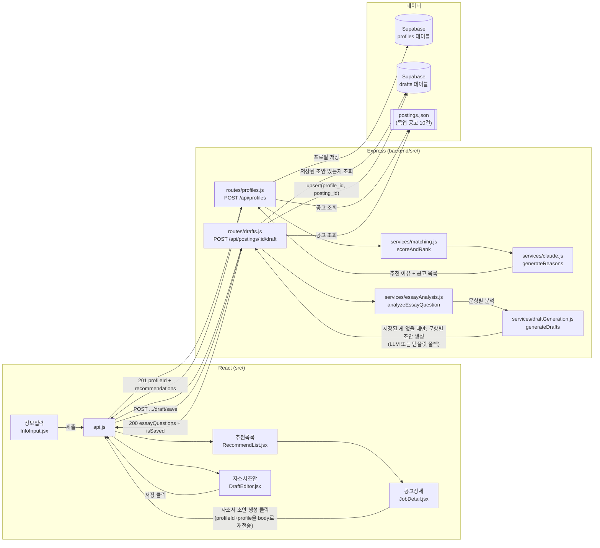
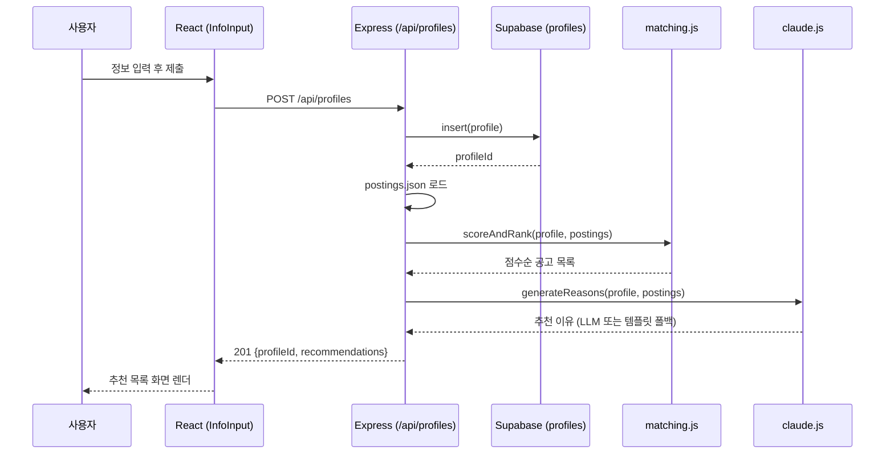
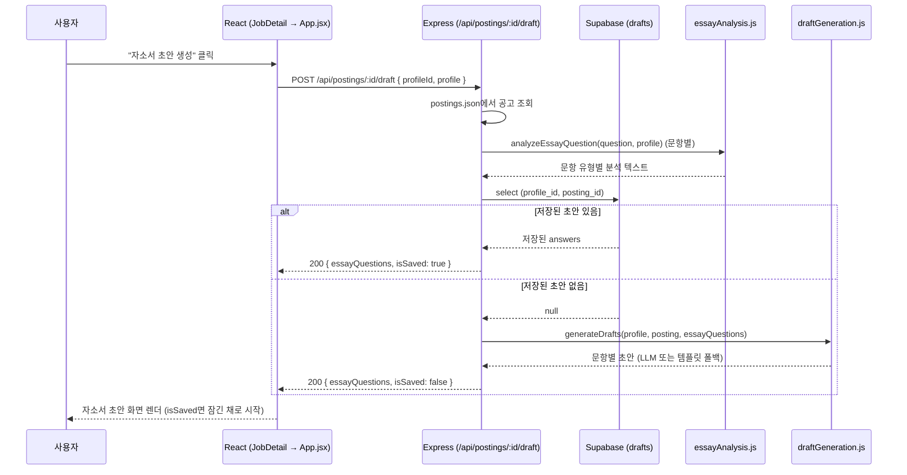
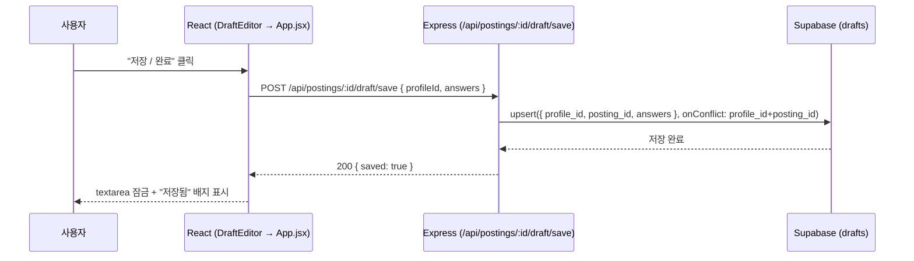

# 진로 에이전트 서비스 (링커리어 공고 추천 & 자소서 초안 Agent)

대학생의 전공·경험 기반 공고 추천 + 자소서 초안 생성 Agent. 기획은 [docs/plan.md](docs/plan.md), 4주 개발 Task는 [docs/checklist.md](docs/checklist.md) 참고.

이번 주 작업 현황은 [GitHub Issues](https://github.com/dohyeon-k/hub/issues)에서 확인할 수 있다(우선순위는 `P0`/`P1`/`P2` 라벨로 표시). 진행 상황은 [GitHub Project 보드](https://github.com/users/dohyeon-k/projects/1)에서 칸반 형태로도 볼 수 있다.

## 아키텍처

화면(4개) → Express 라우트 → 서비스 로직 → 데이터(Supabase/목업 JSON)로 이어지는 전체 구조. 추천 흐름(정보입력→추천)과 자소서 흐름(공고상세→초안) 두 개의 수직 슬라이스가 있다:

요청 하나가 실제로 어떻게 도는지(수직 슬라이스)는 시퀀스로 보면 더 명확하다. 먼저 추천 흐름:

그리고 자소서 초안 흐름 — 저장된 초안이 있으면 재생성 없이 그대로 돌려주고, 없을 때만 LLM을 부른다:

저장 자체는 별도 엔드포인트다:

### 알려진 제약

- `profile` 자체는 Supabase에 저장은 되지만, 프론트는 그걸 DB에서 다시 조회하지 않고 자소서 초안 요청 시 그대로 재전송한다(T10에서 단순함을 우선해 결정) — 이 구조 자체는 그대로 남아있다. 다만 새로고침하면 다 날아가던 문제는 별개로 해결했다: `step`/`profile`/`profileId`/`jobs`/`selectedJob`/`isDraftSaved`를 `sessionStorage`에 저장해뒀다가 마운트 시 복원한다(라우터 라이브러리 없이, URL 변경 없이). 라우터 도입(URL 딥링크, 브라우저 뒤로가기 등)은 여전히 범위 밖 — `CLAUDE.md`에 "라우터 라이브러리는 쓰지 않는다"고 결정돼 있고, 지금 문제(새로고침 복원)엔 필요하지 않다고 판단했다.
- 자소서 초안 "저장"은 원래 세션 로컬(T12)이었으나, 3주차가 예정보다 훨씬 빨리 끝나 생긴 여유로 Supabase `drafts` 테이블에 실제로 영속화하도록 확장했다(`docs/data-model.md` 참고).

---

# React + Vite

This template provides a minimal setup to get React working in Vite with HMR and some Oxlint rules.

Currently, two official plugins are available:

- [@vitejs/plugin-react](https://github.com/vitejs/vite-plugin-react/blob/main/packages/plugin-react) uses [Oxc](https://oxc.rs)
- [@vitejs/plugin-react-swc](https://github.com/vitejs/vite-plugin-react/blob/main/packages/plugin-react-swc) uses [SWC](https://swc.rs/)

## React Compiler

The React Compiler is not enabled on this template because of its impact on dev & build performances. To add it, see [this documentation](https://react.dev/learn/react-compiler/installation).

## Expanding the Oxlint configuration

If you are developing a production application, we recommend using TypeScript with type-aware lint rules enabled. Check out the [TS template](https://github.com/vitejs/vite/tree/main/packages/create-vite/template-react-ts) for information on how to integrate TypeScript and Oxlint's TypeScript related rules in your project.
