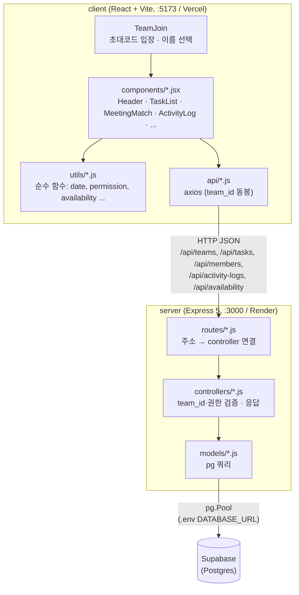
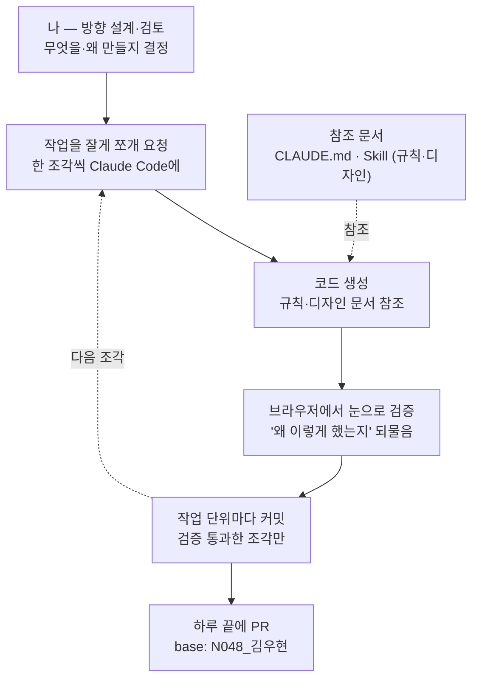

# 팀플 올인원 (Team Project All-in-One)

대학생 팀 프로젝트의 시작(언제 모이지?)부터 끝(누가 뭘 얼마나 했지?)까지 하나로 잇는 웹 서비스입니다.

팀플을 할 때 언제 모일지 시간을 맞추는 것부터 누가 뭘 얼마나 했는지 파악하는 것까지 흩어진 도구(when2meet, 카톡, 각자 메모)를 오가야 해서 번거롭고, 무임승차가 생겨도 잘 드러나지 않는다는 문제에서 출발했습니다. 핵심 기능은 두 가지입니다.

- **태스크 관리** — 할 일 추가·담당자 지정·마감일, 팀 전체/내 진행도, 담당자만 상태를 바꿀 수 있는 권한 규칙
- **회의시간 매칭** — 프로젝트 기간의 실제 날짜×시간 격자에 각자 가능한 시간을 드래그로 표시하고, 겹치는 인원을 히트맵과 추천 시간으로 보여주기

여러 팀이 각자 초대코드로 입장해 자기 팀 데이터만 다루는 **멀티팀** 구조입니다. 1인 개발 프로젝트이며, AI Agent(Claude Code)와 함께 작업 단위를 잘게 쪼개는 방식으로 개발했습니다. 개발 규칙과 설계 결정은 [CLAUDE.md](CLAUDE.md)에 기록돼 있습니다.

## 배포

- 프론트엔드: **Vercel** — https://hub-amber-one.vercel.app
- 백엔드: **Render** — https://teamplan-server.onrender.com
- 두 서비스 모두 `N048_김우현` 브랜치 push 시 자동 재배포됩니다.

> 백엔드는 Render 무료 인스턴스라 일정 시간 미사용 시 잠들며, 첫 요청이 최대 50초가량 지연될 수 있습니다.

## 아키텍처



- 프론트(`client/`)는 백엔드와 직접 통신하며, DB는 만지지 않습니다.
- 백엔드(`server/`)는 `routes → controllers → models` 3단 구조입니다. `routes`는 주소 매핑만, `controllers`는 입력 검증·권한 체크·에러 처리, `models`는 실제 `pg` 쿼리를 담당합니다.
- DB는 로컬 SQLite가 아니라 **Supabase의 Postgres**를 `pg`(node-postgres)로 직접 연결해서 씁니다 — `@supabase/supabase-js` SDK는 쓰지 않고 순수 Postgres 커넥션만 사용합니다.
- 권한 체크(`canMemberChange`) 로직은 client/server가 서로 다른 런타임이라 코드를 공유할 수 없어서 각자 `utils/permission.js`에 동일하게 구현하고, 동일한 테스트로 두 구현이 같은 동작을 하는지 보장합니다.

### 멀티팀: "지금 어느 팀인지"를 다루는 방식

로그인/세션이 없는 대신, 클라이언트가 **현재 팀 id(`team_id`)와 현재 멤버 id(`memberId`)를 매 요청에 실어 보내고 서버는 그대로 신뢰**합니다.

- 세션·쿠키를 쓰지 않은 이유: 프론트(Vercel)와 백엔드(Render)가 서로 다른 도메인이라 쿠키 전달에 `SameSite=None`·`Secure`·CORS credentials 설정을 모두 맞춰야 하는데, 파라미터 방식은 이 문제 자체를 피해가고 기존 `memberId` 처리 방식과도 일관됩니다.
- 초대코드로 입장하면 그 팀의 id를 `localStorage`에 저장하고, 이후 모든 요청에 동봉합니다. GET은 `?team_id=`, POST/PATCH/DELETE는 body의 `team_id`로 보냅니다.
- 태스크 수정 계열 API는 "그 태스크가 요청한 팀 소속인지"를 먼저 검증(불일치 시 404)해서 다른 팀 데이터에 대한 접근(IDOR)을 막고, 그다음 담당자 권한을 검증(불일치 시 403)합니다.

## 기술 스택

| 영역 | 기술 |
|---|---|
| 프론트엔드 | React 19, Vite, axios |
| 백엔드 | Node.js, Express 5, pg (node-postgres), cors, dotenv |
| DB | Supabase (Postgres) — `pg`로 직접 연결 |
| 테스트 | Vitest (client·server 둘 다) |
| 스타일 | 직접 만든 CSS 변수 디자인 시스템 (외부 UI 라이브러리 없음) |
| 배포 | Vercel (프론트) · Render (백엔드) |

## 주요 기능

### 팀 입장 (멀티팀)
- 초대코드를 입력해 팀에 입장하고, 그 팀의 멤버 중에서 자기 이름을 선택합니다.
- 선택한 팀·이름은 `localStorage`에 저장되어 새로고침해도 유지되며, 진입 시 저장된 값이 실제 존재하는 팀/멤버인지 서버로 재검증합니다. 유효하지 않으면 다시 초대코드 입력 화면으로 돌아갑니다.

### 태스크 관리
- 할 일 추가, 담당자 지정(1명, 미지정 허용), 마감일, 상태(대기·진행·완료)
- 제목·담당자·마감일 인라인 수정(클릭 → 그 자리에서 편집)
- **권한 규칙**: 담당자가 있으면 상태 변경·삭제·제목/담당자/마감일 수정 모두 **담당자 본인만** 가능, 담당자가 없으면 누구나 가능. 이 로직(`canMemberChange`)은 TDD로 개발해 client/server 양쪽에 테스트와 함께 존재합니다.
- soft delete — 삭제해도 데이터는 남고(`archived` 플래그), "삭제된 항목 보기"에서 확인 후 복원 가능
- 팀 전체 진행도 + 내 진행도 2종 표시, 모든 상태 변경은 활동 로그에 자동 기록
- **마감 임박 표시** — 완료되지 않은 태스크에 D-day(D-3 / D-DAY / D+2)를 표시하고, 임박(오늘·내일·기한 초과)한 것은 빨간색으로 강조
- **활동 로그 화면** — 상태 변경 이력을 태스크명·담당자명과 함께 시간순으로 확인
- 권한 없는 조작을 시도하면 토스트로 안내

### 회의시간 매칭
- 실제 날짜 기반 주간 격자(1시간 단위), 주 탭으로 이번 주/다음 주 전환
- **드래그 선택** — 격자를 드래그해 여러 시간대를 한 번에 선택/해제. 드래그를 시작한 칸의 상태(빈 칸/채운 칸)로 이번 드래그가 "켜기"인지 "끄기"인지 시작 시점에 확정하고 끝까지 유지하므로, 마우스 경로와 무관하게 결과가 항상 일정합니다. 칸 하나만 바꿀 때는 단일 클릭도 그대로 동작합니다.
- 저장 버튼으로 그 주 전체를 한 번에 반영(부분 수정 아님, 통째로 교체)
- **겹침 히트맵**: 팀원 대비 비율로 배경색 진하기가 달라짐(절대 인원수 아님 — 팀 인원이 달라도 같은 색 체계)
- **추천 회의 시간**: 겹치는 인원이 가장 많은 시간대 상위 몇 개를 자동으로 골라 카드로 표시(동률이면 이른 날짜·시간 우선), 클릭하면 격자에서 해당 칸을 강조
- 내가 선택한 칸은 파란 테두리로 별도 표시, 칸에 마우스를 올리면 누가 가능한지 이름이 뜸

## API 엔드포인트

모든 요청은 `team_id`를 동봉합니다(GET은 쿼리, 그 외는 body).

| Method | 경로 | 설명 |
|---|---|---|
| GET | `/api/teams/by-code?code=` | 초대코드로 팀 조회 → `{ id, name }` |
| GET | `/api/teams/current?team_id=` | team_id로 팀 상세 조회 → `{ id, name, start_date, end_date }` |
| GET | `/api/members?team_id=` | 팀 멤버 이름 목록 |
| GET | `/api/tasks?team_id=` | 팀의 활성 태스크 목록 |
| GET | `/api/tasks/archived?team_id=` | 삭제(soft-delete)된 태스크 목록 |
| POST | `/api/tasks` | 태스크 추가 |
| PATCH | `/api/tasks/:id` | 상태 변경 |
| PATCH | `/api/tasks/:id/title` | 제목 수정 |
| PATCH | `/api/tasks/:id/assignee` | 담당자 수정 |
| PATCH | `/api/tasks/:id/due-date` | 마감일 수정 |
| PATCH | `/api/tasks/:id/restore` | 삭제 복원 |
| DELETE | `/api/tasks/:id` | soft delete |
| GET | `/api/activity-logs?team_id=` | 활동 로그 조회(태스크명·담당자명 JOIN) |
| GET | `/api/availability?team_id=&week_start=` | 그 주의 팀 전체 가능 시간 슬롯 |
| POST | `/api/availability` | 한 멤버의 그 주 가능 시간 전체 교체 |

## 데이터베이스

Supabase(Postgres)에 다음 테이블이 있습니다.

| 테이블 | 주요 컬럼 |
|---|---|
| `teams` | id, name, start_date, end_date, invite_code |
| `members` | id, name, team_id |
| `tasks` | id, team_id, title, assignee_id, due_date, status, archived, created_at |
| `activity_logs` | id, task_id, member_id, previous_status, new_status, changed_at |
| `availability_slots` | id, team_id, member_id, slot_date, slot_hour, created_at |

## 실행 방법

> **Windows 환경 참고**: PowerShell은 기본 실행 정책 때문에 `npm`/`vite` 스크립트 실행이 막힐 수 있습니다. **cmd(명령 프롬프트)** 사용을 권장합니다.

### 1. 환경 변수 설정

`server/.env` (예시는 `server/.env.example`):

```
DATABASE_URL=<Supabase 프로젝트의 Postgres 연결 문자열>
CLIENT_ORIGIN=http://localhost:5173   # CORS 허용 origin (선택, 기본값 있음)
# PORT는 지정하지 않으면 3000 (배포 시 플랫폼이 주입)
```

`client/.env` (예시는 `client/.env.example`):

```
VITE_API_BASE_URL=http://localhost:3000/api
```

테이블은 이미 Supabase에 만들어져 있으므로 별도의 DB 초기화 스크립트를 돌릴 필요는 없습니다.

### 2. 서버 실행

```
cd server
npm install
node src/app.js
```

`http://localhost:3000`에서 API가 뜹니다.

### 3. 클라이언트 실행

새 터미널을 열어서:

```
cd client
npm install
npm run dev
```

`http://localhost:5173`에서 화면을 확인합니다. (서버가 먼저 떠 있어야 API 호출이 됩니다.)

## 테스트 실행 방법

권한 체크 로직(`canMemberChange`)을 TDD로 개발하며 작성한 테스트를 client/server 양쪽에서 각각 실행합니다.

```
cd server
npm test

cd client
npm test
```

`vitest run`으로 1회 실행되며, 코드를 고치면서 계속 지켜보려면 `npm run test:watch`를 사용합니다.

## 폴더 구조

```
hub/
├── client/                    # React (Vite) → Vercel
│   └── src/
│       ├── components/        # 화면 부품 (컴포넌트 옆에 같은 이름의 .css)
│       ├── api/               # 서버 요청 코드 (axios, team_id 동봉)
│       ├── utils/             # 순수 함수 (날짜, 권한, 통계 계산 등) + 테스트
│       ├── styles/            # design-system.css (CSS 변수)
│       ├── App.jsx            # 팀 유무로 최상위 화면 분기
│       └── main.jsx
│
├── server/                    # Express → Render
│   └── src/
│       ├── routes/            # 주소 → controller 연결
│       ├── controllers/       # 요청 검증 · 팀/권한 체크 · 응답
│       ├── models/            # pg 쿼리
│       ├── utils/             # 권한 체크 로직 + 테스트
│       ├── db.js              # Supabase(Postgres) 연결 (pg Pool)
│       └── app.js             # 서버 시작점
│
├── docs/                      # 기획 문서, 작업 계획
├── CLAUDE.md                  # 개발 규칙 · 설계 결정사항 · 디자인 시스템
└── README.md
```

## Agent 협업 워크플로우

이 프로젝트는 AI Agent(Claude Code)와 함께 개발했습니다. AI가 코드를 전부 대신 짜는 방식이 아니라, **방향 설계와 검증은 사람이, 구현은 Agent가** 맡는 분업 구조로 진행했습니다.



핵심은 **작은 조각의 순환**입니다. 큰 기능을 한 번에 만들지 않고, 작은 단위로 나눠 만들고 → 브라우저에서 직접 확인하고 → 통과한 것만 커밋하는 과정을 반복했습니다. 이렇게 하면 문제가 생겨도 어느 조각에서 틀어졌는지 바로 격리할 수 있습니다.

- **규칙을 문서로 고정**: 설계 결정과 디자인 시스템을 [CLAUDE.md](CLAUDE.md)와 Skill에 적어두어, Agent가 매번 일관된 방식으로 작업하도록 했습니다.
- **만들 때마다 이해하고 넘어가기**: 코드가 나올 때마다 "이게 뭘 하는지, 왜 이렇게 했는지"를 되물어 검토했습니다.
- **검증 후 커밋**: 눈으로 동작을 확인한 조각만 커밋하고, 하루가 끝나면 PR로 묶었습니다.

## 문서
- [프로젝트 기획서](https://github.com/jsjsbs7233/hub/wiki/AI-Agent-Challenge-%EA%B8%B0%ED%9A%8D%EC%84%9C)
- [엣지케이스 결정사항](https://github.com/jsjsbs7233/hub/wiki/%EC%97%A3%EC%A7%80%EC%BC%80%EC%9D%B4%EC%8A%A4)
- [개발 Task 백로그](docs/task-backlog.md)
