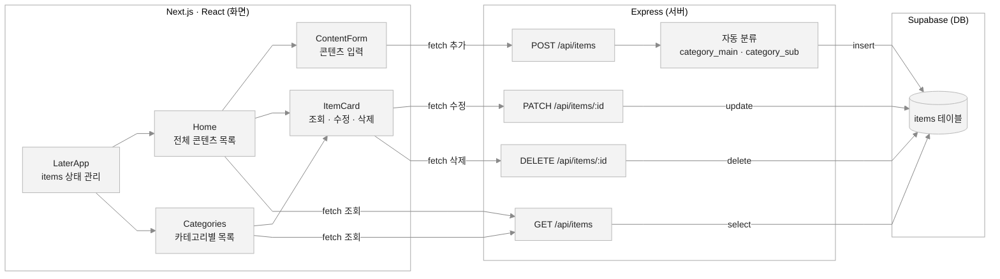

## 서비스 구조 및 데이터 흐름

```mermaid
%%{init: {
  "theme": "base",
  "themeVariables": {
    "background": "#ffffff",
    "primaryColor": "#f3f3f3",
    "primaryTextColor": "#222222",
    "primaryBorderColor": "#b8b8b8",
    "lineColor": "#8a8a8a",
    "secondaryColor": "#ffffff",
    "tertiaryColor": "#ffffff",
    "clusterBkg": "#ffffff",
    "clusterBorder": "#a9a9a9",
    "fontFamily": "Arial, sans-serif",
    "fontSize": "14px"
  },
  "flowchart": {
    "curve": "linear",
    "nodeSpacing": 35,
    "rankSpacing": 55,
    "htmlLabels": true
  }
}}%%

flowchart LR

    subgraph FRONT["Next.js · React (화면)"]
        direction TB

        APP["LaterApp<br/>items 상태 관리"]

        HOME["Home<br/>전체 콘텐츠 목록"]
        CATEGORY["Categories<br/>카테고리별 목록"]

        FORM["ContentForm<br/>콘텐츠 입력"]
        CARD["ItemCard<br/>조회 · 수정 · 삭제"]

        APP --> HOME
        APP --> CATEGORY
        HOME --> FORM
        HOME --> CARD
        CATEGORY --> CARD
    end

    subgraph SERVER["Express (서버)"]
        direction TB

        READ["GET /api/items"]
        CREATE["POST /api/items"]
        UPDATE["PATCH /api/items/:id"]
        REMOVE["DELETE /api/items/:id"]

        CLASSIFY["자동 분류<br/>category_main · category_sub"]

        CREATE --> CLASSIFY
    end

    subgraph DATABASE["Supabase (DB)"]
        direction TB

        ITEMS[("items 테이블")]
    end

    HOME -->|"fetch 조회"| READ
    CATEGORY -->|"fetch 조회"| READ
    FORM -->|"fetch 추가"| CREATE
    CARD -->|"fetch 수정"| UPDATE
    CARD -->|"fetch 삭제"| REMOVE

    READ -->|"select"| ITEMS
    CLASSIFY -->|"insert"| ITEMS
    UPDATE -->|"update"| ITEMS
    REMOVE -->|"delete"| ITEMS

    classDef default fill:#f3f3f3,stroke:#b8b8b8,color:#222222,stroke-width:1px;
    classDef database fill:#f3f3f3,stroke:#b8b8b8,color:#222222,stroke-width:1px;

    class ITEMS database;

    style FRONT fill:#ffffff,stroke:#a9a9a9,stroke-width:1px
    style SERVER fill:#ffffff,stroke:#a9a9a9,stroke-width:1px
    style DATABASE fill:#ffffff,stroke:#a9a9a9,stroke-width:1px
```

## 프로젝트 문서

- [서비스 구조 및 데이터 흐름](docs/SERVICE_ARCHITECTURE.md)
