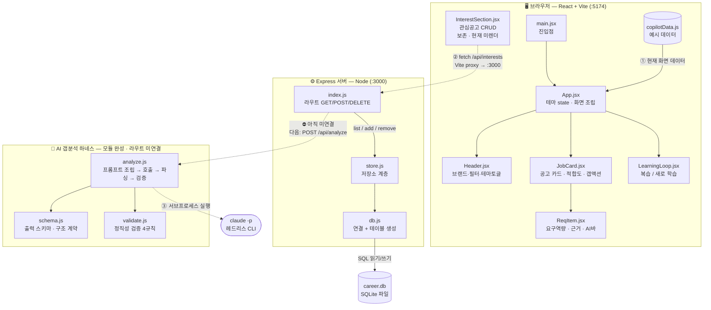

# 커리어 코파일럿 (Career Copilot)

> 내 위키·GitHub를 근거로 채용 공고별 **적합도·갭·학습**을 **정직하게** 보여주는 개인 커리어 대시보드.
> 남들은 이력서 *글자*를 매칭한다. 나는 내 *커밋*을 본다 — 그 커밋이 AI가 짠 건지까지.

---

## 아키텍처 (한 장)



---

## 데이터가 어디로 흐르나 (3갈래)

### ① 화면 렌더 — **현재 동작 중**
`main.jsx` → `App.jsx` → (`Header` · `JobCard`→`ReqItem` · `LearningLoop`).
**데이터 출처는 `copilotData.js`(예시 데이터)** 이고, **서버를 거치지 않는다.** 카드에 보이는 적합도·요구역량·AI바는 전부 이 파일에서 온다.

### ② 관심 공고 CRUD — **동작 검증됨(단, 화면에 미부착)**
`InterestSection.jsx`가 `fetch('/api/interests')` 호출 → **Vite 프록시**가 `:5174/api` 를 `:3000` 으로 넘김 → `index.js` 라우트 → `store.js`(저장소 계층) → `db.js` → **`career.db`(SQLite 파일)**.
서버를 재시작해도 데이터가 남는 것까지 확인함. 다만 이번 UI 교체 때 화면에서 빠져 **코드만 보존** 중.

> **계층 분리의 효과**: DB를 Supabase → SQLite로 바꿀 때 `store.js` 한 파일만 다시 썼고, 라우트(`index.js`)·화면은 한 줄도 안 바뀜.

### ③ AI 갭분석 하네스 — **모듈 완성 · 라우트 미연결**
`analyze.js`가 `schema.js`(출력 모양 계약)로 프롬프트를 만들고 → **`claude -p`(헤드리스 CLI)를 서브프로세스로 실행** → 나온 텍스트를 `JSON.parse` → **`validate.js`(정직성 4규칙)** 로 검증 → `{ ok, job, violations }` 반환.
아직 **Express 라우트에 붙지 않았다.** 다음 단계는 `POST /api/analyze`로 연결하는 것.

---

## 실행

```bash
# 프론트 (브라우저 화면)
npm install && npm run dev        # http://localhost:5173

# 백엔드 (API + SQLite)
cd server && npm install && npm run dev   # http://localhost:3000
```

## 폴더 구조

```
hub/
├── src/                     프론트엔드 (React)
│   ├── App.jsx              화면 조립 + 테마
│   ├── components/          Header · JobCard · ReqItem · LearningLoop
│   └── data/copilotData.js  예시 데이터
├── server/                  백엔드 (Express + SQLite)
│   ├── index.js             라우트
│   ├── store.js             저장소 계층
│   ├── db.js                SQLite 연결·스키마
│   └── harness/             AI 갭분석 하네스
│       ├── schema.js        출력 스키마
│       ├── validate.js      정직성 검증
│       └── analyze.js       생성→검증 본체
└── docs/                    설계·비교·협업 문서
```

## 문서
- [하네스 설계](docs/하네스%20설계.md) · [협업 행동강령](docs/협업%20행동강령.md)
- [모델 비교 (갭분석 baseline)](docs/모델%20비교%20—%20갭분석%20baseline.md) · [차후 공부 방안](docs/차후%20공부%20방안.md)
- [API 명세](server/API.md)
