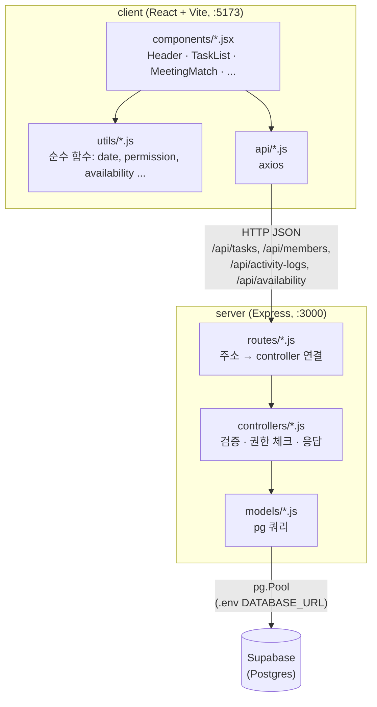

# 팀플 올인원 (Team Project All-in-One)

대학생 팀 프로젝트의 시작(언제 모이지?)부터 끝(누가 뭘 얼마나 했지?)까지 하나로 잇는 웹 서비스입니다.

팀플을 할 때 언제 모일지 시간을 맞추는 것부터 누가 뭘 얼마나 했는지 파악하는 것까지 흩어진 도구(when2meet, 카톡, 각자 메모)를 오가야 해서 번거롭고, 무임승차가 생겨도 잘 드러나지 않는다는 문제에서 출발했습니다. 핵심 기능은 두 가지입니다.

- **태스크 관리** — 할 일 추가·담당자 지정·마감일, 팀 전체/내 진행도, 담당자만 상태를 바꿀 수 있는 권한 규칙
- **회의시간 매칭** — 프로젝트 기간의 실제 날짜×시간 격자에 각자 가능한 시간을 표시하고, 겹치는 인원을 히트맵으로 보여주기

1인 개발(4주) 프로젝트이며, AI Agent(Claude Code)와 함께 작업 단위를 잘게 쪼개는 방식으로 개발했습니다. 개발 규칙과 설계 결정은 [CLAUDE.md](CLAUDE.md)에 기록돼 있습니다.

## 아키텍처



- 프론트(`client/`)는 백엔드와 직접 통신하며, DB는 만지지 않습니다.
- 백엔드(`server/`)는 `routes → controllers → models` 3단 구조입니다. `routes`는 주소 매핑만, `controllers`는 입력 검증·권한 체크·에러 처리, `models`는 실제 `pg` 쿼리를 담당합니다.
- DB는 로컬 SQLite가 아니라 **Supabase의 Postgres**를 `pg`(node-postgres)로 직접 연결해서 씁니다 — `@supabase/supabase-js` SDK는 쓰지 않고 순수 Postgres 커넥션만 사용합니다.
- 권한 체크(`canMemberChange`) 로직은 client/server가 서로 다른 런타임이라 코드를 공유할 수 없어서 각자 `utils/permission.js`에 동일하게 구현하고, 동일한 테스트로 두 구현이 같은 동작을 하는지 보장합니다.

## 기술 스택

| 영역 | 기술 |
|---|---|
| 프론트엔드 | React 19, Vite, axios |
| 백엔드 | Node.js, Express 5 |
| DB | Supabase (Postgres) — `pg`로 직접 연결 |
| 테스트 | Vitest (client·server 둘 다) |
| 스타일 | 직접 만든 CSS 변수 디자인 시스템 (외부 UI 라이브러리 없음) |

## 주요 기능

### 태스크 관리
- 할 일 추가, 담당자 지정(1명, 미지정 허용), 마감일, 상태(대기·진행·완료)
- 제목·담당자·마감일 인라인 수정(클릭 → 그 자리에서 편집)
- **권한 규칙**: 담당자가 있으면 상태 변경·삭제·제목/담당자/마감일 수정 모두 **담당자 본인만** 가능, 담당자가 없으면 누구나 가능. 이 로직(`canMemberChange`)은 TDD로 개발해 client/server 양쪽에 테스트와 함께 존재합니다.
- soft delete — 삭제해도 데이터는 남고(`archived` 플래그), "삭제된 항목 보기"에서 확인 후 복원 가능
- 팀 전체 진행도 + 내 진행도 2종 표시, 모든 상태 변경은 활동 로그에 자동 기록
- 권한 없는 조작을 시도하면 토스트로 안내

### 회의시간 매칭
- 실제 날짜 기반 주간 격자(9시~21시, 1시간 단위), 주 탭으로 이번 주/다음 주 전환
- 셀 클릭으로 내 가능 시간 토글 → 저장 버튼으로 그 주 전체를 한 번에 반영(부분 수정 아님, 통째로 교체)
- **겹침 히트맵**: 팀원 대비 비율(0/25/50/75/100%)로 배경색 진하기가 달라짐(절대 인원수 아님 — 팀 인원이 달라도 같은 색 체계)
- 내가 선택한 칸은 색과 겹치지 않게 파란 테두리로 별도 표시, 칸에 마우스를 올리면 누가 가능한지 이름이 뜸
- 저장 성공 시 다시 조회해서 히트맵을 최신 상태로 갱신

## 실행 방법

> **Windows 환경 참고**: PowerShell은 기본 실행 정책 때문에 `npm`/`vite` 스크립트 실행이 막힐 수 있습니다. **cmd(명령 프롬프트)** 사용을 권장합니다.

### 1. 환경 변수 설정 (server)

`server/.env` 파일을 만들고 Supabase Postgres 연결 문자열을 넣습니다.

```
DATABASE_URL=<Supabase 프로젝트의 Postgres 연결 문자열>
```

테이블은 이미 Supabase에 만들어져 있으므로 별도의 DB 초기화 스크립트를 돌릴 필요는 없습니다.

### 2. 서버 실행

```
cd server
npm install
node src/app.js
```

`http://localhost:3000`에서 API가 뜹니다.

### 3. 클라이언트 실행

새 터미널을 열어서:

```
cd client
npm install
npm run dev
```

`http://localhost:5173`에서 화면을 확인합니다. (서버가 먼저 떠 있어야 API 호출이 됩니다.)

## 테스트 실행 방법

권한 체크 로직(`canMemberChange`)을 TDD로 개발하며 작성한 테스트를 client/server 양쪽에서 각각 실행합니다.

```
cd server
npm test

cd client
npm test
```

`vitest run`으로 1회 실행되며, 코드를 고치면서 계속 지켜보려면 `npm run test:watch`를 사용합니다.

## 폴더 구조

```
hub/
├── client/                    # React (Vite)
│   └── src/
│       ├── components/        # 화면 부품 (컴포넌트 옆에 같은 이름의 .css)
│       ├── api/                # 서버 요청 코드 (axios)
│       ├── utils/               # 순수 함수 (날짜, 권한, 통계 계산 등) + 테스트
│       ├── styles/              # design-system.css (CSS 변수)
│       ├── App.jsx
│       └── main.jsx
│
├── server/                    # Express
│   └── src/
│       ├── routes/            # 주소 → controller 연결
│       ├── controllers/       # 요청 검증 · 권한 체크 · 응답
│       ├── models/            # pg 쿼리
│       ├── utils/              # 권한 체크 로직 + 테스트
│       ├── db.js               # Supabase(Postgres) 연결 (pg Pool)
│       └── app.js              # 서버 시작점
│
├── prototype/                  # 초기 바닐라 HTML/CSS/JS 프로토타입 (참고용, React로 이전 완료)
├── docs/                        # 기획 문서, 작업 계획
├── CLAUDE.md                    # 개발 규칙 · 설계 결정사항 · 디자인 시스템
└── README.md
```

## 문서
-[프로젝트 기획서](https://github.com/jsjsbs7233/hub/wiki/AI-Agent-Challenge-%EA%B8%B0%ED%9A%8D%EC%84%9C)

-[엣지케이스 결정사항](https://github.com/jsjsbs7233/hub/wiki/%EC%97%A3%EC%A7%80%EC%BC%80%EC%9D%B4%EC%8A%A4)

- [개발 Task 백로그](docs/task-backlog.md)
