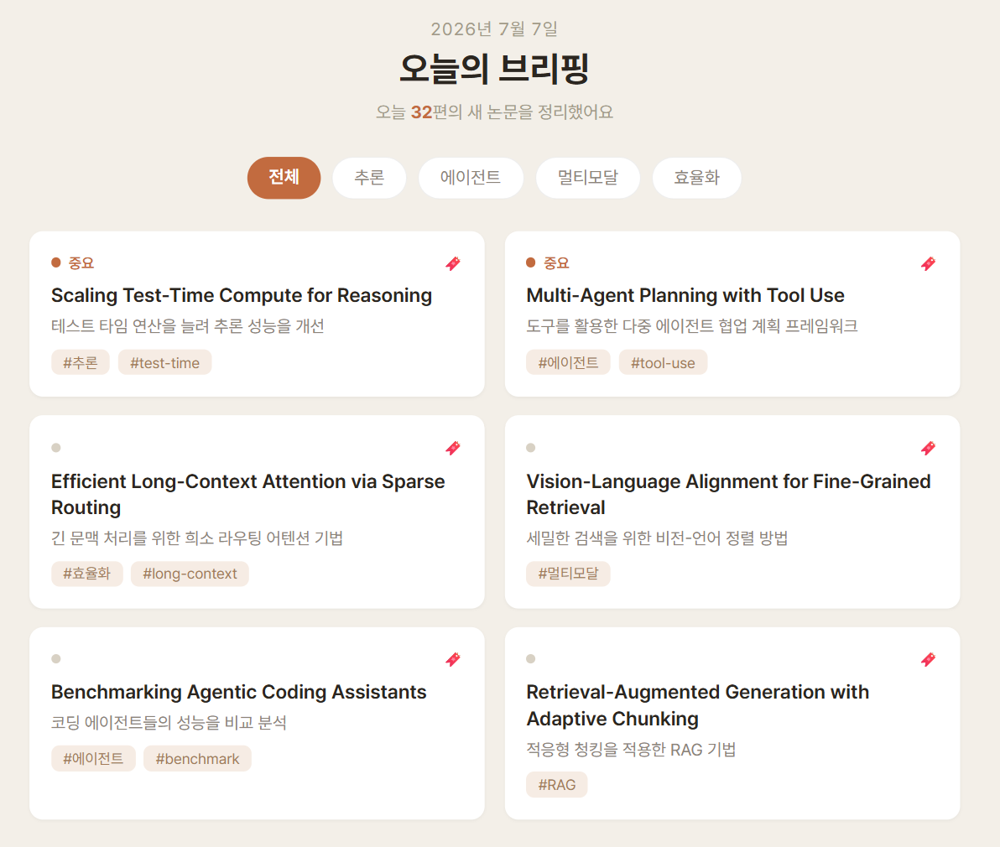

# hub — AI 논문 브리핑 서비스

> 최신 AI(LLM) 논문을 **매일 자동 수집·요약**하여, 연구자·개발자가 짧은 브리핑으로 최신 동향을 놓치지 않고 파악하게 해주는 정적 웹 서비스.

## 문제 정의

최신 AI(특히 LLM) 분야는 arXiv 논문의 **생산 속도와 양이 개인이 따라잡을 수 있는 한계를 넘어섰다.** 매일 수십 편이 쏟아지지만 대부분 영문 원문이라 훑는 데 시간이 오래 걸린다. 그 결과 두 가지 고통이 생긴다.

- **① 놓침** — 중요한 논문·발표를 그냥 지나친다.
- **② 시간 비용** — "무엇이 중요한지 선별하고 파악하는 것" 자체에 매일 큰 시간이 든다.

> **AI 전문가 한 사람이 IT트랜드를 파악하려고 인터넷(논문, 뉴스, SNS)를 조사하는데 정보들이 너무 분산되어 있고 너무 빠르고 많이 나와 조사하는데에 시간이 너무많이 걸린다.**

## 해결 방향

최신 AI(LLM) 논문을 **자동 수집 → LLM 한국어 요약 → 매일 브리핑**으로 정리해, 사용자가 웹에서 **5분 안에** 오늘의 핵심 동향을 훑게 한다.

- **주 사용자**: AI 연구자·개발자 (전문 용어 유지, 깊이 있는 요약 + 배경 설명)
- **핵심 가치**: 놓치지 않기(Curation) + 짧은 시간에 파악(시간 절약)

## MVP 범위

사용자 시나리오 중 **S1(아침 데일리 브리핑) 하나에 집중**해 1~2주 내 동작하는 최소 제품을 만든다. 자세한 내용은 **[docs/spec/mvp-plan.md](./docs/spec/mvp-plan.md)** 참고.

### 핵심 기능 (F1~F4)

| # | 기능 | 설명 |
|---|------|------|
| **F1** | 오늘의 브리핑 피드 | 날짜 헤더 · "오늘 N편 수집" · 카테고리 탭 · 카드 목록(중요도순) |
| **F2** | 논문 카드 요약 | 제목(영·한) · 한줄 요약 · 주제 태그 · 중요도 배지 |
| **F3** | 한국어 요약 열람 | 구조화 요약(기여/방법/결과) + 배경 설명 + 원문 초록 토글 + arXiv 링크 |
| **F4** | 북마크 저장 | 관심 논문을 저장 목록에 추가 |

### 화면 (프로토타입)

S1 **‘오늘의 브리핑’ 피드**를 실제 구현한 모습(MVP).



> 와이어프레임 시안: [실물 보기 (GitHub Pages)](https://leekwanhak.github.io/hub/docs/spec/wireframes/s1-wireframe.html) · [소스](./docs/spec/wireframes/s1-wireframe.html)

## 아키텍처

**정적 사이트 + GitHub Actions cron + GitHub Pages — 서버 0대, 비용 0원.**

```
매일 정해진 시각
  └─ GitHub Actions(무료 cron)가 파이썬 스크립트 실행
       ├─ arXiv 수집 (cs.CL / cs.AI / cs.LG)
       ├─ LLM 한국어 요약 (Gemini Flash 무료 티어)
       ├─ 결과를 JSON/정적 파일로 생성
       └─ 저장소에 커밋
  └─ GitHub Pages가 정적 파일을 웹으로 서빙
```

## 문서

정본(canonical) 기획 문서는 저장소 `docs/`에서 관리합니다. 사람이 보기 좋은 **시각 요약본은 [프로젝트 Wiki](https://github.com/leekwanhak/hub/wiki)** 를 참고하세요.

| 문서 | 내용 |
|------|------|
| [docs/plan.md](./docs/plan.md) | 전체 기획서 (목적·타겟·기능·스택·로드맵·향후 확장) |
| [docs/user-scenarios.md](./docs/user-scenarios.md) | 사용자 시나리오 4종 (넓은 범위) |
| [docs/spec/mvp-plan.md](./docs/spec/mvp-plan.md) | MVP 기획 (문제정의 → S1 흐름 → 핵심 기능 → 화면 설계) |
| [docs/spec/checklist.md](./docs/spec/checklist.md) | 작업 분해 체크리스트 (F1~F4 + 파이프라인) |
| [docs/agent-workflow/planning-methodology.md](./docs/agent-workflow/planning-methodology.md) | 기획 구체화 방법론 (agent 활용 프로세스) |
| [와이어프레임 (실물)](https://leekwanhak.github.io/hub/docs/spec/wireframes/s1-wireframe.html) | 인터랙티브 시안 (피드·상세·저장) · [소스](./docs/spec/wireframes/s1-wireframe.html) |

## 진행 관리

- [주간 계획](./docs/tracking/weekly-plan.md) — 이번 주 요일별 작업·완료 기준(DoD)
- [이슈 초안](./docs/tracking/issues-draft.md) — GitHub 이슈 등록용 작업 목록

## 로드맵 (MVP)

1. **수집 스크립트** — arXiv API에서 최신 논문 fetch, LLM 관련 논문 선별
2. **요약 스크립트** — Gemini Flash로 한국어 구조화 요약, 원문 초록 병기, JSON 저장
3. **정적 프론트** — 오늘의 브리핑 피드 + 논문 상세
4. **자동화** — GitHub Actions cron + GitHub Pages 배포

전체 로드맵·향후 확장(검색·트렌드·카테고리 분류·공유 등)은 [docs/plan.md](./docs/plan.md) 참고.
