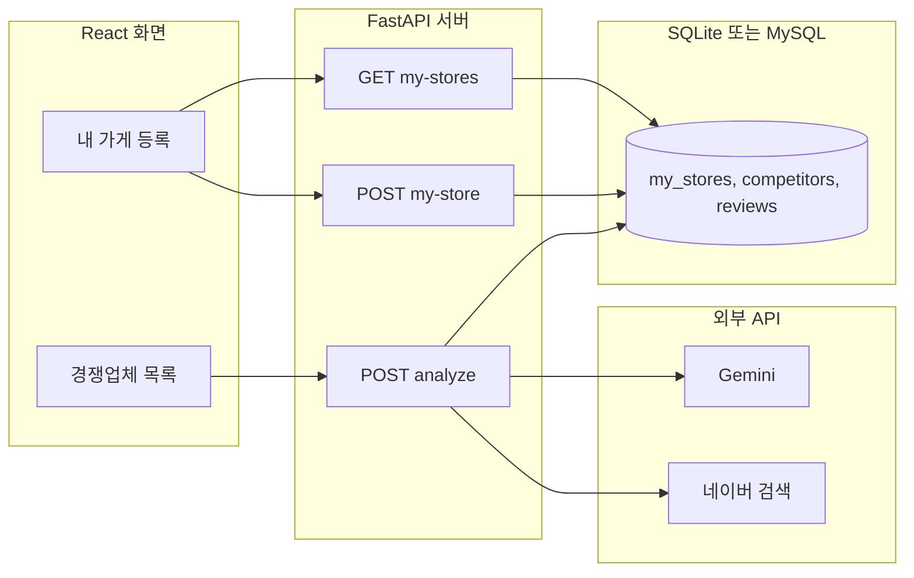

# 상권 스캐너

소상공인을 위한 주변 경쟁업체 리뷰 분석 AI 에이전트입니다. 내 가게 이름을 입력하면 주변 반경 내 같은 업종 경쟁업체를 찾아, 각 업체의 리뷰를 수집·분석하여 긍정/부정 비율, 핵심 키워드 순위, 경쟁 전략 리포트를 자동으로 생성합니다.

> 네이버 AI 부트캠프 프로젝트 (2026)

## 스크린샷


## 주요 기능

- **주변 경쟁업체 검색**: 내 가게 좌표를 기준으로 반경 내 같은 업종 업체를 검색하고 거리순으로 정렬 (Haversine 공식)
- **내 가게 등록**: 내 가게 정보를 DB에 저장하고, 새로고침·재시작 후에도 조회 가능
- **리뷰 감성 분석**: 리뷰를 한 건씩 LLM으로 분석해 긍정/부정으로 분류
- **키워드 추출**: 리뷰에서 핵심 키워드(맛, 가격, 불친절, 웨이팅 등)를 구조화된 JSON으로 추출
- **통계 집계**: 긍정/부정 비율, 키워드 언급 횟수 순위 산출
- **AI 전략 리포트**: 분석 결과를 바탕으로 벤치마킹 포인트와 공략 가능한 약점을 담은 컨설팅 리포트 생성
- **분석 결과 캐싱**: 분석 결과를 DB에 저장하여 동일 매장 재조회 시 LLM 재호출 비용 절감

## 기술 스택

| 구분 | 기술 |
|---|---|
| Frontend | React (Vite), Tailwind CSS v4 |
| Backend | FastAPI, Python |
| AI | LangChain, Google Gemini (gemini-2.5-flash) |
| Database | SQLite (로컬 개발) / MySQL (Docker) |
| ORM | SQLAlchemy |
| Data Collection | Naver 지역검색 API + Naver Blog Search API (공식) |
| Infra | Docker, Docker Compose (MySQL + FastAPI + React/Nginx) |
| Test | pytest (TDD) |

## 디자인

다크 대시보드 레이아웃에 네이버 그린(#03C75A)을 포인트 컬러로 적용했습니다. 색상·간격·컴포넌트 규칙은 [`design-skill.md`](./design-skill.md)에 정리되어 있으며, 새 화면을 만들 때도 이 문서를 기준으로 톤을 통일합니다.

## 아키텍처



- 프론트엔드는 내 가게를 등록하면 `POST /api/my-store`로, 목록 조회는 `GET /api/my-stores`로 서버와 통신
- 리뷰 분석은 `POST /api/analyze`로 가게 이름을 전송
- 백엔드는 `collector.py`로 네이버 검색 API에서 후기 수집
- 수집된 텍스트를 LLM으로 분석하고, Pydantic 스키마 기반 `with_structured_output`으로 결과를 JSON으로 강제
- 분석 결과는 DB에 저장 후 통계와 함께 프론트엔드로 반환

> 현재 "경쟁업체 목록" 화면은 목 데이터 기반이며, 실제 검색 API와의 연결은 진행 중입니다. (진행 상황은 [TASKS.md](./TASKS.md) 참고)

## 데이터 수집에 대한 의사결정

네이버 플레이스 리뷰는 공식 API가 제공되지 않으며, 크롤링은 네이버 이용약관이 금지하는 자동화 수집에 해당합니다. 이에 따라 본 프로젝트는:

1. **MVP 단계(완료)**: 가상 리뷰 데이터로 분석 파이프라인을 검증
2. **고도화 단계(완료)**: 네이버 블로그 검색 API(공식) 기반 후기 텍스트 수집으로 교체
3. **주변 검색 단계(진행 중)**: 네이버 지역검색 API로 내 가게 좌표를 조회하고, Haversine 공식으로 반경 내 경쟁업체를 필터링

수집 계층은 `collector.py`로 완전히 분리하여, 데이터 소스를 교체할 때 나머지 코드 수정이 불필요합니다.

## API 명세

### POST /api/my-store

내 가게 이름을 받아 DB에 저장합니다.

### GET /api/my-stores

저장된 내 가게 목록을 DB에서 조회합니다. 새로고침·서버 재시작 후에도 유지됩니다.

### POST /api/analyze

가게 이름을 받아 리뷰를 수집·분석하고 DB에 저장한 뒤 결과를 반환합니다.

`source` 필드로 데이터 출처를 구분합니다: `naver_blog`(실시간 수집) / `database`(캐시) / `fallback_dummy`(네이버 API 미설정) / `mock`(개발용 목 데이터).

### GET /api/report/{competitor_id}

저장된 리뷰 기반 통계(총 리뷰 수, 긍정/부정 비율, 키워드 순위)를 반환합니다.

### GET /health

서버 상태 확인 (배포 모니터링용).

## 실행 방법

### 사전 설정 (처음 한 번)

**1. 환경 변수 파일 생성**

`backend/` 폴더에 `.env` 파일을 생성합니다:

```
GOOGLE_API_KEY=발급받은_Gemini_API_키
NAVER_CLIENT_ID=발급받은_네이버_Client_ID
NAVER_CLIENT_SECRET=발급받은_네이버_Client_Secret
USE_MOCK=false
```

**2. Python 패키지 설치**

```
cd backend
pip install -r requirements.txt
```

### 실행 — 로컬 개발

**터미널 1 - 백엔드:**

```
cd C:\AI_Agent\hub\backend
uvicorn main:app --reload --port 8000
```

**터미널 2 - 프론트엔드:**

```
cd C:\AI_Agent\hub\frontend
npm run dev -- --host 127.0.0.1 --port 3000
```

브라우저에서 `http://127.0.0.1:3000` 접속.

### 실행 — Docker (Supabase 연결 전체 스택)

```
cd C:\AI_Agent\hub
docker compose up --build
```

### 테스트 실행

```
cd backend
python -m pytest test_distance.py test_sentiment.py -v
```

거리 계산 함수(Haversine)와 긍정 비율 계산 함수는 TDD로 작성되었으며, 단위 테스트로 검증됩니다.

## 데이터베이스 스키마

- `my_stores`: 내 가게 정보 (id, name, latitude, longitude, category, address, created_at)
- `competitors`: 경쟁업체 정보 (id, name, category, address, created_at)
- `reviews`: 리뷰 원문 및 분석 결과 (id, competitor_id, content, sentiment, keywords, summary, analyzed_at, created_at)

## 주요 의사결정

| 항목 | 결정 | 이유 |
|---|---|---|
| 데이터 수집 | 네이버 지역검색·블로그검색 API | 공식, 약관 준수, 무료 할당량 충분 |
| 거리 계산 | Haversine 공식 (직접 구현) | 외부 GIS 도구 없이 좌표 기반 반경 필터링 가능 |
| AI 모델 | Gemini 2.5 Flash | 무료 사용 가능, 구조화된 출력 지원 |
| 프론트엔드 | React + Vite | 프론트-백 분리, 포트폴리오 활용도 |
| DB | SQLite(로컬) / MySQL(Docker) | 개발 속도 vs 배포 환경 재현 |
| 개발 중 목 모드 | USE_MOCK 환경변수 | LLM 할당량과 무관하게 화면 개발 진행 |

## 개발 워크플로우 (AI Agent 활용)

- **계획 수립 Agent** ([`feature-slice.md`](./feature-slice.md)): 새 기능 요구사항을 받아 작업 단위로 나누고 우선순위를 매기는 Agent
- **디자인 Skill** ([`design-skill.md`](./design-skill.md)): 화면 톤(색상·간격·컴포넌트 규칙)을 문서화해, 새 화면도 일관된 스타일로 제작
- 매 기능 개발 전, Plan mode로 먼저 계획을 세우고 단계를 나눠 진행

## 개발 Task

4주간의 개발 일정과 우선순위는 [TASKS.md](./TASKS.md)에서 관리합니다.

## 로드맵

- [x] 분석 파이프라인 및 대시보드 MVP
- [x] 네이버 블로그 검색 API 연동
- [x] 환경변수 .env 자동 로드
- [x] Docker 컨테이너화 (MySQL, FastAPI, React+Nginx)
- [x] 다크 대시보드 디자인 적용 (design-skill.md)
- [x] 주제 전환: 특정 업체 검색 → 내 가게 주변 경쟁업체 분석
- [x] 거리 계산 함수 TDD 구현 (distance.py, test_distance.py)
- [x] 내 가게 저장/조회 DB 연동 (my_stores 테이블)
- [x] 아키텍처 다이어그램 작성
- [ ] 주변 경쟁업체 검색을 실제 DB·API와 연결 (현재 목 데이터)
- [ ] 동일 매장 재조회 시 완전 캐싱 (컨설팅 리포트 DB 저장)
- [ ] GitHub Actions CI/CD
- [ ] 네이버 클라우드 플랫폼 배포 (도전 목표)
- [ ] 모니터링 대시보드

## 트러블슈팅

**Gemini API 429 에러 (할당량 초과)**
- 무료 등급: 일일 20회, 분당 5회 요청 제한
- 해결: 리셋 대기, Google Cloud 결제 연결, 또는 USE_MOCK=true로 개발 계속 진행

**네이버 API 401 에러**
- 원인: .env 파일이 없거나 python-dotenv가 설치되지 않음

**SQLite에서 자동 증가(autoincrement) id가 저장되지 않는 에러**
- 증상: NOT NULL constraint failed
- 원인: BigInteger 타입은 SQLite에서 자동 증가가 보장되지 않음
- 해결: 기본키 컬럼을 Integer + autoincrement=True로 설정하고, 기존 db 파일을 삭제 후 재생성

**Windows 포트 권한 에러 (EACCES)**
- 원인: Windows가 특정 포트 범위를 예약해 둠
- 해결: 예약 범위 밖의 포트로 변경, --host 127.0.0.1 옵션 추가

## 기여 및 문의

네이버 AI 부트캠프 프로젝트입니다.