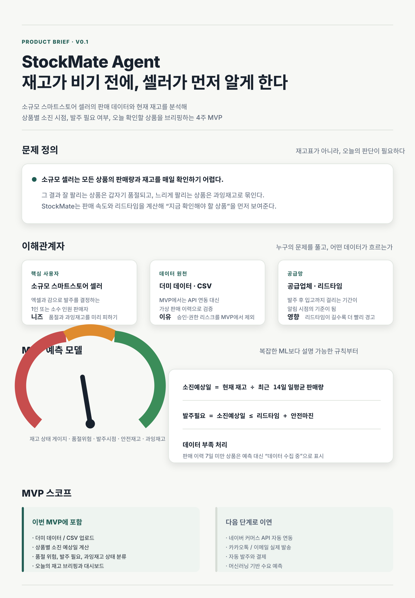
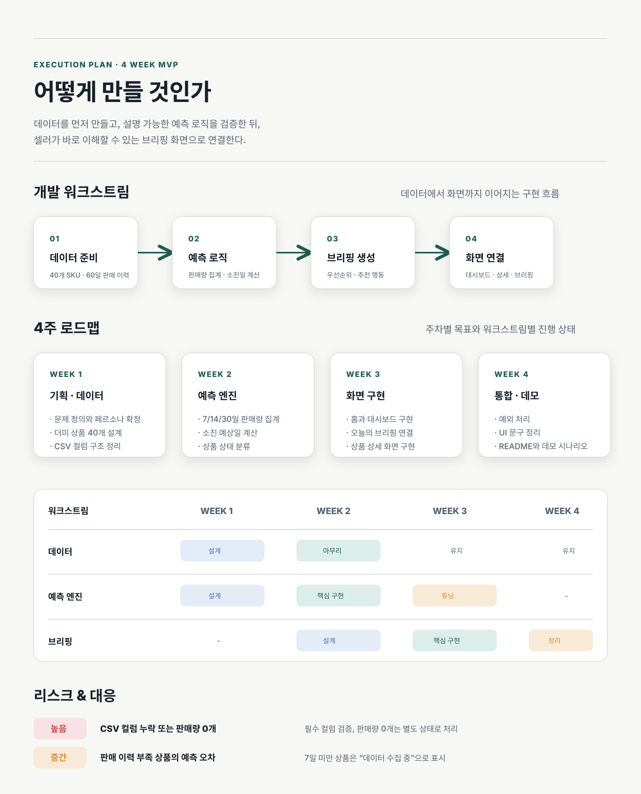
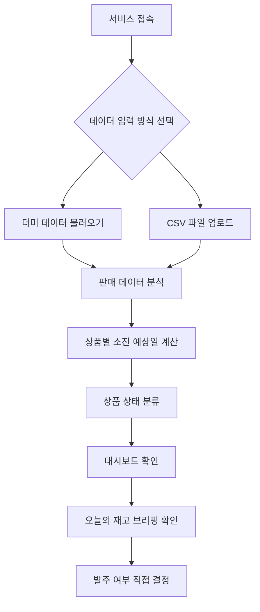
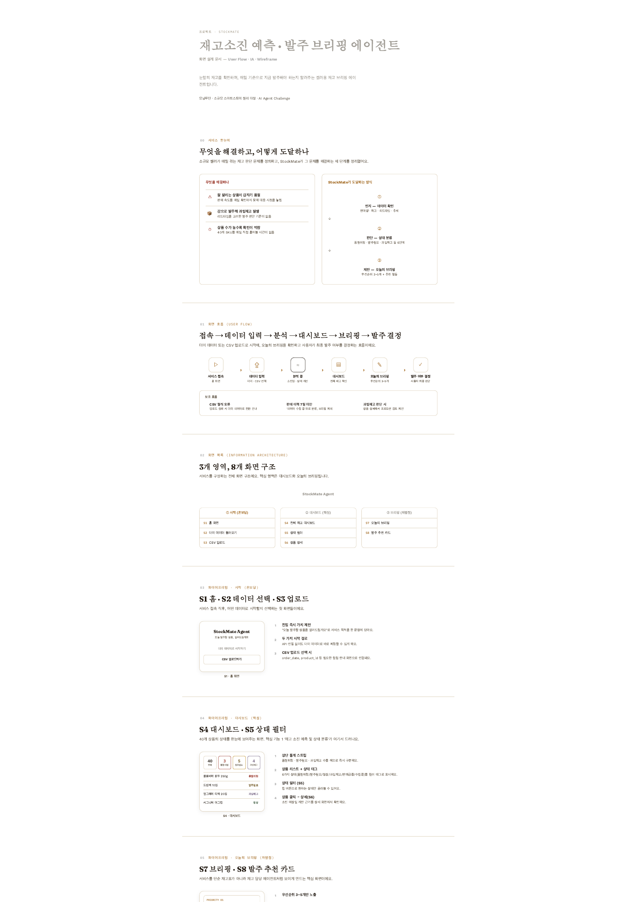
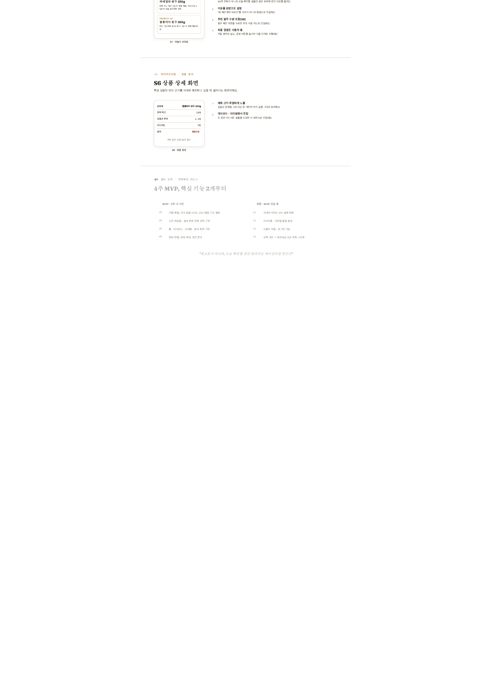
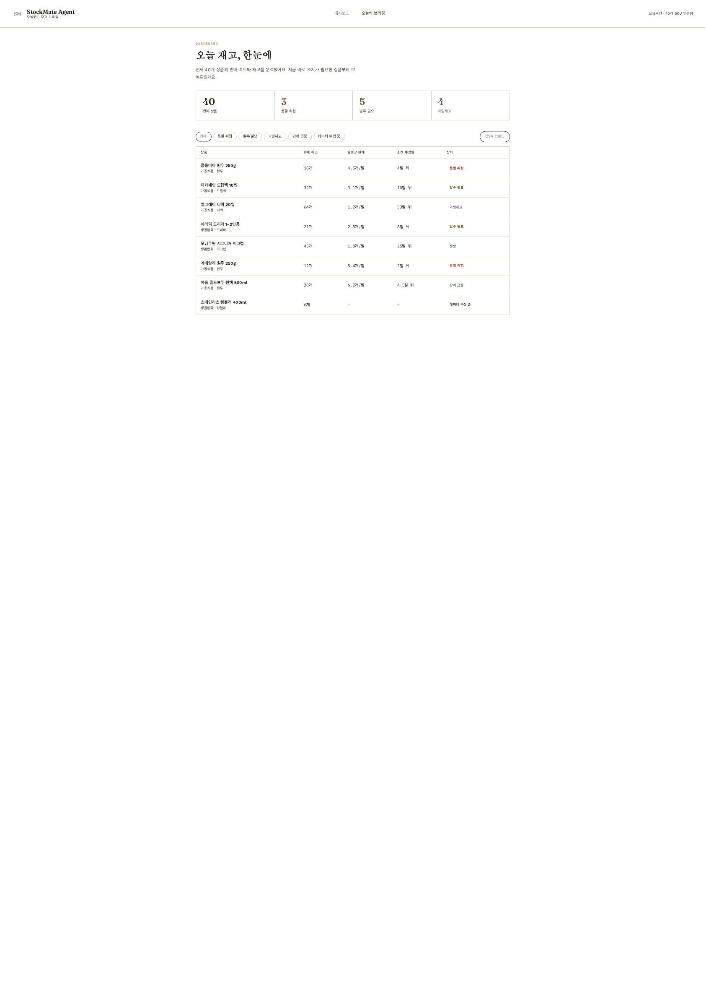

# StockMate Agent

> 소규모 스마트스토어 셀러를 위한 **재고소진 예측 및 발주 타이밍 브리핑 에이전트**

StockMate Agent는 판매 데이터와 현재 재고를 기반으로 상품별 재고 소진 시점을 예측하고, 오늘 발주하거나 확인해야 할 상품을 알려주는 재고관리 에이전트 MVP입니다.

---

## 시각 브리프

---

## 프로젝트 소개

소규모 스마트스토어 셀러는 별도의 재고관리 시스템 없이 엑셀, 스마트스토어 관리자 화면, 감에 의존해 재고를 관리하는 경우가 많습니다.

상품 수가 늘어나면 모든 상품의 판매량과 재고를 매일 직접 확인하기 어려워지고, 그 결과 잘 팔리는 상품은 품절되고 잘 팔리지 않는 상품은 과잉재고로 쌓이는 문제가 반복됩니다.

StockMate Agent는 이런 문제를 해결하기 위해 상품별 판매 속도, 현재 재고, 리드타임을 분석하고 **오늘 확인해야 할 상품과 추천 행동**을 브리핑합니다.

---

## 해결하고자 하는 문제

**소규모 스마트스토어 셀러가 여러 상품의 판매량과 재고를 매일 직접 확인하지 못하는 상황에서, 어떤 상품이 곧 품절되거나 과잉재고가 되는지 제때 판단하지 못하는 불편을 겪는다.**

---

## 핵심 기능

### 1. 재고 소진 예측 및 상태 분류

상품별 판매량과 현재 재고를 바탕으로 소진 예상일을 계산하고, 상품 상태를 자동으로 분류합니다.

- 품절 위험
- 발주 필요
- 정상
- 과잉재고
- 판매 급증
- 데이터 수집 중

### 2. 오늘의 재고 브리핑

전체 상품 중 오늘 확인해야 할 상품 3~5개를 우선순위로 골라 문장형 브리핑을 제공합니다.

브리핑에는 다음 정보가 포함됩니다.

- 왜 이 상품을 확인해야 하는지
- 예상 소진 시점
- 추천 발주 수량
- 추천 행동

---

## MVP 범위

| 구분 | 포함 여부 | 설명 |
|---|---:|---|
| 더미 데이터 사용 | 포함 | API 없이 데모 가능 |
| CSV 데이터 업로드 | 포함 | 판매 데이터를 업로드해 분석 |
| 재고 소진 예측 | 포함 | 최근 판매량 기반으로 소진 예상일 계산 |
| 상품 상태 분류 | 포함 | 품절 위험, 발주 필요, 과잉재고 등 분류 |
| 오늘의 브리핑 | 포함 | 우선 확인 상품과 추천 행동 제공 |
| 네이버 커머스 API | 제외 | 승인 및 권한 문제로 MVP 제외 |
| 자동 발주 | 제외 | 사용자가 최종 결정 |
| 머신러닝 예측 | 제외 | 규칙 기반 예측으로 시작 |

---

## 사용자 흐름

---

## 기획 문서

- [MVP 기획서 보기](docs/plan.md)
- [개발 작업 흐름 보기](docs/plan.md#15-개발-작업-흐름)
- [기획 덱 보기](docs/stockmate-planning-deck.html)
- [프로토타입 보기](docs/stockmate-prototype.html)
- [기획 덱 PDF 보기](docs/stockmate-planning-deck.pdf)
- [프로토타입 PDF 보기](docs/stockmate-prototype.pdf)

---

## 산출물 미리보기

---

## 개발 기간

4주 MVP 개발을 목표로 합니다.

1. 기획 확정 및 데이터 준비
2. 예측 로직 구현
3. 화면 구현
4. 통합 및 데모 준비
