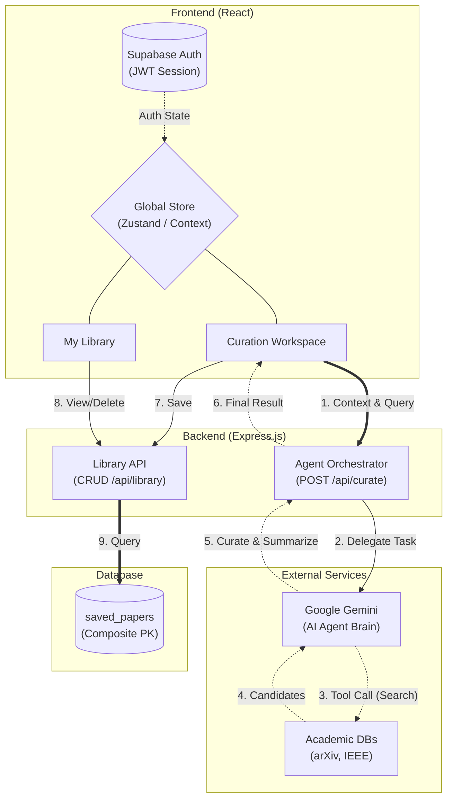

# Scholar-Sync AI Agent
> 대학(원)생의 논문 탐색 피로도를 획기적으로 줄여주는 지능형 큐레이션 및 요약 비서

## 프로젝트 소개
Scholar-Sync AI는 매일 쏟아지는 방대한 논문 데이터베이스 속에서 연구자(대학원생/학부생)에게 꼭 필요한 핵심 논문만 찾아 매칭해주는 AI 에이전트입니다. 유저의 관심 키워드를 기반으로 논문을 큐레이션하고, 읽기 벅찬 영문 초록(Abstract)을 3줄 요약으로 제공하여 정보 과부하와 인지적 피로감을 겪는 연구자들의 문제를 해결합니다.

## 관련 문서 (Documents)
프로젝트의 상세한 기획 및 일정은 아래 문서에서 확인할 수 있습니다.
* **[상세 기획서 (Wiki)](https://github.com/Alexarius/hub/wiki/%EA%B8%B0%ED%9A%8D%EC%84%9C)**: 문제 정의, 사용자 시나리오, 핵심 기능 정의 및 화면 흐름도(User Flow)
* **[개발 백로그 스프레드시트](https://docs.google.com/spreadsheets/d/1k5W1fF0SV-dF4GKP585a6TxhkL57EeBVBypdSdcgCDs/edit?usp=sharing)**: 주차별 세부 개발 일정, 수직 슬라이스 관리 및 Task Breakdown
* **[2주차 일별 대시보드](https://docs.google.com/spreadsheets/d/1AiwgA11tw1gZcz_hsqH0iV2EjA77c9et_VEEjgog3ak/edit?usp=sharing)**: 2주차 일일 진행 상황 모니터링 및 버닝다운 차트 관리
* **[3주차 일별 대시보드](https://docs.google.com/spreadsheets/d/1KOr7yJ7yiS-P5uJ1jNALG-gzISh6O1KyQ8HssnlXCco/edit?usp=sharing)**: 3주차 일일 진행 상황 모니터링 및 버닝다운 차트 관리

## 핵심 기능 요약
- **지능형 논문 큐레이션:** 사용자 프로필(전공/키워드) 임베딩 벡터 유사도를 분석하여 맞춤형 '관련도 점수(%)' 매칭
- **한국어 3줄 요약 (Output):** 긴 영문 초록을 직관적인 3줄 핵심 방법론/결과 요약으로 변환
- **내 서재 아카이빙:** 큐레이팅된 관심 논문 저장 및 동적 리스트 관리

## 웹 서비스 아키텍처 및 데이터 흐름 (Web Service Architecture & Data Flow)

