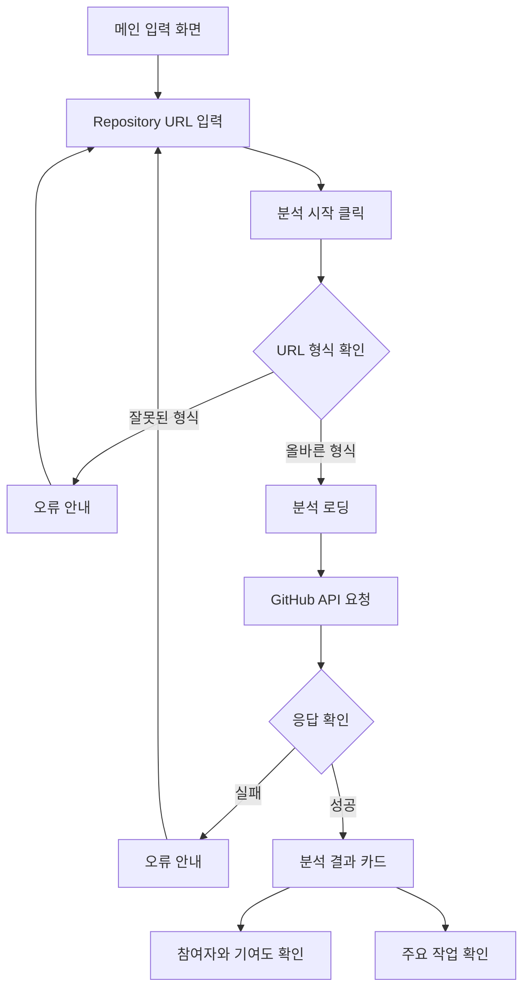

# PtoP(Project to Portfolio)

PtoP는 GitHub Repository를 분석해 대학생 개발자가 프로젝트 경험을 다시 복기하고, 포트폴리오와 회고로 확장할 수 있는 작업 단서를 정리해주는 서비스입니다.

## 문제 정의

프로젝트 경험을 쌓는 대학생 개발자는 프로젝트가 끝난 뒤 시간이 지나면 자신이 맡은 역할, 기여도, 핵심 구현 내용, 문제 해결 과정을 정확히 기억하고 정리하기 어렵습니다.

## 서비스 목표

PtoP는 Repository를 입력하면 참여자, 기여도, 주요 커밋 흐름을 확인하고, 사용자가 “내가 어떤 작업을 했는지” 설명할 수 있는 단서를 제공하는 것을 목표로 합니다.

현재 MVP는 기능을 넓히기보다 다음 흐름을 탄탄하게 만드는 데 집중했습니다.

- GitHub Repository URL 입력
- GitHub API 기반 참여자 조회
- commit 수 기준 기여도 계산
- 최근 commit message 기반 주요 작업 표시
- API 실패 시 임의 결과를 만들지 않고 오류 안내

## 핵심 기능

### 1. Repository 분석 기능

GitHub Repository URL을 입력하면 GitHub 공개 API를 통해 Repository 기본 정보, 참여자, commit 수, 최근 commit message를 가져옵니다.

### 2. 작업 내용 정리 기능

Repository owner의 최근 commit message를 보여줘 사용자가 자신이 주로 어떤 작업을 했는지 빠르게 복기할 수 있게 합니다.

## 화면 흐름



## 실행 방법

```bash
npm install
npm run dev
```

브라우저에서 아래 주소로 접속합니다.

```text
http://127.0.0.1:5173/
```

## 프로토타입 확인

React 메인 페이지와 동일한 흐름을 HTML/CSS/Vanilla JavaScript로도 확인할 수 있습니다.

- [HTML/CSS 프로토타입](./prototype/index.html)

정적 파일로 확인하려면 프로젝트 루트에서 간단한 서버를 실행합니다.

```bash
python3 -m http.server 4177
```

브라우저에서 아래 주소로 접속합니다.

```text
http://127.0.0.1:4177/prototype/index.html
```

## 문서

- [GitHub Wiki](https://github.com/SubJeeLee/hub/wiki)
- [PtoP 기획서](./docs/plan.md)
- [Wiki용 기획서](./docs/wiki-home.md)
- [Day4 작업 계획](./docs/day4-plan.md)
- [PtoP 디자인 시스템](./docs/design-system.md)
- [PtoP 디자인 Skill](./docs/ptop-design-skill.md)
- [1주차 작업 체크리스트](./docs/checklist.md)
- [Git Repository 분석 학습 노트](./docs/repo-analysis-study.md)
- [PtoP 테스트 케이스](./docs/test-cases.md)
- [기획하기 with AI 가이드](./docs/planning-tip.md)

## 기술 스택

- React
- Vite
- HTML
- CSS
- Vanilla JavaScript
- GitHub REST API

## 현재 MVP에서 제외한 것

- 프로젝트 폴더 업로드
- README 전체 분석
- 코드 파일 내용 분석
- PR/Issue 분석
- AI 기반 회고 문장 자동 생성
- Notion, GitHub Pages 내보내기
- 여러 프로젝트 비교
