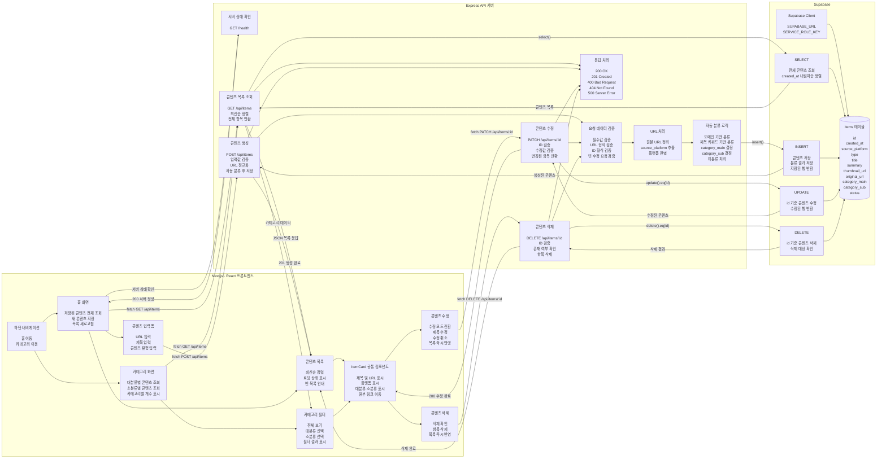

## 전체 프로젝트 아키텍처

```mermaid
flowchart LR

    %% =========================
    %% Frontend
    %% =========================
    subgraph FRONTEND["Next.js · React 프론트엔드"]
        direction TB

        HOME["홈 화면<br/><br/>저장된 콘텐츠 전체 조회<br/>새 콘텐츠 저장<br/>목록 새로고침"]

        INPUT["콘텐츠 입력 폼<br/><br/>URL 입력<br/>제목 입력<br/>콘텐츠 유형 입력"]

        LIST["콘텐츠 목록<br/><br/>최신순 정렬<br/>로딩 상태 표시<br/>빈 목록 안내"]

        CARD["ItemCard 공통 컴포넌트<br/><br/>제목 및 URL 표시<br/>플랫폼 표시<br/>대분류·소분류 표시<br/>원본 링크 이동"]

        EDIT["콘텐츠 수정<br/><br/>수정 모드 전환<br/>제목 수정<br/>수정 취소<br/>목록 즉시 반영"]

        REMOVE["콘텐츠 삭제<br/><br/>삭제 확인<br/>항목 삭제<br/>목록 즉시 반영"]

        CATEGORY_PAGE["카테고리 화면<br/><br/>대분류별 콘텐츠 조회<br/>소분류별 콘텐츠 조회<br/>카테고리별 개수 표시"]

        CATEGORY_FILTER["카테고리 필터<br/><br/>전체 보기<br/>대분류 선택<br/>소분류 선택<br/>필터 결과 표시"]

        NAV["하단 내비게이션<br/><br/>홈 이동<br/>카테고리 이동"]

        HOME --> INPUT
        HOME --> LIST
        LIST --> CARD
        CARD --> EDIT
        CARD --> REMOVE

        CATEGORY_PAGE --> CATEGORY_FILTER
        CATEGORY_FILTER --> CARD

        NAV --> HOME
        NAV --> CATEGORY_PAGE
    end


    %% =========================
    %% Express Server
    %% =========================
    subgraph SERVER["Express API 서버"]
        direction TB

        HEALTH["서버 상태 확인<br/><br/>GET /health"]

        GET_ITEMS["콘텐츠 목록 조회<br/><br/>GET /api/items<br/>최신순 정렬<br/>전체 항목 반환"]

        CREATE_ITEM["콘텐츠 생성<br/><br/>POST /api/items<br/>입력값 검증<br/>URL 정규화<br/>자동 분류 후 저장"]

        UPDATE_ITEM["콘텐츠 수정<br/><br/>PATCH /api/items/:id<br/>ID 검증<br/>수정값 검증<br/>변경된 항목 반환"]

        DELETE_ITEM["콘텐츠 삭제<br/><br/>DELETE /api/items/:id<br/>ID 검증<br/>존재 여부 확인<br/>항목 삭제"]

        VALIDATION["요청 데이터 검증<br/><br/>필수값 검증<br/>URL 형식 검증<br/>ID 형식 검증<br/>빈 수정 요청 검증"]

        URL_PROCESS["URL 처리<br/><br/>원본 URL 정리<br/>source_platform 추출<br/>플랫폼 판별"]

        CLASSIFY["자동 분류 로직<br/><br/>도메인 기반 분류<br/>제목 키워드 기반 분류<br/>category_main 결정<br/>category_sub 결정<br/>미분류 처리"]

        RESPONSE["응답 처리<br/><br/>200 OK<br/>201 Created<br/>400 Bad Request<br/>404 Not Found<br/>500 Server Error"]

        GET_ITEMS --> RESPONSE

        CREATE_ITEM --> VALIDATION
        VALIDATION --> URL_PROCESS
        URL_PROCESS --> CLASSIFY

        UPDATE_ITEM --> VALIDATION
        DELETE_ITEM --> VALIDATION
    end


    %% =========================
    %% Supabase
    %% =========================
    subgraph DATABASE["Supabase"]
        direction TB

        CLIENT["Supabase Client<br/><br/>SUPABASE_URL<br/>SERVICE_ROLE_KEY"]

        ITEMS[("items 테이블<br/><br/>id<br/>created_at<br/>source_platform<br/>type<br/>title<br/>summary<br/>thumbnail_url<br/>original_url<br/>category_main<br/>category_sub<br/>status")]

        SELECT["SELECT<br/><br/>전체 콘텐츠 조회<br/>created_at 내림차순 정렬"]

        INSERT["INSERT<br/><br/>콘텐츠 저장<br/>분류 결과 저장<br/>저장된 행 반환"]

        UPDATE["UPDATE<br/><br/>id 기준 콘텐츠 수정<br/>수정된 행 반환"]

        DELETE["DELETE<br/><br/>id 기준 콘텐츠 삭제<br/>삭제 대상 확인"]

        CLIENT --> ITEMS
        SELECT --> ITEMS
        INSERT --> ITEMS
        UPDATE --> ITEMS
        DELETE --> ITEMS
    end


    %% =========================
    %% Frontend → API
    %% =========================
    HOME -->|"서버 상태 확인"| HEALTH

    HOME -->|"fetch GET /api/items"| GET_ITEMS
    CATEGORY_PAGE -->|"fetch GET /api/items"| GET_ITEMS

    INPUT -->|"fetch POST /api/items"| CREATE_ITEM

    EDIT -->|"fetch PATCH /api/items/:id"| UPDATE_ITEM

    REMOVE -->|"fetch DELETE /api/items/:id"| DELETE_ITEM


    %% =========================
    %% API → Supabase
    %% =========================
    GET_ITEMS -->|"select()"| SELECT

    CLASSIFY -->|"insert()"| INSERT

    UPDATE_ITEM -->|"update().eq(id)"| UPDATE

    DELETE_ITEM -->|"delete().eq(id)"| DELETE


    %% =========================
    %% Supabase → API
    %% =========================
    SELECT -->|"콘텐츠 목록"| GET_ITEMS

    INSERT -->|"생성된 콘텐츠"| CREATE_ITEM

    UPDATE -->|"수정된 콘텐츠"| UPDATE_ITEM

    DELETE -->|"삭제 결과"| DELETE_ITEM


    %% =========================
    %% API Response → Frontend
    %% =========================
    HEALTH -->|"200 서버 정상"| HOME

    GET_ITEMS -->|"JSON 목록 응답"| LIST
    GET_ITEMS -->|"카테고리 데이터"| CATEGORY_FILTER

    CREATE_ITEM -->|"201 생성 완료"| LIST

    UPDATE_ITEM -->|"200 수정 완료"| CARD

    DELETE_ITEM -->|"삭제 완료"| LIST

    CREATE_ITEM --> RESPONSE
    UPDATE_ITEM --> RESPONSE
    DELETE_ITEM --> RESPONSE
```
