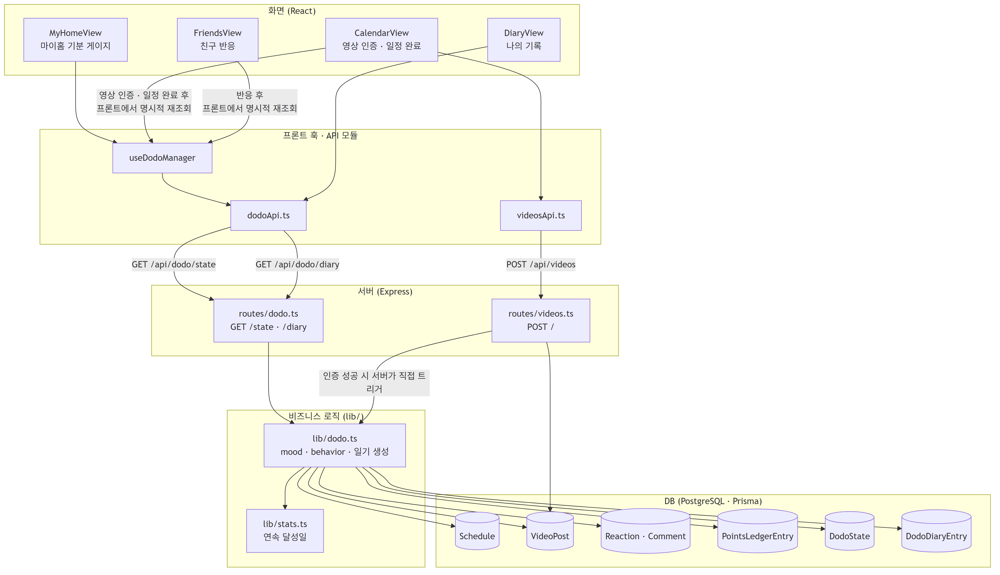
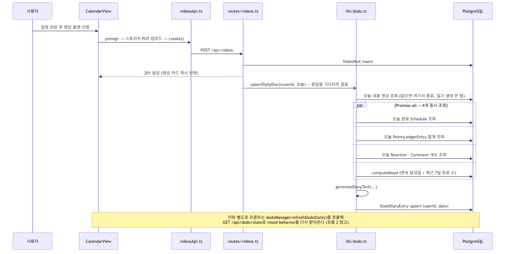
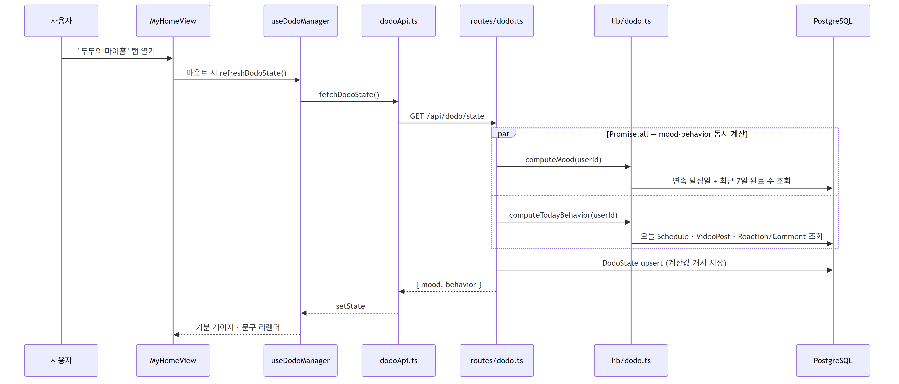
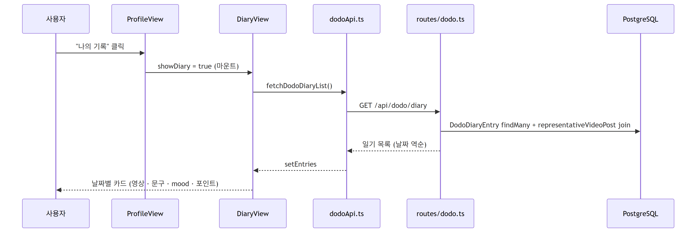

# We should do..

친구와 할 일을 공유하고, 완료 보상으로 캐릭터 **두두(DODO)**와 마이룸을 꾸미는 소셜 할 일 앱입니다.

## 문제 정의

할 일을 해낼 즉각적인 동기가 부족하면 해야 할 일을 계속 미루게 됩니다. `We should do..`는 현실의 할 일 완료를 친구의 반응, 포인트, 두두와 마이룸의 성장으로 연결합니다.

## 핵심 경험

```text
할 일 기록·공유
→ 완료 및 영상 인증
→ 친구 반응과 포인트
→ 두두·마이룸 꾸미기
→ 친구 방문과 건강한 경쟁
→ 다음 할 일을 수행할 동기
```

## 주요 기능

- 사용자 카테고리 기반 할 일 및 일정 관리
- 카테고리별 친구 그룹 공개 설정
- 영상 완료 인증과 친구 반응
- 완료 활동을 정리하는 두두의 오늘 일기
- 포인트를 활용한 두두 돌보기와 꾸미기
- 마이룸 가구 배치 및 친구 방문
- 친구와의 성취 기록 및 꾸미기 비교

## 두두 mood·일기 알고리즘 데이터 흐름

화면 컴포넌트가 훅/API 모듈을 거쳐 서버 라우트를 부르고, 라우트는 `lib/`의 순수 로직에 계산을 맡긴 뒤 그 로직이 직접 DB를 읽고 씁니다. 두두 상태 재조회는 영상 인증뿐 아니라 **일정 완료**(`CalendarView`)와 **친구 반응**(`FriendsView`)에서도 프론트가 명시적으로 트리거합니다. (이미지 클릭 시 원본 크기로 볼 수 있습니다.)

[](./docs/dodo-flow-overview.png)

### 흐름 1 — 영상 인증이 오늘의 일기를 만든다

`videos.ts`의 `POST /` 핸들러는 영상을 DB에 저장한 뒤 `upsertDailyDiary`를 **await 없이(fire-and-forget)** 호출합니다. 영상 업로드 자체는 일기 생성 성공 여부와 무관하게 바로 응답합니다. `upsertDailyDiary` 내부에서 대표 영상 조회 이후 나머지 4개 쿼리는 `Promise.all`로 동시에 실행됩니다.

[](./docs/dodo-flow-1-certify.png)

### 흐름 2 — 마이홈을 열면 mood·행동을 다시 계산한다

`DodoState`는 캐시일 뿐, 응답값은 매번 그 자리에서 새로 계산됩니다. 저장은 "다음에 볼 때 참고용"이지 신뢰의 원천이 아닙니다. `computeMood`와 `computeTodayBehavior`도 `Promise.all`로 동시에 실행됩니다. `MyHomeView`는 탭을 나갔다 들어올 때마다 새로 마운트되므로, 그때마다 `refreshDodoState()`가 다시 호출돼 시간 경과로 바뀐 상태(마감 임박 등)를 반영합니다.

[](./docs/dodo-flow-2-myhome.png)

### 흐름 3 — 나의 기록은 저장된 값을 그대로 보여준다

여기서 부르는 `GET /api/dodo/diary`(목록)는 저장돼 있는 `DodoDiaryEntry`를 그대로 읽기만 합니다. 재계산은 오늘 날짜 한 건을 `GET /api/dodo/diary/:date`로 조회할 때만 일어나는데, 지금 `DiaryView`는 그 엔드포인트를 쓰지 않아서 목록 화면에서는 트리거되지 않습니다.

[](./docs/dodo-flow-3-diary-list.png)

## 문서

- [서비스 기획서](./서비스%20기획서.md)
- [개발 백로그](./docs/개발백로그.md)
- [DB 스키마](./docs/DB스키마.md)

## 실행 방법

Node.js와 pnpm이 설치된 환경에서 실행합니다. 프론트엔드와 백엔드를 각각 별도 터미널에서 띄워야 합니다.

### 프론트엔드

```bash
pnpm install
cp .env.example .env   # VITE_API_BASE_URL 확인
pnpm dev
```

프로덕션 빌드 확인:

```bash
pnpm build
```

### 백엔드 (server/)

```bash
cd server
pnpm install
cp .env.example .env   # DATABASE_URL에 Postgres 연결 문자열 입력
pnpm prisma:migrate
pnpm prisma:seed
pnpm dev
```

기본적으로 백엔드는 4000번 포트, 프론트엔드는 5173번 포트에서 동작합니다.
