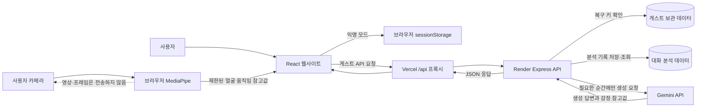
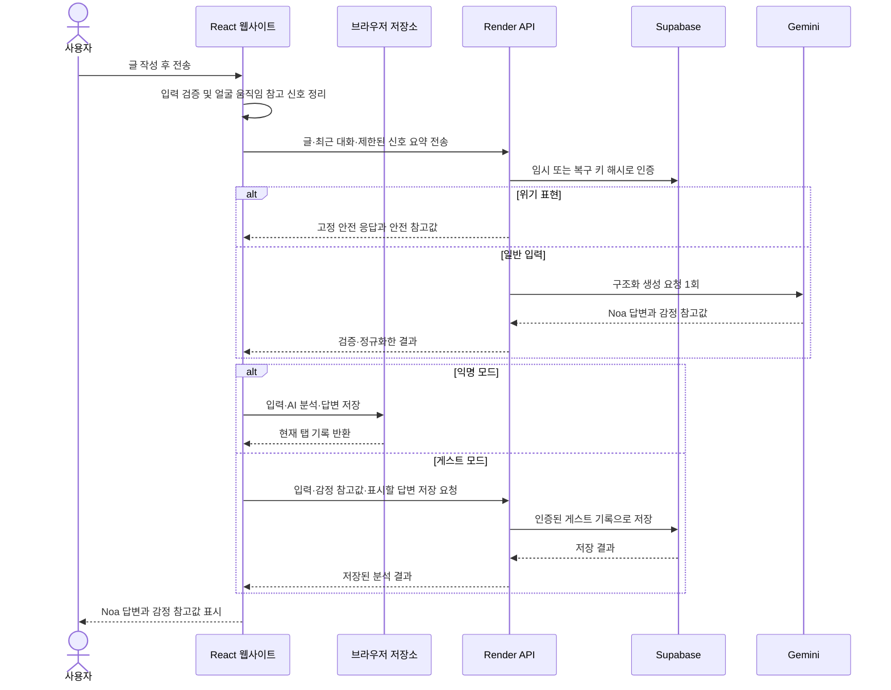

# Noa AI

Noa AI는 사용자가 현재 상황을 이야기하고 선택적으로 카메라 기반 얼굴 움직임
신호를 참고해 대화를 이어가는 웹서비스입니다. 감정 결과는 가능성과 참고값으로만
표시하며 의료적·심리적 진단을 제공하지 않습니다.

- 프로덕션 웹: https://hub-five-topaz.vercel.app

## 현재 사용자 흐름

화면은 세 상태가 순서대로 전환됩니다.

```text
익명·게스트 시작
→ 대화와 선택적 카메라 분석
→ 감정 신호 참고값과 회전 지구본
→ 다시 대화하거나 처음으로 이동
```

### 익명 모드

- 현재 탭의 `sessionStorage`만 사용합니다.
- 브라우저 탭을 닫으면 익명 기록이 사라집니다.
- AI 호출용 임시 키만 서버에서 발급하며 복구 키로 표시하거나 영구 보관하지 않습니다.
- 글을 전송할 때 Gemini가 답변과 감정 참고값을 함께 생성합니다.
- 대화 기록은 서버 DB가 아니라 현재 탭에만 저장합니다.

### 게스트 모드

- 서버가 만든 무작위 복구 키로 시작합니다.
- 복구 키 원문은 서버와 DB에 저장하지 않고 보호된 형태로만 확인합니다.
- 활성 키는 현재 탭의 `sessionStorage`에만 보관합니다.
- 키로 인증된 해당 게스트의 기록만 저장하고 복원합니다.
- 기본 보관 기간은 30일입니다.
- 게스트에서 나가면 현재 탭의 키만 제거되고 서버 기록은 유지됩니다.

## 전체 데이터 흐름



- 익명 대화 기록은 브라우저 탭에만 저장하고 AI 호출용 임시 서버 세션은 종료 시 삭제합니다.
- 게스트 데이터는 복구 키 인증을 거쳐 해당 게스트 기록만 서버에서 처리합니다.
- 카메라 원본은 브라우저 밖으로 보내지 않습니다.
- Gemini는 익명 또는 게스트 사용자가 글을 전송할 때만 호출합니다.

## 사용자가 글을 작성할 때의 데이터 흐름



생성형 AI가 실패하면 가짜 분석이나 대체 답변을 만들지 않고 오류를 표시합니다.
사용량 한도에 도달한 경우에는 `Noa는 자고 있어요.`를 표시합니다.

## AI와 감정 분석

전송 후 확정되는 감정 점수와 답변은 Gemini의 한 번의 구조화 응답으로 생성합니다.
브라우저의 규칙 기반 값은 카메라 사용 중 실시간 미리보기로만 사용합니다.

```text
임시 또는 게스트 인증
→ 입력과 필요한 최근 대화 검증
→ 위기 표현은 서버의 고정 안전 응답
→ Gemini 구조화 단일 요청
→ 서버에서 점수 합계와 출력 형식 검증
→ 생성 답변과 AI 감정 분석 기록 저장
```

- AI 요청에는 시간과 사용량 제한을 적용합니다.
- Gemini 장애나 타임아웃은 오류로 표시하며 가짜 분석으로 대체하지 않습니다.
- 무료 토큰 또는 요청 한도에 도달하면 `Noa는 자고 있어요.`를 표시합니다.
- 백그라운드 호출, 폴링, WebSocket, SSE와 keep-alive 요청은 없습니다.

무료 Gemini 등급은 전송된 내용을 제공자의 제품 개선에 사용할 수 있습니다. 이
사실은 게스트 입력 화면에도 안내합니다.

## 카메라와 개인정보

카메라는 사용자가 `카메라 시작`을 눌렀을 때만 실행됩니다.

```text
카메라 영상
→ 브라우저 내부 MediaPipe Face Landmarker
→ 허용된 blendshape 특징
→ 최근 결과 안정화
→ 얼굴 움직임 참고 신호
```

서버로 전송하지 않는 항목:

- 영상, 사진, 프레임
- 얼굴 랜드마크 좌표
- 전체 blendshape 점수
- 카메라 장치 식별 정보

게스트 기록에 저장할 수 있는 항목:

- `manual` 또는 `camera` 출처
- 0~1 범위의 안정화된 표현 신호 유사도
- 허용된 특징 이름 최대 3개
- 휴리스틱 버전

카메라 화면을 종료하거나 다른 화면으로 이동하면 MediaStream 트랙과 분석
런타임을 정리합니다.

## 결과 지구본

결과 화면은 COBE WebGL 지구본으로 상위 감정 신호 세 개를 표현합니다.

- 평소에는 천천히 자동 회전합니다.
- 분석 중에는 조금 빠르게 회전합니다.
- 마우스와 터치 드래그로 직접 회전할 수 있습니다.
- `prefers-reduced-motion`에서는 자동 회전을 멈춥니다.
- 화면을 떠날 때 애니메이션, ResizeObserver와 WebGL 인스턴스를 정리합니다.
- WebGL 초기화 실패 시 CSS 구체를 표시합니다.

지구본은 시각적 보조 수단입니다. 같은 결과를 텍스트와 progressbar로도 제공합니다.

## 배포 구조

```text
React/Vite · Vercel
  └─ same-origin /api rewrite
       └─ Express · Render Free
            ├─ Supabase Free
            └─ Gemini Developer API Free
```

Vercel은 `/api/:path*`를 Render로 먼저 전달하고 나머지 경로를 SPA
`index.html`로 처리합니다. 브라우저에는 Supabase나 Gemini 비밀키를 제공하지
않습니다.

## 기술 스택

- Frontend: React 18, Vite 8
- Backend: Express 5
- Database: Supabase
- Generative AI: Gemini Developer API
- Camera analysis: MediaPipe Face Landmarker
- Globe: COBE 2
- Deployment: Vercel, Render

## 로컬 실행

```bash
npm install
npm run dev
```

백엔드를 별도 실행하려면:

```bash
npm run server
```

## 서버와 데이터 보호

- 운영 비밀값은 배포 서비스의 비공개 환경설정에서 관리하고 Git에 저장하지 않습니다.
- 브라우저는 데이터베이스나 생성형 AI 공급자에 직접 접근하지 않습니다.
- 게스트 생성·복구, 대화 생성, 분석 저장과 조회는 모두 서버의 검증을 거칩니다.
- 저장 데이터는 인증된 게스트별로 분리하며 브라우저의 직접 DB 접근을 막습니다.
- AI가 준비되지 않았거나 요청에 실패하면 기록을 저장하지 않고 재시도 오류를 표시합니다.

## 빌드 확인

```bash
npm run build
```

## 현재 제한

- 확정 감정 점수는 Gemini가 생성하는 참고값이며 의료적·심리적 진단이 아닙니다.
- 카메라 실시간 미리보기는 얼굴 움직임 기반 휴리스틱이라 실제 내적 감정을 확정하지 않습니다.
- 음성은 실제 녹음·분석이 아니라 사용자가 어조 신호를 선택합니다.
- 회원 계정 로그인은 없으며 게스트 복구 키가 저장 기록의 접근 수단입니다.
- 무료 Render는 첫 요청에 콜드 스타트 지연이 생길 수 있습니다.
- 무료 Gemini 할당량과 데이터 사용 정책은 제공자 정책의 영향을 받습니다.
- 서버 기록 삭제 API는 있으나 현재 UI에는 별도 삭제 확인 화면이 없습니다.
