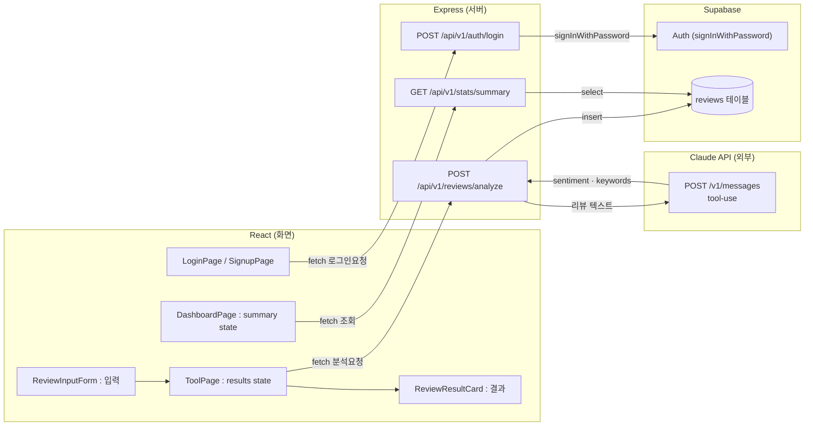

# 🍊 리뷰 매니저 AI

소상공인이 손님 리뷰를 붙여넣으면 감정 분석·키워드 추출·반복 문제 감지·답변 초안 3종을 제공하고, 리뷰마다 AI 점수를 매겨 총 분석·월별 통계까지 보여주는 리뷰 관리 도구입니다. (구 "리뷰 답변 도우미")

## 🚀 배포

- **프론트엔드**: [hub-lovat-omega.vercel.app](https://hub-lovat-omega.vercel.app) (Vercel)
- **백엔드**: [review-assistant-server.onrender.com](https://review-assistant-server.onrender.com) (Render, `/health`로 상태 확인 가능)

## 📄 관련 문서
- [기획서](https://github.com/rldbs5353/hub/wiki/기획서-작성)
- [개발 환경 / 컨벤션 (CLAUDE.md)](CLAUDE.md)
- [개발 Task / 4주 로드맵 (TASKS.md)](TASKS.md)

## 프로젝트 구성

- `review-assistant-react/` — 프론트엔드 (Vite + React)
- `review-assistant-server/` — 백엔드 (Express + Supabase)

## 아키텍처

로그인/리뷰 분석/총 분석 화면, 각각 실제 컴포넌트 → 실제 엔드포인트 → Claude API / Supabase(DB+Auth)로 이어지는 실제 흐름입니다.

- `LoginPage`/`SignupPage`는 코드 변경 없이 그대로입니다 — 백엔드가 대신 Supabase Auth를 불러주는 구조라, 프론트는 여전히 우리 서버(`/api/v1/auth/*`)만 호출합니다.
- `ToolPage`가 `POST /analyze`를 부르면, 서버는 `score`는 직접 계산하고 `sentiment`/`keywords`만 Claude API에 물어본 뒤 Supabase `reviews` 테이블에 `insert`합니다.
- `DashboardPage`는 Claude를 부르지 않고 `reviews` 테이블을 `select`해서 집계만 합니다.
