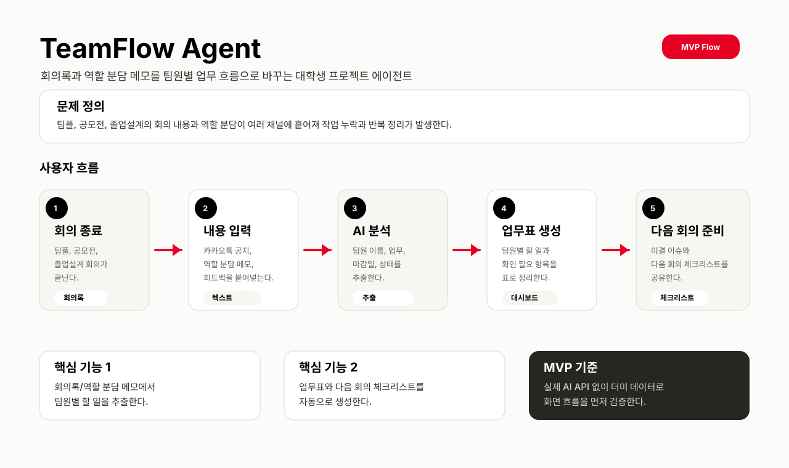
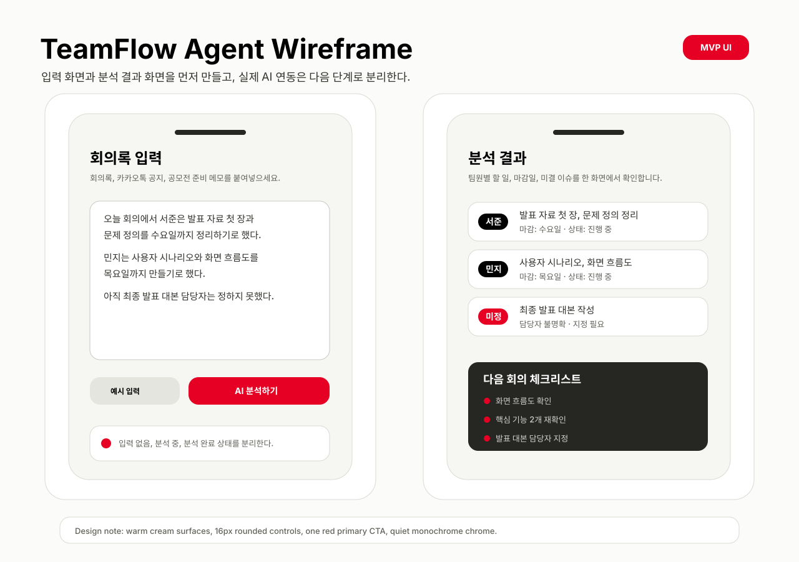

# TeamFlow Agent

대학생 팀플, 공학설계, 졸업설계, 공모전, 동아리 프로젝트에서 회의록과 역할 분담 메모에 흩어진 할 일을 정리해주는 AI 에이전트 기획입니다.

## 서비스 한 줄 설명

TeamFlow Agent는 프로젝트 문서와 회의 내용을 분석해 `누가`, `무엇을`, `언제까지` 해야 하는지 자동으로 정리해주는 대학생 프로젝트 업무 흐름 정리 에이전트입니다.

## 문서

- [기초 개발 기획서](docs/plan.md)
- [작업 분해 체크리스트](docs/checklist.md)
- [PR 설명 초안](docs/pr-description-draft.md)

## 기획 시각화

## 현재 개발 방향

오늘 단계에서는 실제 AI API나 외부 서비스 연동보다, 기획서와 작업 분해를 먼저 정리합니다.

1. 문제 정의와 사용자 시나리오를 명확히 정리합니다.
2. 핵심 기능을 2개로 좁힙니다.
3. Mermaid 사용자 흐름도로 서비스 흐름을 시각화합니다.
4. 이후 기초 화면 개발을 위한 작업 단위로 분해합니다.

## MVP 핵심 기능

- 회의록/역할 분담 메모에서 팀원별 할 일 추출
- 팀원별 업무표와 다음 회의 체크리스트 생성

## 향후 확장

대학생 프로젝트 관리에서 시작해 건축, 조선, 플랜트, 제조 프로젝트의 협력업체 업무 흐름 관리로 확장할 수 있습니다.
