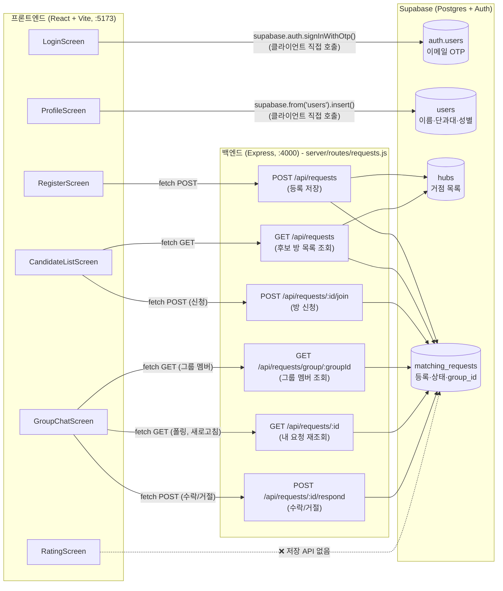

# hub
## 문서
- [기획서](https://github.com/gyu-young-04/hub/wiki/plan.md)
- [작업 체크리스트 (백로그)](https://github.com/gyu-young-04/hub/wiki/checklist.md)
- [주간 계획](docs/weekly-plan.md)
- [디자인 시스템](design_handoff_ridesplit/README.md)
- [백로그(체크리스트)](https://github.com/gyu-young-04/hub/wiki/checklist.md)
- [프로젝트 보드 url](https://github.com/users/gyu-young-04/projects/3)

## 아키텍처 (데이터 흐름)
화면(React) · 서버(Express) · DB(Supabase)가 어떻게 연결되는지 코드 기준으로 그린 다이어그램.

### 그리면서 보인 어색한 구조
1. **경로 이원화** — `Login`/`Profile`은 Express 없이 브라우저에서 Supabase에 직접 연결하는데, `Register`/`Candidates`/`Chat`은 Express를 거침. 이 경계 기준이 문서화돼 있지 않음.
2. **`RatingScreen` 미연결** — 별점/노쇼 체크가 어떤 테이블에도 저장되지 않음. `plan.md`의 "평점/리뷰 시스템"이 화면만 있고 API가 없는 상태.
3. **실시간성 부재** — DB로 가는 화살표가 전부 단방향 요청·응답이고, 새 신청 확인도 폴링(새로고침 버튼)에 의존.

### 알려진 운영 제약
- **인증 메일 발신 도메인 미인증** — Supabase Auth의 Custom SMTP(Resend)를 연결했지만, 발신 주소가 아직 Resend의 공용 테스트 주소(`onboarding@resend.dev`)라서 Resend 정책상 계정 소유자 본인 이메일 외의 수신자에게는 발송이 차단됨. 실제로 여러 학생이 각자의 `.ac.kr` 메일로 로그인하려면, 본인 소유 도메인을 하나 구매해 Resend에 인증(DNS TXT/DKIM 등록)하고 그 도메인 주소를 발신자로 지정해야 함. 현재는 본인 계정 이메일로만 로그인 데모가 가능한 상태.
