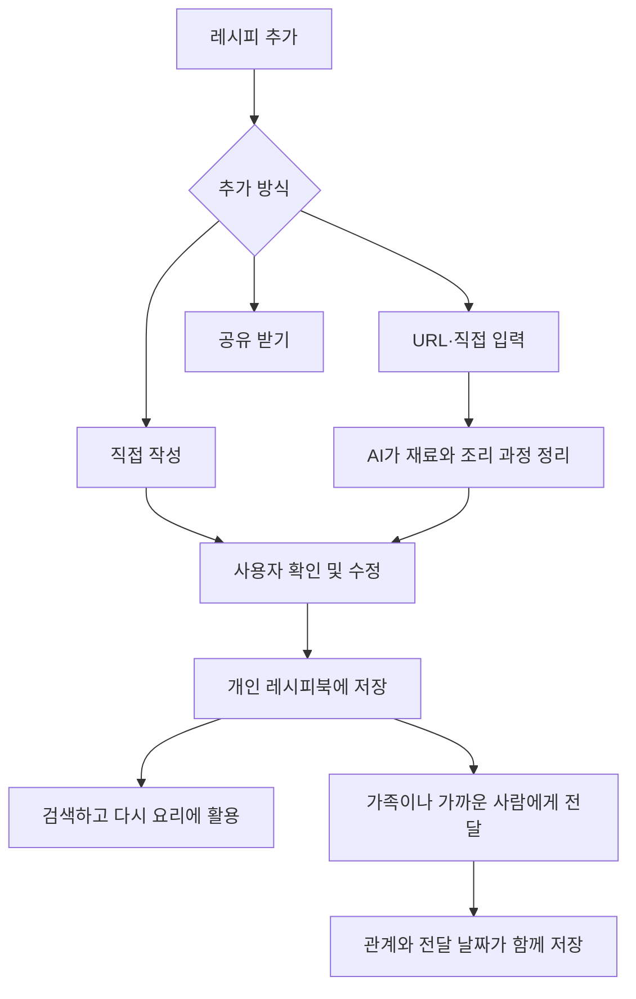

# 나만의 레시피북 서비스
직접 알고 있는 레시피와 인터넷에서 발견한 레시피를 한곳에 모으고, AI가 실제로 다시 요리하기 좋은 형태로 정리해 주는 개인 레시피북 서비스입니다.

## 문제 정의
사람들은 자신이 알고 있는 요리법, 인터넷에서 발견한 레시피, 가족에게 전해 들은 레시피를 여러 장소에 흩어진 형태로 보관합니다. 이러한 방식은 다시 찾아 활용하기 어렵고, 영상이나 자유로운 문장으로 남아 있는 요리법은 실제 조리에 사용하기 좋은 형태로 정리하기도 번거롭습니다. 

특히 부모님이나 할머니에게 전해 받은 마더 레시피는 단순한 조리 정보가 아니라 사람과 기억이 담긴 기록이지만, 일반적인 메모나 링크 공유 방식에서는 누가 전해준 레시피인지에 대한 연결과 의미가 쉽게 사라집니다.

## 핵심 기능
1. 레시피 수집 및 정리
2. 관계 중심 레시피 공유

## 기술 스택

* Frontend: React, Tailwind CSS, React Router (`react-router`)
* Backend: Express, PostgreSQL
* Authentication: Firebase Authentication

## 인증

Firebase Authentication을 사용한다. 초기 MVP에서는 Google 로그인만 제공하고, 핵심 레시피 흐름이 완성된 뒤 이메일/비밀번호와 카카오 로그인을 추가한다. Firebase는 인증에만 사용하며, 사용자와 레시피 데이터는 Express와 PostgreSQL에서 관리한다.

## 핵심 서비스 흐름


## 로컬 실행

### 사전 요구 사항

* Node.js `^20.19.0` 또는 `>=22.12.0`
* Firebase 프로젝트에서 Google 로그인 제공자를 활성화한다.
* Firebase Admin SDK용 서비스 계정 JSON 파일을 로컬의 안전한 경로에 보관한다.

### 의존성 설치

각 앱 디렉터리에서 lockfile 기준으로 의존성을 설치한다.

```bash
cd frontend
npm ci

cd ../backend
npm ci
```

### 환경 변수

환경 변수 파일은 Git에 포함하지 않는다. 현재 `.gitignore`는 `backend/.env`와 `frontend/.env.local`을 제외한다.

프론트엔드에는 `frontend/.env.local`을 만들고 Firebase Web App 설정값을 넣는다.

```dotenv
VITE_FIREBASE_API_KEY=your_firebase_web_api_key
VITE_FIREBASE_AUTH_DOMAIN=your-project.firebaseapp.com
VITE_FIREBASE_PROJECT_ID=your-project-id
VITE_FIREBASE_STORAGE_BUCKET=your-project.firebasestorage.app
VITE_FIREBASE_MESSAGING_SENDER_ID=your-messaging-sender-id
VITE_FIREBASE_APP_ID=your-firebase-app-id

# 로컬에서는 비워 두거나 생략한다. 배포 시에는 백엔드 origin을 지정한다.
VITE_API_BASE_URL=
```

`VITE_*` 값은 브라우저에 제공된다. 서비스 계정 JSON이나 Firebase Admin 비밀값은 프론트엔드 환경 변수에 넣지 않는다.

백엔드에는 `backend/.env`를 만들고 Firebase Admin Application Default Credentials 경로를 설정한다.

```dotenv
FIREBASE_PROJECT_ID=your-project-id
GOOGLE_APPLICATION_CREDENTIALS=C:/absolute/path/to/firebase-admin-service-account.json
PORT=3000
```

`GOOGLE_APPLICATION_CREDENTIALS`가 가리키는 서비스 계정 JSON은 저장소 밖에 보관하고 Commit하지 않는다.

### 개발 서버 실행

터미널 두 개에서 다음 명령을 실행한다.

```bash
# 터미널 1
cd backend
npm run dev

# 터미널 2
cd frontend
npm run dev
```

프론트엔드는 기본적으로 `http://localhost:5173`, 백엔드는 `http://localhost:3000`에서 실행된다. 로컬 프론트엔드는 Vite proxy를 통해 `/api` 요청을 백엔드로 전달하므로 `VITE_API_BASE_URL`을 설정할 필요가 없다.

### 검증 명령

```bash
cd frontend
npm run lint
npm run build

cd ../backend
npm run type-check
npm run build
```
