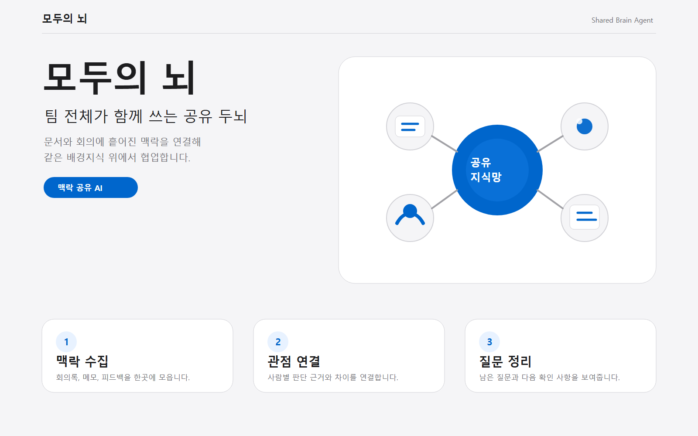

# 모두의 뇌

여러 사람이 하나의 프로젝트를 함께 진행할 때 각자 알고 있는 배경지식, 결정사항, 용어, 미결 질문을 하나의 공유 지식망으로 정리해주는 협업 맥락 AI 에이전트 기획입니다.

## 서비스 한 줄 설명

모두의 뇌는 회의록, 연구 메모, 팀 피드백, 보고서에 흩어진 프로젝트 맥락을 연결해 팀 전체가 함께 쓰는 두 번째 뇌를 만들어주는 AI 에이전트입니다.

## 문서

- [기초 개발 기획서](docs/plan.md)
- [PRD](docs/prd.md)
- [TRD](docs/trd.md)
- [프롬프트 디자인](docs/prompt-design.md)
- [시장 조사 및 경쟁 분석](docs/market-research.md)
- [디자인 산출물 링크](docs/design-assets.md)
- [Figma 디자인 시스템](docs/figma-design-system.md)
- [모두의 뇌 Design Skill](docs/modu-brain-design-skill.md)
- [Figma 개발 핸드오프](docs/figma-handoff.md)
- [작업 분해 체크리스트](docs/checklist.md)
- [PR 설명 초안](docs/pr-description-draft.md)

## 기획 시각화



- [HTML 상세 보기](docs/visualization.html)
- [Figma 보드 프리뷰](docs/figma-board-preview.html)
- [최신 데스크톱 웹 캡처](docs/images/modu-brain-web-desktop.png)
- [최신 모바일 웹 캡처](docs/images/modu-brain-web-mobile.png)

## 현재 개발 방향

오늘 단계에서는 회의 요약 도구와 구분되는 기획 방향을 명확히 하기 위해, `할 일 정리`보다 `맥락 공유`를 핵심 문제로 둡니다. 첨부 개발 패키지의 PRD/TRD/화면설계를 기준으로 React 프로토타입을 구성했습니다.

1. 문제 정의를 협업 맥락 손실 문제로 바꿉니다.
2. 핵심 기능을 프로젝트 맥락 추출과 공유 지식맵 생성으로 좁힙니다.
3. 시장 조사와 경쟁 분석으로 기획 타당성을 보강합니다.
4. 기초 화면 개발을 위해 React + TypeScript 컴포넌트를 추가합니다.
5. 결과 화면은 `개요 / 지식맵 / 온보딩 요약` 탭으로 나눠 보여줍니다.

## MVP 핵심 기능

- 회의록/연구 메모/팀 피드백에서 주제, 용어, 결정사항, 미결 질문 추출
- 사람/역할/주제를 연결한 공유 지식맵과 맥락 요약 생성

## React 프로토타입 구성

- 입력: [ContextInput](src/components/ContextInput.tsx)
- 요약: [SummaryPanel](src/components/SummaryPanel.tsx)
- 관점 표: [PerspectiveTable](src/components/PerspectiveTable.tsx)
- 미결 질문: [QuestionList](src/components/QuestionList.tsx)
- 결정사항: [DecisionList](src/components/DecisionList.tsx)
- 핵심 용어: [KeyTerms](src/components/KeyTerms.tsx)
- 지식맵: [KnowledgeMap](src/components/KnowledgeMap.tsx)
- 온보딩 요약: [OnboardingSummary](src/components/OnboardingSummary.tsx)

## 로컬 실행

```bash
npm install
npm run dev
```

Vite 개발 서버는 `/api/context-analysis` 개발용 API를 함께 제공합니다.

빌드 결과를 같은 API와 함께 확인하려면 다음 순서로 실행합니다.

```bash
npm run build
npm run start
```

## 맥락 분석 API

```http
POST /api/context-analysis
Content-Type: application/json
```

요청:

```json
{
  "projectTitle": "프로젝트 이름",
  "rawText": "회의록, 조사 메모, 피드백, 결정사항"
}
```

응답은 `summary`, `participants`, `decisions`, `questions`, `keyTerms`, `knowledgeMap`, `onboardingSummary`, `participantAgents`를 포함합니다. 현재는 API 키 없이 동작하는 `local-heuristic` mock provider이며, 외부 LLM 키는 클라이언트 코드에 넣지 않습니다.

## npm run dev 확인 시나리오

1. 홈 화면에서 `팀의 흩어진 맥락을 하나의 뇌로.` 제목이 보이는지 확인합니다.
2. `예시 불러오기`를 누르면 입력창이 채워지고 `맥락 분석하기` 버튼이 활성화되는지 확인합니다.
3. 결과 화면의 `개요 / 지식맵 / 온보딩 요약` 탭이 전환되는지 확인합니다.
4. 개요 탭에서 `참여자별 관점 차이 → 다음 회의 질문 → 결정사항 → 핵심 용어` 순서로 보이는지 확인합니다.
5. 모바일 폭에서도 텍스트와 카드가 가로로 넘치지 않는지 확인합니다.
