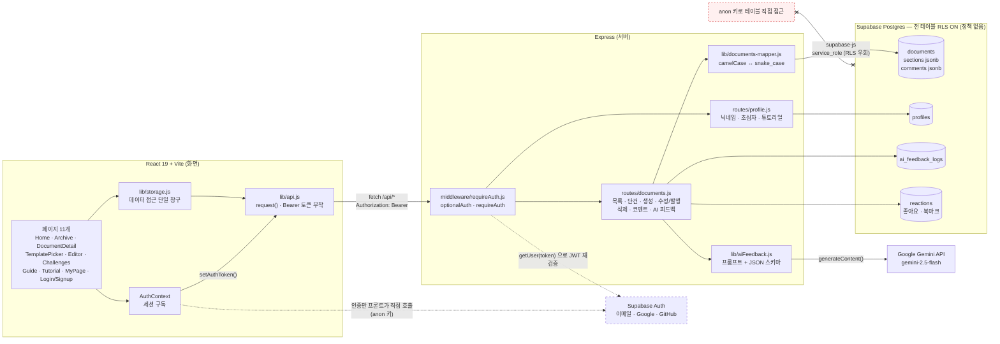

# 역기획소 (respec)

게임 기획자 지망생이 **역기획서를 "틀부터" 배우고, 작성하고, 사람과 AI 양쪽에게 피드백을 받는** 웹 플랫폼입니다.

- **가이드형 에디터** — 직군별 템플릿과 섹션별 작성 가이드가 내장된 에디터로, 백지 공포 없이 구조부터 배우며 씁니다.
- **아카이브 & 섹션별 코멘트** — 같은 게임·같은 시스템을 다룬 역기획서를 비교하며 배우고, 섹션 단위로 구체적인 피드백을 주고받습니다.
- **역기획 챌린지** — 격주 공통 주제로 "일단 완성"을 강제하고, 동일 주제 제출작을 비교합니다.
- **LLM 자동 피드백** — 발행 즉시 Google Gemini가 섹션별로 강점·개선점·제안을 달고 전체 총평을 남깁니다. 구조 완결성·구체성·예외 케이스 질문·역기획 관점 4가지만 봅니다. (회원 전용, 일일 5회)

> **피벗 안내**: 이 프로젝트는 "Core Loop Builder"(AI 코어 루프 설계 도구)에서 방향을 전환한 것입니다. 구 프로젝트의 기획서·발표 자료·프로토타입은 [`docs/archive/core-loop-builder/`](./docs/archive/core-loop-builder/)에 보존되어 있습니다.

## 아키텍처



모든 화면은 `lib/storage.js` → `lib/api.js` 하나만 통과해 백엔드 REST API를 탑니다. 프론트가 Supabase를 직접 부르는 곳은 **인증 한 군데(점선)뿐**이고, 그렇게 받은 토큰도 서버가 다시 검증합니다. LLM 키는 백엔드에만 있어 프론트 번들에 노출되지 않고, DB는 전 테이블 RLS를 켜둬 공개된 anon 키로는 접근할 수 없습니다.

발행→AI 피드백 시퀀스, 인증·권한 흐름, 그리고 **이 그림을 그리다 발견해 고친 권한 구멍 7가지**는 **[docs/ARCHITECTURE.md](./docs/ARCHITECTURE.md)** 에 있습니다.

## 문서

- [아키텍처](./docs/ARCHITECTURE.md) — 데이터 흐름 다이어그램, 그리다 발견해 고친 권한 구멍 7가지
- [아키텍처 발표 대본](./docs/ARCHITECTURE-script.md) — 위 문서를 말로 설명하는 대본
- [서비스 기획서 v0.1](./project-plan.md) — 문제 정의, IA, 기능 명세, 4주 일정
- [개발 백로그](./docs/BACKLOG.md) — 주차별 Task와 우선순위 (진행 상태의 단일 출처)
- [2주차 실행 계획](./docs/WEEK2-PLAN.md) — 이번 주 요일별 작업·완료 기준 (수직슬라이스)
- [디자인 시스템](./design/DESIGN_SYSTEM.md)
- [구 기획서 (Core Loop Builder, Wiki)](https://github.com/geulcho/hub/wiki/Core-Loop-Builder-기획서) — 피벗 이전 기록

**대시보드:** [Issues](https://github.com/geulcho/hub/issues) · [Milestone: 2주차](https://github.com/geulcho/hub/milestone/1)

## 실행 방법

프론트엔드:

```bash
cd frontend
npm install
npm run dev    # http://localhost:5173
```

백엔드 (Express — 문서 CRUD·코멘트·AI 피드백 API. `backend/.env`에 Supabase 키와 `GEMINI_API_KEY`가 필요합니다):

```bash
cd backend
npm install
npm run dev    # http://localhost:4000
```
