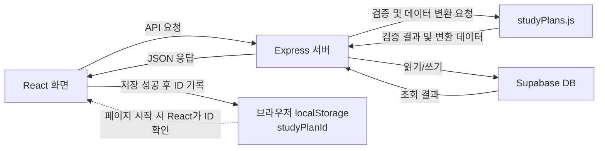
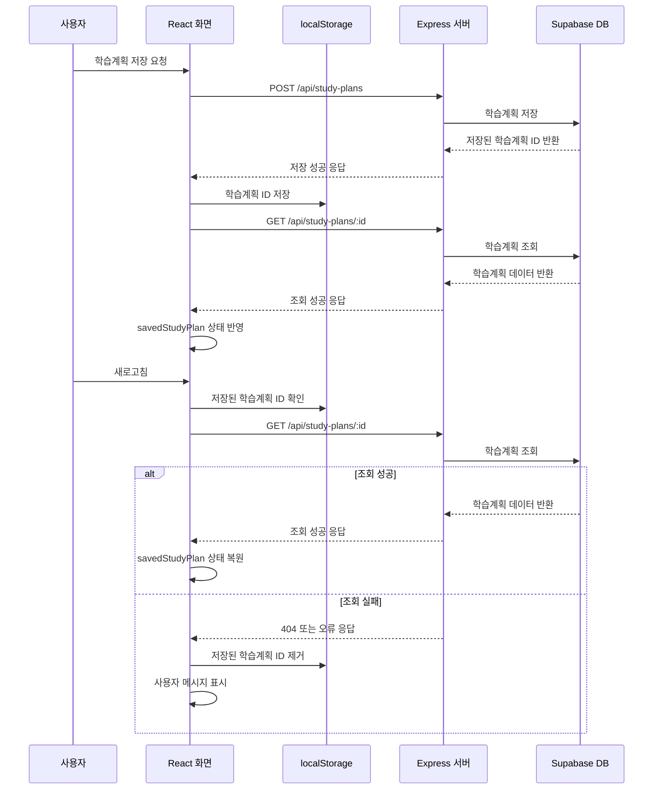

# hub

- [프로젝트 기획서](docs/plan.md)
- [개발 Task 및 백로그](https://app.notion.com/p/AI-Agent-Challenge-Task-399bd5ad252d80f5a73afd5e6443d3fd?source=copy_link)

## 2주차 작업 계획

- [2주차 수직 슬라이스 구현 계획](docs/week2-vertical-slice-plan.md)

## 3주차 작업 계획

- Supabase DB 연동 상태 점검
- 저장된 학습계획의 새로고침 복원 기능 구현
- Vitest를 이용한 테스트 환경 구성 및 TDD 적용
- 서비스 구조와 데이터 흐름을 Mermaid로 시각화
- 테스트코드 생성 Skill 제작
- 코드 검증 Agent 제작
- 개인 개발 Workflow 문서화

### 서비스 구조와 데이터 흐름

이 서비스는 React가 화면을 보여주고, Express가 API 요청을 처리합니다. `studyPlans.js`는 Express가 사용하는 학습 계획 검증 및 데이터 변환 모듈입니다. Supabase는 학습 계획 데이터를 저장하고 조회합니다.

### 저장 및 새로고침 복원 흐름

