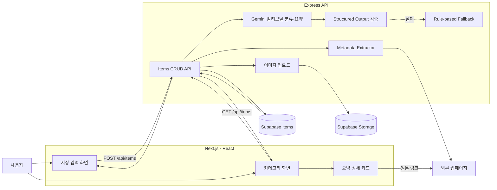

# Later

나중에 다시 보고 싶은 URL, 텍스트, 이미지를 저장하고 Gemini가 제목, 요약,
카테고리를 생성해 다시 찾기 쉽게 정리하는 서비스입니다.

## 서비스 구조 및 데이터 흐름



URL 저장 시 메타데이터를 추출하고, 이미지가 있으면 이미지 바이너리와 입력 텍스트를
함께 Gemini에 전달합니다. Gemini는 다음 값을 구조화된 JSON으로 반환합니다.

- 짧고 구체적인 표시 제목
- 1~3문장의 콘텐츠 요약
- 대분류와 소분류

확인을 마친 콘텐츠는 카테고리 화면에서 아카이브로 보낼 수 있으며, 아카이브
화면에서 다시 복원하거나 삭제할 수 있습니다.

Gemini가 설정되지 않았거나 호출·검증에 실패하면 기존 규칙 기반 분류를 사용합니다.
이미지 단독 요청을 규칙으로 판단할 수 없으면 `미분류 / null`로 저장합니다.

## 이미지 저장 및 AI 분류

- 지원 형식: JPEG, PNG, WebP
- 최대 크기: 5MB
- 이미지는 `multipart/form-data`로 Express에 전송됩니다.
- Express는 이미지를 메모리에서 Gemini inline data로 전달합니다.
- 분류 후 이미지는 Supabase Storage에 업로드합니다.
- 이미지 원본이나 Base64 데이터는 일반 DB 컬럼에 저장하지 않습니다.

## Supabase 설정

아래 migration을 순서대로 적용합니다.

```text
supabase/migrations/202607230001_add_item_images.sql
supabase/migrations/202607230002_add_item_summary.sql
supabase/migrations/202607260001_add_item_archive.sql
```

첫 migration은 `items.content`, `items.image_url`과 public `later-images` 버킷을
생성합니다. 두 번째 migration은 AI 요약을 저장하는 `items.summary`를 추가하고,
세 번째 migration은 아카이브 상태와 보관 시각을 추가합니다.

서버 환경변수:

```env
PORT=4000
CLIENT_ORIGIN=http://localhost:3000
SUPABASE_URL=
SUPABASE_SERVICE_ROLE_KEY=
SUPABASE_STORAGE_BUCKET=later-images
GEMINI_API_KEY=
GEMINI_MODEL=
```

`GEMINI_API_KEY`와 `GEMINI_MODEL`이 모두 있을 때만 Gemini를 호출합니다. 실제 비밀
키는 저장소에 커밋하지 않습니다.

프론트엔드 환경변수:

```env
NEXT_PUBLIC_API_BASE_URL=http://localhost:4000
```

## 로컬 실행

프론트엔드와 Express 서버를 각각 실행합니다.

```bash
npm run dev
```

```bash
npm run dev:server
```

## 검증

```bash
npm test
npx tsc --noEmit
npm run build
```
