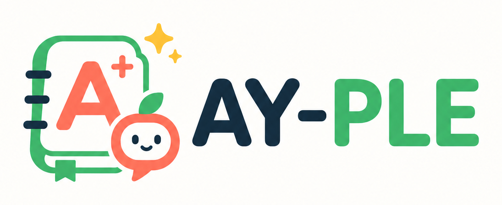

<h1 align="center">
  
</h1>

<p align="center">
  <strong>AY가 내 학기 파일에서 일하고, 판단이 필요할 때 앱으로 물어보게.</strong>
</p>

<p align="center">
  Local-first 학업 Agent · Codex-native Chat · TypeScript 기반 npm workspace
</p>

<p align="center">
  <a href="docs/product/ay-ple-overview.md">제품 소개</a> ·
  <a href="artifacts/camp-demo/product-flow/index.html">동적 prototype</a> ·
  <a href="docs/architecture/codex-chat-implementation-map.md">구현 지도</a> ·
  <a href="docs/product/ay-ple-development-backlog.md">개발 백로그</a>
</p>

## AY-PLE는 무엇인가

AY-PLE(에이플)는 AY가 사용자의 한 학기 Git workspace에서 실제 파일을 직접 다루고, 판단이 필요한 순간에는 MCP로 App의 typed UI를 요청하는 local-first 학업 Agent 앱입니다. App은 원문·변경·선택지를 작업에 맞는 화면으로 보여주고 사용자의 structured result를 같은 Codex Turn에 돌려줍니다. Skill과 AY는 workflow와 실제 file mutation을 소유합니다.

현재 코드베이스는 이 경계를 First Assignment vertical로 구현했습니다. `@ay-ple/interaction-mcp`의 typed request/result, authenticated App Broker, Browser inline Review와 같은 MCP call의 응답 반환이 연결되고, AY가 결과를 해석해 실제 파일을 바꿉니다. 초기 vertical이 사용했던 app-owned `RawMaterial`·`ModelingRun`·durable patch/confirmation과 Server-owned apply graph는 제거됐습니다. Exact current topology와 검증 표면은 [구현 지도](docs/architecture/codex-chat-implementation-map.md)가 소유합니다.

Local-first는 offline을 뜻하지 않으며 Codex 실행의 provider 전송 경계는 [Public repository clean snapshot ADR](docs/adr/0015-bootstrap-public-repository-from-reviewed-clean-snapshot.md)에 기록합니다.

| 둘러볼 곳 | 무엇을 볼 수 있나 |
| --- | --- |
| [AY-PLE는 어떤 앱인가](docs/product/ay-ple-overview.md) | AI Agent가 앱 안에서 학생을 위해 일하는 대표 사용 흐름 |
| [AY–App Interaction Capability](docs/architecture/ay-app-interaction-capabilities.md) | MCP 요청, typed UI와 같은 Turn result 반환을 잇는 long-lived seam |
| [Codex Chat 구현 지도](docs/architecture/codex-chat-implementation-map.md) | 현재 maintained runtime·Server·Chat Shell topology와 남은 연결 지점 |
| [개발 백로그](docs/product/ay-ple-development-backlog.md) | 구현 완료 항목과 확인된 사용자 필요에 따른 후속 작업 순서 |

## 빠른 시작

```bash
npm install
```

Fresh clone에서는 App을 열기 전에 [runtime package README](packages/codex-chat-runtime/README.md)에 따라 production bundle을 materialize합니다. 이어서 `hub/`를 연 Codex CLI 같은 native client에서 `semester-workspace-init` Skill을 실행해 strict v4 `workspace-state.json`, 실제 `.git` directory, workspace-local Skill과 required Interaction MCP declaration을 가진 prepared SemesterWorkspace를 만듭니다.

첫 open과 학기 변경에는 prepared Git root의 absolute path를 명시합니다.

```bash
npm run dev -- --workspace /absolute/path/to/prepared-semester
```

Required Runtime·Interaction readiness가 성공하면 App이 그 root를 `WorkspaceRegistry`의 active pointer로 기록합니다. 이후 같은 학기를 다시 열 때만 인자 없이 시작합니다.

```bash
npm run dev
```

Explicit prepared root와 valid active pointer가 모두 없으면 Browser와 Workspace Runtime을 열지 않고 fail closed합니다. Canonical root ownership과 Runtime state layout은 [Server README](apps/server/README.md)와 [Codex Runtime 격리 문서](docs/architecture/codex-runtime-isolation.md)가 소유합니다.

## 캠프 데모

캠프 발표 deck과 동적 제품 prototype을 하나의 정적 artifact 경로에서 실행한다. 발표 artifact는 현재 제품·아키텍처의 정본이 아니며, Runtime Inspector 화면은 완료된 Week 1의 정적 증거로만 남긴다. 구현 상태는 활성 문서와 코드를 우선한다.

```bash
npm run demo
```

이 명령은 artifact-local Vite server만 시작하며 Server, Runtime Harness와 Inspector를 실행하지 않는다.

- [캠프 데모 실행 안내](artifacts/camp-demo/README.md)
- [동적 제품 prototype](artifacts/camp-demo/product-flow/index.html)

## 프로젝트 문서

기획서를 포함한 formal project docs는 이 README에서 링크로 접근할 수 있게 관리합니다. 이 목록은 탐색을 위한 mirror이며, 문서의 분류·역할·배치 기준은 [docs/README.md](docs/README.md)가 소유합니다.

### 활성 문서

| 구분 | 문서 | 용도 |
| --- | --- | --- |
| 제품 소개 | [AY-PLE는 어떤 앱인가](docs/product/ay-ple-overview.md) | 처음 보는 사람을 위한 제품 소개와 대표 사용 흐름 |
| 제품 기획 | [AY-PLE Product Brief](docs/product/ay-ple-product-brief.md) | 문제 정의, 제품 테제, MVP 경계 |
| 제품 디자인 | [AY-PLE Design System Direction](docs/product/ay-ple-design-system.md) | 밝은 학업 워크스페이스 중심의 브랜드/UI 기준 |
| 개발 계획 | [AY-PLE 개발 백로그](docs/product/ay-ple-development-backlog.md) | 날짜 없는 계층형 task list와 작업 순서·완료 조건 |
| AY↔App 구조 | [AY–App Interaction Capability](docs/architecture/ay-app-interaction-capabilities.md) | MCP request→typed UI→user result→같은 Turn 반환의 deep-module seam |
| Runtime 구조 | [Codex Runtime 격리](docs/architecture/codex-runtime-isolation.md) | Codex runtime, app data, 사용자 workspace의 실행 경계 |
| 구현 현황 | [Codex Chat 구현 지도](docs/architecture/codex-chat-implementation-map.md) | Codex Chat runtime, Server와 Chat Shell의 현재 모듈 지도·구현 gap |
| ADR | [0002. First-class academic objects](docs/adr/0002-use-first-class-academic-objects-with-derived-operational-views.md) | Assignment/Exam canonical model과 derived view 결정 |
| ADR | [0005. Codex App Server 우선 사용](docs/adr/0005-use-codex-app-server-as-first-class-mvp-runtime.md) | 4주 MVP의 실행 엔진과 protocol isolation 결정 |
| ADR | [0006. 제품 실행 경로 소유권 분리](docs/adr/0006-separate-package-app-data-and-semester-workspace-roots.md) | package, app data, SemesterWorkspace 경로와 수명 분리 |
| ADR | [0009. macOS-first local web app 제품 경로](docs/adr/0009-use-a-macos-first-local-web-app-product-path.md) | 첫 제품 실행·지원 환경과 후속 Desktop App 경계 결정 |
| ADR | [0011. Official Codex Python SDK를 Chat Shell baseline으로 재사용](docs/adr/0011-reuse-official-codex-python-sdk-for-chat-shell.md) | Official SDK direct reuse와 supervised Node bridge 결정 |
| ADR | [0012. Codex Chat-only runtime graph 채택](docs/adr/0012-adopt-codex-chat-only-and-remove-legacy-runtime-surfaces.md) | Maintained Runtime 단일화와 legacy executable·alias 제거. Chat-only public surface 결과는 ADR 0013이 대체 |
| ADR | [0013. Product-only public surface와 durable v2 baseline](docs/adr/0013-adopt-product-only-public-surface-and-v2-store-compatibility-baseline.md) | Canonical product cutover와 workspace-local current v2의 장기 compatibility 정책 |
| ADR | [0015. Reviewed clean snapshot public repository](docs/adr/0015-bootstrap-public-repository-from-reviewed-clean-snapshot.md) | Public source lineage·canonical cutover, Apache-2.0 first-party license와 trust·export authority |
| ADR | [0018. User-owned Git SemesterWorkspace](docs/adr/0018-adopt-user-owned-git-semester-workspaces.md) | 기존 Git working tree를 직접 workspace·actual-file 작업 경계로 채택한 결정 |
| ADR | [0019. MCP InteractionCapability를 AY–App seam으로 사용](docs/adr/0019-use-mcp-interaction-capabilities-as-the-ay-app-seam.md) | Typed MCP request/result와 App UI round trip의 역할 경계 결정 |
| ADR | [0020. Pre-App native SemesterWorkspace Bootstrap](docs/adr/0020-bootstrap-semester-workspaces-before-app-startup.md) | Native client가 App 시작 전에 SemesterWorkspace를 준비하고 App은 prepared root만 여는 결정 |

### 기술 참고 문서

| 문서 | 용도 |
| --- | --- |
| [Codex Python SDK patch stack 축소 연구](docs/spikes/codex-sdk-patch-reduction/research.md) | `0010` patch-free 대안과 `0001`–`0009`의 유지·제거 조건 |
| [Codex App Server context delivery capability 조사](docs/spikes/codex-app-server-context-delivery/research.md) | context·request·tool·Hook 전달 경로와 case별 선택 근거 |
| [Codex session topology 조사](docs/spikes/codex-session-topology/research.md) | thread·turn·item·compaction·resume의 저수준 의미와 topology 위험 |
| [Codex local Memories 아키텍처 조사](docs/spikes/codex-memory-architecture/research.md) | built-in memory pipeline, personalization surface, scope·privacy 제약 |
| [에이전트 실행 엔진 재사용 후보 조사](docs/spikes/agent-runtime-reuse-landscape/research.md) | Codex 직접 사용과 ACP·대체 실행 엔진 비교 근거 |

### 완료·역사 기록

| 문서 | 용도 |
| --- | --- |
| [캠프 데모](artifacts/camp-demo/README.md) | 캠프 기간 동안 유지하는 발표 deck, 실행 흐름과 fallback |
| [Review Workspace Scenario](docs/product/ay-ple-review-workspace-scenario.md) | First Assignment의 자료 선택·Review UI와 app-owned workflow 가설 |
| [Codex-native product composition](docs/architecture/codex-native-product-composition.md) | ADR 0019가 대체한 Recipe·Invocation·Run과 Review mapping |
| [0007. Native Codex composition](docs/adr/0007-use-native-codex-composition-for-product-actions.md) | Native primitive 재사용 원칙은 유지하고 app-owned workflow 경계는 ADR 0019가 대체 |
| [0014. App-owned normalized SemesterWorkspace](docs/adr/0014-create-app-owned-normalized-semester-workspaces.md) | ADR 0018이 대체한 scaffold·복사 기반 `ImportSource` 결정 |
| [0016. Exact npx application과 verified Runtime release](docs/adr/0016-distribute-public-preview-with-an-exact-npx-launcher-and-verified-runtime-release.md) | 중단한 public release lane의 application↔Runtime binding·delivery·cache와 rollback 결정 |
| [0017. Codex-managed Browser OAuth](docs/adr/0017-use-codex-managed-browser-oauth-for-product-account-lifecycle.md) | 제거한 managed ChatGPT login과 app-scoped credential 결정 |
| [제품 데모 UI 판단 기록](artifacts/camp-demo/product-flow/design-notes.md) | Review Workspace 탐색부터 단일 guided flow 통합까지의 역사 기록 |
| [AY-PLE 4주 제출 백로그](docs/archive/2026-07-ay-ple-4-week-submission-backlog.md) | 최초 캠프 제출 일정과 당시 우선순위 보존 |
| [Runtime Ownership Spike Plan](docs/spikes/codex-runtime-ownership/plan.md) | 완료된 실행환경 소유권 Spike의 당시 계획 |
| [0001. Runtime Spike file auth store](docs/adr/0001-use-file-auth-store-for-runtime-spike.md) | Runtime Ownership Spike의 인증 저장 결정 |
| [0003. Runtime Harness 선행](docs/adr/0003-build-runtime-harness-before-product-layer.md) | 1주차 Runtime Harness 선행 결정과 구현 기준선 |
| [0004. Runtime history와 workspace storage 분리](docs/adr/0004-split-runtime-history-semantics-from-workspace-storage.md) | 제거된 Harness의 진단 이력과 제품 저장 책임을 분리했던 당시 결정 |
| [0008. Headless Codex Client Host와 제품 UI adapter 분리](docs/adr/0008-separate-headless-codex-client-host-from-product-ui.md) | ADR 0011이 대체한 모든 capability를 한곳에 둔 Host Seam의 당시 결정 |

### 문서·Agent 운영

| 문서 | 용도 |
| --- | --- |
| [docs/README.md](docs/README.md) | 프로젝트 문서 위치, 상태 분류와 관리 규칙 |
| [Issue Tracker](docs/agents/issue-tracker.md) | spec, implementation ticket, PR 요청 표면 규칙 |
| [Triage Labels](docs/agents/triage-labels.md) | triage 상태 마커 규칙 |
| [Domain Docs](docs/agents/domain.md) | domain docs와 ADR 위치 규칙 |
| [AGENTS.md](AGENTS.md) | Codex 작업 규칙과 브랜치/PR 컨벤션 |
| [CONTEXT.md](CONTEXT.md) | AY-PLE의 현재 domain glossary |

## 코드베이스 구성

| 영역 | 위치 | 설명 |
| --- | --- | --- |
| Brand assets | `assets/brand/` | AY-PLE 로고, 마크, AY 프로필 이미지의 프로젝트 공용 원본 |
| Server app | `apps/server/` | Prepared workspace lifecycle·read-only source projection·normal AY Chat·inline Semantic Review HTTP/NDJSON, Runtime·Broker lifecycle을 소유하는 Express local companion |
| Chat Shell app | `apps/chat-shell/` | Prepared lifecycle, 3-pane source explorer·text/PDF preview·AY Chat, general clarification·interrupt와 inline Semantic Review를 제공하는 Vite React desktop UI |
| Product contract | `packages/product-contract/` | Target `/api/product/*` Browser-safe JSON·NDJSON의 dependency-free exact type·decoder |
| Codex Chat runtime | `packages/codex-chat-runtime/` | Official Python SDK, supervised Node bridge, native conversation contract와 deterministic fake |
| Product API | `/api/product/*` | Path-free workspace lifecycle, settings, source list·text/PDF preview, normal Chat, Semantic Review·general interaction·interrupt |
| Camp artifact | `artifacts/camp-demo/` | Live runtime과 분리된 정적 발표 deck, product prototype와 artifact-local 검증 도구 |

## 개발 명령어

```bash
npm run dev
npm run demo
npm test
npm run test:e2e
npm run typecheck
npm run build
npm run lint -w @ay-ple/chat-shell
npm run test:product-entrypoint
npm run check:docs-links
```

Materialized exact runtime이 필요한 provider-free native·process gate는 일반 test와 분리해 명시적으로 실행합니다.

```bash
npm run verify:production-runtime -w @ay-ple/codex-chat-runtime
npm run test:local-provider -w @ay-ple/codex-chat-runtime
npm run test:prepared-workspace-product-actual
```

아직 DB, AY-PLE 자체 cloud account와 범용 상태관리 선택지는 고정하지 않습니다. Current dev·dogfood는 전역 `CODEX_HOME`을 사용합니다. 현재 구현에서 App은 typed InteractionCapability와 workspace registry를, AY와 Skill은 workflow·실제 file mutation·Git checkpoint를, SemesterWorkspace는 학기 자료와 history를 소유합니다. 남은 구현 gap은 [Codex Chat 구현 지도](docs/architecture/codex-chat-implementation-map.md)를 따릅니다.
