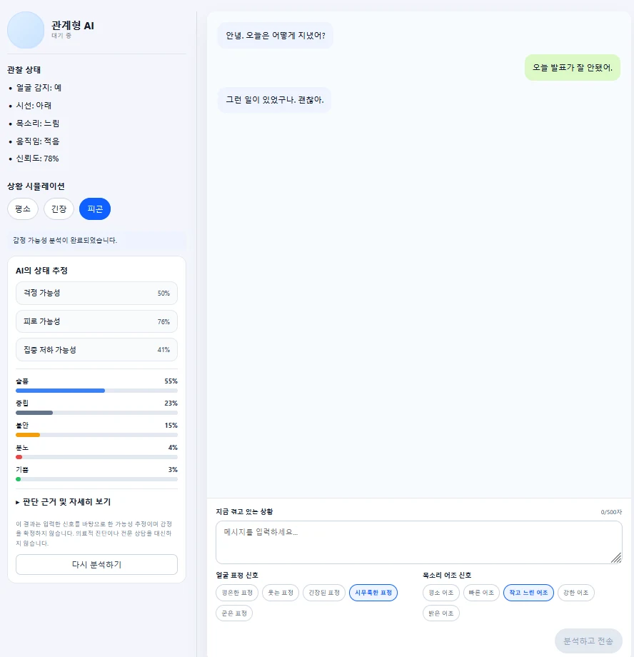
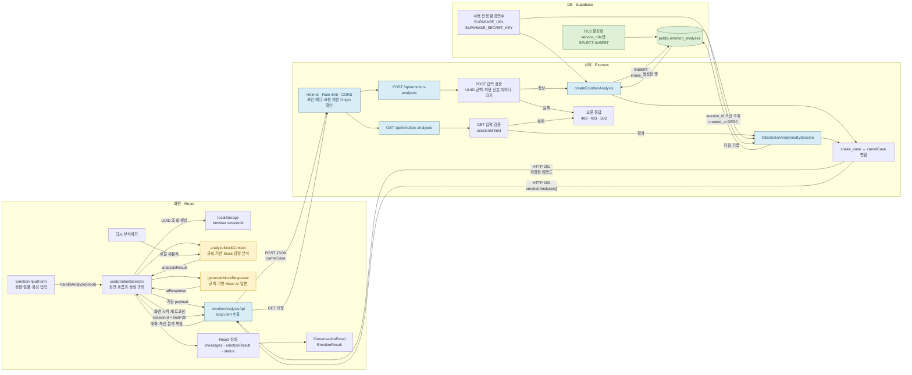
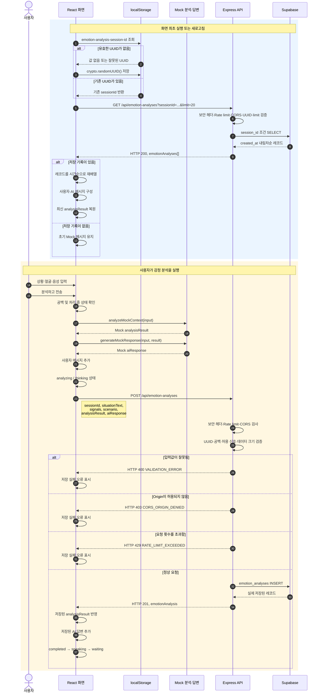

# 관계형 AI

관계형 AI는 사용자가 자신의 상황과 얼굴·목소리 신호를 입력하면 감정 가능성을 분석하고 공감형 반응이나 후속 질문을 제공하는 웹서비스입니다.

현재 감정 분석과 응답 생성에는 실제 생성형 AI API가 아닌 규칙 기반 Mock 로직을 사용합니다.



## 현재까지 완료한 작업

### 화면과 사용자 흐름

* 상황 입력, 얼굴 신호, 목소리 신호를 한 화면에서 입력
* 수동 얼굴 신호 선택과 카메라 자동 감지 전환
* 분석 상태, 오류, 감정 분석 결과와 대화 응답 표시
* 브라우저 UUID를 사용한 최근 대화 기록 복원
* 재사용 기준으로 입력·결과 컴포넌트 통합
* 전역 진입 CSS는 import 역할만 담당하고 레이아웃·입력·결과·대화·카메라 스타일을 기능별 파일로 분리
* 분석·저장·기록 조회 오류 문구를 세션 상수에서 한 번만 관리

### 카메라 얼굴 움직임 신호

* MediaPipe Face Landmarker를 이용한 브라우저 내부 실시간 분석
* 카메라 영상을 먼저 연결한 뒤 분석 모델을 준비하는 실행 순서
* 얼굴 없음, 여러 얼굴, 권한 거부, 모델 오류 처리
* 최근 5회 결과를 이용한 순간적인 오감지 완화
* 감정을 단정하지 않고 눈썹·눈·입 움직임별 상대 강도를 화면에 표시
* 영상, 사진, 프레임, 랜드마크와 전체 blendshape 점수는 서버로 전송하지 않음

### 서버와 데이터베이스

* React → Express → Supabase 저장·조회 연결
* 상황, 제한된 신호 요약, Mock 분석 결과와 응답 저장
* `emotion_analyses` 테이블과 카메라 메타데이터 마이그레이션 구성
* 실제 Supabase 연결, INSERT 및 세션별 SELECT 검증 완료
* 새로고침 시 최근 20개 기록을 불러와 대화 복원

### 테스트와 보안

* 화면 → 실제 HTTP → Express → 테스트 저장소 E2E 테스트
* 실제 Express → Supabase 저장·조회 검증 스크립트
* MediaPipe 변환, 안정화, 카메라 cleanup과 권한 오류 테스트
* Helmet 기본 HTTP 보안 헤더 적용
* IP별 15분당 API 요청 100회 제한
* JSON 본문 100KB, AI 응답 2,000자, 분석 JSON 20KB 제한
* npm 의존성 감사 결과 알려진 취약점 0개

## 해결하려는 문제

사용자는 감정을 표현할 때 공감과 다음 단계를 원하는데, 기존 시스템은 단순한 자동 응답이나 챗봇형 인터페이스로 감정적 연결을 제공하지 못합니다.

## 핵심 사용자 시나리오

1. 사용자가 상황을 입력한다.
2. 사용자가 얼굴 신호를 수동 선택하거나 카메라 자동 감지를 사용한다.
3. React가 얼굴 표현 신호와 상황·목소리 신호를 Mock 분석한다.
4. React 앱이 제한된 요약 메타데이터와 함께 Express API에 요청을 보낸다.
5. Express 서버가 입력값과 카메라 메타데이터를 검증한다.
6. Supabase에 사용자 입력, 변환된 신호와 AI 응답을 저장한다.
7. 저장된 결과가 React 대화 화면에 표시되고 새로고침 시 복원된다.

## 핵심 수직 슬라이스

* 사용자 상황 입력과 얼굴·목소리 신호 선택
* 규칙 기반 감정 점수, 가능한 상태와 판단 근거 생성
* React에서 Express API 호출
* Express에서 입력값 검증
* 감정 결과에 맞는 Mock 공감 응답과 후속 질문 생성
* Supabase에 사용자 입력과 AI 응답 저장
* 저장 결과 반환
* React 대화 화면 갱신과 브라우저 세션별 기록 복원
* 로딩·오류·중복 요청 방지
* 새 대화 메시지를 알리는 접근성 대화 로그

## 기술 스택

* Frontend: React 18, Vite 8
* Backend: Express 5
* Database: Supabase
* Supabase SDK: @supabase/supabase-js
* Face signal: MediaPipe Face Landmarker
* HTTP 요청: fetch
* React 상태 관리: Hooks
* Test: Vitest, Testing Library
* AI 응답: 규칙 기반 Mock 분석 및 응답

## 실행 방법

의존성을 설치하고 프런트엔드와 API 서버를 각각 실행합니다.

```bash
npm install
npm run dev
```

프런트엔드 기본 주소는 `http://127.0.0.1:5173`입니다.

API와 Supabase 저장 기능을 함께 사용하려면 별도 터미널에서 서버를 실행합니다.

```bash
npm run server
```

Supabase 환경변수와 스키마 설정은 [Supabase 설정 문서](docs/supabase-setup.md)를 따릅니다. API 주소가 기본값과 다르면 공개 환경변수 `VITE_API_BASE_URL`을 설정합니다. Supabase 비밀키에는 `VITE_` 접두사를 사용하지 않습니다.

## 주요 기능

* 최대 500자의 상황 입력
* 얼굴 표정과 목소리 어조 신호 선택
* 카메라 기반 얼굴 표현 신호 자동 감지와 수동 선택 전환
* 최근 5개 결과를 이용한 얼굴 신호 안정화
* 얼굴 없음·여러 얼굴·권한 거부·모델 오류 상태 처리
* 평소·긴장·피곤 시나리오 시뮬레이션
* 감정 점수 합계 100 정규화
* 가능한 감정 상태와 판단 근거 표시
* 분석 결과에 맞는 공감형 Mock 응답
* 브라우저 UUID 기반 Supabase 저장과 최근 20개 기록 복원
* 분석·저장 상태와 오류 표시
* 새 메시지 자동 스크롤
* `role="log"`와 `aria-live="polite"`를 이용한 대화 접근성

## 카메라 얼굴 움직임 신호

카메라 기능은 MediaPipe Face Landmarker의 blendshape를 브라우저 안에서 분석합니다.

```text
카메라 영상
→ 브라우저 내부 Face Landmarker
→ blendshape 특징
→ 최근 결과 안정화
→ 눈썹·눈·입 움직임별 상대 강도 표시
```

카메라 결과 화면에서는 `화남`, `슬픔`, `긴장`처럼 감정을 단정하지 않습니다. 대신 다음과
같은 관찰 가능한 얼굴 움직임과 상대 강도를 표시합니다.

```text
왼쪽·오른쪽 입꼬리 올림
왼쪽·오른쪽 입꼬리 내림
왼쪽·오른쪽 눈썹 내림
안쪽 눈썹 올림
왼쪽·오른쪽 눈 가늘게 뜸
왼쪽·오른쪽 입술 압박
```

이 값은 얼굴 근육 움직임의 상대적인 신호이며 실제 내면 감정, 감정 확률 또는 의료적
판단이 아닙니다. Mock 분석 호환을 위한 대표 `faceSignal`은 카메라 분석 중 브라우저
내부에서만 사용하고 서버나 DB에는 저장하지 않습니다.

서버와 DB에는 다음 요약 정보만 저장합니다.

```text
manual 또는 camera 출처
안정화된 프로토타입 유사도
허용된 주요 특징 이름 최대 3개
휴리스틱 버전
```

웹캠 영상, 사진, 프레임, 얼굴 랜드마크 좌표, 전체 blendshape 결과와 카메라 장치 정보는
Express 또는 Supabase로 전송하거나 저장하지 않습니다.

기존 Supabase 테이블에는 다음 마이그레이션을 한 번 적용해야 합니다.

```text
backend/migrations/20260724_add_face_signal_metadata.sql
```

그다음 카메라 기록의 감정형 대표값 저장을 중단하는 마이그레이션을 한 번 적용합니다.

```text
backend/migrations/20260724_make_camera_face_signal_optional.sql
```

## TDD 적용

`ConversationPanel`의 새 메시지 접근성 기능을 작은 TDD 단위로 구현했습니다.

1. 대화 영역을 `role="log"`로 찾는 테스트를 먼저 작성했습니다.
2. 기존 구현에 해당 역할이 없어 테스트가 실패하는 red를 확인했습니다.
3. `role`, `aria-live`, `aria-relevant` 속성만 추가했습니다.
4. focused test와 전체 Vitest가 통과하는 green을 확인했습니다.

관련 파일:

* [ConversationPanel 테스트](frontend/src/features/conversation/components/ConversationPanel.test.jsx)
* [ConversationPanel 구현](frontend/src/features/conversation/components/ConversationPanel.jsx)

## Agent와 Skill

### 관계형 AI 기능 계획 Agent

[관계형 AI 기능 계획 Agent](agents/relationship-ai-feature-planner.md)는 요구사항을 최대 25분 단위로 나누고 P0·P1·P2 우선순위, 선행 작업과 완료 기준을 정합니다.

### 테스트 검증 Skill

[test-verification Skill](skills/test-verification/SKILL.md)은 다음 절차를 반복 가능하게 정의합니다.

```text
요구사항 확인
→ 실패 테스트 작성
→ red 원인 확인
→ 최소 구현
→ focused test green 확인
→ 전체 회귀 검증
→ 결과 보고
```

### 기능 검증 Agent

[기능 검증 Agent](agents/agents/feature-verifier.md)는 요구사항, 변경 코드, 테스트와 빌드 결과를 근거로 기능을 `PASS`, `FAIL`, `BLOCKED` 중 하나로 판정합니다.

이번 `ConversationPanel` 접근성 기능의 검증 결과는 `PASS`입니다.

## 테스트와 검증

```bash
# 전체 Vitest
npm run test:run

# 규칙 기반 감정 분석 검증
npm run test:analysis

# Express API와 Supabase 통합 검증
npm run test:api

# Supabase 연결 검증
npm run test:supabase

# 프로덕션 빌드
npm run build
```

최근 검증 결과:

* Vitest: 테스트 파일 17개, 테스트 47개 통과
* Mock 감정 분석: 대표 시나리오 4개 통과
* Vite 프로덕션 빌드 성공
* 실제 Supabase 연결 및 `emotion_analyses` 읽기 통과
* Express API를 통한 실제 Supabase INSERT·SELECT 통과
* npm 운영·개발 의존성 감사: 알려진 취약점 0개
* `test-verification` Skill 공식 구조 검증 통과

`npm run test:api`는 실제 Supabase에 검증용 레코드 1건을 저장합니다. API·Supabase 검증을
다시 실행하려면 `.env` 설정과 실행 중인 Express 서버가 필요합니다.

### 화면 → 서버 → DB 저장 경계 E2E 테스트

사용자가 화면에서 상황을 입력하고 제출했을 때 다음 흐름을 한 번에 검증합니다.

```text
EmotionInputForm
→ frontend emotionAnalysisApi
→ 실제 로컬 HTTP POST
→ Express 요청 검증
→ API 데이터 매핑
→ 테스트용 DB 저장소 기록
→ API 응답을 화면 제출 콜백에서 확인
```

실행 명령:

```bash
npm run test:e2e
```

2026년 7월 24일 실행 결과:

```text
Test Files  1 passed (1)
Tests       1 passed (1)
```

검증한 내용:

* 화면에서 입력한 상황, 얼굴 신호, 목소리 신호가 서버까지 전달됩니다.
* Express가 요청을 검증하고 DB 형식인 snake_case 레코드로 변환합니다.
* 제한 저장 필드가 테스트용 DB 저장소에 기록됩니다.
* 영상, 이미지, 얼굴 랜드마크 필드는 저장되지 않습니다.
* 저장된 레코드가 API 응답 DTO로 변환되어 프론트엔드에 돌아옵니다.

이 테스트는 실제 Supabase 자격증명 없이 반복 실행할 수 있도록 메모리 기반 테스트 저장소를 DB 경계에 주입합니다. 따라서 화면부터 저장소 호출까지의 애플리케이션 흐름은 검증하지만, Supabase 네트워크 연결과 실제 테이블 저장은 `npm run test:supabase` 및 `npm run test:api`로 별도 확인해야 합니다.

### 서버 보안 기준

* Helmet으로 기본 HTTP 보안 헤더를 적용합니다.
* API는 기본적으로 IP별 15분당 100회로 요청을 제한합니다.
* JSON 요청 본문은 최대 100KB로 제한합니다.
* AI 응답은 최대 2,000자, 분석 결과 JSON은 최대 20KB로 제한합니다.
* Supabase secret key는 Express 서버의 `.env`에서만 사용합니다.
* 카메라 영상, 이미지, 얼굴 랜드마크와 전체 blendshape 점수는 서버로 전송하지 않습니다.

현재 세션 UUID는 사용자 인증을 대신하지 않습니다. 외부 배포 전에는 Supabase Auth를 추가하고 서버에서 인증된 사용자와 저장 기록의 소유권을 검증해야 합니다.

## 현재 제한사항과 다음 작업

* 실제 생성형 AI API가 아니라 규칙 기반 Mock 분석과 응답을 사용합니다.
* 카메라 신호는 얼굴 움직임 관찰값이며 실제 감정을 판정하지 않습니다.
* 브라우저 UUID는 로그인이나 사용자 인증 수단이 아닙니다.
* 외부 배포 전 Supabase Auth와 서버의 사용자 소유권 검증이 필요합니다.
* 저장 기록의 보관 기간, 사용자 삭제 기능과 자동 만료 정책이 필요합니다.
* 카메라 입력은 감정형 대표 `face_signal`을 저장하지 않고 제한된 움직임 신호 요약만 저장합니다.

## Showcase

프로젝트 소개 정보와 대표 이미지는 `showcase/`에 있습니다.

* [Showcase 정보](showcase/showcase.json)
* [대표 이미지](showcase/thumbnail.webp)
* 화면 이미지: [평소](showcase/screenshots/home2.webp), [긴장](showcase/screenshots/home3.webp), [피곤](showcase/screenshots/home1.webp)

## 프로젝트 폴더 구조

```
hub/
├─ agents/
│  ├─ relationship-ai-feature-planner.md
│  └─ agents/
│     └─ feature-verifier.md
│
├─ backend/
│  ├─ config/
│  │  └─ supabaseClient.js
│  ├─ features/
│  │  └─ emotion-analyses/
│  │     ├─ emotionAnalysisMapper.js
│  │     ├─ emotionAnalysisRoutes.js
│  │     └─ emotionAnalysisValidation.js
│  ├─ migrations/
│  │  ├─ 20260724_add_face_signal_metadata.sql
│  │  └─ 20260724_make_camera_face_signal_optional.sql
│  ├─ repositories/
│  │  └─ emotionAnalysisRepository.js
│  ├─ security/
│  │  └─ serverSecurity.test.js
│  └─ supabase-schema.sql
│
├─ docs/
│  ├─ codex-prompt.md
│  ├─ emotion-analysis-api.md
│  ├─ github-issues.md
│  ├─ mvp-scope.md
│  ├─ project-brief.md
│  ├─ supabase-setup.md
│  └─ test-plan.md
│
├─ frontend/
│  └─ src/
│     ├─ e2e/
│     │  └─ screenServerDatabase.e2e.test.jsx
│     ├─ features/
│     │  ├─ conversation/
│     │  │  ├─ components/
│     │  │  │  ├─ ConversationPanel.jsx
│     │  │  │  └─ ConversationPanel.test.jsx
│     │  │  ├─ data/
│     │  │  │  └─ mockMessages.js
│     │  │  ├─ utils/
│     │  │  │  └─ generateMockResponse.js
│     │  │  └─ index.js
│     │  │
│     │  ├─ emotion-analysis/
│     │  │  ├─ components/
│     │  │  │  └─ AnalysisStatus.jsx
│     │  │  ├─ data/
│     │  │  │  └─ scenarioAnalysisPresets.js
│     │  │  ├─ utils/
│     │  │  │  ├─ analyzeMockContext.js
│     │  │  │  ├─ analyzeMockEmotion.js
│     │  │  │  └─ normalizeEmotionScores.js
│     │  │  └─ index.js
│     │  │
│     │  ├─ emotion-input/
│     │  │  ├─ components/
│     │  │  │  ├─ EmotionInputForm.jsx
│     │  │  │  └─ SignalSelector.jsx
│     │  │  ├─ data/
│     │  │  │  └─ signalOptions.js
│     │  │  └─ index.js
│     │  │
│     │  ├─ emotion-result/
│     │  │  ├─ components/
│     │  │  │  └─ EmotionResult.jsx
│     │  │  └─ index.js
│     │  │
│     │  ├─ emotion-session/
│     │  │  ├─ api/
│     │  │  │  └─ emotionAnalysisApi.js
│     │  │  ├─ hooks/
│     │  │  │  └─ useEmotionSession.js
│     │  │  ├─ utils/
│     │  │  │  └─ browserSession.js
│     │  │  └─ index.js
│     │  │
│     │  ├─ face-camera/
│     │  │  ├─ components/
│     │  │  │  └─ FaceCamera.jsx
│     │  │  ├─ hooks/
│     │  │  │  └─ useFaceLandmarker.js
│     │  │  ├─ runtime/
│     │  │  │  ├─ cameraStream.js
│     │  │  │  ├─ faceLandmarkerRuntime.js
│     │  │  │  └─ processFaceResult.js
│     │  │  ├─ utils/
│     │  │  │  ├─ mapBlendshapesToFaceSignal.js
│     │  │  │  ├─ mapBlendshapesToFaceSignal.test.js
│     │  │  │  ├─ stabilizeFaceSignal.js
│     │  │  │  └─ stabilizeFaceSignal.test.js
│     │  │  └─ index.js
│     │  │
│     │  ├─ observation-status/
│     │  │  ├─ components/
│     │  │  │  └─ ObservationStatus.jsx
│     │  │  └─ index.js
│     │  │
│     │  └─ scenario-simulation/
│     │  │  ├─ components/
│     │  │  │  ├─ ScenarioSelector.jsx
│     │  │  │  └─ ScenarioSelector.test.jsx
│     │  │  ├─ data/
│     │  │  │  └─ scenarioPresets.js
│     │  │  └─ index.js
│     │
│     ├─ shared/
│     │  ├─ components/
│     │  │  └─ ServiceHeader.jsx
│     │  └─ constants/
│     │     └─ emotionDefinitions.js
│     │
│     ├─ test/
│     │  └─ setup.js
│     ├─ App.jsx
│     ├─ index.css
│     └─ index.jsx
│
├─ scripts/
│  ├─ verify-emotion-analysis.mjs
│  ├─ verify-emotion-analysis-api.mjs
│  └─ verify-supabase-connection.mjs
│
├─ shared/
│  └─ contracts/
│     └─ emotionAnalysisContract.js
│
├─ test/
│  └─ fixtures/
│     └─ emotionAnalysisFixtures.js
│
├─ showcase/
│  ├─ screenshots/
│  │  ├─ home1.webp
│  │  ├─ home2.webp
│  │  └─ home3.webp
│  ├─ showcase.json
│  └─ thumbnail.webp
│
├─ skills/
│  └─ test-verification/
│     ├─ agents/
│     │  └─ openai.yaml
│     └─ SKILL.md
│
├─ .github/
│  └─ pull_request_template.md
├─ AGENTS.md
├─ index.html
├─ package.json
├─ package-lock.json
├─ README.md
├─ server.js
└─ vite.config.js
```

## 문서 링크
* [Mock 데이터 사용 및 화면 표시 현황](https://github.com/studentnoname/hub/wiki/Mock-%EB%8D%B0%EC%9D%B4%ED%84%B0-%EC%82%AC%EC%9A%A9-%EB%B0%8F-%ED%99%94%EB%A9%B4-%ED%91%9C%EC%8B%9C-%ED%98%84%ED%99%A9)

## 현재 개발 상태
* [개발일지 - 1] (https://github.com/studentnoname/hub/wiki/%5B%EA%B0%9C%EB%B0%9C%EC%9D%BC%EC%A7%80-%E2%80%90-1-%5D-%E2%80%90-2026%EB%85%84-7%EC%9B%94-21%EC%9D%BC-(%ED%98%84%EC%9E%AC-%EC%83%81%ED%99%A9-%EC%9A%94%EC%95%BD))

## 전체 데이터의 흐름


## 분석 저장과 새로고침의 복원 순서


