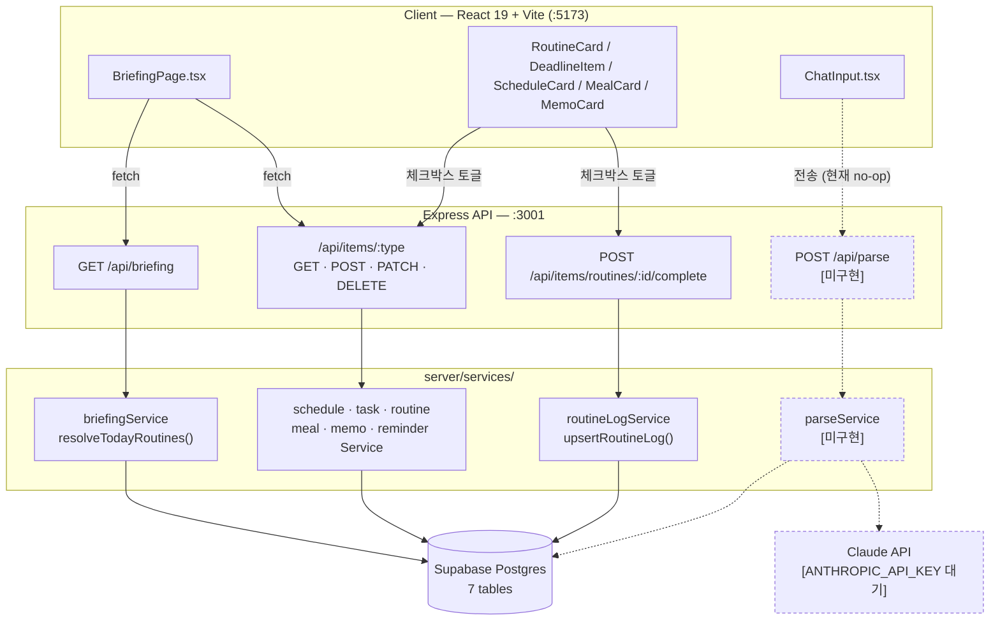
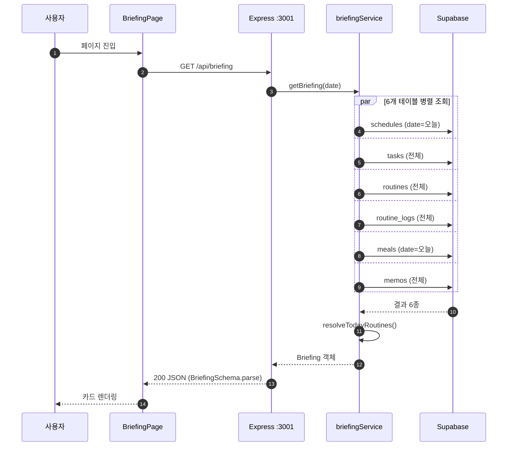
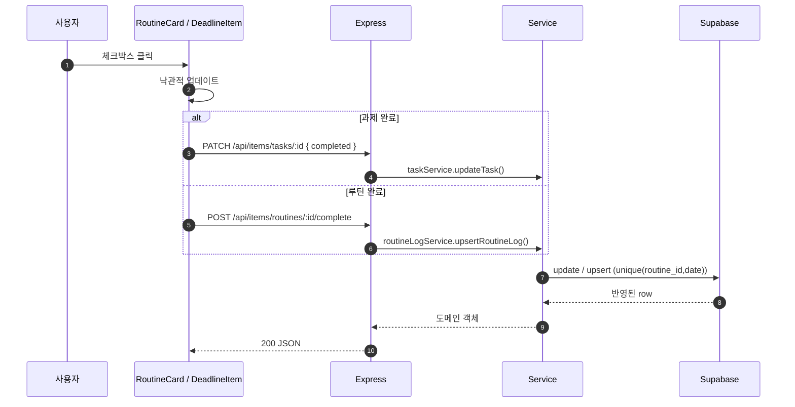
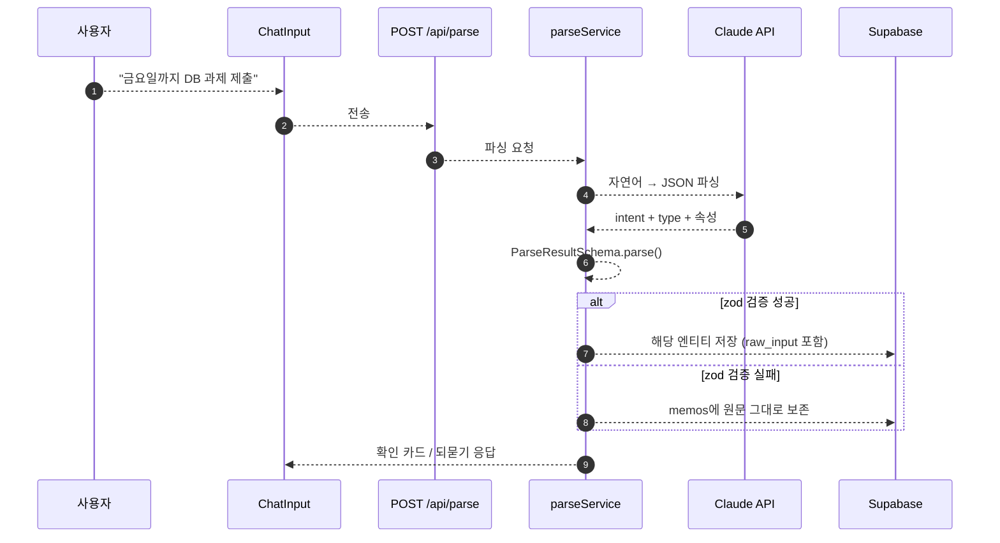

# Briefy

> **"한 문장으로 관리하는 하루"** — 자연어 한 줄로 적어내면 스케줄과 루틴이 정리되고, 브리핑까지 해주는 자연어 라이프 매니저

"금요일까지 데이터베이스 과제 제출"이라고 적으면 AI가 마감일 있는 과제로 분류해 저장합니다. 폼 입력도, 앱 전환도 없습니다. 그리고 아침에 앱을 열면 오늘의 일정·운동 루틴(오늘이 상체 day인지까지)·식단·마감 임박 과제가 **하루 브리핑 한 화면**에 모입니다.

## 핵심 기능

**A. 자연어 CRUD 파이프라인** — 단일 입력창에 자유로운 한국어 문장을 입력하면 Claude API가 의도(create/update/delete/query/complete)와 항목 유형(일정/과제/루틴/식단/메모)을 파싱해 처리합니다.

| 입력 예시 | 동작 |
| --- | --- |
| "금요일까지 데이터베이스 과제 제출" | 마감일 있는 과제로 저장 |
| "다음주 화요일 오후 3시 팀플 회의, 전날 알려줘" | 일정 + 리마인더 동시 생성 |
| "치과 4시로 바꿔줘" | 기존 일정 검색 후 수정 |
| "이번 주 마감 뭐 있어?" | 이번 주 마감 항목만 조회 |
| "오늘 운동 다 함" | 오늘 루틴 완료 처리 |

모호한 입력("운동")은 임의 저장하지 않고 선택지를 되묻고, 파싱에 실패해도 원문을 메모로 보존합니다 — **사용자 입력은 절대 유실되지 않습니다.**

**B. 오늘의 브리핑 대시보드** — 앱을 열면 오늘의 일정(시간순), 루틴(시간이 아니라 "상체 day · 벤치프레스, 러닝 3km"라는 내용까지), 식단, 마감 임박 과제(D-day), 메모가 한 화면에 표시됩니다. 루틴을 완료하면 다음 운동일에 순환의 다음 단계(하체 day)가 자동으로 표시됩니다.

## 아키텍처

브라우저는 Supabase에 직접 접근하지 않고 모든 데이터는 Express API를 거칩니다. 점선은 아직 코드가 없는 부분(`/api/parse`, Claude 연동)입니다.



<details>
<summary>데이터 흐름 — 브리핑 조회 (구현·검증됨)</summary>



</details>

<details>
<summary>데이터 흐름 — 완료 체크 (구현·검증됨)</summary>



</details>

<details>
<summary>데이터 흐름 — 자연어 저장 (설계, 미구현)</summary>



</details>

## 기술 스택

- **Frontend**: React + TypeScript (Vite, Tailwind CSS) — 모바일(390px) 기준 반응형
- **Backend**: Express — 자연어 파싱 엔드포인트(Claude API) + 엔티티 CRUD API
- **Database**: Supabase (Postgres)
- **AI**: Claude API (자연어 파싱 전용)

## 시작하기

### 요구 사항

- Node.js 20+
- Supabase 프로젝트 (URL, service role key)
- Anthropic API key

### 설치 및 실행

```bash
# 의존성 설치
npm install

# 환경변수 설정
cp .env.example .env
# .env에 ANTHROPIC_API_KEY, SUPABASE_URL, SUPABASE_SERVICE_ROLE_KEY 입력

# 개발 서버 실행 (FE + BE)
npm run dev
```

> ⚠️ API 키는 서버 환경변수로만 관리합니다. `VITE_*` 등 클라이언트 노출 변수에 넣지 마세요.

## 프로젝트 구조

```
briefy/
├─ CLAUDE.md                  # AI 협업 규칙 (Claude Code용)
├─ .claude/skills/briefy-ui/  # 디자인 스킬 (토큰·컴포넌트 규칙)
├─ docs/
│  ├─ plan.md                 # 서비스 기획서
│  ├─ design.md               # 디자인 방향 및 참조
│  └─ wireframes/             # 화면 와이어프레임 (S1, S2-b, S2-c, S3)
├─ src/                       # Frontend (React)
└─ server/                    # Backend (Express)
```

## 로드맵

| Phase | 범위 |
| --- | --- |
| **Phase 1 (MVP)** | 자연어 파이프라인(저장·조회·수정·삭제) + 오늘의 브리핑, 웹 |
| **Phase 2** | 로그인/계정, 푸시 알림, 주간 뷰, 음성 입력(STT) |
| **Phase 3** | React Native 모바일 앱, 음성 대화(TTS), 외부 캘린더 동기화 |

상세한 문제 정의, 사용자 시나리오, 데이터 모델, 리스크 분석은 [docs/plan.md](./docs/plan.md)를 참고하세요.

## 문서

- [기획서 (plan.md)](./docs/plan.md)
- [디자인 (design.md)](./docs/design.md)
- [AI 협업 규칙 (CLAUDE.md)](./CLAUDE.md)

## 일정 및 프로젝트 관리

- **칸반 보드:** [Briefy MVP 개발 보드](https://github.com/uncledrew-sr/hub/issues)
