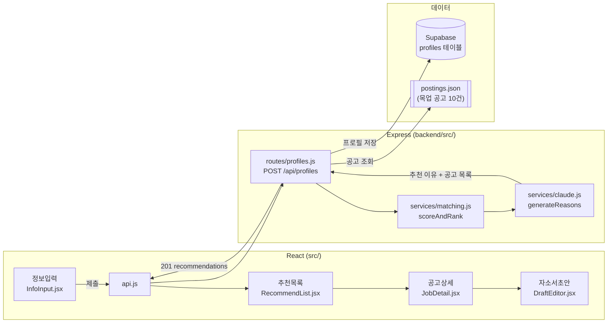
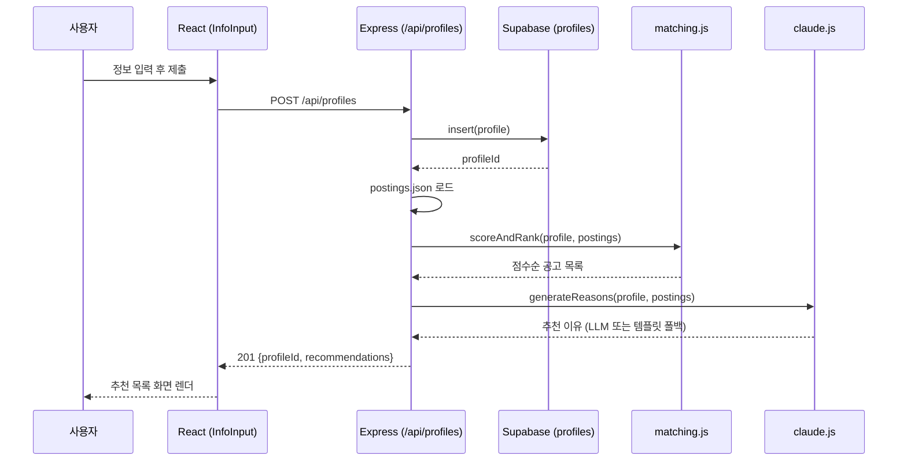

# 진로 에이전트 서비스 (링커리어 공고 추천 & 자소서 초안 Agent)

대학생의 전공·경험 기반 공고 추천 + 자소서 초안 생성 Agent. 기획은 [docs/plan.md](docs/plan.md), 4주 개발 Task는 [docs/checklist.md](docs/checklist.md) 참고.

이번 주 작업 현황은 [GitHub Issues](https://github.com/dohyeon-k/hub/issues)에서 확인할 수 있다(우선순위는 `P0`/`P1`/`P2` 라벨로 표시). 진행 상황은 [GitHub Project 보드](https://github.com/users/dohyeon-k/projects/1)에서 칸반 형태로도 볼 수 있다.

## 아키텍처

화면(4개) → Express 라우트 → 서비스 로직 → 데이터(Supabase/목업 JSON)로 이어지는 전체 구조:

요청 하나가 실제로 어떻게 도는지(수직 슬라이스)는 시퀀스로 보면 더 명확하다:

---

# React + Vite

This template provides a minimal setup to get React working in Vite with HMR and some Oxlint rules.

Currently, two official plugins are available:

- [@vitejs/plugin-react](https://github.com/vitejs/vite-plugin-react/blob/main/packages/plugin-react) uses [Oxc](https://oxc.rs)
- [@vitejs/plugin-react-swc](https://github.com/vitejs/vite-plugin-react/blob/main/packages/plugin-react-swc) uses [SWC](https://swc.rs/)

## React Compiler

The React Compiler is not enabled on this template because of its impact on dev & build performances. To add it, see [this documentation](https://react.dev/learn/react-compiler/installation).

## Expanding the Oxlint configuration

If you are developing a production application, we recommend using TypeScript with type-aware lint rules enabled. Check out the [TS template](https://github.com/vitejs/vite/tree/main/packages/create-vite/template-react-ts) for information on how to integrate TypeScript and Oxlint's TypeScript related rules in your project.
