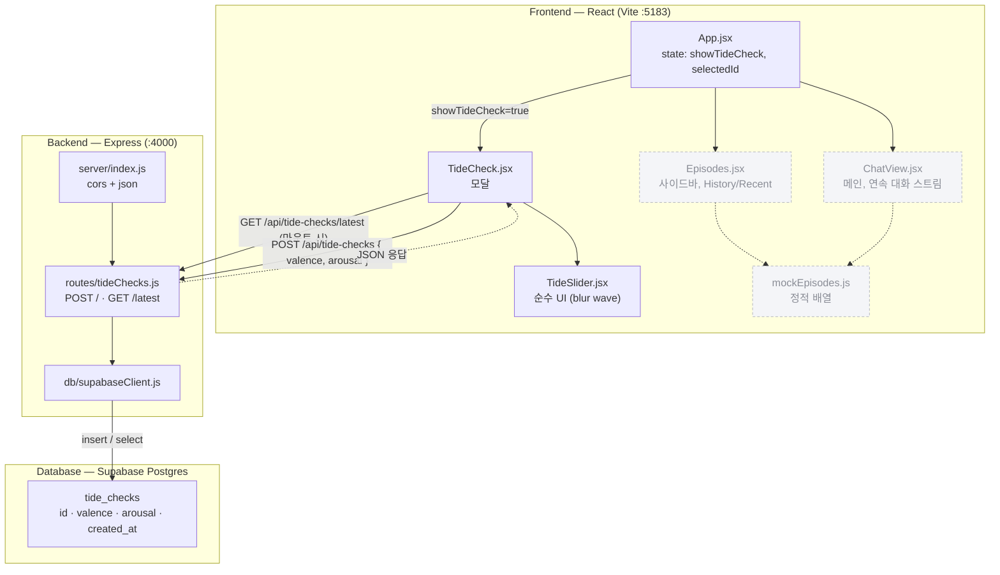

# React + Vite

This template provides a minimal setup to get React working in Vite with HMR and some Oxlint rules.

Currently, two official plugins are available:

- [@vitejs/plugin-react](https://github.com/vitejs/vite-plugin-react/blob/main/packages/plugin-react) uses [Oxc](https://oxc.rs)
- [@vitejs/plugin-react-swc](https://github.com/vitejs/vite-plugin-react/blob/main/packages/plugin-react-swc) uses [SWC](https://swc.rs/)

## React Compiler

The React Compiler is not enabled on this template because of its impact on dev & build performances. To add it, see [this documentation](https://react.dev/learn/react-compiler/installation).

## Expanding the Oxlint configuration

If you are developing a production application, we recommend using TypeScript with type-aware lint rules enabled. Check out the [TS template](https://github.com/vitejs/vite/tree/main/packages/create-vite/template-react-ts) for information on how to integrate TypeScript and Oxlint's TypeScript related rules in your project.

## 문서
- [TideNote 기획서](https://github.com/snael0510-coder/hub/wiki/TideNote-%EA%B8%B0%ED%9A%8D%EC%84%9C)

## 아키텍처

현재 코드 기준(2026-07-22) 화면-서버-DB 데이터 흐름. `TideCheck`만 실제로
DB까지 왕복하고, `Episodes`/`ChatView`는 아직 `mockEpisodes.js`(정적 배열)를
쓴다는 걸 점선으로 구분했다.

### 설명하다가 발견한 것
- **Episodes/ChatView는 아직 DB에 안 붙어 있다.** 다이어그램을 그리기 전엔
  "TideNote 화면이 다 서버랑 연결됐다"고 막연히 생각했는데, 실제로 화살표를
  따라가 보니 실제 DB 왕복은 `TideCheck` 하나뿐이고 나머지 화면은 전부
  `mockEpisodes.js`라는 정적 배열만 보고 있었다. 이 gap은 이미
  `docs/backlog.md`에 Task 8(History DB 연동, P2)로 남아있어서 새로 이슈를
  만들진 않았지만, 다이어그램으로 보니 훨씬 명확해졌다.
- **TideCheck 모달이 앱 진입점 역할까지 겸하고 있다.** `App.jsx`의
  `showTideCheck` 기본값이 `true`라서, 사실상 이 앱은 "Tide Check 모달 →
  (완료 시) 메인 화면"이라는 강제된 진입 흐름을 갖는데, 다이어그램에는 이
  강제성이 화살표 하나("showTideCheck=true")로만 표현돼서 다소 안 보인다.
  기획서 상 "하루 최소 1회 필수 체크인"이라는 요구사항과 맞는 설계이긴
  하지만, 그림만 봐서는 왜 TideCheck가 항상 먼저 뜨는지 설명이 더 필요하다.

## 7/9 진행 상황
Claude Design, Google Stitch 등 AI 디자인 도구로 먼저 시도했으나 원하는 UI가 나오지 않아 Figma로 직접 디자인 작업을 진행했습니다. 오늘 안에 개발 Agent에 export할 수준까지는 완성하지 못해, 디자인 skill 문서화 및 개발 환경 구성은 내일(7/10) 이어서 진행합니다.

## 개발 Task (Week 2-4)

### Backlog란?
앞으로 해야 할 작업들을 모아둔 목록. Sprint 시작 시 이 중 일부를 뽑아 실제 작업 계획으로 옮긴다. 매 스프린트마다 팀이 모여 우선순위를 검토(grooming)하고 높은 것부터 가져온다.

### Week 2 — 핵심 기능 뼈대
| 우선순위 | Task | 설명 |
|---|---|---|
| 상 | Episode Segmentation | 메시지 간 시간 간격 기준으로 대화를 episode로 분리 |
| 상 | 기본 채팅 UI | 연속 스트림 + 인라인 블록 라벨 |
| 상 | Tide Check 화면 | Valence/Arousal 슬라이더, 하루 1회 필수 체크인 |
| 중 | Express 기본 서버 | 대화/episode 저장용 API 뼈대 |

### Week 3 — Recall 로직 + History
| 우선순위 | Task | 설명 |
|---|---|---|
| 상 | Recall Module | D_gen/D_recall 격차 계산, threshold 판단 |
| 상 | 24h History / Long History 탭 | 목록 UI + 탭 전환 |
| 상 | Attachment(첨부) 인터랙션 | History 카드를 채팅창에 참조 카드로 첨부 |
| 중 | Circadian Estimation | MEQ 온보딩 설문 + D_gen 계산 |

### Week 4 — 마무리 + 발표 준비
| 우선순위 | Task | 설명 |
|---|---|---|
| 상 | Daily Tide Window | 당일 아침 지나면 자동 노출 전환 |
| 상 | 발표 자료(PT) 제작 | 최종 데모 시나리오 + 슬라이드 |
| 중 | 스타일링 폴리싱 | 색감/트랜지션 다듬기 |
| 하 | 배포 (선택) | Vercel/Netlify 간단 배포 |

## 배포
- FE(Vercel): https://hub-murex-mu.vercel.app
- BE(Render): https://tidenote-api.onrender.com

## 문서 · Agent · Skill
- [나만의 AI 워크플로우](./docs/workflow.md) — 재사용 가능한 작업 레시피 + Agent 협업 구조도
- [작업 기록 (오류·요청·검토·확인 과정)](./docs/work-log.md)
- [데모 영상 대본](./docs/video-script.md)
- [백로그 (우선순위·일정)](./docs/backlog.md)
- [작업 체크리스트](./docs/checklist.md)
- [계획 수립 Agent](./docs/agents/planning-agent.md)
- [기능 검증 Agent](./docs/agents/verification-agent.md) — 요구사항대로 동작하는지 확인
- [코드 검증 Agent](./docs/agents/code-verification-agent.md) — 테스트 존재 여부·버그·스타일 점검
- [테스트코드 생성 Skill](./.claude/skills/tidenote-test-writer/SKILL.md)
- [비주얼 디자인 Skill](./.claude/skills/tidenote-visual-language/SKILL.md)
- [GitHub 이슈](https://github.com/snael0510-coder/hub/issues)
