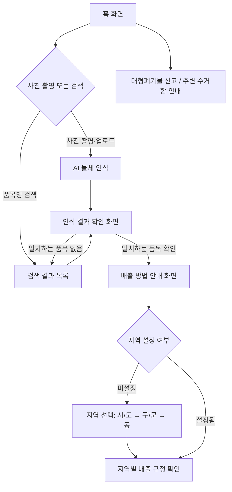

# confiSort
# AI 분리배출 도우미 (AI Recycling Assistant for South Korea)

> **사진 한 장으로, 한국의 올바른 분리배출 방법을 공식 데이터와 AI를 통해 쉽고 정확하게 안내하는 서비스**

* 프로젝트 소개(배경/목표/핵심 컨셉/기능/아키텍처/기술 스택)는 [`./docs/ABOUT_PROJECT.md`](./docs/ABOUT_PROJECT.md) 참고.
* 개발 컨벤션(코드 스타일, 커밋 메시지 규칙)은 [`./docs/CONTRIBUTING.md`](./docs/CONTRIBUTING.md) 참고.
* 현재 구현 진행 상황은 [`./docs/TASK.md`](./docs/TASK.md) / [`./docs/backlog.md`](./docs/backlog.md) 참고.

---

# 서비스 흐름

# 개발 기획 - GitHub 이슈
https://github.com/ymina25/hub/issues
