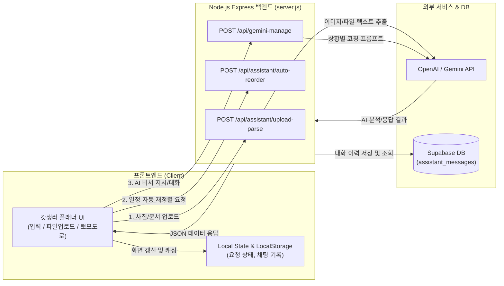

서비스 아키텍처 및 데이터 흐름

```mermaid
graph LR
    subgraph Client ["프론트엔드 (Client)"]
        UI["갓생러 플래너 UI<br/>(입력 / 파일업로드 / 뽀모도로)"]
        State["Local State & LocalStorage<br/>(요청 상태, 채팅 기록)"]
    end

    subgraph Server ["Node.js Express 백엔드 (server.js)"]
        UploadAPI["POST /api/assistant/upload-parse"]
        ReorderAPI["POST /api/assistant/auto-reorder"]
        ManageAPI["POST /api/gemini-manage"]
    end

    subgraph External ["외부 서비스 & DB"]
        AI["OpenAI / Gemini API"]
        Supabase[("Supabase DB<br/>(assistant_messages)")]
    end

    UI -->|"1. 사진/문서 업로드"| UploadAPI
    UI -->|"2. 일정 자동 재정렬 요청"| ReorderAPI
    UI -->|"3. AI 비서 지시/대화"| ManageAPI

    UploadAPI -->|"이미지/파일 텍스트 추출"| AI
    ManageAPI -->|"상황별 코칭 프롬프트"| AI

    Server -->|"대화 이력 저장 및 조회"| Supabase
    AI -->|"AI 분석/응답 결과"| Server
    Server -->|"JSON 데이터 응답"| UI
    UI -->|"화면 갱신 및 캐싱"| State
```

