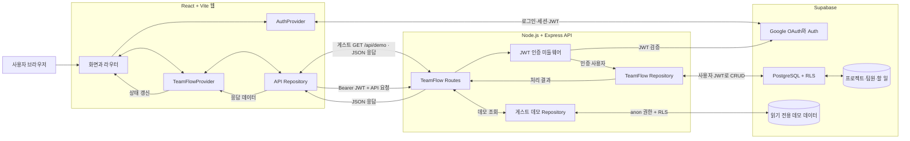

# TeamFlow

대학생 팀 프로젝트의 프로젝트·할 일·팀원·회의록·자료를 한 공간에서 관리하는 웹 서비스입니다.

## 현재 구현 상태

- 서비스 소개와 Google OAuth 로그인, 읽기 전용 게스트 데모
- 로그인 사용자의 프로젝트·담당자·할 일을 Supabase에 영속화
- 프로젝트 생성·기간 수정, 담당자 추가, 할 일 생성·상태 변경·삭제
- Express의 JWT 검증과 Supabase RLS 기반 사용자별 데이터 격리
- 게스트가 조회할 수 있는 Supabase 기반 데모 프로젝트
- 공유 노트, 자료실, AI 팀원 화면의 데모 UI
- 요구사항 기반 기능 검증용 Codex Agent

초기 Mock 데이터는 제품 코드에서 제거했습니다. Google 사용자는 빈 프로젝트 목록에서 시작하고, 게스트만 읽기 전용 데모를 봅니다. 로그인 사용자의 노트·자료·AI 영속화는 다음 단계 범위입니다.

## 시스템 아키텍처



- 브라우저의 `AuthProvider`가 Supabase Auth와 직접 통신해 Google 로그인 세션과 JWT를 관리합니다.
- 로그인 사용자의 프로젝트·팀원·할 일 요청은 API Repository에서 Bearer JWT를 붙여 Express로 보냅니다.
- Express는 JWT를 검증하고 같은 토큰으로 Supabase에 접근합니다. PostgreSQL RLS가 사용자별 데이터 접근을 최종 제한합니다.
- 게스트는 인증 없이 `/api/demo`의 활성 데모 데이터만 조회할 수 있으며 변경 작업은 웹 Repository에서 차단됩니다.

배포 환경에서는 React + Vite 웹을 Vercel에, Express API를 Render에 각각
배포합니다. Supabase는 기존처럼 Google Auth와 PostgreSQL/RLS를 담당합니다.
로컬에서는 Vite 프록시를 유지하므로 개발 실행 방식은 바뀌지 않습니다.

## Workspace

- `apps/web`: React + Vite 프론트엔드
- `apps/api`: Node.js + Express API
- `packages/shared`: 프론트엔드와 API가 공유하는 JavaScript 계약
- `references/figma-ai-prototype`: Figma AI 생성 코드 참고본
- `.codex/agents/verification_agent.toml`: 기능 검증 Agent

## 실행 준비

Node.js 24.14.0 이상 25 미만을 사용합니다. `.nvmrc`가 동일 버전을 고정합니다.

```bash
nvm use
npm install
```

## TeamFlow Supabase 환경변수

API와 웹 환경변수 예시를 각각 복사합니다.

```powershell
Copy-Item apps/api/.env.example apps/api/.env
Copy-Item apps/web/.env.example apps/web/.env.local
```

두 파일의 `sb_publishable_replace_with_teamflow_publishable_key`를 TeamFlow 프로젝트의 활성 `sb_publishable_...` 키로 교체합니다.

- TeamFlow 프로젝트 ref: `lmmeuoeuiouyowpthxwg`
- 브라우저와 Express 모두 publishable key만 사용하며, 사용자의 Bearer 토큰과 RLS가 권한을 결정합니다.
- `service_role`이나 `sb_secret_...` 키를 사용하지 않습니다.
- TimeBox 프로젝트의 URL은 웹과 API 시작 단계에서 거부됩니다.
- 실제 `.env` 파일은 Git에서 제외되므로 커밋하지 않습니다.

## Google OAuth 설정

Google Cloud Console과 TeamFlow Supabase Dashboard에서 한 번 설정해야 실제 Google 로그인이 열립니다.

1. Google Cloud에서 TeamFlow 전용 OAuth 2.0 Web Client를 만듭니다.
2. 승인된 리디렉션 URI에 `https://lmmeuoeuiouyowpthxwg.supabase.co/auth/v1/callback`을 추가합니다.
3. Supabase `Authentication > Providers > Google`에서 Google Client ID와 Client Secret을 입력하고 활성화합니다.
4. Google 로그인만 허용하려면 같은 Providers 화면에서 Email provider를 비활성화합니다.
5. Supabase `Authentication > URL Configuration`의 Redirect URLs에 `http://localhost:5173/auth/callback`을 추가합니다.
6. 배포할 때는 실제 Vercel 도메인의 `/auth/callback`도 추가합니다.

Google Client Secret은 Supabase Dashboard에만 입력하고 저장소나 프론트 환경변수에는 넣지 않습니다.

## 로컬 실행

첫 번째 터미널에서 API 서버를 실행합니다.

```bash
npm.cmd run dev:api
```

두 번째 터미널에서 웹 개발 서버를 실행합니다.

```bash
npm.cmd run dev:web
```

브라우저에서 `http://localhost:5173`을 엽니다. Vite가 `/api` 요청을 `http://127.0.0.1:3000`으로 전달합니다.

웹 개발 서버는 OAuth Redirect URL과 일치하도록 `5173` 포트에 고정되어 있습니다. 다른 로컬 대시보드가 `5173`을 사용 중이면 TeamFlow가 임의로 다른 포트로 이동하지 않고 실행을 중단하므로, 해당 대시보드를 종료한 뒤 TeamFlow를 먼저 실행합니다.

- 상태 확인: `GET http://localhost:3000/health`
- 공개 데모: `GET http://localhost:3000/api/demo`
- 로그인 데이터: `GET http://localhost:3000/api/bootstrap` (`Authorization: Bearer ...` 필수)

브라우저에서 다음 흐름을 확인합니다.

1. `/`에서 `게스트로 둘러보기`를 누르고 데모가 읽기 전용인지 확인합니다.
2. 게스트 모드를 종료하고 Google로 로그인합니다.
3. 빈 프로젝트 화면에서 프로젝트와 담당자, 할 일을 생성합니다.
4. 새로고침 후 데이터가 유지되는지 확인합니다.
5. 할 일 상태를 변경하고 삭제한 뒤 로그아웃합니다.

## 검증 명령

```powershell
npm.cmd run lint
npm.cmd test
npm.cmd run build
```

## 배포

배포 순서와 필요한 환경변수는 [Vercel + Render 배포 가이드](./docs/deployment.md)를
따릅니다. 실제 키 값은 Vercel·Render Dashboard에만 입력하고 저장소에는
커밋하지 않습니다.

## 프로젝트 문서

- [기획서](./docs/plan.md)
- [아키텍처 설명서](./docs/architecture.md)
- [API 명세서](./docs/api.md)
- [배포 가이드](./docs/deployment.md)
- [2주차 주간 개발 계획](https://github.com/connect-AIAgentChallenge-26-1/hub/issues/700)
