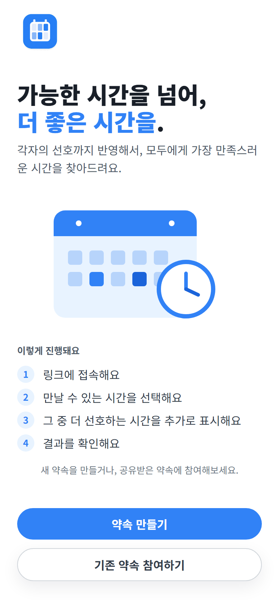
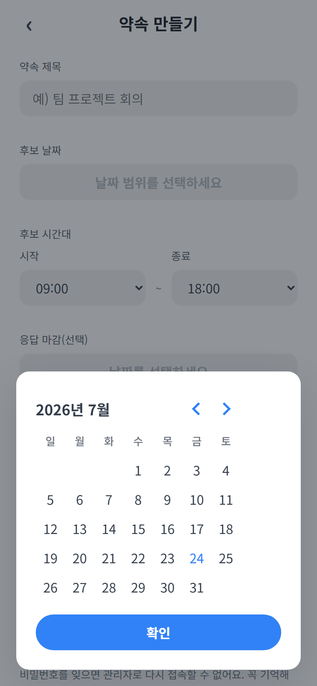
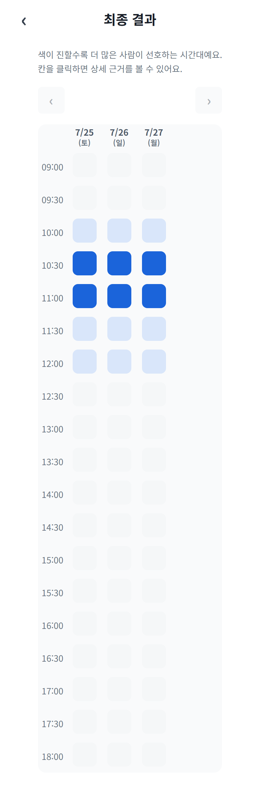
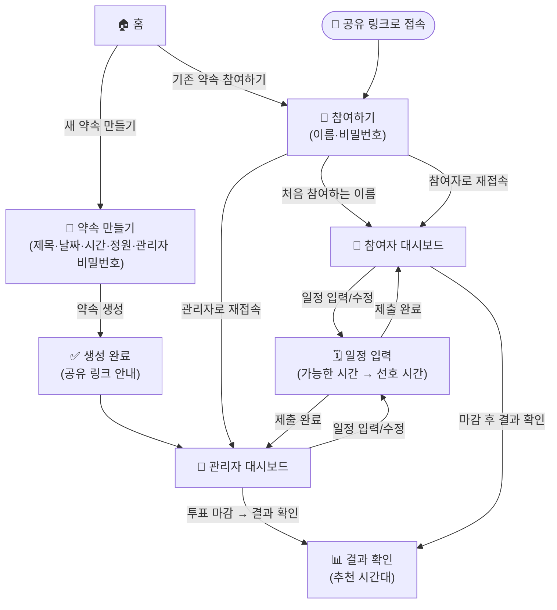

# Hub

여러 참여자가 가능한 시간을 입력하고, 방장이 투표를 마감해
공통 일정을 확인하는 모바일 웹 기반 일정 조율 서비스.

## 주요 기능

- 약속 생성 및 참여 링크 공유
- 이름과 PIN을 이용한 참여·재접속
- 가능한 시간과 선호 시간 입력
- 투표 마감 및 시간대별 결과 집계

## 스크린샷

<table>
<tr>
<td align="center"> 홈</td>
<td align="center"> 약속 생성</td>
<td align="center"> 결과 히트맵</td>
</tr>
</table>

## FlowChart

## 기술 스택

| 구분 | 내용 |
|---|---|
| Frontend | React + TypeScript, react-router, axios, react-hook-form + zod(@hookform/resolvers), date-fns, @supabase/supabase-js |
| Backend | Express + TypeScript, cors, dotenv, zod, morgan, @supabase/supabase-js, tsx(dev) |
| DB | Supabase(Postgres) |
| 공유 | `shared/`의 zod 스키마를 client(zodResolver)·server(요청 검증) 양쪽이 그대로 import |
| 테스트 | Vitest — client는 @testing-library/react, server는 supertest 병행 |

## 프로젝트 구조

npm workspaces 모노레포.

- `client/` — FE (Vite, 기본 포트 5173)
- `server/` — BE (Express, 기본 포트 4000)
- `shared/` — FE/BE 공유 타입·zod 스키마

## 문서

[기획](https://github.com/Ladea1224/hub/wiki/%EA%B8%B0%ED%9A%8D_%EC%B5%9C%EC%A2%85)

[개발 테스크](https://fish-quark-a38.notion.site/81045f08993647048109a5d222ae4e25?v=8c8e2fea06f04edb8508e3d632f3b8c3&source=copy_link)

[제한 사항](docs/summary.md)